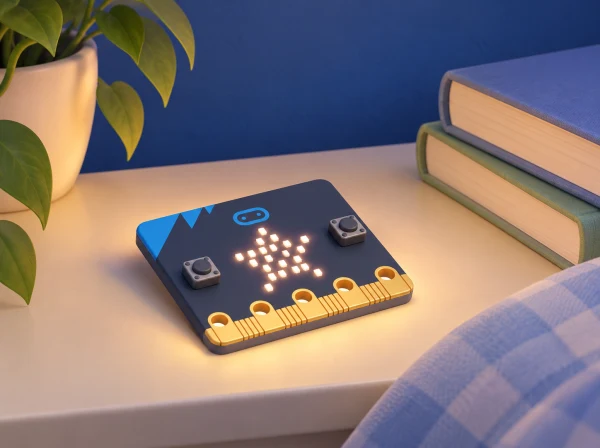

_Una mateixa placa dona lloc a sis projectes; la ruta es pot programar amb blocs o amb Python._

## 🌱 Situació i intenció

La biblioteca escolar obri un laboratori de projectes digitals per explicar què pot fer una micro:bit. Cada sessió resol un repte curt amb una eixida, una entrada, una estructura de control o un sensor. Els projectes parteixen de la unitat oficial *First lessons with MakeCode and the micro:bit*; es pot repetir la ruta amb el curs paral·lel de Python. Les paraules i personatges dels exemples són ficticis: no es mostren noms ni emocions reals de l’alumnat.

## 🎯 Aprenentatges i vocabulari

- Identificar l’entrada i l’eixida de cadascun dels sis projectes de biblioteca.
- Programar una insígnia, una animació, un comptador o un joc amb seqüència, bucle, botó, sensor o aleatorietat.
- Comparar una versió amb blocs i una versió Python mantenint el mateix objectiu i els mateixos casos de prova.
- Dissenyar prototips amb contingut fictici, sense guardar dades personals de lectores o visitants.

## 📅 Seqüència didàctica · 6 sessions

### **Sessió 1 · Identificador fictici (Name badge).**

#### Fase 1 · Activem i prediem

Trieu una paraula inventada, una paraula comuna o una icona de personatge. Predigueu com apareixerà a la matriu LED i què pot passar si el text és massa llarg.

#### Fase 2 · Explorem i construïm

Programeu el text o la icona per comprendre instruccions, seqüència, càrrega del programa i matriu LED. Per a la via Python, obriu l’editor i feu que la placa mostre un símbol propi.

#### Fase 3 · Expliquem i registrem

Identifiqueu l’entrada, el procés i l’eixida i anoteu el comportament del text i de la imatge. Deseu el programa breu o una captura impresa.

#### Fase 4 · Apliquem i millorem

Compareu text i icona i reviseu el missatge si el desplaçament o la durada en dificulten la lectura.

#### Fase 5 · Comprovem i reflexionem

Expliqueu quina informació pot mostrar la placa i què es podria comunicar millor en una targeta impresa. **Evidència:** programa d’identificador fictici i diagrama entrada-procés-eixida.

### **Sessió 2 · Animació amb bucle (Beating heart).**

#### Fase 1 · Activem i prediem

Dibuixeu dos fotogrames i decidiu-ne l’ordre. Predigueu com canviarà la percepció del moviment amb pauses curtes o llargues.

#### Fase 2 · Explorem i construïm

Programeu dues imatges senzilles que alternen i useu un bucle per repetir-les. Manteniu la mateixa seqüència visual si compareu blocs amb una versió Python.

#### Fase 3 · Expliquem i registrem

Anoteu l’ordre, les pauses i el nombre de repeticions. Compareu el guió visual amb el programa executat.

#### Fase 4 · Apliquem i millorem

Ajusteu una pausa i torneu a provar. Oferiu una versió estàtica si els LED intermitents no són accessibles o còmodes.

#### Fase 5 · Comprovem i reflexionem

Expliqueu com el bucle redueix instruccions repetides i si l’animació manté el patró previst. **Evidència:** dos fotogrames, programa amb bucle i comparació de pauses.

### **Sessió 3 · Insígnia amb entrada (Emotion badge).**

#### Fase 1 · Activem i prediem

Dissenyeu dues icones per a preferències lectores de personatges ficticis. Predigueu quina eixida apareixerà en prémer A o B; les imatges no representen ni revelen estats emocionals de companys.

#### Fase 2 · Explorem i construïm

Programeu els botons A/B com a entrades i la matriu LED com a eixida. Creeu dues imatges pròpies i assigneu-ne una a cada botó.

#### Fase 3 · Expliquem i registrem

Una persona provadora prem cada botó i comprova la icona prevista. Registreu l’entrada, la resposta i qualsevol discrepància.

#### Fase 4 · Apliquem i millorem

Reviseu la icona o l’assignació si les dues opcions no es distingeixen prou. Torneu a provar A i B en un ordre diferent.

#### Fase 5 · Comprovem i reflexionem

Expliqueu què ha activat cada imatge i per què el programa no pot inferir emocions de ningú. **Evidència:** dues icones fictícies, codi i taula de proves dels botons.

### **Sessió 4 · Comptador de recorreguts (Step counter).**

#### Fase 1 · Activem i prediem

Dibuixeu una ruta curta per una maqueta de prestatgeries i predigueu quants passos de fitxa hi ha. Expliqueu que el recompte descriu la prova del model, no l’activitat d’una persona.

#### Fase 2 · Explorem i construïm

Feu la ruta amb una fitxa mòbil i compareu-la amb un comptador de sacsejades de la placa. Definiu l’algorisme, incrementeu una variable i reinicieu-la entre assaigs.

#### Fase 3 · Expliquem i registrem

Compareu recompte manual i automàtic i anoteu falses deteccions o moviments que no s’han comptat. Manteniu el registre sense noms.

#### Fase 4 · Apliquem i millorem

Reviseu una condició i repetiu la ruta. Si sacsejar la placa no és accessible, useu el botó, la fitxa o una simulació.

#### Fase 5 · Comprovem i reflexionem

Descriviu què compta i quines limitacions té el model, sense presentar-lo com un podòmetre validat. **Evidència:** algorisme, variable, registre comparatiu i errors identificats.

### **Sessió 5 · Senyal que respon a la llum (Nightlight).**

#### Fase 1 · Activem i prediem

Predigueu què ocorrerà quan la lectura de llum baixe del llindar acordat. Recordeu que l’eixida LED no il·lumina prou per llegir ni és un dispositiu de seguretat.

#### Fase 2 · Explorem i construïm

Useu la lectura de llum disponible per encendre una icona quan el nivell baixa del llindar. Col·loqueu la placa en dos punts de prova de la biblioteca.

#### Fase 3 · Expliquem i registrem

Anoteu el valor observat i si la icona s’ha activat en cada lloc. Incloeu proves de lectura baixa, alta i de frontera.

#### Fase 4 · Apliquem i millorem

Canvieu el llindar si hi ha falsos activaments i torneu a provar les tres condicions. Manteniu constants els altres elements del programa.

#### Fase 5 · Comprovem i reflexionem

Expliqueu què indica el sensor en les condicions provades i què no podem concloure d’una mesura local. **Evidència:** codi condicional, taula de tres casos i llindar revisat.

### **Sessió 6 · Joc de mans (Rock, paper, scissors).**

#### Fase 1 · Activem i prediem

Predigueu quines opcions pot mostrar el joc i què vol dir que el resultat siga aleatori. Recordeu que és una simulació lúdica, no una predicció.

#### Fase 2 · Explorem i construïm

Useu el gest «sacsejar» o un botó per iniciar una simulació amb nombre aleatori, variable i selecció. Associeu cada valor a una eixida del joc.

#### Fase 3 · Expliquem i registrem

Proveu una seqüència de casos, incloent-hi el valor mínim i màxim del rang. Registreu nombre, condició i eixida resultant.

#### Fase 4 · Apliquem i millorem

Reviseu l’algorisme si alguna opció no té correspondència o queda exclosa per un límit incorrecte. Torneu a provar els extrems i l’associació de cada valor.

#### Fase 5 · Comprovem i reflexionem

Expliqueu si totes les opcions poden aparéixer i què significa justícia en aquesta simulació. **Evidència:** programa, taula de proves i explicació dels límits.

## 💻 Dues vies de programació

MakeCode permet construir els sis projectes amb blocs i transferir-los a la placa. La ruta Python recorre els mateixos objectius amb codi textual: mostrar text/icones, bucles d’animació, lectura de botons, variables de recompte, condicions de llum i nombres aleatoris. En cada sessió, l’alumnat pot comparar el diagrama de blocs amb una versió Python preparada pel docent o adaptada a l’editor vigent; la situació no substitueix els tutorials específics de sintaxi.

## 🧪 Evidències i avaluació

Guardeu sis programes breus o captures impreses, el diagrama d’entrada-procés-eixida, una taula de proves i una revisió final de la ruta. Valoreu l’ordre dels passos, l’ús de bucles, variables i condicions, la depuració i si el grup pot explicar què limita cada projecte.

## Guió comú per als sis prototips

En cada sessió, seguiu la mateixa rutina: llegir la targeta del repte, dibuixar una predicció, construir o programar una primera versió, provar dos casos, anotar una diferència i fer una revisió. La micro:bit és l'objecte d'estudi; no necessita quedar permanentment instal·lada a la biblioteca ni mostrar informació d'usuaris. Cada fitxa de projecte indica quina entrada rep, quin procés aplica i quina eixida s'observa.

### **Insígnia fictícia:**

useu un nom inventat de personatge, una paraula comuna o una icona. Compareu text i imatge a la matriu LED i expliqueu per què un missatge llarg pot desplaçar-se.

### **Animació:**

dibuixeu dos fotogrames, decidiu-ne l'ordre i compareu una animació amb pausa curta i una de pausa més llarga. La repetició del bucle ha de correspondre amb el guió visual.

### **Insígnia d'opcions:**

representeu dos personatges ficticis amb botons A i B. Una persona provadora prem cada botó i comprova si apareix la icona prevista; no s'infereixen emocions de ningú.

### **Comptador de maqueta:**

una fitxa recorre un plànol de prestatgeries i el grup compara el recompte manual amb un programa d'entrada de moviment. Registreu falses deteccions i reinicieu la variable entre assaigs.

### **Indicador de llum:**

col·loqueu la placa en dos punts de prova i ajusteu un llindar local. Proveu lectura baixa, lectura alta i una situació de frontera; expliqueu que l'eixida no il·lumina prou per llegir ni certifica la il·luminació.

### **Joc aleatori:**

proveu les tres opcions del joc en una seqüència de casos, incloent el mínim i el màxim del rang. Comproveu que la condició associa cada nombre amb una eixida i que cap opció ha quedat sense correspondència.

## Comparar MakeCode i Python sense duplicar la dificultat

Per a qui ja estiga preparat per a codi textual, mostreu un únic projecte equivalent en blocs i Python i associeu cada part visible amb la instrucció textual corresponent. Manteniu els objectius de la sessió estables: primer la lògica i la prova, després la sintaxi. El docent pot proporcionar un esquelet de codi perquè la classe complete una línia o una condició; la situació no pressuposa experiència prèvia en Python ni un editor concret.

En acabar, cada equip tria un dels sis prototips i el presenta en una targeta amb repte, entrada, eixida, dos casos provats i una limitació. La classe pot muntar una petita exposició de projectes amb plaques desconnectades o simulacions, sense recollir dades personals dels visitants.

## 🧰 Materials, versions i inclusió

BBC micro:bit, MakeCode o Python Editor, llibres i targetes de la maqueta. Confirmeu les funcions de la placa i l’entorn, especialment el sensor de llum i l’acceleròmetre. Si sacsejar o observar LED parpellejant no és accessible, oferiu botó, targeta estàtica o simulació. Cap activitat necessita guardar dades d’alumnes.

## ♿ Participació, accessibilitat i seguretat

Si sacsejar la placa, mirar LED intermitents o llegir codi textual no és accessible per a alguna persona, oferiu una targeta estàtica, un botó o un programa de mostra equivalent. La via Python és opcional i no condiciona l’accés als mateixos objectius. Els prototips de lectura usen identificadors ficticis i no guarden dades de visitants.

## 🔗 Unitats oficials adaptades

La seqüència cobreix els sis projectes de micro:bit [First lessons with MakeCode and the micro:bit](https://microbit.org/teach/lessons/first-lessons-with-makecode-and-the-microbit/): *Name badge*, *Beating heart*, *Emotion badge*, *Step counter*, *Nightlight* i *Rock, paper, scissors*. La mateixa seqüència ofereix la via paral·lela de [First lessons with Python and the micro:bit](https://microbit.org/teach/lessons/first-lessons-with-python-and-the-microbit/), que reutilitza aquests sis projectes per introduir codi textual. La narrativa de biblioteca i les proves són pròpies.
