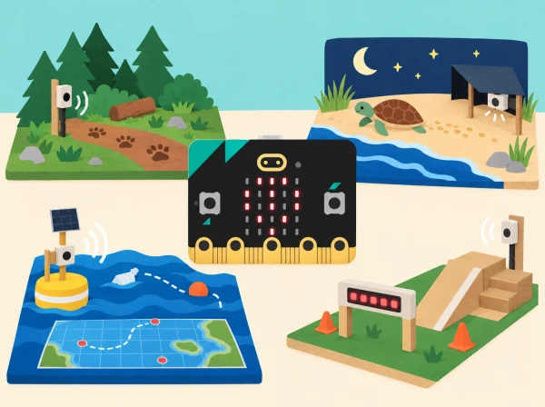
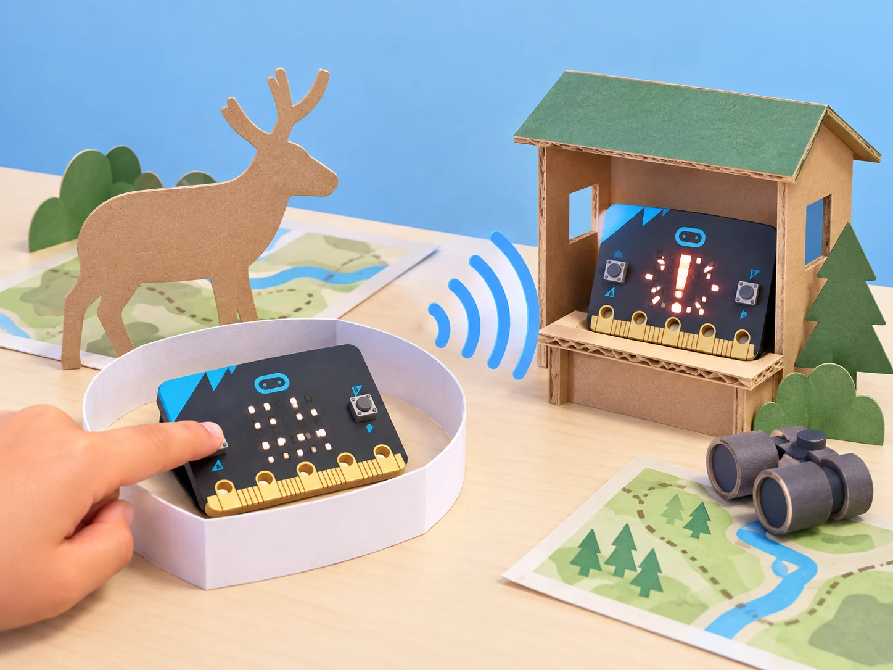
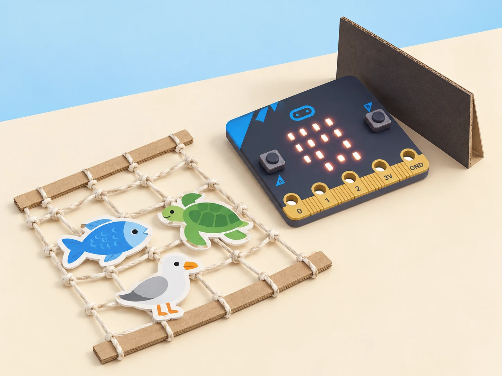
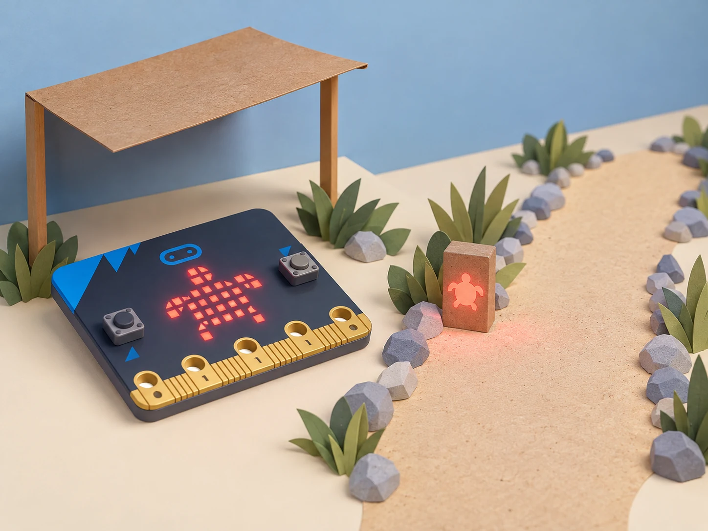
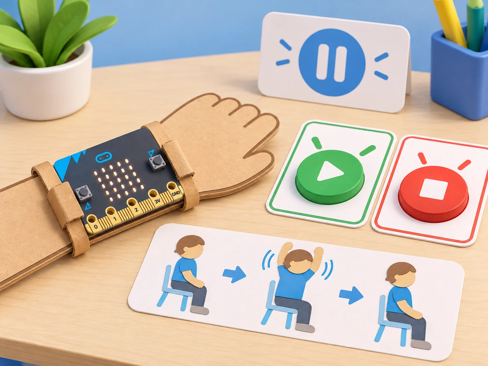
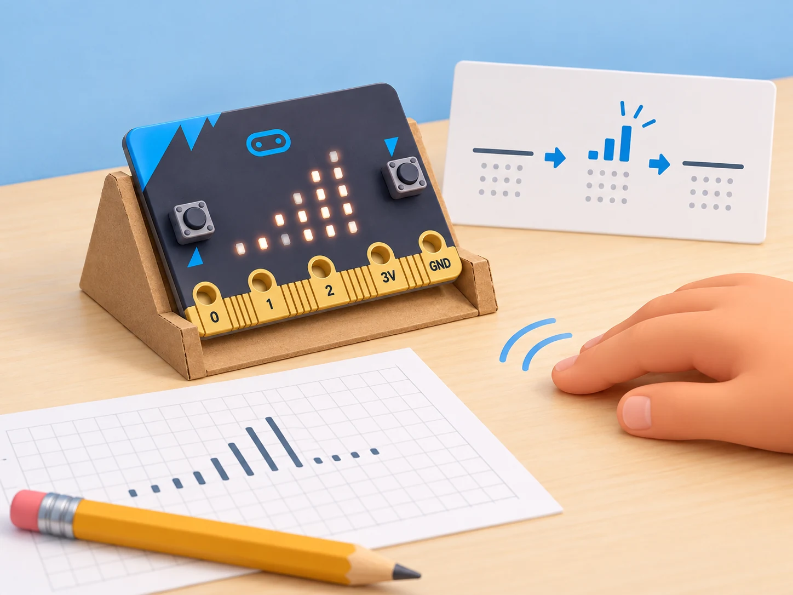
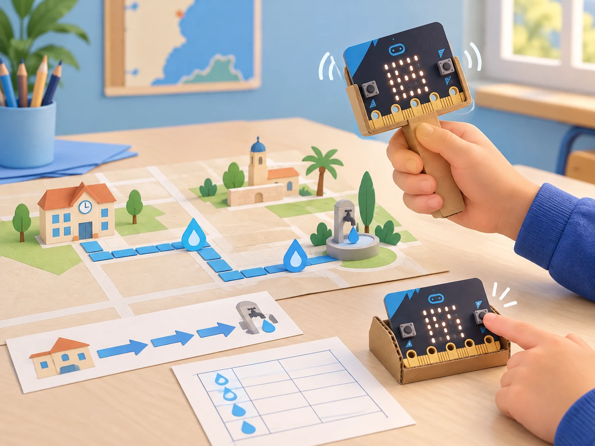
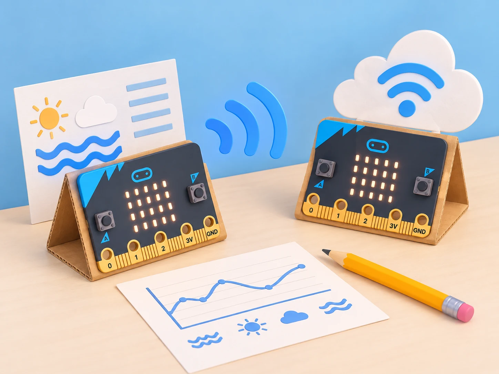
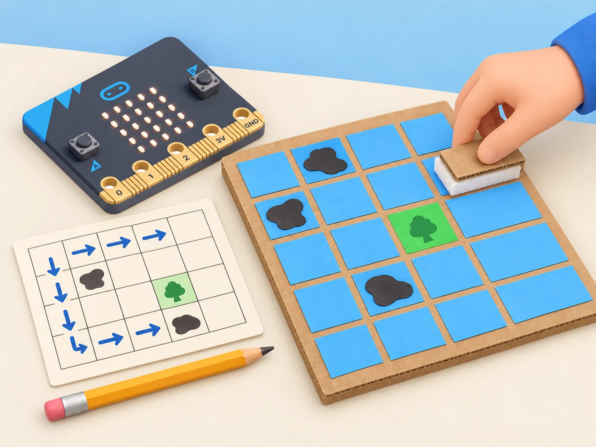

_Els projectes són prototips educatius: qualsevol ús real requereix validació experta i participació de les comunitats afectades._

## 🌍 Com usar aquesta col·lecció

Aquesta fitxa adapta cinc reptes de disseny de micro:bit, cadascun amb les seues activitats identificades. El docent pot triar un repte complet (dues o tres activitats) i dedicar-hi entre dues i tres sessions per activitat. Comenceu amb recerca i criteris, seguiu amb pseudocodi i prototip, i tanqueu amb proves i comunicació dels límits. Les dades són simulades o de maquetes; no es fan proves amb fauna, persones en risc, carrers oberts ni aigua real.

## 🐾 Repte 1 · Biodiversitat terrestre

Adapta [Protecting animals on land](https://microbit.org/teach/lessons/protecting-animals/) i les seues dues activitats:

### **Detectius d’espècies (Spot the species).**

#### Fase 1 · Activem i prediem

Trieu un hàbitat pròxim i una pregunta sobre espècies que el grup puga investigar amb fonts fiables. Predigueu quins trets observables permetrien distingir-ne dues.

#### Fase 2 · Explorem i construïm

Consulteu fonts seleccionades i creeu una clau d’identificació amb observacions accessibles, com forma, mida aproximada o nombre de fulles, sempre que la font les documente.

#### Fase 3 · Expliquem i registrem

Programeu un comptador manual per registrar observacions en una eixida guiada o treballeu amb dades simulades. Anoteu la font i el criteri de recompte.

#### Fase 4 · Apliquem i millorem

Compareu les classificacions entre equips i reviseu una descripció ambigua. Diferencieu el nombre registrat de la presència real de l’espècie.

#### Fase 5 · Comprovem i reflexionem

**Evidència:** clau, registre i font consultada. No publiqueu ubicacions sensibles ni presenteu el recompte escolar com un cens de biodiversitat.

### **Alerta de protecció del bosc (Anti-poaching collar).**

#### Fase 1 · Activem i prediem

La proposta oficial parteix de la caça furtiva i planteja explorar com la tecnologia podria ajudar a protegir espècies. Consulteu una font de conservació i distingiu tres coses: què afirma la font, quines dades desconeixem i quina part es podria representar a l’aula sense acostar-se a un animal. No suposeu que hi ha caça furtiva al vostre municipi. En una història fictícia d’una reserva, formuleu la pregunta: «Com podem avisar una persona responsable que s’ha activat un senyal de prova, sense afirmar que hem detectat cap perill?»

#### Fase 2 · Explorem i construïm

Feu una maqueta seca amb una silueta plana d’animal de cartó, una tira de paper al seu voltant —sense posar-la a cap ésser viu— i dues micro:bit: emissora i estació receptora. El botó A serà l’únic activador manual de la prova; la placa no incorpora un sensor que detecte caça furtiva. En MakeCode, programeu `radio.setGroup(42)` en totes dues plaques, envieu `PROVA-ALERTA` en prémer A i feu que la receptora mostre un símbol només quan rep exactament eixe missatge. El text té menys de 19 caràcters, límit de `radio.sendString`. La ràdio funciona com un canal compartit: el mateix grup permet comunicar-se, però no xifra ni autentica el missatge.

```javascript
radio.setGroup(42)
input.onButtonPressed(Button.A, function () {
    radio.sendString("PROVA-ALERTA")
})
```

```javascript
radio.setGroup(42)
radio.onReceivedString(function (message) {
    if (message == "PROVA-ALERTA") {
        basic.showIcon(IconNames.Yes)
    } else {
        basic.showIcon(IconNames.No)
    }
})
```



_És una maqueta de comunicació activada manualment: no és un collar funcional ni detecta animals o incidents._

#### Fase 3 · Expliquem i registrem

Executeu tres intents per cas i registreu si la placa emissora envia, si la receptora mostra l’acceptació o el rebuig i quina condició heu canviat. Proveu: missatge correcte i grup igual; missatge desconegut amb el grup igual; missatge correcte amb un grup diferent; dos enviaments seguits; i cap pressió de botó. Anoteu «sense missatge rebut» quan no s’activa l’esdeveniment de recepció: no inventeu un temps de resposta ni interpreteu el silenci com a prova que tot està bé. Compareu els resultats amb una taula de predicció i observació.

#### Fase 4 · Apliquem i millorem

Canvieu una sola condició cada vegada i depureu primer el cas de grups diferents; després, torneu al mateix grup i investigueu els missatges desconeguts i repetits. Afegiu una resposta visual clara per a «avís de prova rebut» i una altra per a «missatge no reconegut». La ràdio envia missatges als dispositius del mateix grup, però aquesta activitat no implementa confirmació de recepció garantida, xifratge ni control d’identitat. Per això, qualsevol avís en el relat requeriria revisió humana i una via de comunicació validada; la maqueta mai no ordena una intervenció.

#### Fase 5 · Comprovem i reflexionem

**Evidències:** diagrama emissor–canal–receptor, programa amb el grup compartit, taula dels cinc casos amb tres repeticions i una explicació d’un límit tècnic i un límit ètic. La proposta adapta el repte oficial de crear una alarma sense reproduir-ne els materials; les històries, la maqueta i el codi són propis. El prototip només comunica una ordre manual de prova: no detecta caça, tala ni moviment, no localitza fauna i no garanteix que cada missatge arribe. No poseu dispositius a cap animal. [La lliçó oficial Anti-poaching collar](https://microbit.org/teach/lessons/protecting-animals-poaching/) presenta un repte de disseny amb ràdio per a alumnat de 7–11 anys; l’adaptació manté aquest focus i canvia el desplegament animal per una simulació escolar segura.

## 🌊 Repte 2 · Criatures marines

Adapta [Saving sea creatures](https://microbit.org/teach/lessons/sea-creatures/):

### **Xarxes més selectives (Light-up fishing nets).**

#### Fase 1 · Activem i prediem

Llegiu la descripció oficial del repte i definiu *captura accidental* amb un exemple verificat: una xarxa captura una espècie diferent de la que es volia pescar. Situeu el cas en una llotja o port valencià fictici, sense atribuir-lo a una confraria concreta. En una graella, separeu què sabem per la font, què és una pregunta i què voldríem provar amb una maqueta. Pregunta guia: «Quin senyal podria mostrar una xarxa de prova quan la llum ambiental baixa?»

#### Fase 2 · Explorem i construïm

Construïu una xarxa de paper o cordill damunt d’una safata seca i feu servir fitxes planes per a representar espècies; no hi poseu animals vius ni acerqueu la placa a l’aigua. Programeu la lectura ambiental amb `input.lightLevel()` —la matriu LED fa també de sensor de llum— i comenceu amb el llindar oficial `50`: si la lectura és menor, mostreu un patró de LEDs; altrament, esborreu la pantalla. Llegiu la llum abans d’encendre el patró, perquè la mateixa matriu fa també d’entrada i d’eixida. Cada grup pot cobrir parcialment la placa amb una cartolina per simular menys llum, sense embolicar-la ni tapar-la completament.



_És un model de taula amb fitxes planes: no prova ni demostra l’eficàcia d’una xarxa real._

#### Fase 3 · Expliquem i registrem

Feu almenys cinc proves en cada condició: placa descoberta, parcialment ombrejada i coberta per la cartolina. Registreu la lectura `0–255`, si és `< 50`, `= 50` o `> 50`, el patró esperat, el resultat observat i si la pantalla s’ha esborrat quan tocava. Repetiu una prova pròxima al llindar i anoteu si la llum de l’aula fa variar la lectura. Si hi ha micro:bit V2 o un altaveu extern disponible, proveu el so com una eixida separada i opcional; manteniu-lo silenciat per defecte i no l’activeu prop d’oïdes sensibles. V1 sense altaveu conserva el repte amb els LEDs.

#### Fase 4 · Apliquem i millorem

Compareu les proves entre equips i canvieu només una variable cada vegada: llindar, duració del senyal o patró LED. Si `50` activa el patró massa sovint o massa poques vegades en la llum del centre, proveu un valor nou i justifiqueu-lo amb les lectures, no amb una suposada profunditat marina exacta. El so que mostra el tutorial oficial és una idea de prototip; la classe no pot inferir d’aquesta maqueta que les llums o el so eviten captures reals. Manteniu una versió sense so i assegureu que el senyal visual es pot distingir sense color.

#### Fase 5 · Comprovem i reflexionem

**Evidències:** maqueta seca, programa amb la condició, taula de cinc o més proves, font consultada i una comparació abans/després del canvi triat. Expliqueu què mesura la micro:bit, com es decideix mostrar o apagar el patró i quin resultat continua sense poder afirmar-se. No useu animals ni proveu res dins de la mar. El prototip no està validat per a pesca ni acredita que una llum o un so protegisquen fauna.

### **Platja segura per a tortugues (Sea safe turtles).**

#### Fase 1 · Activem i prediem

Llegiu la proposta oficial: les cries de tortuga utilitzen la llum de la lluna per orientar-se cap a la mar, i els llums alts o brillants poden desorientar-les. Consulteu una font de conservació i anoteu quina afirmació prové de la font i quina és una pregunta del grup. Situeu el repte en una maqueta fictícia de camí costaner valencià, sense atribuir cap problema concret a una platja local. Predigueu quin senyal baix i discret podria orientar caminants sense imitar una lluna intensa.

#### Fase 2 · Explorem i construïm

En una maqueta seca, col·loqueu la micro:bit a nivell del camí, al costat d’una fitxa que represente una persona caminant. Llegiu la llum ambiental amb la matriu LED i useu `input.lightLevel() < 100` com a llindar inicial oficial: en foscor, mostreu una icona pròpia de tortuga en la matriu; amb llum igual o superior a 100, esborreu-la. Preneu la lectura abans de mostrar la icona i repetiu el cicle cada dos segons, com en el projecte de referència. No afegiu una llum alta, pampallugues ni una llanterna real; la pantalla és un indicador de maqueta, no un llum de camí homologat.



_La imatge representa un prototip de taula; no és un dispositiu desplegable ni una llum validada per a platges._

#### Fase 3 · Expliquem i registrem

Feu cinc lectures o més en cadascuna de tres condicions: placa descoberta, ombrejada i amb llum intermèdia. Anoteu `0–255`, si la lectura queda `< 100`, `= 100` o `> 100`, quin patró s’espera i si la pantalla queda fosca quan toca. Mostreu la icona a una altra parella i pregunteu què interpreta sense donar-li la resposta; registreu si veu la tortuga i si entén que és un símbol de maqueta, no una instrucció de caminar per una platja real.

#### Fase 4 · Apliquem i millorem

Si l’icona no s’entén, canvieu-ne un detall i torneu-la a provar; si la lectura activa la pantalla massa prompte o tard en la llum de l’aula, canvieu només el llindar i repetiu els casos propers al valor nou. Compareu un patró estàtic amb una opció sense llum, i justifiqueu quin comunica millor amb menys eixida lluminosa. No compareu la intensitat LED de la placa amb una lluminària real ni afirmeu que una llum roja concreta és segura per a les tortugues: aquesta propietat no s’ha provat en la maqueta.

#### Fase 5 · Comprovem i reflexionem

**Evidències:** programa amb selecció `< 100`, icona pròpia, taula de lectures i una decisió argumentada entre patró, llum mínima o absència de llum. Expliqueu què mesura la placa, com es mostra o s’esborra la icona i quina afirmació de protecció no podem fer. El projecte és un prototip educatiu inspirat en la font, no una llum que protegisca tortugues ni una autorització per a intervenir en una platja.

## 🏃 Repte 3 · Activitat amb autonomia

Adapta [Being active](https://microbit.org/teach/lessons/being-active/) amb tres activitats:

### **Recordatori triat per l’usuari (Fitness friend).**

#### Fase 1 · Activem i prediem

La proposta oficial demana dissenyar i provar un dispositiu wearable que recorde fer activitat física a intervals regulars. Adapteu la idea a una pausa voluntària durant una estona de treball: un avís pot oferir una opció de moviment suau, estirament assegut o descans, però no dir què ha de fer cada persona. Llegiu la descripció oficial i feu una llista de decisions de disseny: qui activa el recordatori, com el cancel·la, quin missatge apareix i quines dades no cal registrar. Predigueu què ha de passar si ningú l’activa o si la persona prem el botó d’aturada.

#### Fase 2 · Explorem i construïm

Abans de programar, escriviu l’algorisme: inactiu en iniciar; A activa el temporitzador; quan transcorre l’interval de prova, mostra una icona breu; B l’atura i esborra la pantalla. Useu una placa sobre una taula o un suport de cartó com el de la imatge, no cal portar-la al cos. El valor de 10 segons del codi només facilita provar-lo a classe; cada usuari pot canviar l’interval i l’avís no prescriu exercici.

```javascript
let enabled = false
let lastReminder = 0
let interval = 10000 // interval curt només per a la prova

input.onButtonPressed(Button.A, function () {
    enabled = true
    lastReminder = control.millis()
})
input.onButtonPressed(Button.B, function () {
    enabled = false
    basic.clearScreen()
})

basic.forever(function () {
    if (enabled && control.millis() - lastReminder >= interval) {
        lastReminder = control.millis()
        basic.showIcon(IconNames.SmallHeart)
        basic.pause(800)
        basic.clearScreen()
    }
    basic.pause(100)
})
```



_Prototip de taula amb inici i aturada voluntaris; no mesura l’activitat ni recomana una rutina de salut._

#### Fase 3 · Expliquem i registrem

Prepareu una taula de prova amb estat inicial, entrada, temps simulat, resultat esperat i resultat observat. Comproveu almenys: deixar el dispositiu inactiu; prémer A i esperar menys de 10 segons; esperar fins que aparega l’avís; prémer B abans de l’avís; prémer B després de l’avís; i tornar a prémer A després d’aturar-lo. Repetiu cada cas tres vegades i registreu si la pantalla queda apagada quan el sistema està inactiu. Demaneu a una altra parella que interprete el missatge, sense demanar-li que faça cap exercici.

#### Fase 4 · Apliquem i millorem

Si el missatge sembla una ordre, canvieu-lo per una invitació que incloga l’opció «ara no». Proveu un interval diferent i calculeu quant tarda cada variant, però no compareu persones ni registres d’activitat. Depureu qualsevol cas en què B no ature el programa; reviseu també que reiniciar amb A comence un interval nou i que el recordatori no s’acumule quan el dispositiu estava aturat. El suport físic ha de deixar els botons accessibles i no atrapar la placa ni dificultar desconnectar la bateria.

#### Fase 5 · Comprovem i reflexionem

**Evidències:** algorisme anotat, programa amb temporitzador i control d’aturada, prototip de taula, resultats dels sis casos i una revisió del missatge després de rebre feedback. La font oficial tracta de wearables i recordatoris regulars; aquesta versió local transforma l’avís en una invitació cancel·lable amb alternatives equivalents. No mesura pols, moviment ni rendiment, no desa dades personals, no prescriu activitat física i no avalua qui participa. Consulteu les necessitats d’accessibilitat amb la persona usuària i manteniu sempre l’opció de no començar o parar. [Fitness friend](https://microbit.org/teach/lessons/being-active/) és la primera activitat de la unitat oficial *Being active*.

### **Mesura crítica de pols (Heart rate monitor).**

#### Fase 1 · Activem i prediem

La fitxa oficial planteja observar com activitats diferents poden afectar la freqüència cardíaca i dissenyar, provar i avaluar un prototip amb micro:bit. Convertiu el repte en una investigació de sistemes: quina entrada detecta el dispositiu, com filtra el senyal, quin càlcul fa i què mostra? Separeu «comptar esdeveniments d’una vibració de prova» de «mesurar el pols d’una persona». La micro:bit no incorpora un sensor cardíac; el seu acceleròmetre registra moviment. Predigueu quines vibracions artificials podrien ser confoses amb un batec i quines conclusions serien injustificades.

#### Fase 2 · Explorem i construïm

Fixeu la placa en un suport estable de cartó sobre la taula i definiu un protocol de senyal conegut: primer 10 segons sense tocar res, després una sèrie de tocs lleugers al costat del suport i finalment silenci. No col·loqueu la placa sobre el cos ni colpegeu els components. Registreu l’acceleració en repòs i durant els tocs; trieu un llindar entre les dues distribucions només si les mesures se separen prou. Si se solapen, anoteu que el sensor no discrimina el senyal amb fiabilitat. L’algorisme de mostra compta només el flanc de pujada, espera que el senyal baixe del llindar abans de tornar a comptar i converteix els esdeveniments d’una finestra de 10 segons en esdeveniments per minut (`recompte × 6`).

```javascript
let threshold = 1050 // valor inicial de prova; calibreu-lo amb el vostre muntatge
let detected = false
let count = 0
let started = input.runningTime()

basic.forever(function () {
    let signal = input.acceleration(Dimension.Strength)
    if (signal > threshold && !detected) {
        count += 1
        detected = true
    }
    if (signal <= threshold) {
        detected = false
    }
    if (input.runningTime() - started >= 10000) {
        basic.showNumber(count * 6) // esdeveniments simulats per minut, no bpm
        count = 0
        started = input.runningTime()
    }
    basic.pause(20)
})
```



_Prova de moviment sobre una taula. El nombre mostrat és una extrapolació de tocs simulats, no una freqüència cardíaca._

#### Fase 3 · Expliquem i registrem

Prepareu una matriu de proves amb cinc situacions: muntatge quiet durant 10 segons; 10 tocs lents coneguts; 10 tocs més ràpids; una sacsejada no periòdica; i una segona execució quieta després de moure el suport. Feu tres repeticions per cas i registreu el llindar, el nombre de deteccions, l’esperat, el resultat i els falsos positius/negatius. Compareu el recompte amb els tocs previstos i calculeu l’error absolut del model; escriviu el resultat com a «esdeveniments simulats per minut», mai com a `bpm`. No mesureu el pols de companys, no feu l’activitat després d’exercici ni deseu dades biomètriques.

#### Fase 4 · Apliquem i millorem

Canvieu només el llindar o el temps de bloqueig entre deteccions, no tots dos alhora, i repetiu les proves lenta, ràpida i de sacsejada. Analitzeu el compromís: un llindar baix pot comptar soroll; un llindar alt pot perdre tocs menuts. Si els dos tipus de senyal continuen confonent-se, canvieu la conclusió i expliqueu que la maqueta no compleix un criteri de monitoratge. Com a exercici de dades, compareu sèries fictícies o una taula pública seleccionada pel docent, sempre amb origen identificat; distingiu correlació, mostra i inferència, sense deduir salut individual.

#### Fase 5 · Comprovem i reflexionem

**Evidències:** diagrama entrada–procés–eixida, programa amb llindar calibrat, registre de cinc situacions amb tres repeticions i una decisió sobre si el model passa els criteris de prova. La proposta oficial demana explorar el cor i prototipar un monitor; aquesta adaptació manté el treball d’acceleròmetre, càlcul i display com a banc de proves amb vibracions simulades. L’IET descriu, en un recurs tècnic complementari per a 11–14 anys, un prototip d’acceleròmetre, pantalla LED i càlcul aproximat, però cap de les dues fitxes converteix la placa en instrument clínic. El muntatge d’aula no mesura pols real, no avalua l’efecte de l’exercici en l’alumnat i no permet diagnòstics; no el porteu al cos ni publiqueu dades de salut. [Heart rate monitor](https://microbit.org/teach/lessons/heart-rate-monitor/) és la segona activitat oficial de *Being active*; el recurs complementari de l’[IET](https://education.theiet.org/secondary/teaching-resources/design-a-personal-heart-monitoring-system-microbit) detalla el flux de disseny amb acceleròmetre.

### **Comptador d’un trajecte (Walking for water).**

#### Fase 1 · Activem i prediem

Llegiu el repte oficial [Walking for water](https://microbit.org/teach/lessons/walking-for-water/) i una font contextualitzada sobre accés a aigua i sanejament, com els [resultats globals d’UNICEF](https://www.unicef.org/reports/global-annual-results-report-2023-goal-area-4). Distingiu les dades que descriuen infraestructures i serveis de les experiències de les persones: no suposeu que la situació siga igual a tots els llocs ni demaneu a ningú que represente una situació de pobresa. En una maqueta de paper, plantegeu una ruta fictícia entre una escola i un punt d’aigua. Abans de construir, responeu: què comptaria el sensor?, què no podria dir sobre la qualitat o disponibilitat de l’aigua?, i quina informació necessitaríem per prendre decisions justes?

#### Fase 2 · Explorem i construïm

Adapteu el principi del [comptador de passos oficial](https://microbit.org/projects/make-it-code-it/step-counter/): l’acceleròmetre detecta una sacsejada, suma una unitat i mostra el recompte. Fixeu la placa en un suport de cartó i genereu sacsejades controlades al costat del suport; no la poseu al cos. Afegiu A per consultar el total i B per reiniciar-lo:

```javascript
let steps = 0

input.onGesture(Gesture.Shake, function () {
    steps += 1
    basic.showNumber(steps)
})

input.onButtonPressed(Button.A, function () {
    basic.showNumber(steps)
})

input.onButtonPressed(Button.B, function () {
    steps = 0
    basic.showNumber(steps)
})
```



_La maqueta compta sacsejades de prova i representa una ruta fictícia; no mostra distàncies reals ni l’experiència de cap persona._

Si el gest Shake no és accessible o no resulta consistent amb el suport disponible, feu servir targetes de dades fictícies o un registre manual equivalent. En aquesta adaptació ningú ha de caminar, carregar aigua ni compartir dades personals de moviment.

#### Fase 3 · Expliquem i registrem

Prepareu una taula amb condició, sacsejades fetes, total mostrat, diferència respecte del recompte manual i observacions. Proveu, com a mínim: repòs sense moviment; 10 sacsejades lentes; 10 sacsejades ràpides; moviment accidental del suport; consulta amb A; i reinici amb B. Repetiu cada condició tres vegades. Comproveu si cada gest genera una sola detecció, si el programa continua comptant després de consultar el valor i si B deixa el sistema realment a zero. Anoteu falsos recomptes i deteccions perdudes, sense reinterpretar una sacsejada com una passa real.

#### Fase 4 · Apliquem i millorem

Si les sacsejades es perden o es compten dues vegades, canvieu una condició de prova cada vegada (ritme, fermesa o estabilitat del suport) i repetiu els tres intents. Compareu el recompte automàtic amb el manual i expliqueu qualsevol correcció; multiplicar per dos només tindria sentit si les proves demostraren un patró estable d’una detecció per cada dues sacsejades, no com una regla universal. Apliqueu després el recompte a la ruta fictícia del mapa: què es pot estimar amb una escala acordada de caselles?, quines decisions depenen de fonts sobre serveis d’aigua i no del comptador? Incloeu l’alternativa desconnectada amb les mateixes dades i criteris.

#### Fase 5 · Comprovem i reflexionem

**Evidències:** programa amb consulta i reinici, mapa de ruta fictícia, taula de sis condicions amb tres repeticions, comparació entre recompte manual i automàtic i una conclusió que cite la font consultada. Expliqueu què representa el nombre mostrat i què deixa fora: el comptador no mesura distància sense calibratge, temps de trajecte, accés segur, qualitat de l’aigua ni necessitats d’una comunitat. No convertiu experiències de pobresa en joc, no feu competicions de distància i no recolliu dades personals. La proposta conserva el comptatge amb micro:bit i la reflexió del repte oficial, però substitueix la caminada per una maqueta cooperativa accessible.

## 🌙 Repte 4 · Visibilitat i desplaçaments nocturns

Adapta [Night safety](https://microbit.org/teach/lessons/night-safety/) en tres prototips:

### **Recordatori de visibilitat (Night sensor).**

#### Fase 1 · Activem i prediem

Prepareu una maqueta d’itinerari i predigueu quins factors afecten la visibilitat d’un objecte. Consulteu normes i recomanacions viàries en fonts fiables.

#### Fase 2 · Explorem i construïm

Programeu un avís amb el sensor de llum integrat de micro:bit, si el model i l’orientació permeten la lectura prevista. Representeu l’itinerari a escala de maqueta.

#### Fase 3 · Expliquem i registrem

Proveu el programa amb llum ambiental diferent i anoteu les condicions i l’avís. Compareu-lo amb materials reflectors físics de la maqueta.

#### Fase 4 · Apliquem i millorem

Reviseu el llindar amb diverses proves i expliqueu els casos en què l’avís podria fallar. No proveu el prototip en un desplaçament real.

#### Fase 5 · Comprovem i reflexionem

**Evidència:** registre de proves i comparació de solucions. Cap eixida de micro:bit substitueix il·luminació homologada ni garanteix seguretat.

### **Roda visible en maqueta (Flashing wheels).**

#### Fase 1 · Activem i prediem

Consulteu fonts de disseny universal i predigueu quines característiques farien visible una peça en una maqueta, sense demanar a ningú que simule una discapacitat.

#### Fase 2 · Explorem i construïm

Dissenyeu una peça visual per a un model de cadira de rodes. Si useu LED, trieu un patró lent i un interruptor accessible.

#### Fase 3 · Expliquem i registrem

Proveu estabilitat, visibilitat des de diversos angles i resposta de l’interruptor. Anoteu les condicions de cada observació.

#### Fase 4 · Apliquem i millorem

Feu una revisió de la peça amb els criteris acordats i corregiu un punt d’inestabilitat o poca visibilitat.

#### Fase 5 · Comprovem i reflexionem

**Evidència:** maqueta revisada i registre de criteris. No s’utilitza en trànsit real ni representa l’experiència d’una persona usuària.

### **Bossa per a un trajecte (A bag for Juliane).**

#### Fase 1 · Activem i prediem

Presenteu un personatge fictici i un trajecte imaginat en el context local. Predigueu quins elements de disseny poden fer visible una bossa en la maqueta.

#### Fase 2 · Explorem i construïm

Creeu un accessori reflectant i una llum de maqueta amb materials disponibles. Eviteu reproduir estereotips o convertir l’experiència refugiada en un joc.

#### Fase 3 · Expliquem i registrem

Proveu la visibilitat en diverses condicions de llum i registreu des de quins angles es veu l’accessori.

#### Fase 4 · Apliquem i millorem

Reviseu la col·locació del reflector o la llum a partir de les observacions. Parleu de quines mesures depenen del disseny de l’entorn i de la comunitat.

#### Fase 5 · Comprovem i reflexionem

**Evidència:** accessori de maqueta, registre de visibilitat i proposta de millora. La seguretat del trajecte és una responsabilitat comunitària, no individual.

## 🐬 Repte 5 · Salut dels oceans

Adapta [Healthy oceans](https://microbit.org/teach/lessons/healthy-oceans/) i les activitats avançades:

### **Xarxa de sensors en maqueta (Ocean health monitor).**

#### Fase 1 · Activem i prediem

La fitxa oficial proposa construir prototips de sensors sense fils per a representar l’onatge i l’oratge marí, entendre la transmissió de dades i situar els nodes dins d’una xarxa amb passarel·la. Connecteu el repte amb l’ODS 14 i mostreu un mapa esquemàtic de la costa valenciana, sense atribuir-hi cap lectura ni problema ambiental real. Cada equip rep valors ficticis (per exemple, «ona = 3» i «vent = 2», sense unitats físiques) i prediu quin registre hauria d’arribar a una estació receptora.

#### Fase 2 · Explorem i construïm

Construïu una xarxa de taula amb dues micro:bit com a nodes, una tercera com a passarel·la i un mapa de paper. Useu el mateix grup de ràdio, però noms de camp diferents per identificar les dades simulades. En MakeCode, el botó A envia una mostra manual: una placa envia `ONA` i valor `3`; l’altra envia `VENT` i valor `2`. La passarel·la rep el parell nom–valor i el mostra. Els valors no tenen unitats ni provenen de sensors: el micro:bit no és per si mateix un sensor de marees, vent o temperatura marina.

```javascript
radio.setGroup(42)
input.onButtonPressed(Button.A, function () {
    radio.sendValue("ONA", 3)
})
```

```javascript
radio.setGroup(42)
radio.onReceivedValue(function (name, value) {
    basic.showString(name)
    basic.showNumber(value)
})
```



_El mapa, les icones i els valors són una simulació escolar; no s’ha connectat cap sensor marí ni cap servei d’Internet._

#### Fase 3 · Expliquem i registrem

Feu tres intents per cadascun dels dos nodes i anoteu en una taula: nom del camp, valor enviat, valor mostrat per la passarel·la, ordre de recepció i si el missatge s’ha rebut. Afegiu proves amb un nom desconegut, valors repetits, un node configurat en un grup diferent i cap pressió de botó. Compareu la predicció amb el resultat observat. En el diagrama, traceu el recorregut «node → ràdio → passarel·la → representació d’Internet» i marqueu clarament que l’últim tram només és una maqueta de paper.

#### Fase 4 · Apliquem i millorem

Si els registres s’intercanvien o no arriben, reviseu el nom del camp, el grup i la seqüència d’assaig, canviant-ne un cada vegada. Afegiu a la pantalla de la passarel·la un indicador de «SIMULACIÓ» o una fitxa visible al costat de la placa perquè ningú confonga els valors amb mesures reals. Discutiu què necessitaria una instal·lació marina: sensor adequat, calibratge, alimentació, caixa resistent, comunicació de llarg abast i manteniment; una passarel·la real també requeriria connexió i un servei que emmagatzemara les dades. No presenteu el diagrama com una xarxa desplegada ni publiqueu ubicacions de fauna.

#### Fase 5 · Comprovem i reflexionem

**Evidències:** esquema anotat de node, ràdio i passarel·la; programa emissor i receptor; registre dels cinc casos amb tres repeticions; i una explicació de quina part del sistema només està dibuixada. La font oficial descriu una activitat de nodes de dades sense fils connectats a passarel·les d’Internet; aquesta proposta n’adapta l’arquitectura a una maqueta seca i dades fictícies. Una xarxa real requeriria sensors ambientals externs, calibratge, energia, protecció contra l’aigua, connectivitat i manteniment. La micro:bit i el prototip no mesuren l’oceà ni serveixen per a monitorar-lo. [Ocean health monitor](https://microbit.org/teach/lessons/healthy-oceans-monitor/) és la primera de les dues activitats oficials *Healthy oceans*, orientada a prototips de nodes sense fils per a l’onatge i l’oratge marí.

### **Ruta eficient per a una taca simulada (Oil spill cleaner-upper).**

#### Fase 1 · Activem i prediem

La font oficial divideix *Oil spill cleaner-upper* en dues parts: primer, un repte d’algorismes per netejar una zona marina que es pot resoldre sense micro:bit ni maquinari; després, un disseny de vehicle autònom. Comenceu per la part desconnectada, que és completa per si mateixa. En una quadrícula de paper representeu una costa fictícia, una taca amb fitxes negres, un escull protegit amb una cel·la verda, un punt d’inici i una zona de recollida. Acordeu els criteris abans de dibuixar rutes: visitar totes les fitxes, no entrar a l’escull, minimitzar moviments i, en cas d’empat, fer menys girs. Són criteris del model escolar, no una mètrica de neteja real.

#### Fase 2 · Explorem i construïm

Prepareu dues rutes diferents amb targetes de fletxes i escriviu-les també com a instruccions pas a pas. Un marcador de cartó representa el vehicle i una fitxa blanca seca, el material de recollida; l’alumnat mou el model només quan l’algorisme ho indica. No useu oli, aigua, detergents ni altres líquids. Si el centre vol explorar un vehicle motoritzat, tracteu-lo com una ampliació separada: cal identificar abans el controlador, els motors, l’alimentació i la compatibilitat reals, i cap d’aquests accessoris s’atribueix a la placa micro:bit sola.



_La il·lustració mostra un algorisme de taula amb peces de paper, no un vessament ni un vehicle autònom funcional._

#### Fase 3 · Expliquem i registrem

Executeu cada ruta tres vegades amb la mateixa quadrícula i registreu, en una taula, l’ordre de les cel·les, les fitxes visitades, les repeticions, el nombre de moviments i els girs. Compareu la predicció amb el recorregut efectiu: l’algorisme cobreix totes les fitxes? Ha entrat alguna vegada a l’escull? Dues parelles poden executar la mateixa llista d’instruccions per comprovar si s’interpreta igual. Marqueu qualsevol diferència com un error de seqüència o una ambigüitat, no com una errada de la persona que segueix les instruccions.

#### Fase 4 · Apliquem i millorem

Canvieu un sol element del mapa —per exemple, afegiu una cel·la prohibida o traslladeu una fitxa— i predigueu què passaria amb les dues rutes. Reviseu les instruccions si deixen una fitxa sense visitar, travessen l’escull o repeteixen moviments evitables; després torneu a executar-les amb els mateixos criteris. Compareu cobertura, moviments, girs i seguretat de la ruta en lloc de declarar un únic algorisme «millor» sense explicar per a quin objectiu ho és. Si creeu una extensió motoritzada, valideu-la en una pista seca i tancada amb supervisió i parada accessible.

#### Fase 5 · Comprovem i reflexionem

**Evidències:** quadrícula anotada, dos algorismes executables, taula de tres intents per ruta, diagrama de flux d’una ruta revisada i explicació dels límits del model. La segona part de la font oficial proposa passar del disseny de l’algorisme a un vehicle autònom; ací queda com a extensió condicionada a maquinari real compatible i una validació de seguretat, no com una funció de micro:bit inclosa. Cap robot escolar es presenta com a resposta suficient a un vessament ni s’aboca cap substància. [Oil spill cleaner-upper](https://microbit.org/teach/lessons/healthy-oceans-oil-spill/) és la segona activitat oficial *Healthy oceans* i permet separar la part d’algorisme de la construcció del vehicle.

## 🎯 Aprenentatges i vocabulari

- Analitzar un repte ambiental o de benestar i delimitar què pot comprovar una maqueta escolar.
- Dissenyar una entrada, una regla i una eixida amb micro:bit, registrant les condicions de prova.
- Comparar les prediccions amb resultats repetits i comunicar errors, riscos i casos no coberts.
- Proposar una alternativa que no manipule fauna ni dades personals i que no prometa protecció real.

## 🧰 Materials, prototips i avaluació

Micro:bit, MakeCode, cartó, mapa, materials reflectants, peces de maqueta i fitxes de dades simulades. Les ràdios funcionen entre plaques dins dels límits de l’entorn; sensors d’humitat, llum externs, relés, motors o altres elements no formen part de la placa i necessiten maquinari compatible addicional. Cada equip lliura mapa del problema, font d’informació, criteris, diagrama/pseudocodi, prototip, proves i un apartat «què no pot fer».

## 🛡️ Salvaguardes

No captureu dades personals ni biomètriques. No poseu dispositius a animals ni proveu prototips en carreteres, espais naturals sensibles o aigua. Useu LEDs sense pampallugues ràpides i atureu qualsevol activitat que incomode. Les necessitats de seguretat, salut i conservació s’han de consultar amb persones expertes i comunitats afectades; una maqueta escolar no és un producte validat.

## 🧪 Evidències i avaluació

Rúbrica compartida: comprensió del problema, qualitat de les fonts, algorisme, elecció de components reals, proves repetibles, cooperació i comunicació de límits. Avalueu també qui podria quedar exclòs, quines conseqüències no previstes hi ha i quina alternativa de baix cost o desconnectada existeix.

## 🔗 Fonts oficials i abast de l’adaptació

La col·lecció reinterpreta els reptes públics de [Protecting animals on land](https://www.microbit.org/teach/lessons/protecting-animals/), [Saving sea creatures](https://www.microbit.org/teach/lessons/sea-creatures/), [Being active](https://www.microbit.org/teach/lessons/being-active/), [Night safety](https://www.microbit.org/teach/lessons/night-safety/), [Healthy oceans](https://www.microbit.org/teach/lessons/healthy-oceans/) i [Helping plants grow](https://microbit.org/teach/lessons/helping-plants-grow/). La sessió de xarxes s’ha contrastat també amb el [projecte oficial Light-up fishing nets](https://www.microbit.org/projects/make-it-code-it/light-up-fishing-nets/): manté la lectura de llum amb la matriu, el llindar inicial 50, la resposta LED i el so opcional, però situa la prova en una maqueta seca i comunica que no s’ha demostrat cap efecte sobre captures reals. La de tortugues s’alinea amb el projecte [Saving sea turtles](https://microbit.org/projects/make-it-code-it/saving-sea-turtles/): lectura de llum per la matriu, llindar inicial 100, icona de tortuga en foscor, esborrat de pantalla amb més llum i cicle de dos segons; la proposta local afegeix proves accessibles i declara que no valida una llum ambiental. Cada repte conserva el tema i el punt de partida descrits en les pàgines oficials, però canvia els escenaris, les dades, els materials i els prototips per al context local. Els sensors ambientals, motors i altres accessoris s’identifiquen com a externs quan no formen part de la placa. Les activitats que requeririen desplegament real es resolen amb simulacions i maquetes segures.
