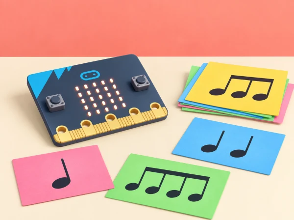

_La peça és original i pot escoltar-se amb la placa, instruments d’aula, llum o notació visual._

## 🌱 Situació i intenció

El pati de l’escola tindrà una mostra sonora breu. Cada equip crea una peça original, escriu instruccions per a un públic concret i investiga com la micro:bit pot interpretar notes, pauses i gestos. La situació recorre les cinc lliçons oficials de *Musical micro:bit*, combinant algoritmes desconnectats, composició, selecció, acceleròmetre, programació i avaluació.

## 🎯 Aprenentatges i vocabulari

- Transformar una idea musical en símbols, duracions i instruccions interpretables.
- Programar una peça amb les eixides sonores disponibles i depurar-ne el ritme i les pauses.
- Comparar una interpretació de la placa amb una interpretació humana i revisar la partitura perquè es puga seguir.
- Comunicar decisions de composició i oferir una participació visual o silenciosa equivalent.

## 📅 Seqüència didàctica · 5 sessions

### **Sessió 1 · Algoritmes musicals (Musical algorithms).**

#### Fase 1 · Activem i prediem

Escolteu patrons breus creats pel grup i representeu notes i pauses amb símbols acordats. Abans d’interpretar-ne un, prediu l’ordre dels sons i el lloc del silenci.

#### Fase 2 · Explorem i construïm

Acordeu símbols per a so curt, so llarg, silenci i repetició, a més d’inici i final. Cada equip escriu una peça original de 20–40 segons amb tres o quatre sons i una llegenda clara.

#### Fase 3 · Expliquem i registrem

Una persona interpreta la partitura amb percussió corporal o instruments suaus i una altra la segueix amb el dit; després intercanvien rols. Anoteu les interpretacions diferents i les instruccions que han resultat ambigües.

#### Fase 4 · Apliquem i millorem

Reviseu la notació perquè indique millor durades, pauses o repeticions. No corregiu la persona que interpreta: feu que la partitura comunique amb més precisió. Proveu-la de nou amb una altra parella.

#### Fase 5 · Comprovem i reflexionem

Expliqueu què ha fet que l’algoritme siga interpretable per a un públic que no l’ha escrit. **Evidència:** partitura amb llegenda, prova entre parelles i versió revisada.

### **Sessió 2 · Programar i depurar música (Programming & debugging music).**

#### Fase 1 · Activem i prediem

Llegiu una seqüència de MakeCode amb notes, durades i una repetició. Predigueu l’ordre i la durada abans d’escoltar-la; compareu-la amb la partitura de la sessió anterior.

#### Fase 2 · Explorem i construïm

Trieu una frase curta i programeu-la amb blocs de notes, durades i repeticions. Feu primer funcionar una frase de dos sons, afegiu una pausa explícita i després repetiu una secció. Useu l’altaveu integrat en micro:bit V2; amb V1, feu servir només una eixida d’àudio autoritzada pel centre o interpreteu-la amb instruments d’aula.

#### Fase 3 · Expliquem i registrem

Executeu la peça i anoteu l’ordre dels blocs, el resultat esperat i el que s’ha sentit o representat. Registreu qualsevol diferència entre la predicció i l’eixida.

#### Fase 4 · Apliquem i millorem

Quan el resultat no correspon a la predicció, reviseu selecció de notes, durades, ordre dels blocs i repeticions, en aquest ordre. Canvieu un element i torneu a provar; anoteu error inicial, hipòtesi i resultat posterior.

#### Fase 5 · Comprovem i reflexionem

Compareu la versió inicial i la depurada i expliqueu quin canvi ha resolt la diferència. **Evidència:** partitura, codi amb pausa o repetició i taula d’errors corregits.

### **Sessió 3 · Gestos musicals (Musical gestures).**

#### Fase 1 · Activem i prediem

Una persona dirigeix amb gestos acordats i l’equip prediu quina instrucció correspon a cada gest: repetir, triar una de dues notes o fer una pausa.

#### Fase 2 · Explorem i construïm

Traduïu els gestos en instruccions i incorporeu-los a la partitura. Trieu un públic concret i prepareu una notació visual que puga seguir la peça sense dependre de la lectura musical convencional.

#### Fase 3 · Expliquem i registrem

Intercanvieu la partitura amb un altre grup i registreu quins gestos s’han interpretat de més d’una manera i quina part de la notació ha causat el dubte.

#### Fase 4 · Apliquem i millorem

Afegiu un símbol, una llegenda o un exemple breu per resoldre l’ambigüitat. Torneu a dirigir la seqüència i comproveu que els gestos i la partitura concorden.

#### Fase 5 · Comprovem i reflexionem

Expliqueu quina instrucció s’ha aclarit i com ho heu comprovat amb el públic triat. **Evidència:** partitura visual, llegenda de gestos i comentaris de la prova.

### **Sessió 4 · Controlem la música amb entrades (Controlling music with inputs).**

#### Fase 1 · Activem i prediem

Trieu un esdeveniment senzill —per exemple, el botó A inicia o canvia de motiu— i representeu-lo en una targeta. Predigueu quina variació activarà i què ha de passar si no arriba cap entrada.

#### Fase 2 · Explorem i construïm

Programeu un botó o moviment de la placa perquè active una variació sonora amb condicions. Compareu l’activació per botó i per acceleròmetre amb moviments suaus i voluntaris. Assageu el moviment de la placa sobre una taula i comproveu que el llindar no activa la música accidentalment.

#### Fase 3 · Expliquem i registrem

Una persona executa les entrades i una altra registra la resposta prevista i observada, incloent-hi les activacions no desitjades. Expliqueu quina condició del programa decideix la variació.

#### Fase 4 · Apliquem i millorem

Ajusteu el llindar si cal i repetiu les proves. Manteniu un botó o control de direcció com a alternativa equivalent; ningú no ha de sacsejar la placa ni fer un moviment que no li resulte accessible o còmode.

#### Fase 5 · Comprovem i reflexionem

Comproveu si l’entrada activa el motiu previst i si hi ha una alternativa per a cada participant. **Evidència:** targeta d’esdeveniment, codi amb condició i registre de proves d’entrada.

### **Sessió 5 · Avaluem la música de micro:bit (Evaluating micro:bit music).**

#### Fase 1 · Activem i prediem

Reprengueu la peça i identifiqueu el ritme acordat, la repetició i una condició que es podria modificar sense perdre el patró.

#### Fase 2 · Explorem i construïm

Feu el repte de modificació: canvieu una condició o una repetició. Prepareu el codi o la partitura perquè una persona que no ha programat puga seguir la demostració.

#### Fase 3 · Expliquem i registrem

Presenteu la partitura o el codi abans d’interpretar-lo. L’audiència respon: quin patró ha reconegut?, en quin moment ha sentit el silenci?, quina part es podria representar amb llum o amb un gest? El retorn descriu l’experiència, no qualifica el gust musical ni la capacitat de ningú.

#### Fase 4 · Apliquem i millorem

Reviseu una part de la peça a partir del retorn. Si no convé usar so, mostreu una animació LED estàtica amb el ritme representat en seqüència o dirigiu una interpretació silenciosa amb targetes.

#### Fase 5 · Comprovem i reflexionem

Valoreu quan la placa ajuda a fer música i quan convé una alternativa acústica, visual o corporal. **Evidència:** peça revisada, retorn de l’audiència i autoavaluació del mitjà triat.

## 🧰 Materials i compatibilitat

BBC micro:bit, MakeCode, instruments d’aula opcionals, targetes de símbols i un altaveu de baix volum si cal. El so integrat està disponible en micro:bit V2; confirmeu les sortides d’àudio de la placa concreta abans de preparar l’activitat. No és necessari gravar ni reproduir veus.

## 🧪 Evidències i avaluació

Recolliu partitura simbòlica, algoritme per a un públic, codi amb una iteració, taula d’errors corregits i una valoració del mitjà triat. Valoreu si les instruccions són interpretables, si el programa respon als esdeveniments previstos i si la proposta admet diverses formes de participació.

## Partitura comuna i procés de composició

Abans de programar, acordeu quatre símbols: so curt, so llarg, silenci i repetició. Afegiu un símbol d'inici i un de final perquè l'altra classe sàpia quan escoltar. La peça pot durar entre 20 i 40 segons i usar només tres o quatre sons, cosa que facilita provar-ne l'ordre sense haver de llegir notació convencional. Cada equip escriu una llegenda que explica què significa cada marca i deixa una casella per anotar una variació.

En la primera prova, una persona interpreta la partitura amb percussió corporal o instruments suaus i una altra la segueix amb el dit. Després intercanvien rols. Si les dues interpretacions són diferents, no corregiu la persona: reviseu la notació perquè indique millor la durada o el silenci. El docent pot mostrar una seqüència de MakeCode amb notes, durades i una repetició i demanar que el grup prediga l'ordre abans d'escoltar-la.

## Programació, entrades i depuració

Feu primer funcionar una frase de dos sons. Afegiu després una pausa explícita i, finalment, repetiu una secció. Per controlar-la, definiu un esdeveniment senzill —botó A inicia o canvia de motiu— i representeu-lo en una targeta. Si s'usa l'acceleròmetre, assageu un moviment suau de la placa sobre una taula i comproveu que el llindar no activa la música accidentalment. Manteniu el botó o la direcció com a alternativa equivalent; no cal que ningú sacsege la placa.

Quan el resultat no correspon a la predicció, reviseu en aquest ordre: selecció de notes, durades, ordre dels blocs, repeticions i esdeveniment d'entrada. Canvieu un element i torneu a escoltar. Anoteu l'error inicial, la hipòtesi i el resultat posterior; així l'alumnat mostra una estratègia de depuració, no només un producte final reeixit.

## Mostra i retorn de l'audiència

Prepareu una mostra en què cada equip presente el codi o la partitura abans d'interpretar-la. L'audiència pot respondre amb tres preguntes: quin patró ha reconegut?, en quin moment ha sentit el silenci?, i quina part es podria representar amb llum o amb un gest? El retorn descriu l'experiència, no qualifica el gust musical ni la capacitat de ningú. Si no convé usar so, l'equip mostra una animació LED estàtica amb el ritme representat en seqüència o dirigeix una interpretació silenciosa amb targetes.

## Criteris observables i ajustos

Useu una escala de tres nivells per observar si la partitura té llegenda, si l'ordre es pot seguir, si el programa integra una pausa o repetició, si una entrada activa l'acció prevista i si l'equip pot explicar una revisió. Accepteu evidències en format oral, escrit, visual o de demostració. Manteniu el volum baix i les proves breus; oferiu auriculars només si la política del centre i les necessitats individuals ho recomanen, i permeteu sempre una opció sense so.

## ♿ Participació i cura auditiva

Oferiu notació, llum, percussió suau, instruments o direcció com a alternatives equivalents. Manteniu el volum moderat i permeteu treballar sense estímuls sonors. La interpretació amb moviment és opcional i no es puntua la precisió física.

## 🔗 Unitat oficial adaptada

Aquesta situació adapta les cinc lliçons de micro:bit [Musical micro:bit](https://microbit.org/teach/lessons/musical-microbit-unit-overview/): *Musical algorithms*, *Programming & debugging music*, *Musical gestures*, *Controlling music with inputs* i *Evaluating micro:bit music*. Les peces, els ritmes, les targetes i l’avaluació són originals i cobreixen algoritmes, repetició, selecció, entrades i eixides.
