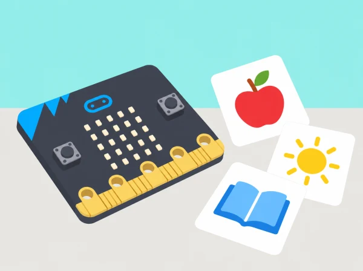

_Les paraules i icones es trien amb la classe de llengües i es representen per seqüències LED._

## 🌱 Situació i intenció

La classe prepara un joc de targetes per repassar vocabulari d’anglés, valencià o una altra llengua que estiguen aprenent. Primer crea algorismes clars perquè una persona presente una pista i l’altra responga; després programa una selecció de paraules com a imatges LED. La matriu 5×5 obliga a abstraure, no a escriure paraules llargues: les targetes físiques conserven l’ortografia, el so i el significat.

## 🎯 Aprenentatges i vocabulari

- Seleccionar vocabulari adequat al grup i representar-lo amb text breu o icones pròpies.
- Programar una targeta amb seqüència, patró, pausa i una entrada de control.
- Provar si la targeta ajuda una altra parella a recordar o reconéixer una paraula sense pressa.
- Crear alternatives llegibles que no depenguen només del color, la velocitat de lectura o la resposta oral.

## 📅 Seqüència didàctica · 5 sessions de 45 minuts

### **Sessió 1 · Algorismes de flashcards (Flashcard algorithms).**

#### Fase 1 · Activem i prediem

Trieu huit paraules d’una unitat ja treballada, com animals o objectes de classe. En parelles, repartiu els rols de qui mostra la pista i qui respon. Predigueu quines instruccions necessita l’altra persona des que apareix la icona fins que arriba el torn de resposta.

#### Fase 2 · Explorem i construïm

Escriviu una seqüència d’instruccions amb inici, pista, temps per pensar, resposta i canvi de torn. Intercanvieu rols i proveu les instruccions amb una parella nova, sense explicar-les oralment.

#### Fase 3 · Expliquem i registrem

Anoteu en quin pas s’ha aturat la parella o ha interpretat una instrucció d’una altra manera. Si «espera un poc» és ambigu, identifiqueu què no queda definit: durada, senyal per continuar o moment de resposta.

#### Fase 4 · Apliquem i millorem

Substituïu instruccions ambigües per una pausa acordada i un senyal clar per continuar. Torneu a provar la targeta amb una parella que no l’haja creada.

#### Fase 5 · Comprovem i reflexionem

Comproveu si qualsevol parella pot usar la targeta sense ajuda dels autors. **Evidència:** algorisme inicial, prova externa, instruccions revisades i targeta en paper.

### **Sessió 2 · Abstracció i programació (Abstraction & programming).**

#### Fase 1 · Activem i prediem

Seleccioneu quatre paraules conegudes i determineu quina característica visual seria imprescindible per reconéixer cadascuna. Predigueu què es perdrà en reduir una imatge a 25 píxels.

#### Fase 2 · Explorem i construïm

Dibuixeu una icona 5×5 per a cada paraula i passeu la seqüència a MakeCode. Manteniu la paraula completa en la targeta física: la matriu LED és una pista visual, no una representació ortogràfica exhaustiva.

#### Fase 3 · Expliquem i registrem

Compareu dues versions de cada icona i anoteu quina característica han conservat i què han simplificat. Deseu la graella, el programa i la justificació.

#### Fase 4 · Apliquem i millorem

Passeu les targetes a un grup que no haja participat en el disseny. Demaneu que explique què interpreta abans de revelar la resposta i reviseu la icona si les pistes no resulten clares.

#### Fase 5 · Comprovem i reflexionem

Expliqueu què aporta la imatge digital i què continuen aportant l’ortografia, el so i el significat de la targeta física. **Evidència:** vocabulari seleccionat, quatre graelles, programa i retorn de la prova externa.

### **Sessió 3 · Patrons i pauses (Patterns & delays).**

#### Fase 1 · Activem i prediem

Trieu tres flashcards i ordeneu-les en un patró repetit. Predigueu en quin moment apareixerà cada pista i quant temps necessita el jugador abans de respondre.

#### Fase 2 · Explorem i construïm

Representeu el patró amb icones de paper i després programeu-lo a MakeCode amb una pausa entre pista i resposta. La transició serà una pausa seguida d’una imatge estable; no useu pampallugues ràpides.

#### Fase 3 · Expliquem i registrem

Proveu dues durades d’espera i registreu què ha pogut fer l’audiència en cada cas. Deixeu que les persones participants indiquen quina durada els facilita el torn.

#### Fase 4 · Apliquem i millorem

Ajusteu la pausa segons el retorn i torneu a provar el mateix patró. Manteniu constants les altres instruccions per poder comparar l’efecte del canvi.

#### Fase 5 · Comprovem i reflexionem

Comproveu que l’ordre es conserva i que hi ha temps suficient per pensar o passar el torn. **Evidència:** seqüència en paper i codi, comparació de durades i decisió justificada.

### **Sessió 4 · Predir i experimentar (Predicting & experimenting).**

#### Fase 1 · Activem i prediem

Abans d’executar el programa, dibuixeu els LED que espereu veure i descriviu quan apareixerà cada imatge. Planifiqueu una targeta numèrica amb els criteris acordats pel grup.

#### Fase 2 · Explorem i construïm

Proveu l’esbós al simulador o a la placa. Compareu diferents maneres de controlar els LED i incorporeu la targeta numèrica seguint la mateixa convenció que les icones de vocabulari.

#### Fase 3 · Expliquem i registrem

Compareu la predicció amb el resultat i registreu quina instrucció o esdeveniment ha produït una diferència. Si la icona no apareix com s’esperava, reviseu graella, ordre dels blocs i entrades.

#### Fase 4 · Apliquem i millorem

Canvieu una sola instrucció cada vegada i torneu a executar la prova. Comproveu si la targeta numèrica respecta l’ordre i la llegenda compartits.

#### Fase 5 · Comprovem i reflexionem

Expliqueu quina prova ha confirmat o refutat la predicció i quina part del programa s’ha revisat. **Evidència:** dibuix previ, targeta numèrica, programa i registre de proves.

### **Sessió 5 · Depurar i avaluar (Debugging & evaluating).**

#### Fase 1 · Activem i prediem

Intercanvieu la flashcard amb una altra parella, que la provarà sense instruccions orals dels autors. Abans de començar, acordeu els criteris: icona visible, pausa suficient, seqüència correcta, resposta en el moment esperat i opció de passar.

#### Fase 2 · Explorem i construïm

La parella provadora recorre el joc i registra què entén, quan rep la pista i si pot passar o demanar que es repetisca. No avalueu la rapidesa ni la pronunciació en una llengua que l’alumne està aprenent.

#### Fase 3 · Expliquem i registrem

Compareu els resultats amb la llista de criteris i descriviu un punt concret que haja dificultat el joc. Accepteu respostes orals, escrites, assenyalades o amb comunicació augmentativa.

#### Fase 4 · Apliquem i millorem

Depureu un element i documenteu què ha canviat. Torneu a provar la targeta i compareu la claredat i el temps d’espera.

#### Fase 5 · Comprovem i reflexionem

Valoreu què ajuda a practicar la micro:bit i què requereix veu, escriptura o una targeta gran. **Evidència:** proves entre parelles, criteris observats, canvi depurat i valoració final.

## 🧰 Materials i preparació

BBC micro:bit física o simulador, MakeCode, targetes de vocabulari i fulls 5×5 per esbossar píxels. Seleccioneu paraules que l’alumnat ja haja treballat i acordeu la llengua amb el docent de l’àrea. No cal connexió externa ni cap compte d’usuari.

## 🧪 Evidències i avaluació

Recolliu algorisme inicial, vocabulari seleccionat, graella d’icones, prediccions, programa, proves entre parelles i revisió dels criteris. Valoreu si les instruccions s’entenen, si el codi respecta la seqüència i si la representació digital complementa el vocabulari sense substituir-ne la forma escrita o oral.

## Desenvolupament de les sessions

**Sessió 1 — Algorisme de la targeta (45 min):** trieu huit paraules d'una unitat que ja s'haja treballat, com ara animals o objectes de classe. En parelles, una persona mostra una pista i l'altra respon; després escriviu què ha de passar des del moment que apareix la icona fins a la resposta. Intercanvieu els rols i proveu les instruccions amb una parella nova. Si «espera un poc» és ambigu, substituïu-ho per una pausa acordada i una indicació clara per continuar. Tanqueu amb una targeta de paper que qualsevol parella puga usar sense ajuda.

**Sessió 2 — Abstraure sense perdre el significat (45 min):** seleccioneu quatre paraules i dibuixeu per a cadascuna una imatge en una graella de 5×5. Compareu dues versions: quina característica és imprescindible per reconéixer-la? Què s'ha simplificat? Manteniu la paraula completa en la targeta física; la matriu LED és una pista visual, no una representació ortogràfica exhaustiva. Passeu les targetes a un grup que no haja participat en el disseny i demaneu-li que explique què interpreta abans de revelar la resposta.

**Sessió 3 — Patrons i pauses (45 min):** ordeneu tres flashcards en una seqüència repetida i representeu-la primer amb icones de paper. Afegiu a MakeCode una pausa prou llarga perquè el grup pense abans de respondre. Compareu dues durades i deixeu que l'audiència indique quina facilita el torn. Eviteu pampallugues ràpides: la transició entre targetes pot ser una pausa seguida d'una imatge estable.

**Sessió 4 — Predir i experimentar (45 min):** abans d'executar el programa, cada equip dibuixa els LED que espera veure i descriu quan apareixerà cada imatge. Proveu l'esbós al simulador o a la placa, una variació cada vegada. Si una icona no apareix com s'esperava, reviseu la graella, l'ordre dels blocs i els esdeveniments d'entrada. Afegiu una targeta numèrica segons la mateixa convenció i comproveu si la seqüència és coherent.

**Sessió 5 — Intercanviar, depurar i avaluar (45 min):** una altra parella prova el joc sense instruccions orals dels autors. Useu una llista compartida: icona visible, pausa suficient, seqüència correcta, resposta en el moment esperat i opció de passar. Depureu un punt concret i documenteu què ha canviat. Finalment, compareu què ajuda a practicar la micro:bit i què continuen fent millor la conversa, la pronunciació i la targeta impresa.

## Plantilla per documentar cada targeta

### **Paraula i significat:**

escriviu-la en la llengua acordada i afegiu una definició o frase model.

### **Pista visual:**

dibuixeu els píxels de la matriu i indiqueu què heu triat simplificar.

### **Seqüència:**

anoteu quan apareix la pista, quina pausa hi ha i com respon el jugador.

### **Prova externa:**

registreu la interpretació de la parella sense explicar-li la solució abans.

### **Revisió:**

canvieu un sol element i expliqueu si la nova versió és més clara.

No avalueu la rapidesa de resposta ni la pronunciació en una llengua que l'alumne està aprenent. Doneu temps de pensar, repetiu la pista quan es demane i accepteu respostes orals, escrites, assenyalades o amb comunicació augmentativa.

## Rols, accés i seguretat visual

Roteu els rols de creador/a de vocabulari, dibuixant de píxels, programador/a i provador/a; amb poques plaques, feu primer la seqüència sencera en paper. Oferiu contrast elevat, imatges estàtiques i targetes impreses amb lletra gran. La persona pot treballar amb el simulador o observar una demostració. No mostreu seqüències intermitents ràpides ni utilitzeu la placa com a únic canal d'informació; les paraules, els sons i les icones en paper continuen disponibles.

## ♿ Disseny accessible

Oferiu icones estàtiques, targetes impreses amb lletra gran, lectura en veu alta i temps d’espera configurable. La llum LED no ha de parpellejar ràpid; es pot completar tota la seqüència amb targetes de paper o amb el simulador.

## 🔗 Unitat oficial adaptada

Aquesta situació adapta les cinc lliçons de micro:bit [Digital flashcards](https://microbit.org/teach/lessons/digital-flashcards-unit-of-work/): algorismes entre parelles, abstracció d’imatges LED, patrons i retards, predicció i experimentació, i depuració/avaluació d’una targeta numèrica. El vocabulari, les icones, els criteris i el format de joc són propis.
