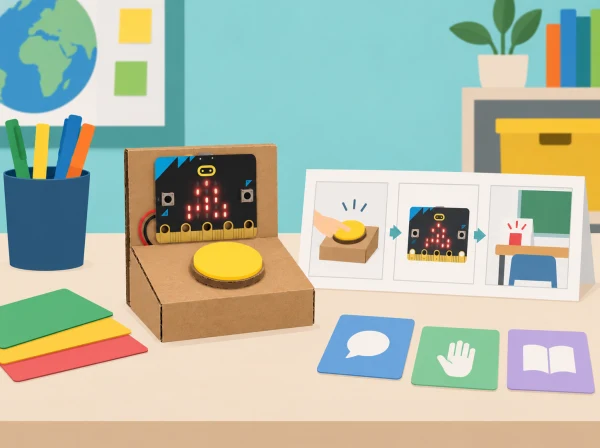

_El prototip comunica una petició triada per l’usuari; no avalua salut ni substitueix l’acompanyament humà._

## 🌱 Situació i intenció

El centre vol millorar una rutina quotidiana: demanar una pausa, recordar una tasca de descans visual o avisar discretament que cal suport. Els equips investiguen exemples de tecnologia de salut i benestar, delimiten què pot fer un prototip escolar i dissenyen una ajuda amb micro:bit. El repte parteix de necessitats fictícies o consultades voluntàriament amb persones adultes; ningú ha de revelar informació personal.

La proposta transforma la unitat oficial en un projecte de disseny accessible. La placa mostra icones o missatges breus quan l’usuari prem un botó; la decisió de quan usar-la continua sent seua. No hi ha sensors corporals, monitoratge, diagnòstic ni registre d’identitat.

## 🎯 Aprenentatges i vocabulari

- Investigar un repte de rutina amb situacions fictícies i criteris definits per les persones usuàries.
- Dissenyar un prototip opcional amb entrada, resposta, cancel·lació i aturada accessibles.
- Provar diversos casos d’ús i revisar si la persona manté el control i pot ignorar o desactivar l’ajuda.
- Comunicar que el prototip no diagnostica, vigila ni substitueix el suport d’una persona adulta.

## 📅 Seqüència didàctica · 5 sessions

### **Sessió 1 · Investiguem tecnologia per a la salut (Health of the nation).**

#### Fase 1 · Activem i prediem

Llegiu tres casos preparats pel docent: una ajuda per comunicar una elecció, un temporitzador de pausa i un senyal d’accessibilitat. Predigueu quin problema pràctic aborda cada cas i qui decideix activar-lo.

#### Fase 2 · Explorem i construïm

Analitzeu cada tecnologia i completeu una fitxa amb benefici, usuari, dades necessàries, risc, supervisió humana i manera d’aturar-la. No investigueu la salut de companys ni demaneu relats personals.

#### Fase 3 · Expliquem i registrem

Distingiu suport a la comunicació, accessibilitat, rutina de benestar i diagnòstic. Creeu un glossari de salut digital i assenyaleu quines dades no són necessàries per als casos ficticis.

#### Fase 4 · Apliquem i millorem

Reviseu les fitxes i retireu qualsevol dada personal o funció de vigilància que no siga necessària. Afegiu una alternativa de suport humà quan la tecnologia no funciona o no és adequada.

#### Fase 5 · Comprovem i reflexionem

Compartiu un benefici i un risc de cada exemple i expliqueu per què el prototip escolar no serà un dispositiu mèdic. **Evidència:** casos analitzats, glossari i mapa de dades necessàries/innecessàries.

### **Sessió 2 · Definim una necessitat i ideem solucions (Health tech innovations).**

#### Fase 1 · Activem i prediem

Trieu una situació fictícia —per exemple, demanar una pausa o recordar una rutina— i redacteu-la com una oportunitat de disseny, no com una etiqueta sobre una persona: «cal una manera senzilla d’indicar que vull fer una pausa».

#### Fase 2 · Explorem i construïm

Si es consulta una persona usuària voluntària, demaneu consentiment i permeteu que no participe; també podeu treballar només amb un perfil inventat. Dibuixeu tres solucions possibles i compareu-les per claredat, control de l’usuari, privacitat, materials i facilitat d’aturada.

#### Fase 3 · Expliquem i registrem

Anoteu els criteris d’èxit i per què cada idea els compleix o no. Registreu qui activa el sistema, quines dades necessita i com es cancel·la; no inclogueu diagnòstics ni informació personal.

#### Fase 4 · Apliquem i millorem

Seleccioneu una idea i construïu un model inicial de cartó. Reviseu si la persona manté el control, pot ignorar o desactivar l’ajuda i pot triar entre resposta visual o sonora.

#### Fase 5 · Comprovem i reflexionem

Expliqueu per què la idea triada respon millor als criteris i què encara caldrà provar. **Evidència:** mapa de necessitat fictícia, tres esbossos, criteris de selecció i maqueta inicial.

### **Sessió 3 · Algorisme, programa i depuració (Prototyping innovations).**

#### Fase 1 · Activem i prediem

Escriviu pseudocodi amb inici, entrada, resposta, cancel·lació i retorn a l’estat inicial. Predigueu què ha de passar amb una pulsació breu, una de repetida i cap activació.

#### Fase 2 · Explorem i construïm

Programeu el botó A de micro:bit perquè mostre una icona pròpia. Si es necessita un avís sonor, useu només un accessori compatible i volum baix, amb una alternativa visual. La simulació de MakeCode i les targetes permeten completar el mateix flux sense placa.

#### Fase 3 · Expliquem i registrem

Proveu activació breu, activació repetida, absència d’activació, reinici i cancel·lació. Registreu la resposta prevista i observada i anoteu errors del prototip, no de les persones.

#### Fase 4 · Apliquem i millorem

Si apareix una resposta inesperada, reviseu l’esdeveniment i l’estat del programa. Canvieu una part i repetiu la prova; no canvieu la necessitat definida per adaptar-la a un error del codi.

#### Fase 5 · Comprovem i reflexionem

Comproveu que el sistema respon als casos previstos i torna a l’estat de repòs. **Evidència:** pseudocodi, programa, taula de cinc proves i una depuració documentada.

### **Sessió 4 · Completem i preparem la presentació (Preparing presentations).**

#### Fase 1 · Activem i prediem

Reviseu la maqueta i predigueu si una persona que no ha programat entendrà com iniciar, cancel·lar i interpretar la resposta.

#### Fase 2 · Explorem i construïm

Refineu el muntatge, afegiu instruccions clares i prepareu una fitxa d’ús amb propòsit, passos, manera de demanar ajuda i límits. El text indicarà que la persona controla quan usa el prototip i que no envia avisos a cap servei real.

#### Fase 3 · Expliquem i registrem

Prepareu un diagrama del programa i una demostració sense dades personals. Registreu la decisió de privacitat, els casos provats i l’alternativa d’accés o cancel·lació.

#### Fase 4 · Apliquem i millorem

Feu una prova d’ús amb consentiment; la persona pot rebutjar-la. Reviseu les instruccions, la icona o la disposició dels botons si l’observació mostra una dificultat.

#### Fase 5 · Comprovem i reflexionem

Comproveu que la presentació descriu tant la utilitat com les limitacions del prototip. **Evidència:** fitxa d’ús, diagrama, demostració i revisió basada en una prova voluntària.

### **Sessió 5 · Mostra i avaluació (Health tech showcase).**

#### Fase 1 · Activem i prediem

Abans de la mostra, cada equip identifica un cas en què el prototip no seria adequat i una persona o servei que podria oferir suport real.

#### Fase 2 · Explorem i construïm

Presenteu el prototip a l’audiència i demostreu inici, resposta, cancel·lació i retorn a repòs. No feu servir registres personals ni presenteu l’activitat com una prova de salut.

#### Fase 3 · Expliquem i registrem

Recolliu comentaris sobre accessibilitat i claredat. Separeu l’observació del prototip de qualsevol afirmació sobre les necessitats de persones o grups.

#### Fase 4 · Apliquem i millorem

Reviseu el prototip o les instruccions a partir del retorn. Expliqueu quin canvi heu incorporat i què no heu resolt.

#### Fase 5 · Comprovem i reflexionem

Contesteu: en quin cas no seria adequat usar-lo i qui hauria de donar suport real? **Evidència:** presentació, valoració de l’audiència, millora i límit d’ús justificat.

## 🧰 Materials i programació

Micro:bit, ordinador amb MakeCode, cable USB i cartó reutilitzat. La placa incorpora botons, matriu LED, acceleròmetre i sensor de llum; aquesta proposta només necessita els botons i la matriu. Si es munta un interruptor extern, reviseu connexions i pin disponible abans d’afirmar-ne la compatibilitat. La simulació de MakeCode i un guió de paper permeten provar l’algorisme sense placa.

## 🛡️ Privacitat, seguretat i inclusió

No recolliu diagnòstics, noms, imatges, veu, ritmes corporals ni registres d’ús. La persona ha de poder no participar, aturar el dispositiu i triar si vol resposta visual o sonora. Eviteu llums intermitents ràpides i sons inesperats; oferiu instruccions en text, pictogrames i demostració. Expliqueu que és un prototip educatiu, no un dispositiu mèdic ni un servei d’emergència.

## 🧪 Evidències i avaluació

Carpeta de casos investigats, mapa de necessitat fictícia, tres esbossos, criteris de selecció, pseudocodi, programa, proves d’ús voluntàries i millores. Valoreu la justificació del disseny, la depuració, l’accessibilitat i la capacitat d’explicar dades que deliberadament no s’han recollit.

## Procés de disseny en cinc fases

**Investigar:** analitzeu tres casos preparats pel docent —una ajuda per comunicar una elecció, un temporitzador de pausa i un senyal d'accessibilitat— i completeu una fitxa: quin problema pràctic aborda?, qui decideix activar-lo?, quines dades necessita?, com s'atura?, qui pot donar suport si no funciona? No investigueu la salut de companys ni demaneu relats personals. **Idear:** redacteu la necessitat com una oportunitat de disseny, no com una etiqueta sobre una persona; per exemple, «cal una manera senzilla d'indicar que vull fer una pausa». Dibuixeu tres solucions i compareu-les amb criteris de claredat, control de l'usuari, privacitat, materials i facilitat d'aturada.

**Prototipar:** construïu una maqueta de cartó amb un botó de paper i dues possibles eixides LED. Escriviu pseudocodi que incloga inici, acció, resposta, cancel·lació i estat de repòs. Després programeu un botó real o simulat i proveu cinc casos: activació breu, activació repetida, cap activació, reinici i cancel·lació. Si apareix una resposta inesperada, reviseu l'esdeveniment i l'estat del programa; no canvieu la necessitat definida per adaptar-la a un error del codi.

**Preparar la presentació:** creeu una fitxa d'ús amb el propòsit, els passos, com demanar ajuda i què no fa el dispositiu. El text ha de dir clarament que la persona controla quan usa el prototip i que no envia cap avís a un servei real. **Mostrar i revisar:** una audiència prova el prototip amb consentiment i pot rebutjar la prova; aporta retorn sobre si sap iniciar-lo, cancel·lar-lo i entendre la icona. L'equip incorpora un canvi i explica què ha millorat i què encara no ha resolt.

## Criteris d'avaluació i límits

Valoreu si l'equip defineix una necessitat sense estigmatitzar, considera opcions abans de construir, representa tots els estats del programa, prova entrades vàlides i repetides, incorpora una alternativa accessible i declara un límit concret. El prototip només és una demostració de comunicació local amb micro:bit. No contacta amb famílies, personal sanitari ni emergències, i no pot substituir una conversa o un pla de suport del centre. Esborreu qualsevol projecte de prova al final segons les normes del centre.

## 🔗 Unitat oficial adaptada

Adapta les cinc lliçons de [Health tech](https://microbit.org/teach/lessons/health-tech-unit-of-work/): *Health of the nation*, *Health tech innovations*, *Prototyping innovations*, *Preparing presentations* i *Health tech showcase*. El context de rutines escolars i el prototip de comunicació són propis; s’han exclòs aplicacions diagnòstiques i mesures de salut.
