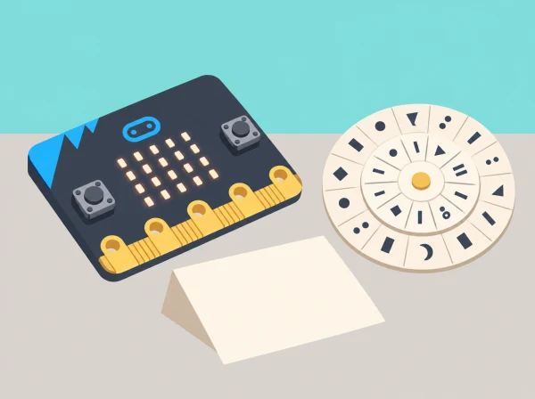

_Els missatges són inventats i els xifrats històrics s’estudien com a algoritmes, no com a protecció moderna._

## 🌱 Situació i intenció

L’arxiu imaginari d’un museu local prepara una xicoteta exposició sobre com les persones han transformat missatges per transmetre’ls. Cada equip crea una peça didàctica: una nota inventada, un disc de Cèsar, una explicació de l’algorisme i una demostració programada. Per donar-li arrelament, la nota pot contenir una dada cultural comprovada en una font pública de la localitat —un nom, una data o una ubicació—, però mai informació personal ni cap secret real.

La proposta combina història, llengua, matemàtiques i programació. Està seqüenciada per al tercer cicle de primària; la unitat oficial de micro:bit s’adreça a alumnat d’11 a 14 anys, de manera que ací el context i el codi s’introdueixen amb passos guiats. La programació textual és una ampliació: si el grup encara no coneix Python, pot completar la mateixa lògica amb pseudocodi i taules de seguiment.

## 🎯 Què aprendrem?

- Distingir missatge original, regla de transformació, clau, xifrat i desxifrat.

- Descriure i executar un algorisme reversible, incloent-hi el retorn de Z a A.

- Comparar el resultat manual amb una traça de programa i corregir errors amb proves.

- Explicar per què un xifrat de Cèsar és un model didàctic feble i no protegeix dades actuals.

- Documentar la procedència d’una dada cultural pública i comunicar-la sense revelar dades personals.

## 📅 Seqüència didàctica · 4 sessions de 50 minuts

### **Sessió 1 · Una història, moltes claus (50 min).**

#### Fase 1 · Activem i prediem

Ordeneu quatre targetes —missatge, clau, transformació i resultat— i predigueu què necessita saber qui rep el missatge per recuperar-lo. Plantegeu la pregunta de la sessió: què pot amagar una regla senzilla i què pot revelar-la?

#### Fase 2 · Explorem i construïm

En grups, construïu una línia del temps breu amb exemples documentats de comunicació secreta: un xifrat de substitució antic i el treball de desxiframent durant la Segona Guerra Mundial. Consulteu fonts per situar Alan Turing dins del treball col·lectiu de Bletchley Park i reconéixer les investigacions poloneses anteriors que també el van fer possible.

#### Fase 3 · Expliquem i registrem

Expliqueu amb les targetes què es coneix en cada etapa i quina informació necessita el receptor per recuperar el text. Anoteu al costat de cada fita de la línia del temps la font i una idea que hàgeu verificat.

#### Fase 4 · Apliquem i millorem

Compareu els exemples de la línia del temps i reviseu si la seqüència confon xifrat, desxiframent i desxiframent per anàlisi. Afegiu una nota o canvieu l’ordre quan la font indique una relació diferent.

#### Fase 5 · Comprovem i reflexionem

Compartiu una cosa que pot amagar una regla de substitució i una pista que en podria revelar el missatge. **Evidència:** línia del temps amb fonts i ordenació justificada de missatge, clau, transformació i resultat.

### **Sessió 2 · El disc i les convencions (50 min).**

#### Fase 1 · Activem i prediem

Abans de construir el disc, decidiu quines lletres i signes es transformaran. Acordeu per a tota la seqüència: alfabet A–Z en majúscula; espais, accents, Ç, números i signes es conserven sense canvis.

#### Fase 2 · Explorem i construïm

Fabriqueu dos cercles de cartó amb les lletres A–Z i marqueu un desplaçament acordat. Xifreu una frase breu inventada i intercanvieu-la amb un altre equip, que l’ha de desxifrar amb la mateixa clau. En «PLAÇA», per exemple, només es transformen P, L i A; la Ç es manté.

#### Fase 3 · Expliquem i registrem

Anoteu la convenció al costat de cada missatge i descriviu els passos que heu seguit per xifrar-lo. Registreu la clau, el text original i el resultat per poder repetir el procés en sentit invers.

#### Fase 4 · Apliquem i millorem

Si dos equips obtenen resultats diferents, compareu primer la convenció i després la posició del disc. Corregiu una instrucció ambigua i torneu a xifrar o desxifrar la mateixa frase per comprovar l’efecte.

#### Fase 5 · Comprovem i reflexionem

Verifiqueu si l’altre equip pot recuperar el missatge amb la clau i les instruccions escrites. **Evidència:** disc, convenció explícita i missatge inventat xifrat i desxifrat.

### **Sessió 3 · De la regla al pseudocodi (50 min).**

#### Fase 1 · Activem i prediem

Representeu cada lletra com una posició de 0 a 25. Predigueu què passa en els casos de frontera: A amb desplaçament −1 i Z amb desplaçament +1. Recordeu que el resultat ha de tornar a l’inici de l’alfabet.

#### Fase 2 · Explorem i construïm

Escriviu el pseudocodi: per xifrar, sumeu el desplaçament i feu la volta a l’alfabet quan el valor supera 25; per desxifrar, resteu-lo i feu la volta en sentit contrari. Ompliu una taula de traça amb lletra, posició, desplaçament i resultat. Proveu desplaçaments 0, 1, 3 i 25; afegiu espais i puntuació per comprovar que queden intactes.

#### Fase 3 · Expliquem i registrem

Intercanvieu el pseudocodi amb una parella, que el seguirà pas a pas. Una parella rep una targeta amb un error deliberat —no fer la volta de Z a A— i el detecta amb un cas mínim; anoteu quin pas causa el resultat incorrecte.

#### Fase 4 · Apliquem i millorem

Corregiu el pas identificat i repetiu la traça dels casos de frontera. Com a extensió, proveu totes les claus possibles sobre una frase inventada i observeu com el context pot revelar el missatge.

#### Fase 5 · Comprovem i reflexionem

Compareu el pseudocodi inicial i el corregit i expliqueu quina prova ha fet visible l’error. **Evidència:** pseudocodi, taula de traça amb casos normals i de frontera i explicació de la correcció.

### **Sessió 4 · Programar, comparar i explicar (50 min).**

#### Fase 1 · Activem i prediem

Trieu un missatge breu ja xifrat amb el disc i prediu el resultat del programa. Identifiqueu els casos que s’han de conservar sense canvis —espais, accents, Ç, números i signes— segons la convenció acordada.

#### Fase 2 · Explorem i construïm

Escriviu funcions separades per xifrar i desxifrar. El programa passa el text a majúscules, transforma només les lletres A–Z i conserva la resta; per a cada lletra, calcula la posició amb la regla modular. La micro:bit pot executar el programa, però la matriu LED no és adequada per mostrar frases llargues: useu la consola de l’entorn quan estiga disponible o una traça impresa o visualitzada en l’ordinador.

#### Fase 3 · Expliquem i registrem

Executeu les mateixes proves que al disc i compareu, caràcter per caràcter, el resultat manual i el del programa. Registreu qualsevol discrepància, el cas que l’ha produïda i la correcció aplicada.

#### Fase 4 · Apliquem i millorem

Depureu el programa a partir d’una prova fallida i torneu a executar els casos de retorn circular i conservació dels signes. Prepareu una cartel·la amb la clau, la convenció i una prova de reversibilitat.

#### Fase 5 · Comprovem i reflexionem

Presenteu la cartel·la i expliqueu per què el xifrat de Cèsar és un model didàctic feble, que es pot trencar provant les claus i que no protegeix informació actual. **Evidència:** codi o model de paper, comparació amb el disc, prova de reversibilitat i advertència sobre els límits del mètode.

## 🧰 Materials i preparació

Micro:bit, ordinador amb un entorn Python compatible, paper o cartolina, tisores, enquadernador o llapis per al centre del disc, retoladors i targetes de proves. Prepareu missatges inventats i una plantilla amb l’alfabet A–Z. Si no hi ha plaques, ordinadors o experiència prèvia amb Python, les sessions 3 i 4 es poden completar amb pseudocodi, taula de traça i targetes de paper; l’objectiu conceptual continua sent el mateix.

Abans de començar, comproveu que tot el grup usa la mateixa convenció d’alfabet i que les frases no inclouen noms, contrasenyes, ubicacions privades ni informació identificable. Si s’incorpora una dada del patrimoni local, l’equip n’anota la font pública i la contrasta amb la fitxa original.

## 🧪 Evidències i avaluació

Recolliu una línia del temps amb fonts, el disc i la convenció escrita, un exemple xifrat i desxifrat, el pseudocodi, una taula de traça amb casos normals i de frontera, el codi o model de paper i la cartel·la final. Observeu si l’alumnat:

- identifica correctament clau, missatge i transformació;

- aplica el desplaçament i el retorn circular sense perdre caràcters que no són lletres;

- usa proves que inclouen límits i explica què revela cada prova;

- compara el resultat manual amb el programa i localitza un error de manera raonada;

- comunica amb precisió que el mètode és vulnerable i cita les fonts de les dades culturals.

Per a l’autoavaluació, cada alumne completa: «La meua regla és reversible perquè…», «el cas que més m’ha ajudat a trobar errors és…» i «no compartiria aquest mètode per a…».

## ♿ Accés i participació

Oferiu el disc amb lletres grans i contrastades, una plantilla ja retallada, lectura en veu alta de les instruccions i una versió digital accessible. Repartiu rols rotatius —historiador/a de fonts, operador/a del disc, verificador/a i programador/a— perquè la manipulació, la lectura i l’escriptura de codi no recaiguen sempre en la mateixa persona. Qui necessite més suport pot treballar amb un desplaçament fix i frases curtes; qui avance amb facilitat pot implementar una segona convenció o provar l’atac per força bruta i explicar-ne el cost.

## 🔒 Límits i ús responsable

El xifrat de Cèsar té només 25 desplaçaments útils i es pot trencar provant-los tots o aprofitant paraules previsibles. Serveix per estudiar algoritmes, modularitat i història; no és una protecció per a comptes, missatges reals o dades personals. Tots els textos de prova són inventats. La mostra de patrimoni local, si n’hi ha, és una dada ja pública i es publica amb la seua font, mai associada a una persona.

## 🔗 Unitat oficial adaptada

Aquesta situació adapta la unitat de micro:bit [Introduction to cryptography](https://www.microbit.org/teach/lessons/cryptography/) i les seues tres lliçons: [What is cryptography?](https://www.microbit.org/teach/lessons/cryptography-what-is/), [Caesar cipher algorithms](https://www.microbit.org/teach/lessons/cryptography-caesar-cipher/) i [Ciphers and text-based programming](https://www.microbit.org/teach/lessons/cryptography-text-based-programming/). Es conserven els eixos de context històric, creació i descodificació del xifrat de Cèsar, disseny i depuració d’algorismes i programació textual amb Python; la seqüència, els missatges, les proves i la narrativa del museu són propis. L’original està pensat per a 11–14 anys: ací s’adapta al tercer cicle amb bastides, convencions explícites i l’opció de fer l’extensió de Python de manera guiada.
