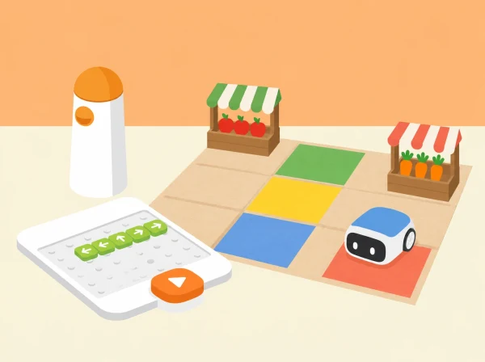

_La graella i les parades són una adaptació pròpia; els preus ficticis permeten practicar càlcul sense jutjar cap família._

## ❓ Repte i intenció

La classe organitza el mercat de proximitat d’una cooperativa escolar. Quatre targetes de producte viatgen juntes sobre un suport pla del robot; en cada parada es retira la targeta corresponent i es conta una microhistòria sobre qui la necessita i per què. El repte combina orientació i programació tangible amb una extensió matemàtica de quantitats, suma de preus ficticis i comparació de rutes. Els aliments són targetes il·lustrades: no es manipula ni es jutja el menjar de ningú.

## 🎯 Aprenentatges i vocabulari

- Llegir una graella i descompondre encàrrecs en parades, ordres i destinacions.
- Planificar una compra fictícia respectant un pressupost i les quantitats acordades.
- Comparar recorreguts amb una mateixa unitat i comprovar que cap encàrrec s’ha omés.
- Inventar i compartir una missió de mercat amb aliments locals i opcions no estigmatitzants.

## 🧰 Preparació i materials

Prepareu MatataBot, torre de comandaments i tauler del Coding Set; una quadrícula pròpia de 5 × 5 caselles; quatre parades amb noms i pictogrames (fruita de temporada, hortalisses, cooperativa i cuina escolar); quatre targetes de producte que càpiguen planes sobre un suport de paper lleuger; targetes de comanda, fletxes, llapis, moneda simbòlica i full de registre. Situeu parades i obstacles amb espai perquè el robot puga avançar, retrocedir i girar sense enganxar-se. Comproveu primer que el suport no tapa sensors, rodes ni elements de programació. Si no es pot carregar amb estabilitat, una persona transporta les targetes mentre MatataBot guia la ruta, i l’equip anota aquesta variant.

Useu valors inventats per a l’exercici: quatre productes amb preus enters entre 1 i 5 monedes i un pressupost de 12. Es pot canviar el pressupost o treballar amb preus sense moneda per adaptar el càlcul; no són preus reals del mercat ni recomanacions de compra.

## 📅 Seqüència didàctica · quatre sessions de 45 minuts

### **Sessió 1 · Llegir la graella i arribar a una parada.**

*Context (5 min):*

presenteu quatre encàrrecs ficticis i pregunteu què ha d’incloure una instrucció perquè una altra parella la puga seguir.

*Mapa i orientació (10 min):*

marqueu l’inici, una parada i dos obstacles; poseu una fletxa davant del robot i descriviu cap a on mira.

*Demostració guiada (10 min):*

modeleu ordres de pas endavant, pas arrere i gir a esquerra/dreta de 90°, verbalitzant que un gir canvia l’orientació però no trasllada el robot a una altra casella.

*Planificació (10 min):*

parelles dibuixen una ruta i construeixen la seqüència amb targetes de comanda abans de posar-la al tauler.

*Prova (10 min):*

executeu-la, compareu posició prevista i real i corregiu l’ordre en el primer punt de desviació. Evidència: mapa amb inici, orientació, obstacles i seqüència corregida.

### **Sessió 2 · Quatre encàrrecs, quatre històries.**

*Preparació (5 min):*

col·loqueu les quatre parades i associeu a cadascuna un producte i una targeta-personatge pròpia (per exemple, qui cuina el dinar col·lectiu o qui prepara un tast de temporada).

*Predicció (10 min):*

en grup, decidiu en quin ordre visitar les parades i on es descarregarà cada targeta; cada persona verbalitza una part de l’itinerari.

*Programa i càrrega (10 min):*

carregueu les quatre targetes planes, o repartiu-les a una persona missatgera, i prepareu la seqüència de moviments.

*Execució (15 min):*

proveu el recorregut i, en cada parada, retireu una única targeta, llegiu la microhistòria corresponent i marqueu el lliurament. Si una ordre porta a una parada incorrecta, atureu, reconstruïu l’orientació actual i repreneu des d’allí.

*Retorn (5 min):*

ordeneu de memòria les quatre destinacions i expliqueu quina pista us ajuda a recordar cada lliurament. Evidència: llista ordenada de parades, registre dels lliuraments i relat de quatre frases.

### **Sessió 3 · Comparar cost i recorregut sense perdre cap encàrrec.**

*Pressupost (10 min):*

llegiu la carta fictícia, sumeu els quatre productes i decidiu si el total respecta 12 monedes; representeu la suma amb monedes o recta numèrica. Si supera el límit, compareu alternatives que encara complisquen les necessitats del repte, sense parlar de capacitat adquisitiva real de les famílies.

*Dues rutes (10 min):*

dibuixeu dos ordres de visita possibles i calculeu passos i girs a partir de la graella.

*Proves controlades (15 min):*

executeu les dues rutes en les mateixes condicions i anoteu desplaçaments, errors d’orientació, encàrrecs lliurats i cost.

*Comparació (10 min):*

expliqueu quina ruta és més curta segons el recompte i si això canvia la decisió de cost. Distingiu la longitud del recorregut, el preu i la quantitat de productes: són mesures diferents. Evidència: dues prediccions, taula de resultats i una conclusió limitada a aquesta maqueta.

### **Sessió 4 · Canviar l’inici, crear i compartir una missió.**

*Repte nou (10 min):*

canvieu l’orientació inicial o moveu una parada i demaneu a cada parella que anticipe quines ordres deixaran de servir.

*Depuració i bucle (15 min):*

modifiqueu el programa; si el recorregut repeteix un mateix tram, representeu-lo amb una targeta de repetició quan el set i el nivell del grup ho permeten, i compareu aquesta notació amb l’expansió ordre per ordre.

*Creació (10 min):*

inventeu una cinquena destinació o una targeta d’encàrrec pròpia i reviseu que siga assolible sense col·lisions.

*Galeria i reflexió (10 min):*

una altra parella executa les instruccions i deixa una pregunta o proposta de millora; l’equip decideix si la incorpora i justifica la decisió. Evidència: mapa final, programa provat, canvi respecte de l’original i microhistòria local.

## 📋 Avaluació i evidències

Recolliu el mapa anotat, les seqüències en targetes, les prediccions de ruta, la suma del pressupost fictici, la taula de proves i les microhistòries. Observeu si l’alumnat (1) relaciona orientació, girs i desplaçaments; (2) programa i depura una ruta a partir del punt concret on divergeix; (3) recorda i lliura els quatre encàrrecs en l’ordre acordat; i (4) representa cost i distància amb unitats diferenciades i explica les limitacions de la prova. Es pot valorar amb tres nivells: ho resol amb modelatge; ho resol amb alguna pista; ho resol i ho explica de manera autònoma. No es puntua la velocitat ni que la ruta siga la més curta si la prova no compara totes les alternatives.

## ♿ Participació i opcions

Oferiu mapa gran, alt contrast, fletxes tàctils, pictogrames de parades, peces mòbils i lectura en veu alta. Es pot participar com a planificador/a, programador/a de peces, responsable de parades, narrador/a, observador/a d’orientació o registrador/a; feu rotar les responsabilitats sense exigir manipulació fina ni exposició oral individual. Reduïu el mapa a tres parades o retireu obstacles si cal, i amplieu-lo amb una ruta alternativa o una repetició si el grup està preparat. Permeteu calcular amb objectes, dibuix, recta numèrica o nombres. Les històries són fictícies i no demanen revelar hàbits, salut o situació econòmica personal.

## 🌱 Connexió local i ús responsable

Les parades poden representar un mercat de la comarca i les targetes poden parlar de productes de temporada consultats en una font local que el centre date i cite. Si no s’ha fet aquesta verificació, etiqueteu la selecció com a exemple fictici i no afirmeu que un producte és de temporada. El pressupost és una variable matemàtica de joc, no una prova de com compra una família; es pot substituir per “nombre màxim d’encàrrecs” per evitar parlar de diners.

## 🔗 Referent i adaptació

La fitxa oficial [Delivery Animals](https://matatalab.com/en/node/86) proposa una sessió de 45 minuts: revisar moviments, preparar quatre llocs i quatre animals, situar obstacles i transportar cada figura fins a la destinació, amb un relat per visita; amplia després a quatre destinacions en un mateix recorregut i a celebrar lliuraments amb música. Aquesta proposta conserva quatre càrregues, quatre destinacions, obstacles, ordre de visita, canvi d’orientació i narració; transforma els animals i llocs en encàrrecs i parades d’un mercat local, i hi afegeix una investigació de preus ficticis i comparació de rutes. Els mapes, targetes, històries i imatge són propis; la possible repetició de codi és una extensió i depén dels blocs reals del set.
