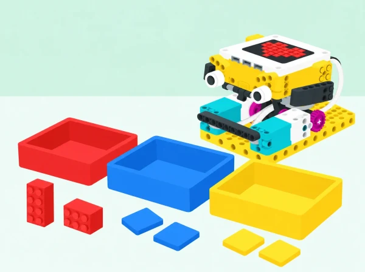

_El prototip classifica mostres de prova segons el color; no determina per si mateix el material ni el contenidor correcte._

## ♻️ Repte, context i aprenentatges

En un mercat de barri o en el menjador escolar es generen materials diferents i cal separar-los seguint les normes locals. L’equip dissenya amb SPIKE Prime un prototip de classificació que usa el color com a dada d’entrada. Primer provarà maons o targetes de colors coneguts; després compararà eixa tasca limitada amb el problema real de gestionar residus. Un envàs blau pot ser de diversos materials, i un mateix material pot tindre molts colors: la lectura cromàtica no és una identificació del material ni una instrucció de reciclatge.

## 🎯 Aprenentatges i vocabulari

formular criteris de classificació, relacionar una dada de sensor amb una regla, construir un mecanisme amb motors, provar-lo amb casos variats, calcular resultats sobre un conjunt conegut i comunicar límits i decisions pendents de validació humana.

## 🧰 Materials, preparació i referències locals

Prepareu un set SPIKE Prime amb hub, motor(s) angular(s), sensor de color i elements de construcció; un dispositiu amb l’app SPIKE; mostres netes de maons o targetes mates de diversos colors; safates buides; regle o separadors per estabilitzar distàncies; full de registre i calculadora opcional. La il·lustració mostra un prototip conceptual fet amb peces compatibles; l’alumnat ha de construir i provar el seu propi mecanisme amb les peces disponibles, no copiar un muntatge oficial.

El sensor de color de SPIKE pot llegir color, reflectivitat o llum ambiental. La fitxa tècnica del fabricant dona una distància de lectura òptima aproximada de 16 mm, que pot variar amb la mida, el color i la superfície de l’objecte. Abans de classe, comproveu en el set físic la lectura i el mecanisme proposat; no feu dependre una decisió important d’un valor de sensor sense verificar-lo. Per a una classificació autèntica de residus, consulteu la guia vigent del municipi o centre i useu mostres netes o targetes, mai residus tallants, bruts o desconeguts.

**Vocabulari:** sensor, mostra, criteri, classificar, material, color, excepció, fals positiu, falsa detecció, prototip i validació. Distingiu el vocabulari de la màquina («ha llegit blau») del vocabulari del residu («és un envàs d’un material concret»).

## 📅 Seqüència didàctica · cinc sessions de 50 minuts

### **Auditem un problema sense tocar residus (50 min).**

#### Fase 1 · Mirem el problema local (10 min)

Mostreu fotografies o una llista de materials del mercat o del menjador escolar. En parelles, l’alumnat proposa com els separaria i anota quina informació li falta. Abans de la sessió, el docent contrasta les propostes amb la guia municipal o la informació vigent del centre.

#### Fase 2 · Distingim el cas real del model (15 min)

Compareu dos objectes ficticis de color semblant i parleu de què sabem i què no sabem només mirant-los. Un envàs blau pot estar fet de materials diferents; un material pot tindre colors diversos. La lectura cromàtica no identifica la composició ni determina el contenidor.

#### Fase 3 · Definim la tasca de prova (15 min)

Cada equip tria dues o tres categories de color per a una maqueta amb maons o targetes. Dibuixeu entrada, regla i possibles eixides. Afegiu una categoria «per revisar» per a lectures desconegudes, i compareu-la amb la informació que caldria consultar per decidir sobre un residu real.

#### Fase 4 · Tanquem amb una pregunta (10 min)

Completeu un mapa de dues columnes: «què pot fer el prototip» i «què cal confirmar en la guia local». No cal manipular ni portar residus reals a l’aula.

**Evidència:** mapa de criteris amb una decisió del prototip i una dada pendent de verificar.

**Pregunta docent:** El color ens diu de quin material està fet un objecte? Quina font ens ajudaria a decidir què fer amb un residu real?

### **Dissenyem i construïm el classificador (50 min).**

#### Fase 1 · Representem el flux (10 min)

Dibuixeu el recorregut d’una mostra: entrada, lectura, regla i eixida. Trieu un muntatge segur amb una mostra situada davant del sensor i una comporta motoritzada que puga orientar-la cap a una de dues safates. En una primera versió, la comporta es pot moure a mà.

#### Fase 2 · Fem un prototip estable (25 min)

Fixeu el sensor en un suport ferm i perpendicular a la mostra. Marqueu una distància estable pròxima a la recomanació tècnica del fabricant, aproximadament 16 mm, i feu una lectura abans de connectar el motor. Useu només peces lleugeres i deixeu espai perquè la mostra no s’encalle.

#### Fase 3 · Revisem el mecanisme sense motor (10 min)

Moveu la comporta manualment per comprovar-ne l’abast. Identifiqueu on podrien quedar atrapats els dits o la mostra i ajusteu l’estructura abans d’automatitzar-la. L’alumnat no ha de copiar el prototip conceptual de la imatge: construirà una solució pròpia amb les peces disponibles.

#### Fase 4 · Anotem la decisió de disseny (5 min)

Assenyaleu al diagrama el sensor, l’actuador, les safates i la zona d’aturada segura.

**Evidència:** esbós anotat i prototip mecànic que supera una prova manual sense encallaments.

**Pregunta docent:** Quina peça ha de moure’s? Com evitarem que una mostra o un dit quede atrapat?

### **Programem i calibrem amb mostres conegudes (50 min).**

#### Fase 1 · Comprovem les lectures disponibles (10 min)

Llegiu maons o targetes mates amb colors que el sensor de SPIKE reconega en el model del centre. Registreu el valor que retorna el programa abans d’afegir una comporta. La lectura exacta pot variar amb la distància, la il·luminació i la superfície.

#### Fase 2 · Programem una regla senzilla (20 min)

En l’app SPIKE, creeu una condició per al color triat. Si es detecta, el motor orienta la comporta cap a una eixida; altrament, la mostra queda en una safata de revisió. Ajusteu els blocs al muntatge real i comproveu que la posició inicial del motor siga repetible.

#### Fase 3 · Repetim i canviem una condició (15 min)

Proveu cada cas almenys tres vegades des de la mateixa posició. Després canvieu només una variable —distància, il·luminació o superfície— i compareu el resultat. Incloeu una mostra fora de les categories; el programa ha de poder respondre «no ho sé».

#### Fase 4 · Registrem la calibració (5 min)

Completeu la taula amb mostra, color esperat, lectura, eixida i excepció. Afegiu un comentari al codi que explique la regla.

**Evidència:** taula de calibratge amb lectures repetides, codi comentat i una ruta de revisió per als casos desconeguts.

**Pregunta docent:** Quina lectura es repetix? Què fa el sistema quan apareix un color que no havíem previst?

### **Posem a prova els límits amb casos adversos (50 min).**

#### Fase 1 · Preparem una prova comparable (10 min)

Creeu vint mostres repetibles amb peces LEGO o targetes, no amb residus reals. Incloeu colors coincidents, variacions de to, blanc i negre, i superfícies mates i brillants. Barregeu l’ordre perquè el programa no puga aprofitar una seqüència coneguda.

#### Fase 2 · Executem i anotem cada cas (20 min)

Una persona que no programa la màquina conserva la clau de les categories de prova. L’equip executa les mostres i registra encerts, errors i casos enviats a revisió. Manteniu constants l’orientació i la distància; si les canvieu, marqueu-ho com una prova diferent.

#### Fase 3 · Analitzem els errors (15 min)

Calculeu el percentatge d’encerts sobre el nombre de mostres que el prototip havia de distingir. Compteu a banda les mostres de revisió: no són encerts automàtics. Trieu un fals positiu i un cas ambigu, i decidiu si l’origen probable és la lectura, la regla o el mecanisme.

#### Fase 4 · Concloem què no podem afirmar (5 min)

Escriviu un límit que les dades demostren i un risc que encara no s’ha provat. Un resultat amb maons o targetes no valida la classificació de residus reals.

**Evidència:** matriu de vint proves, percentatge amb denominador explícit i dos errors comentats.

**Pregunta docent:** Quin error seria més greu si la mostra fora un residu real? Quina informació encara falta?

### **Millorem i comuniquem una conclusió responsable (50 min).**

#### Fase 1 · Triem una sola millora (10 min)

Reviseu la matriu de proves i trieu una regla o una part mecànica. Escriviu una predicció concreta sobre què hauria de millorar abans de tocar el prototip.

#### Fase 2 · Repetim els mateixos casos (15 min)

Canvieu una sola cosa i torneu a provar les mateixes vint mostres en condicions semblants. Si una categoria millora i una altra empitjora, conserveu les dues dades i expliqueu el compromís.

#### Fase 3 · Contrastem amb la decisió real (10 min)

Compareu la maqueta amb la guia local: què pot automatitzar-se en una prova de color?, què exigix informació sobre composició i etiquetatge?, quan cal una revisió humana? La guia vigent, i no el prototip, és la referència per a les normes locals.

#### Fase 4 · Preparem una comunicació precisa (15 min)

Presenteu un diagrama, la taula de proves, el percentatge, un límit del sensor i una millora pendent. Redacteu la conclusió com «classifica aquestes mostres per color en les condicions provades», no com «sap reciclar qualsevol residu».

**Evidència:** prototip revisat, comparació abans/després i recomanació per a una persona operadora.

**Pregunta docent:** Quina afirmació permeten les dades? Quina informació addicional cal per a decidir sobre un objecte real?

## 📊 Avaluació i evidències

Recolliu l’esbós del flux, fotografies del mecanisme sense persones, codi comentat, registres de calibratge i taula comparativa de vint mostres. Observeu si l’alumnat:

- separa una lectura sensorial d’una conclusió sobre material o contenidor;

- construeix una regla que té una eixida per a casos desconeguts;

- repeteix proves en condicions documentades i calcula encerts sobre el total correcte;

- identifica si l’error apareix al sensor, a la lògica o al mecanisme;

- usa la guia local com a referent per a parlar de residus reals.

Es valora la qualitat de les proves i l’explicació dels límits, no una taxa d’encert perfecta. L’equip ha de distingir clarament entre mostra de prova i residu real.

## ♿ Seguretat i participació accessible

No manipuleu residus reals ni objectes bruts, tallants, amb líquids o d’origen desconegut. Useu peces lleugeres; manteniu dits fora de la comporta i desconnecteu el motor abans d’ajustar engranatges. Manteniu la màquina a baixa velocitat i sota supervisió. Per a participar, oferiu rols de cartografia, muntatge, programació, lectura de dades i auditoria; es poden donar instruccions perquè una altra persona opere el dispositiu. Les categories han de tindre pictogrames i formes a més de colors per no dependre només de la visió cromàtica. Es pot presentar la conclusió amb gràfic, text, comunicació augmentativa o demostració sense contacte amb el mecanisme.

## 🔗 Dotació i fonts tècniques

La proposta usa el sensor de color, hub, motors i elements estructurals del set SPIKE Prime. Consulteu la [fitxa tècnica oficial del sensor de color](https://education.lego.com/en-us/teacher-resources/lego-education-spike-prime/support-technical-info/lego-education-spike-prime-support-technical-info-product-info/) i comproveu-ne el funcionament al set del centre. La guia municipal o del centre sobre residus s’ha de consultar de nou abans d’usar l’activitat, perquè el prototip no determina les normes locals ni substitueix una classificació humana.
