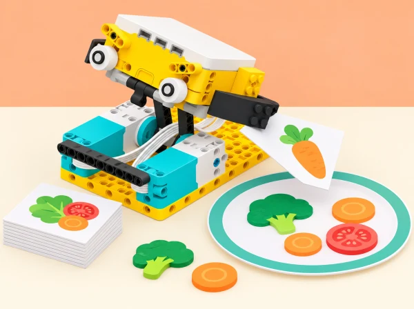

_El prototip treballa amb targetes i aliments simulats; no toca menjar ni prepara receptes reals._

## 🌱 Situació i intenció

La biblioteca escolar prepara una mostra titulada «De l’horta a la taula» amb receptes inventades a partir de targetes d’ingredients. L’encàrrec és dissenyar un ajudant mecànic de taula que resolga una part concreta de la preparació representada: fer avançar una targeta, prémer una fitxa d’un recorregut o remenar peces lleugeres dins d’una zona de paper. Els aliments, les safates i els estris només apareixen dibuixats; el robot no toca menjar ni participa en una cuina real.

Per arrelar el repte al territori, cada equip tria una hortalissa o un altre producte que puga documentar amb una font pública de la Comunitat Valenciana, com les fitxes de cultiu del [Portal Agrari de la Generalitat](https://portalagrari.gva.es/va/formacio-i-transferencia/cerca-divulgacio-tecnica), i prepara una targeta que en cita la procedència. La recepta i el procés són ficticis: no s’hi fan afirmacions sobre temporada, nutrició o tècniques culinàries sense una font contrastada. L’objectiu tecnològic és convertir una necessitat d’ús en un prototip fàcil d’activar, repetible, revisable i segur.

## 🎯 Objectius i criteris de disseny

- Definir una tasca delimitada i identificar qui l’utilitzaria i en quin punt del procés.

- Transformar el gir del motor en una acció útil mitjançant una palanca, corró o mecanisme de moviment.

- Relacionar la longitud del braç amb el recorregut i comparar configuracions amb una prova justa.

- Ajustar velocitat, durada o rotacions a materials de maqueta diferents, registrar resultats i iterar.

- Reutilitzar una part del programa en una eina nova i explicar què cal adaptar.

- Comunicar la limitació del prototip i distingir la maqueta d’un dispositiu alimentari real.

Abans de construir, l’equip acorda quatre criteris observables: l’acció s’entén sense una explicació llarga; s’activa amb un control accessible; completa la tasca tres vegades de manera semblant; i s’atura sense colpejar, atrapar dits ni eixir de la zona de prova.

## 📅 Seqüència didàctica · 5 sessions de 50 minuts

### **Sessió 1 · Investiguem la tasca i qui la farà servir.**

#### Fase 1 · Activem i prediem

Observeu les targetes de la recepta de mostra i marqueu el pas que podria beneficiar-se d’una ajuda: allisar una tira de paper, avançar una targeta o moure fitxes d’un recorregut. No reproduïu cap tasca real amb aliments.

#### Fase 2 · Explorem i construïm

Completeu en parella un mapa «persona / tasca / dificultat / ajuda possible». Formuleu la necessitat amb la frase «Una persona que ___ necessita que ___ perquè ___». Ordeneu les targetes del procés i trieu una sola acció per al primer prototip.

#### Fase 3 · Expliquem i registrem

Compareu els exemples del brief —corró sense mànec, sandvitxera i batedor automàtic— i valoreu quins es poden representar amb seguretat. Dibuixeu dues solucions i assenyaleu entrada, acció, zona de treball i aturada.

#### Fase 4 · Apliquem i millorem

Seleccioneu una solució segons els criteris acordats: acció comprensible, activació accessible, tres execucions semblants i aturada sense colps, dits atrapats ni eixida de la zona de prova. Oferiu targetes visuals i frases iniciadores si cal.

#### Fase 5 · Comprovem i reflexionem

Expliqueu quina part ha de fer el robot i quina convé deixar a la persona. **Evidència:** mapa de necessitat, dues idees anotades i decisió raonada.

### **Sessió 2 · Fem una primera maqueta mecànica.**

#### Fase 1 · Activem i prediem

Construïu una base SPIKE Prime estable amb un motor i un corró o braç que actue sobre paper. En el repte del corró sense mànec, connecteu una peça LEGO llarga al radi del motor, tal com proposa el brief. Dibuixeu què espereu que faça el paper i marqueu línies d’inici i final.

#### Fase 2 · Explorem i construïm

Comproveu que cap peça puga caure sobre les mans i que hi haja espai per desconnectar l’alimentació o aturar el programa. Feu girar el mecanisme a mà només si el muntatge ho permet sense forçar-lo.

#### Fase 3 · Expliquem i registrem

Compareu un braç curt i un de llarg mantenint iguals material, velocitat i temps d’activació. Anoteu la distància del punt final i si l’estructura es balanceja.

#### Fase 4 · Apliquem i millorem

Reviseu el muntatge si es desestabilitza. Expliqueu el compromís: un braç llarg pot ampliar el recorregut i alhora reduir estabilitat o control; no conclogueu que «més llarg és sempre millor».

#### Fase 5 · Comprovem i reflexionem

Compareu predicció i resultat i decidiu quina configuració provar després. **Evidència:** esbós, dues configuracions i predicció. Si no hi ha motor lliure, feu primer la comparació amb palanca manual.

### **Sessió 3 · Programem una acció controlada.**

#### Fase 1 · Activem i prediem

Activeu el motor amb el botó del hub o una ordre inicial simple. Predigueu què ocorrerà amb quatre rotacions o una duració acordada i marqueu la distància esperada.

#### Fase 2 · Explorem i construïm

Creeu una seqüència d’inici, moviment i aturada, primer amb blocs i, si hi ha experiència, amb Python. Proveu durada i nombre de rotacions com a maneres de delimitar l’acció; useu baixa velocitat en la primera execució.

#### Fase 3 · Expliquem i registrem

Cada intent parteix d’una predicció i registra valor programat, distància, desviació i incidència. Feu tres intents comparables i canvieu una sola variable en cada prova.

#### Fase 4 · Apliquem i millorem

Si el corró patina, comproveu contacte, base i valor del programa abans de reconstruir-ho tot. Afegiu una pausa o una ordre d’aturada clara quan es complete l’acció.

#### Fase 5 · Comprovem i reflexionem

Expliqueu quin canvi heu triat a partir de les dades. **Evidència:** codi comentat o diagrama, tres intents comparables i decisió de millora. Com a ampliació, feu que l’acció es puga repetir amb un segon botó només si es conserva una aturada accessible.

### **Sessió 4 · Adaptem el programa i el reutilitzem.**

#### Fase 1 · Activem i prediem

Prepareu dues tires de prova —per exemple, paper fi i cartolina lleugera— i anoteu les diferències. Predigueu quina configuració del motor funcionarà millor; no les descrigueu com a aliments ni atribuïu al sensor una lectura de duresa.

#### Fase 2 · Explorem i construïm

Modifiqueu només la configuració del motor —velocitat, potència o durada— i determineu quina funciona millor per a cada tira. Després canvieu l’eina: reutilitzeu la lògica del corró en una palanca que mou una fitxa o un remenador de peces dins d’un cercle dibuixat.

#### Fase 3 · Expliquem i registrem

Ressalteu al codi quines instruccions es conserven i quines depenen del mecanisme nou. Registreu les configuracions i els resultats per a cada material simulat.

#### Fase 4 · Apliquem i millorem

Com a extensió, afegiu un sensor del set només si aporta una entrada comprensible. El sensor de color pot llegir una marca gran de la targeta i seleccionar una configuració; calibreu-lo amb la llum de l’aula i oferiu un botó manual equivalent. El color és una etiqueta de l’equip, no una identificació d’ingredient ni una mesura del material.

#### Fase 5 · Comprovem i reflexionem

Expliqueu com es pot reutilitzar el programa i què cal adaptar en canviar el mecanisme. **Evidència:** taula de dues configuracions i esquema «codi que reutilitze / codi que canvie».

### **Sessió 5 · Combinem, provem i presentem.**

#### Fase 1 · Activem i prediem

Combineu dues accions senzilles —per exemple, ordenar una targeta i avançar una fitxa— sense fer el prototip més complex del que podeu provar. Predigueu l’ordre i la manera d’aturar-lo.

#### Fase 2 · Explorem i construïm

Un altre equip rep la consigna sense veure l’esbós i ha d’explicar què fa l’ajudant, trobar el control i assenyalar com s’atura. Feu tres execucions amb la mateixa configuració.

#### Fase 3 · Expliquem i registrem

Registreu els resultats i el retorn de l’altre equip. Si les execucions varien, identifiqueu si cal ajustar la base, el recorregut o la instrucció.

#### Fase 4 · Apliquem i millorem

Reviseu una part i repetiu la prova. Prepareu una cartel·la amb nom de la tasca, esquema d’entrada/eixida, font de la targeta local, una dada de prova i una limitació explícita.

#### Fase 5 · Comprovem i reflexionem

Demostreu el prototip i compareu-lo amb la seqüència manual. Expliqueu què fa amb més repetibilitat, què continua fent la persona i quines comprovacions serien necessàries abans de qualsevol ús fora de la maqueta. **Evidència:** demostració, registre final, retorn d’un altre equip i reflexió individual.

## 🧰 Materials i preparació

Set LEGO Education SPIKE Prime 45678 per equip o parella, hub carregat, un motor, peces estructurals, paper fi i cartolina lleugera, targetes pròpies amb símbols, retoladors, regla i full de registre. Sensor de color opcional si forma part de la dotació disponible. No cal expansió, utensili de cuina, menjar, líquid ni peça addicional no indicada.

Abans de la sessió, reviseu l’app i la versió del kit, proveu el port del motor, prepareu una base estable de demostració i una alternativa manual per a les targetes. Retalleu les proves a mida que no puga quedar atrapada dins del mecanisme. Organitzeu rols rotatius —disseny, muntatge, programació, registre i portaveu— perquè cada membre participe en la predicció i la prova, no sols en la construcció.

## 🧪 Evidències i criteris d’avaluació

La carpeta de procés reuneix mapa de necessitat, esbossos, criteris, esquema mecànic, codi o pseudocodi, taula de proves, adaptació a un segon material, tros de programa reutilitzat, font local i cartel·la. Useu aquesta escala breu per donar retorn durant la feina:

- **Necessitat i ús:** identifica una tasca concreta i descriu qui la faria servir; comprova si una altra persona entén l’acció.

- **Mecanisme:** relaciona braç/radi i recorregut amb mesures i reconeix el compromís amb estabilitat.

- **Programació i iteració:** delimita l’acció, registra almenys tres proves comparables i modifica una variable amb una raó.

- **Adaptació:** diferencia entre canviar el programa i canviar el mecanisme, i justifica què reutilitza.

- **Comunicació responsable:** cita la font d’una dada local i declara que la maqueta no prepara aliments ni valida seguretat alimentària.

Autoavaluació: «La prova que més m’ha ensenyat és…», «el canvi que he fet a partir d’una dada és…» i «una persona encara ha de…». El retorn entre equips ha d’incloure una fortalesa observada i una pregunta que ajude a millorar.

## ♿ Participació, cura i límits

Presenteu consignes en text i pictogrames, deixeu que la persona trie entre programació, construcció, documentació o presentació i permeteu participar sense manipular el mecanisme. Marqueu la zona de moviment amb una base clara, useu baixa velocitat i peces de prova lleugeres; ningú posa els dits davant del corró ni bloqueja el motor amb la mà. Atureu i desconnecteu el hub abans d’ajustar engranatges o retirar paper encallat. Si una peça es desprén o el muntatge es mou, pareu la prova i estabilitzeu-lo abans de continuar.

Aquest prototip no és apte per a cuinar, manipular aliments, líquids, ganivets, superfícies calentes o recipients. Una lectura de color només reconeix la marca preparada per a l’activitat. Les targetes de recepta són una representació educativa, no consell nutricional ni recepta per a consumir.

## 🔗 Referent oficial i correspondència

Partim del [SPIKE Activity Brief: RoboChef](https://assets.education.lego.com/v3/assets/blt293eea581807678a/blt5cf523e9f737c7ac/6324c446556fbc660c8ca4ba/LE_14x8.5_LessonMat_RoboChef_WB_Mech_NoCrops.pdf?locale=en-us) de LEGO Education. La proposta conserva el repte obert d’ajudar en una tasca de preparació, les preguntes sobre què costa fer i quines eines serien útils, els tres exemples del full —corró sense mànec, sandvitxera i batedor—, el criteri de disseny fàcil d’usar, la peça LEGO llarga que amplia el radi del motor, el canvi de configuració segons el material, la reutilització del programa en altres eines, la incorporació opcional de sensors i el repte de combinar més d’una tasca. Aquests elements apareixen en el brief oficial de dues pàgines; la seqüència de cinc sessions, la temàtica valenciana, les targetes, les proves, els criteris i la il·lustració són elaboració pròpia. La programació per blocs o Python es tria segons la versió de l’app i l’experiència de l’equip.
