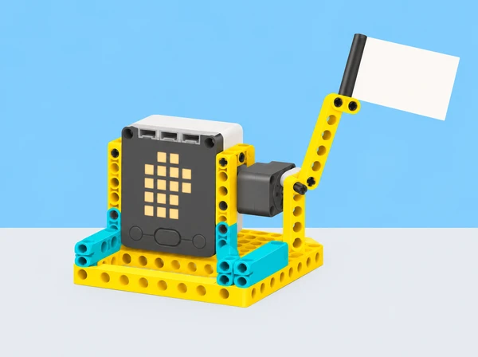

_El gest s’activa a distància; el hub, el motor i les bigues representen components SPIKE Prime de la dotació._

## 🌱 Situació i intenció

La biblioteca del centre rep classes convidades i vol un senyal visual d’acollida que es puga entendre de lluny i que no exigisca cap contacte físic. Cada equip dissenya un mecanisme SPIKE Prime amb un moviment de benvinguda: una salutació, una inclinació o una bandera que s’alça i torna a la posició inicial. El robot és una maqueta de comunicació: no substitueix la salutació de les persones ni decideix qui pot entrar.

El repte combina expressió visual, moviment i programació. La pregunta central és com les decisions sobre la forma, l’amplitud i el ritme canvien la lectura del gest. Partim d’un espai pròxim —la biblioteca escolar— i pensem també com es podria rebre un grup visitant d’un altre centre de la localitat. No gravem ni identifiquem visitants: les proves es fan amb targetes o amb persones voluntàries que poden observar des de la distància i retirar-se quan vulguen.

## 🎯 Objectius i criteris de disseny

- Generar diverses idees de gest i justificar quina comunica millor l’acollida.

- Construir un braç o bandera articulada i relacionar la posició del motor amb el moviment observat.

- Comparar control per temps i control per rotacions amb repeticions mesurables.

- Programar una entrada i una resposta amb una aturada clara i una posició de repòs segura.

- Recollir feedback sense jutjar l’expressió personal de qui participa, i modificar el prototip a partir d’evidències.

Abans del muntatge, cada equip defineix com comprovarà aquests criteris: el gest es reconeix a distància; el moviment no resulta brusc ni envaeix l’espai personal; torna de manera repetible a una posició segura; i hi ha una alternativa si no es vol activar el sensor o participar en la prova.

## 📅 Seqüència didàctica · 5 sessions de 50 minuts

### **Sessió 1 · Què fa que una benvinguda siga llegible?**

Observeu tres targetes amb gestos dibuixats —braç que saluda, bandera que s’alça i inclinació breu— i descriviu què veieu sense endevinar intencions. En grups, esbosseu tres propostes i anoteu per a cadascuna: què es mou, qui inicia el moviment, des de quina distància es veu i com acaba. Compareu una forma amable i recognoscible amb una de més abstracta; no cal afegir una cara o ulls al muntatge perquè el moviment comunique.

Trieu un gest que es puga representar amb un motor i una peça lleugera. Marqueu en el dibuix la base, l’eix, la part mòbil i el recorregut màxim. El criteri d’accessibilitat comença ací: el senyal ha de ser visible sense so, i una targeta fixa de benvinguda ha de continuar disponible. **Evidència:** tres esbossos, anotacions de lectura i selecció argumentada. **Suport:** oferiu una plantilla amb les parts «base / motor / element mòbil / espai segur»; **ampliació:** dissenyeu dos gestos diferents amb una mateixa peça terminal.

### **Sessió 2 · Del gir del motor al gest.**

Construïu una base ferma amb un motor SPIKE Prime i un braç o bandera de cartó lleuger subjecte amb peces del kit. Comenceu amb l’articulació més simple. Desplaceu el motor o canvieu la posició de l’eix per observar com varia l’arc del braç; dibuixeu l’eix de rotació i mesureu l’amplitud aproximada en una graella de paper. Afegiu una «mà» geomètrica o una peça terminal només si ajuda a llegir el gest, sense fer-la massa pesada.

Compareu una extensió curta amb una llarga: observeu recorregut, oscil·lació de la base i estabilitat en començar i parar. Com a ampliació inspirada en el brief, uniu peces en X per construir una extensió de tisora. Mesureu l’abast en repòs i desplegada i decidiu si realment millora la visibilitat del senyal. **Evidència:** muntatge anotat, esquema de l’eix i una comparació de dues formes. **Alternativa:** si la tisora és inestable o el temps és limitat, conserveu-la com a model de paper i completeu el gest bàsic amb un braç directe.

### **Sessió 3 · Programem el ritme i la tornada.**

Escriviu primer una seqüència curta: posició inicial, moviment fins a una amplitud acordada, pausa breu i retorn. Programeu-la en blocs; si el grup té experiència prèvia, representeu la mateixa seqüència en Python. Creeu dues versions: una basada en temps i una altra en rotacions del motor. Manteniu constants la forma i la velocitat mentre compareu-les. Executeu cada versió tres vegades i registreu si l’element arriba al punt previst i si torna al repòs sense colpejar el suport.

Si el braç no retorna o es mou massa, feu una prova de depuració canviant una sola cosa: valor de rotació, durada o orientació inicial del motor. Eviteu accelerar el moviment com a primera solució. **Evidència:** pseudocodi, captura o diagrama del programa i taula de tres execucions. **Repte d’ampliació:** programeu dos moviments consecutius amb una pausa clara i expliqueu quin es podria perdre si es redueix massa el temps entre ells.

### **Sessió 4 · Decidim quan s’activa.**

La proposta oficial planteja un sensor ultrasònic per fer que el moviment s’active quan hi ha algú al davant. Adapteu-ho sense apuntar a persones: useu una targeta gran o un objecte de cartó que es col·loca davant del sensor de distància SPIKE. Definiu una distància d’activació i una altra de separació, feu proves des de tres punts marcats i observeu si el gest s’activa una vegada o repetidament mentre l’objecte roman allí. Ajusteu el valor només després d’escriure què espereu que canvie.

Feu una llista de possibles errors: objecte massa menut, angle diferent, obstacle del fons o distància fora del rang provat. Si el sensor no forma part del set o no està disponible, useu el botó del hub o un inici manual. Aquesta alternativa no és menys vàlida: permet comparar una entrada automatitzada amb una d’explícita i conserva el control de la persona. **Evidència:** diagrama d’entrada/resposta, taula de distàncies i una nota sobre falses activacions. Cap sensor identifica una persona ni determina si vol interactuar.

### **Sessió 5 · Fem una prova d’ús i revisem.**

Prepareu una demostració en una taula estable. Una parella que no ha construït el model veu el gest des d’un punt marcat i tria una targeta de retorn: «he entés el senyal», «el moviment m’ha sorprés» o «preferisc el senyal estàtic». No es pregunta a ningú si el robot li sembla personalment acollidor, ni es grava la resposta. El grup constructor usa el retorn per a canviar una sola característica —amplitud, posició del motor, durada o forma terminal— i torna a provar-lo.

Presenteu el prototip amb un cartell que mostre el gest triat, el programa resumit i una limitació. Acabeu comparant el muntatge directe amb el braç de tisora, si s’ha construït, i expliqueu quina versió és més estable i més clara. **Evidència:** prototip revisat, feedback anònim no identificable, canvi documentat i explicació oral o escrita.

## 🧰 Materials i preparació

Set LEGO Education SPIKE Prime 45678 per parella o equip, hub carregat, un motor, peces estructurals, cartó lleuger per a bandera o mà, paper quadriculat, retoladors, regle i targetes de feedback. Sensor de distància opcional, només si forma part de la dotació i funciona en la versió local de l’app; si no, el botó del hub és suficient. No cal una expansió ni cap objecte addicional que interactue amb el cos.

Abans de la classe, proveu el port i l’orientació del motor, prepareu una base estable i marqueu una zona de moviment segura. Deixeu targetes de gest disponibles per a anticipar la seqüència i un mode manual perquè el prototip no depenga del sensor. Roten els rols de disseny, muntatge, programació, registre i observació; cada alumne pot aportar una prova encara que no vulga activar ni veure el gest en directe.

## 🧪 Evidències i avaluació

Recolliu esbossos i criteris, diagrama mecànic, codi o pseudocodi, comparació temps/rotacions, registre de proves del sensor (si s’usa), retorn d’ús i revisió final. La rúbrica formativa observa:

- **Comunicació:** explica quin gest vol representar i justifica forma i amplitud amb criteris observables.

- **Mecànica:** identifica eix i braç, compara dues configuracions i usa una mesura per descriure’n el canvi.

- **Programació:** implementa moviment, pausa i retorn, i depura el comportament modificant una variable cada vegada.

- **Prova:** repeteix les execucions en condicions semblants, documenta incidències i aplica feedback sense identificar participants.

- **Inclusió i seguretat:** conserva una alternativa estàtica/manual, delimita la zona i evita moviment cap a les persones.

Autoavaluació: «El gest es llig des de…», «he triat temps/rotacions perquè…» i «una alternativa que continua disponible és…». El feedback es refereix al disseny i a la llegibilitat, mai a la personalitat o a les emocions de qui observa.

## ♿ Participació, cura i límits

Oferiu instruccions escrites i visuals, demostració lenta i opció d’anticipar els moviments amb targetes. El missatge ha de combinar moviment amb un senyal estàtic visible; el so no és necessari. Les persones poden observar des de la distància que trien, participar a través del registre o no acostar-se al mecanisme. No useu el sensor per detectar o seguir visitants i no associeu cap moviment amb l’estat d’ànim de les persones.

Proveu el braç a baixa velocitat, sobre una superfície estable i sense ningú dins del seu recorregut. Atureu i desconnecteu el hub abans d’ajustar l’eix o retirar peces. El prototip no és un sistema de control d’accés ni un dispositiu per a espais públics; la recepció real continua sent responsabilitat de les persones del centre.

## 🔗 Referent oficial i adaptació

Partim del [SPIKE Activity Brief: Greetings, Earthling](https://assets.education.lego.com/v3/assets/blt293eea581807678a/blt52090884117e954a/6324c3b5258fb55f6b2169d0/LE_14x8.5_LessonMat_GreetingsEarthling_WB_Mech_NoCrops.pdf?locale=en-us), elaborat amb el Tufts Center for Engineering Education and Outreach. El brief proposa saludar amb una salutació de mà, un puny o un xoc de mans; pensar com fer un aspecte amable, on situar el motor perquè el braç es moga amb naturalitat, i controlar la quantitat de moviment amb temps o rotacions. També suggereix afegir una mà, activar-se amb sensor ultrasònic i allargar el braç amb una tisora de peces en X. Aquesta adaptació conserva eixos i extensions, però representa el gest a distància per no requerir contacte corporal. La narrativa de biblioteca, seqüència, proves, criteris i il·lustració són propis; el sensor s’assaaja només amb objectes.
