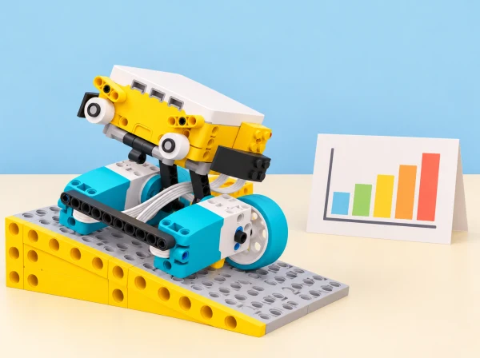

_Una biblioteca escolar permet explorar rutes, verificació i privacitat amb paquets ficticis._

## 🌱 Situació i intenció

Adaptació de la unitat *Kickstart a Business* per al context d’un centre educatiu valencià. Cada sessió conserva l’objectiu oficial i el tradueix en un repte, materials i criteris propis; quan una activitat del pla és híbrida o no requereix el hub, s’indica expressament en la sessió.

## 🎯 Aprenentatges i vocabulari

- Aplicar criteris de qualitat per preparar i verificar un paquet fictici de llibres.
- Planificar i depurar una ruta de lliurament amb distàncies i punts de control observables.
- Registrar cada transferència de la maqueta sense incorporar noms, préstecs ni dades de lectores reals.
- Explicar quines parts del procés pot executar el robot i quines decisions continuen sent humanes.

## 📅 Seqüència didàctica · 7 sessions

Durada orientativa: una sessió per a les activitats d’inici i depuració; dues per al traçador X-Y, la capsa lògica i el repte final d’automatització. Abans de cada repte, l’equip formula una predicció; després prova, registra el resultat i explica un canvi. Les fitxes de comanda, claus i paquets són inventades: el robot només treballa en una maqueta i no s’utilitza per controlar serveis reals.

### **S1 · El control de qualitat de la mediateca ([Place Your Order](https://education.lego.com/en-us/lessons/prime-kickstart-a-business/place-your-order/), 45–60 min).**

#### Fase 1 · Activem i prediem

Repartiu una comanda fictícia de llibres i descomponeu «comprovar que el paquet està preparat» en accions observables: posar el sistema en marxa, llegir una fitxa de color, respondre amb moviment i donar un senyal final. Pregunteu quin ordre d’accions esperen veure al vídeo i què hauria de passar si la fitxa canvia.

#### Fase 2 · Explorem i construïm

En parelles, feu una construcció en tàndem: una persona prepara les peces i reconeix les accions del vídeo de guia; l’altra munta el capçal. Després canvieu o compartiu tasques perquè totes dues puguen explicar el model. Alineeu els motors abans d’executar-lo i comproveu que el sensor de color veu la fitxa sense que els dits queden darrere: els pot detectar com un color violeta.

#### Fase 3 · Expliquem i registrem

Mireu el primer vídeo tantes vegades com calga, anoteu només les accions observades en pseudocodi i convertiu-les en la primera pila de blocs. Mireu el segon vídeo, distingiu les accions noves i escriviu pseudocodi i piles addicionals. Registreu què s’ha afegit i què s’ha mantingut igual entre versions.

#### Fase 4 · Apliquem i millorem

Demaneu a una altra parella que seguisca les instruccions sense que les completeu oralment. Compareu la precisió del pseudocodi i el funcionament del model, localitzeu una ambigüitat i reviseu-la. Si queda temps, graveu un tutorial breu propi o feu una guia il·lustrada per muntar i programar el control de qualitat.

#### Fase 5 · Comprovem i reflexionem

**Evidència:** dues versions de pseudocodi, les piles corresponents i la comprovació de lectura del color. Autoavaluació amb tres graons propis (reproduïsc una acció / diverses / en cree d’originals) i retorn entre parelles amb una millora concreta. El repte conserva la descomposició i la traducció d’observació a programa, amb una comanda de biblioteca pròpia.

### **S2 · El carretó que feia una ruta inesperada ([Out of Order](https://education.lego.com/en-us/lessons/prime-kickstart-a-business/out-of-order/), 45 min).**

#### Fase 1 · Activem i prediem

Presenteu el carretó de repartiment de la maqueta —dos motors mitjans al davant per avançar o recular i un motor gran al darrere per dirigir-lo— i un programa intencionadament defectuós. Abans d’executar-lo, cada parella dibuixa la ruta que espera i prediu quin tram pot resultar incorrecte.

#### Fase 2 · Explorem i construïm

Executeu el codi sense modificar-lo i descriviu el símptoma; marqueu cada acció real sobre el mapa de ruta propi. El moviment pot ser una mica imprevisible: és una propietat del model i no una fallada que l’alumnat haja de «corregir» mecànicament.

#### Fase 3 · Expliquem i registrem

En parelles, feu una llista d’errors possibles i proposeu una causa per a cadascun. Anoteu el símptoma observat, la hipòtesi i quin bloc o valor podria explicar-lo; contrasteu les hipòtesis abans de tocar el programa.

#### Fase 4 · Apliquem i millorem

Canvieu un únic bloc o valor cada vegada i torneu a provar. Compareu les estratègies i programeu el carretó perquè seguisca un segon trajecte nou. Anoteu els canvis amb comentaris clars perquè una altra parella puga continuar el treball.

#### Fase 5 · Comprovem i reflexionem

**Evidència:** taula «símptoma / hipòtesi / canvi / resultat», codi abans i després, i llista de comprovació. El docent pot donar pistes graduades o una targeta amb diversos errors ordenats per complexitat. El repte adapta la cerca, correcció i documentació d’errors, no una ruta literal del fabricant.

### **S3 · Traçador de rutes entre prestatgeries ([Track Your Packages](https://education.lego.com/en-us/lessons/prime-kickstart-a-business/track-your-packages/), 2 sessions de 45–60 min).**

#### Fase 1 · Activem i prediem

Presenteu el repte de traçar el mapa de passadissos de la mediateca i predigueu com es pot traduir cada tram a moviment dels motors. Dibuixeu una ruta curta amb angles rectes i marqueu quins trams seran verticals i quins horitzontals.

#### Fase 2 · Explorem i construïm

Munteu un traçador X-Y amb una agulla ampla que llisque sobre paper; practiqueu com carregar el full i dividiu la construcció entre les dues parts principals. Amb piles de codi separades, proveu línies verticals i horitzontals. Registreu girs o rotacions del motor i la longitud que ha traçat cada prova.

#### Fase 3 · Expliquem i registrem

Combineu les piles en un sol programa reutilitzant blocs i ajustant paràmetres. Traceu el mapa propi de passadissos i una diagonal cap a una prestatgeria fictícia. Compareu la longitud prevista amb la traçada i representeu en una gràfica almenys dos parells (rotacions, centímetres).

#### Fase 4 · Apliquem i millorem

A la segona sessió, feu un segon mapa i comenteu el codi reutilitzat. A partir dels dos parells registrats, proposeu una regla aproximada del tipus *distància = p × rotacions + q* i mesureu una tercera ruta per comprovar la predicció o recalibrar. Si les diagonals dificulten l’entrada, comenceu amb verticals i horitzontals; com a ampliació, convertiu el traçador en plòter, dibuixeu un símbol original i resoleu una forma més complexa.

#### Fase 5 · Comprovem i reflexionem

**Evidència:** mapa anotat, programa modular, comentaris i taula que relaciona rotacions del motor amb longitud de línia. Expliqueu quina decisió de calibratge ha millorat el traçat i atribuiu els blocs adaptats al programa de partida quan se n’haja reutilitzat un.

### **Una condició per controlar l’accés a la capsa de préstec ([Keep It Safe](https://education.lego.com/en-us/lessons/prime-kickstart-a-business/keep-it-safe/), 90–120 min).**

#### Fase 1 · Activem i prediem

**Temps orientatiu · 10 min.** Activeu la conversa amb tres preguntes: «Quin dispositiu de seguretat coneixes?», «Què fa que una contrasenya siga fàcil o difícil d’endevinar?» i «Què és una condició?». Mireu el vídeo de la lliçó oficial i formuleu el repte propi: com podem fer que una capsa de maqueta responga a una regla clara? Cada equip dibuixa una predicció amb dos estats —porta tancada i porta oberta— i escriu què espera que faça la capsa quan rep l’ordre triada.

#### Fase 2 · Explorem i construïm

**Temps orientatiu · 35 min.** En tàndem, una persona munta la porta i l’altra el cos de la capsa; després revisen juntes les unions i connecten el motor segons les instruccions de construcció disponibles al centre. Executeu el programa inicial per observar el mecanisme abans de modificar-lo. Localitzeu la clau manual per recuperar la porta si el motor queda bloquejat i deixeu preparat el motor addicional per a la lliçó següent, amb el cable fixat darrere del model. Registreu en un dibuix quin moviment obri i quin tanca, sense introduir objectes de valor ni codis reals.

#### Fase 3 · Expliquem i registrem

**Temps orientatiu · 15 min.** Representeu la regla inicial com un diagrama de flux amb una condició i dues eixides: «si es prem A, obri; si no, es queda tancada». Identifiqueu l’entrada, la condició vertadera o falsa i l’acció del motor. Abans de programar, completeu una taula amb tres casos: A premut, A no premut i una segona pulsació després d’obrir. Compareu la predicció amb el comportament observat i anoteu qualsevol diferència.

#### Fase 4 · Apliquem i millorem

**Temps orientatiu · 35–45 min.** Programeu la regla i executeu els tres casos de la taula, reiniciant el mecanisme entre intents quan calga. Afegiu una segona condició senzilla —per exemple, prémer A i després B en l’ordre acordat— i compareu-la amb la versió inicial. Feu una prova creuada: un altre equip rep la capsa sense conéixer la regla, proposa quines entrades provarà i registra si ha pogut deduir el patró. Si el moviment no és repetible, reviseu la posició inicial i el gir del motor abans d’atribuir el resultat al programa. Personalitzeu, si hi ha temps, la matriu de llum o el so perquè el feedback indique «prova acceptada» o «torna-ho a provar» sense revelar cap dada.

#### Fase 5 · Comprovem i reflexionem

**Temps orientatiu · 10–15 min.** Recolliu el diagrama, la taula de casos i el programa revisat. Observeu si cada alumne pot explicar què és una condició, utilitzar-la en el programa i parlar amb precisió dels límits de la maqueta. Autoavaluació amb tres nivells: «he provat una condició», «n’he provat dues» o «n’he provat més de dues»; una parella deixa un retorn concret per a S5. Com a extensió lingüística, feu un glossari breu de *booleà, condició, xifratge* i *distingeix majúscules*; són conceptes de seguretat digital, no propietats que implemente aquesta maqueta. Reserveu cinc minuts per a desconnectar i ordenar les peces.

La font oficial pauta Engage (5 min), Explore (20 min), Explain (5 min), Elaborate (15 min) i avaluació; la planificació local amplia la construcció, les proves i l’avaluació fins a 90–120 minuts. La capsa només usa autoritzacions inventades: no és un pany segur ni guarda objectes de valor, contrasenyes reals o dades personals.

### **S5 · Dues condicions i una regla transparent ([Keep It Really Safe!](https://education.lego.com/en-us/lessons/prime-kickstart-a-business/keep-it-really-safe/), 90–120 min en dues sessions).**

#### Fase 1 · Activem i prediem

Recupereu la regla simple de S4 i pregunteu què pot passar si algú descobreix una contrasenya. El repte és ampliar la maqueta de caixa forta amb una condició composta: la porta només s’obri si coincideixen dues entrades. Escriviu què hauria de passar quan només n’hi ha una, quan no n’hi ha cap i quan totes dues són certes.

#### Fase 2 · Explorem i construïm

En parelles i per tasques complementàries, una persona construeix el cos de la caixa i l’altra la porta amb el braç motoritzat. Abans d’executar el programa, alceu el braç a la posició inicial correcta, proveu el recorregut amb cura i localitzeu la clau manual de desbloqueig. Executeu el programa inicial per observar el mecanisme; la maqueta només utilitza autoritzacions fictícies i no és un pany real.

#### Fase 3 · Expliquem i registrem

Compareu *AND* i *OR* amb targetes d’entrada i predigueu els quatre casos de la regla «botó A **i** sensor de força activat»:

- A no premut + sensor inactiu → la porta queda tancada.
- A no premut + sensor actiu → la porta queda tancada.
- A premut + sensor inactiu → la porta queda tancada.
- A premut + sensor actiu → el programa permet obrir la porta.

Expliqueu per què *AND* és més restrictiu que *OR* en aquesta regla i dibuixeu el flux abans de programar.

#### Fase 4 · Apliquem i millorem

Afegiu la condició composta al programa i proveu, una per una, les quatre combinacions previstes; anoteu predicció, resposta del motor i diferència. Després desafieu una altra parella a obrir la caixa de maqueta explicant quines entrades ha provat. Si la primera regla funciona, creeu una segona amb *OR* i una altra amb *NOT* per a generar un avís quan falta una autorització. Com a ampliació, connecteu un altre sensor del set SPIKE Prime —de distància o força— i expliqueu per què l’heu triat. Reserveu temps per a guardar el material; el treball complet es distribueix en dues sessions.

#### Fase 5 · Comprovem i reflexionem

**Criteris d’èxit:** explicar què és una condició composta; programar i provar una regla; interpretar els quatre resultats; parlar de seguretat digital amb precisió. Autoavalieu-vos segons si heu creat una, dues o més condicions compostes i rebeu d’una altra parella una observació concreta i una millora aplicable. Completeu un glossari propi amb *booleà, condició, condició composta, AND, OR, NOR, NOT, xifratge* i *sensibilitat a majúscules*, amb un exemple de la maqueta. **Evidència:** taula de veritat anotada, prediccions i resultats, programa, explicació del comportament i glossari. No useu contrasenyes reals ni guardeu informació personal: la maqueta no protegeix objectes ni dades de valor.

### **S6 · Classificació assistida de retorns ([Automate It!](https://education.lego.com/en-us/lessons/prime-kickstart-a-business/automate-it/), 2–3 sessions, 120+ min).**

#### Fase 1 · Activem i prediem

Delimiteu una àrea per guardar prototips entre classes i prepareu una llibreta d’inventor amb espais per a esbossos, prediccions, problemes, proves i decisions. Observeu sistemes de classificació i discutiu què detecten, com saben on són i quins detalls fan que el moviment siga repetible. Definiu el repte propi: classificar fitxes-paquet fictícies per destinació.

#### Fase 2 · Explorem i construïm

Cada equip identifica les parts clau del problema, esbossa almenys dues solucions i en tria una amb criteris explícits: precisió, facilitat de revisió, estabilitat i ús de materials. Escriviu pseudocodi i construïu un primer ajudant; combineu rols i anoteu qualsevol problema en lloc d’amagar-lo.

#### Fase 3 · Expliquem i registrem

Atureu-vos per descriure un problema observat, mostrar les dades inicials i decidir quin canvi provareu. Modifiqueu una variable per tanda i anoteu la relació entre canvi i resultat en la llibreta d’inventor.

#### Fase 4 · Apliquem i millorem

Completeu programa i mecanisme; feu proves amb targetes de diferents colors, formes i paraules; registreu classificacions correctes i errors. Presenteu la solució a la classe i, amb prototips prou estables, connecteu-los en una línia de triatge per observar com cooperarien. Comenceu amb un model bàsic modificable si cal suport; amplieu afegint funcions o un carretó que connecte estacions. Reserveu temps per a ordenar el material.

#### Fase 5 · Comprovem i reflexionem

**Evidència:** llibreta amb idees alternatives, pseudocodi, taula de resultats, decisió de redisseny i presentació amb esquemes o fotografies pròpies i límits identificats. Observeu si l’alumnat identifica elements del problema, treballa amb autonomia cap a una solució funcional i creativa, i comunica idees amb claredat. Autoavaluació («funciona», «resol creativament», «ho explique amb claredat») i coavaluació amb una pregunta i una millora. El sistema només classifica objectes de joc combinant color, forma i paraula; no classifica persones ni substitueix la catalogació real.

### **S7 · Instruccions d’esquena a esquena ([Back to Back](https://education.lego.com/en-us/lessons/prime-kickstart-a-business/back-to-back/), 45 min, híbrida i desconnectada).**

#### Fase 1 · Activem i prediem

Activeu idees prèvies amb «què és un codi?» i construïu definicions compartides d’algorisme, error, descomposició i pseudocodi. Compareu una instrucció quotidiana ordenada amb una seqüència de blocs descrita en paraules: què fa que siga clara i executable?

#### Fase 2 · Explorem i construïm

Cadascú dissenya, sense mostrar-lo, un animal de maqueta inspirat en la fauna d’aiguamoll valencià amb cinc peces o menys. Escriu instruccions curtes, ordenades i precises perquè una altra persona el puga reconstruir. L’activitat és híbrida: es pot fer amb peces soltes de SPIKE Prime, altres peces, dibuixos o cartes, i no necessita hub ni programari.

#### Fase 3 · Expliquem i registrem

En parelles, una persona segueix exactament les instruccions i després canvieu els rols. Compareu original i reconstrucció i feu retorn amable amb un exemple concret: «aquesta instrucció era clara» o «ací faltava indicar…». Identifiqueu una ambigüitat o pas absent i anoteu com el resultat ajuda a depurar el pseudocodi.

#### Fase 4 · Apliquem i millorem

Reviseu les instruccions i feu una segona reconstrucció, o redacteu una versió millorada per a un model nou. Vinculeu l’experiència amb el treball en parella de programació: una persona escriu i l’altra executa el codi. Si es fa a distància, compartiu les instruccions en una videotrucada o document i reconstruïu-les en un espai de treball adequat.

#### Fase 5 · Comprovem i reflexionem

Autoavalueu-vos amb tres graons («necessite una pauta», «escric i depure», «puc ensenyar-ho a una altra parella») i deseu el pseudocodi inicial i el final. **Evidència:** instruccions i reconstrucció amb una anotació de la millora concreta. Reserveu temps per a compartir una estratègia que haja fet les instruccions més precises.

## 🧰 Materials i preparació

SPIKE Prime, graella de paper, fitxes fictícies, cartró i sensor de color i sensor de força del set SPIKE Prime, verificats amb el hub i l’app del centre. Aquesta situació és una maqueta didàctica: no gestiona préstecs, panys ni comandes reals de la biblioteca.

## 🎯 Evidències i avaluació

Incloem protocol de comanda, depuració abans/després, mapa X-Y, taula de proves amb condicions simples i compostes, llibreta d’inventor amb diverses iteracions, resultats de classificació i pseudocodi revisat. En cada sessió, el grup tria un indicador observable del progrés i rep una observació útil d’una altra parella; la valoració no depén de si el mecanisme «guanya» ni si la primera solució funciona. La mostra final explica una decisió que conserva privacitat o evita una automatització injusta.

## ♿ Participació i inclusió

Les etiquetes combinen color amb forma i símbol. Es pot seguir la ruta amb un mapa tàctil o una fitxa desplaçable, i participar com a cartògraf, programador, verificador o narrador. Totes les dades de persones i llibres són inventades.

## 🔗 Unitat oficial i traçabilitat

La unitat conté set lliçons que s’han contrastat individualment en les seues [fitxes públiques de LEGO Education](https://education.lego.com/en-us/lessons/prime-kickstart-a-business/): observació de vídeos i pseudocodi per a descompondre el control de qualitat; depuració documentada d’un carretó de repartiment; reutilització de piles de codi en un traçador X-Y; condicions en una caixa amb clau manual; condicions compostes amb AND/OR; un projecte obert d’ajudant automatitzat al llarg de 2–3 sessions; i pseudocodi sense ordinador en una lliçó híbrida amb peces flexibles. També hem incorporat la construcció en tàndem, els objectius d’avaluació i les ampliacions públiques compatibles amb la dotació. Les instruccions detallades de l’alumnat i els models de LEGO remeten a l’app i no es reprodueixen: la proposta, la maqueta de biblioteca, les dades, els criteris, les targetes i la imatge són propis. Els muntatges i sensors es comproven amb el set disponible al centre.
