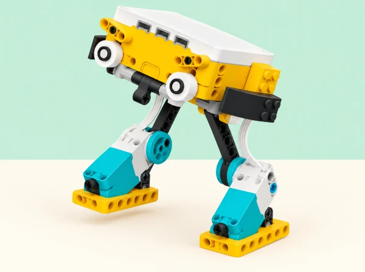

_El model caminador usa el hub, les peces estructurals i els mecanismes de pota del set SPIKE Prime, sense rodes ni cara fictícia._

## 🌱 Situació i intenció

Per a la mostra de ciència del centre, cada equip construeix un caminador SPIKE Prime que avança sense rodes i explica com ho aconsegueix. La pista de prova representa paviments que l’alumnat reconeix al seu entorn —rajola llisa, junta de pedra, superfície rugosa— amb mostres de cartó, paper i goma escuma preparades a l’aula. No s’entra en calçades ni es fan proves amb vianants; el repte és mecànic i controlat sobre una taula.

El full oficial deixa oberta la construcció i pregunta com la llargària de les potes afecta el moviment i com impulsar el robot sense rodes. Ací convertim eixes preguntes en una investigació: predir, fer un muntatge inicial, canviar una variable cada vegada, repetir i comunicar els límits. No busquem una «caminada correcta»: un prototip que vibra, gira o no avança també aporta evidència si l’equip la registra i la usa per decidir el pas següent.

## 🎯 Objectius i criteris de disseny

- Identificar quines peces giren, quines articulen les potes i quins punts contacten amb la pista.

- Relacionar la llargària i l’ancoratge de les potes amb la distància, la direcció i l’estabilitat.

- Programar rotacions i pauses, i comparar moviments de dos motors coordinats o alternats.

- Planificar una prova justa, repetir-la almenys tres vegades i explicar variacions en els resultats.

- Descriure una millora amb dades i aclarir en quines condicions és vàlida la conclusió.

Els criteris comuns són: cap roda; el model es manté sobre la pista durant la prova; el recorregut pot mesurar-se; l’equip pot aturar-lo abans d’ajustar-lo; i els resultats es presenten sense exagerar què demostra una única superfície o tres intents.

## 📅 Seqüència didàctica · 5 sessions de 50 minuts

### **Sessió 1 · Descomponem la caminada.**

Observeu el model de referència i una demostració lenta. Marqueu amb fletxes les peces que giren, els punts d’unió de les bieles i les parts que toquen el terra. En parelles, esbosseu dues maneres de fixar les potes al motor: mateixa llargària amb ancoratges diferents o llargàries diferents amb punts d’unió iguals. Feu una predicció sobre quina avançarà, quina oscil·larà i quina podria bolcar, i indiqueu per què.

Prepareu un plànol de prova amb línia d’eixida, carril i zona d’aturada. La classe tria una superfície inicial comuna i una durada curta de funcionament; encara no compareu dissenys sobre pistes diferents. Repartiu rols de muntatge, programació, observació i registre, amb rotació prevista. **Evidència:** diagrama anotat, predicció i protocol inicial. **Suport:** targetes amb «gira / empeny / toca / s’estabilitza»; **ampliació:** afegiu un dibuix de la trajectòria que esperem de cada pota.

### **Sessió 2 · Construïm el primer model sense rodes.**

Feu una base baixa amb hub, motor i peces estructurals. Afegiu dues potes o un parell d’extremitats articulades amb peces de la dotació. Comproveu que les unions estan fixades i que els elements no colpegen la taula amb força. Moveu el model a mà només quan estiga apagat, si la construcció ho permet, per detectar bloquejos abans d’engegar-lo.

Executeu una ordre lenta i curta. Mesureu distància des de la línia d’eixida, temps fins a l’aturada i estat final (dret, tombat, girat o sense desplaçament). Si el prototip només vibra, poseu a prova una hipòtesi concreta —per exemple, si les potes empenyen cap avant o només cap avall— en lloc de començar de nou. **Evidència:** fotografia o dibuix de la construcció, codi inicial i registre del primer resultat.

### **Sessió 3 · Una variable cada vegada.**

Trieu una característica per modificar: llargària de la pota, separació dels punts de suport, posició de la biela o velocitat del motor. Feu servir la mateixa pista, la mateixa durada de programa i el mateix punt d’inici. Executeu tres intents per a la versió A i tres per a la B; registreu distància, temps, estabilitat i incidències. Calculeu el valor central senzill (mitjana o mediana, amb la fórmula que el grup conega) i compareu també la dispersió. Una mitjana més gran no és prou evidència si el robot bolca o els intents varien molt.

Feu una pausa per revisar: «què hem mantingut igual?», «quina variable hem canviat?» i «quin resultat no esperàvem?». Si una prova no és comparable perquè el motor es va iniciar des d’un angle diferent, marqueu-la com a incidència i repetiu-la. **Evidència:** taula de sis intents i decisió de conservar o revertir la modificació.

### **Sessió 4 · Programem el ritme i comparem la pista.**

Programeu una pausa entre rotacions i compareu-la amb un moviment continu. Després proveu dos valors baixos de velocitat mantenint la mateixa seqüència. Si el model té dos motors, compareu-los coordinats i alternats; abans de cada prova dibuixeu quina pota avança en cada moment. No canvieu simultàniament velocitat, potes i superfície: això impediria atribuir el canvi a una causa.

Quan la construcció siga estable, repetiu la configuració guanyadora en una segona superfície plana i segura feta de materials d’aula. Etiqueteu-la amb el material i descriviu-ne només el que observeu (llisa, rugosa, flexible); no afirmeu que representa tots els paviments reals. Com a extensió, proveu si un prototip de dos motors pot simplificar-se a un sol, i compareu quina coordinació es perd o millora. El sensor del kit pot afegir una ordre d’aturada davant d’una barrera ampla d’escuma, però no es considera dispositiu de seguretat ni és objectiu obligatori. **Evidència:** pseudocodi o flux de moviments, resultats de ritme i nota de la segona superfície.

### **Sessió 5 · Desfilada de prototips i explicació.**

Prepareu una presentació breu amb el diagrama del mecanisme, la millor comparació de proves i una afirmació delimitada: «en aquesta pista i amb aquest programa, la versió B ha recorregut…». Un equip visitant rep el diagrama sense instrucció oral i comprova si pot identificar el sentit d’avanç, les potes i el motor. Anoteu quin detall del dibuix o del muntatge necessita més explicació.

Feu la desfilada a baixa velocitat, d’un en un, amb el carril separat de la vora de la taula. Cada equip comparteix una decisió que va canviar a partir de dades, un error útil i una limitació. Tanqueu amb una reflexió individual: «al principi pensava…», «la prova que m’ha fet revisar-ho és…» i «encara no puc afirmar que…». **Evidència:** cartel·la o explicació oral, diagrama revisat i reflexió final.

## 🧰 Materials, preparació i programació

SPIKE Prime 45678 amb hub, un o dos motors, bigues i connectors; cinta per marcar el carril; regle o cinta mètrica; cronòmetre; full de dades; bases de cartó i retalls plans de diferents textures. Un sensor del set és opcional. Prepareu una superfície plana i una barrera ampla d’escuma només per a la prova de sensor; manteniu lliure la vora de les taules i recolliu peces soltes.

En blocs, programeu una seqüència de gir amb velocitat i nombre de rotacions explícits, i una pausa entre accions quan corresponga. No interpreteu «temps» i «rotacions» com a proves equivalents si les condicions d’inici difereixen. Python és una extensió per a qui ja coneix l’entorn; el codi d’exemple oficial correspon a SPIKE Legacy, per això cal comprovar la versió disponible. Si no hi ha dispositiu, l’equip pot simular el cicle motor-pota amb una roda de paper i fitxes de moviment, però la conclusió es marca com a model de paper i no com a resultat del robot físic.

## 🧪 Evidències i avaluació

La carpeta de procés conté esbossos de potes, predicció, protocol, muntatge, programa, taules d’intents, incidències, comparació d’una variable i explicació final. La rúbrica formativa mira si l’equip:

- assenyala peces motrius i de suport al diagrama;

- canvia una variable i manté les altres condicions de la prova;

- registra repeticions i interpreta tant distància com estabilitat;

- usa pauses o alternança amb una raó explícita;

- descriu el resultat per a la superfície provada i evita generalitzar-lo;

- comparteix rols i incorpora una pregunta o observació d’un altre equip.

Autoavaluació: «la meua prova més justa ha sigut…», «la dada que ha canviat el meu disseny és…» i «una condició que no he provat encara és…». El feedback entre equips descriu allò que s’ha observat, en lloc de votar quin caminador és el millor.

## ♿ Participació i seguretat

Oferiu plantilles de pista i registre amb columnes ja preparades, demostració a baixa velocitat i instruccions visuals del cicle. Els rols de disseny, construcció, codi, mesura i comunicació roten; també es pot contribuir amb el diagrama, l’anàlisi de dades o la presentació sense manipular el robot. Useu pictogrames i patrons a més del color per identificar superfícies.

Atureu el programa i apagueu el hub abans d’ajustar potes o engranatges. Manteniu les mans fora de les bieles mentre el model es mou, assegureu les peces, feu carreres sobre una taula baixa i sense vora pròxima, i no llanceu ni peseu el robot. El sensor davant d’una paret de prova és una demostració de detecció limitada, no una funció de prevenció d’accidents.

## 🔗 Brief oficial adaptat

Aquesta situació adapta el repte obert [SPIKE Activity Brief: Silly Walks](https://assets.education.lego.com/v3/assets/blt293eea581807678a/bltf117b333c6076b7e/6324c41d5a8acf5d92ccf395/LE_14x8.5_LessonMat_SillyWalks_WB_Mech_NoCrops.pdf?locale=en-us) i el seu [exemple Python](https://assets.education.lego.com/v3/assets/blt293eea581807678a/blt8ca5fc78a2b2847a/5f880121b8b59a77a945d126/le_activitybrief_sillywalks_python.pdf?locale=en-us). Conserva les preguntes sobre llargària i ancoratge de les potes, l’avanç sense rodes, les peces versàtils, el ritme i les pauses, els motors coordinats o alternats, el repte d’un sol motor i l’extensió de sensor davant d’una paret. El marc de paviments de l’entorn escolar, el protocol de repetició, les dades, la presentació i els materials són propis. L’exemple Python oficial és per a SPIKE Legacy; la versió amb blocs és completa.
