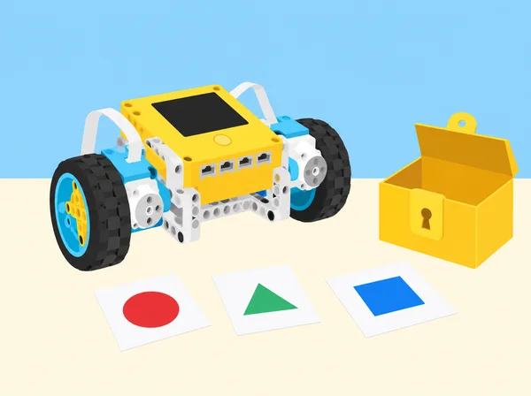

_Les condicions compostes coordinen diverses regles; una maqueta permet provar-les sense bloquejar ni protegir res real._

## 🌱 Repte i context

La classe dissenya una activitat de descoberta per a una mostra de tecnologia. Els visitants, sempre lliures de continuar o aturar-se, resolen una seqüència de pistes sobre una taula; el programa mostra si cada resposta compleix les regles i actualitza una puntuació compartida. Les variables conserven el resultat d’una partida, els operadors combinen requisits, i el SPIKE Prime dona respostes de llum, so o moviment curt. En les sessions centrals, la classe investiga com una condició composta pot simular una contrasenya i compara usabilitat, nombre de combinacions i accessibilitat. Aquesta situació adapta les cinc lliçons de la unitat 8 *Compound Conditionals* de LEGO Education *Foundations of Physical Computing*. “Obrir una caixa” i “eixir d’una sala” s’interpreten com a metàfores de joc en una maqueta: l’alumnat mai queda tancat, cap objecte valuós depén del prototip i no s’hi introdueixen dades o credencials reals.

## 🎯 Objectius d’aprenentatge

- Dissenyar una activitat de dos participants amb torns i puntuació mantinguda per variables, i comunicar-ne unes regles prou clares perquè un altre grup puga jugar sense explicació oral addicional.

- Expressar una condició simple i composta amb llenguatge quotidià, diagrama, pseudocodi i blocs; distingir què implica `i`, `o` i `no`.

- Programar una seqüència de comprovacions en l’ordre acordat, incloent casos correctes, incorrectes, incomplets, reinici i límits de repetició.

- Construir un model segur que combine entrades reals del kit —botons del hub, color o distància segons la disponibilitat— amb una resposta comprensible, sense afirmar que és un sistema d’autenticació fiable.

- Planificar un repte tipus breakout que es resolga des de fora o al voltant d’una taula oberta, identificar restriccions i iterar el joc a partir de proves d’altres equips.

- Relacionar els continguts amb tasques d’arquitectura, construcció, enginyeria, ciència i matemàtiques, incloent formació, habilitats i col·laboració entre perfils.

## 🧠 Continguts i llenguatge

**Variable de puntuació:** valor amb nom que s’inicialitza abans de la partida i s’actualitza segons una regla publicada. **Condició simple:** una expressió que és certa o falsa. **Condició composta:** dues o més condicions relacionades amb un operador lògic. Per exemple, “el color és blau *i* el botó ha sigut premut” exigeix ambdues coses; “el color és groc *o* verd” permet qualsevol dels casos, i en aquesta unitat l’OR és inclusiu. **Seqüència:** ordre de comprovacions que forma part de la regla. **Restricció:** requisit que limita disseny i comportament, com ara poder reiniciar o no usar contrasenyes personals.

La seguretat digital real depén de molts factors que no es modelen en el kit. Una seqüència de colors vista o enregistrada no és un secret segur; l’objectiu matemàtic és comprendre les regles i els compromisos entre facilitat d’ús i complexitat, no ensenyar a protegir comptes mitjançant un robot escolar.

## 🧰 Preparació i materials

Per equip: set SPIKE Prime 45678, dispositiu amb l’app SPIKE i hub carregat; base mòbil o model senzill amb sensor de color i sensor de distància si estan disponibles; targetes gruixudes de resposta; cartolina, cinta de paper, peces per a una capsa de maqueta que no tanque ni puga bloquejar-se, fulls de regles i diari d’enginyeria. Prepareu una pista de taula amb codis ficticis i un sistema de puntuació que no premie la rapidesa física ni penalitze errors d’accés. Verifiqueu abans quines lectures i botons admet la versió d’app del centre. Si falten sensors o les lectures varien, empreu targetes/observador com a entrada simulada i assenyaleu-ho explícitament. Cap llum o so ha de semblar una alarma d’emergència.

Feu una anàlisi prèvia de riscos amb l’alumnat: la maqueta queda oberta, la partida no té límit que obligue a córrer i tothom pot eixir de l’activitat en qualsevol moment. En lloc d’un qüestionari personal, recolliu comentaris anònims sobre llegibilitat i opcions de pista. Rols rotatius: responsable de regles, programació, muntatge/seguretat i observació d’usabilitat.

## 📅 Seqüència d’aprenentatge · cinc lliçons

### **Lliçó 1 · Joc amb variables: punts que es poden explicar (60–90 min).**

#### Fase 1 · Activem i prediem

Compareu jocs de taula, cartes, esports i videojocs. Cada persona pot parlar d’un joc conegut o analitzar-ne un de neutre preparat per la docent. Predigueu com se sap que s’ha guanyat i com es registra la puntuació.

#### Fase 2 · Explorem i construïm

Inventeu un joc de taula per a dues persones amb una fitxa que recorre una pista i targetes de situació. Definiu com es guanyen o perden punts, quants torns hi ha i quan acaba. Escriviu les regles en passos numerats i feu una ronda manual.

#### Fase 3 · Expliquem i registrem

Creeu variables `punts_jugador_a` i `punts_jugador_b`, inicialitzeu-les a zero a l’inici de cada partida, canvieu de torn explícitament i afegiu una resposta de llum o so quan canvia la puntuació. Registreu almenys quatre torns en una taula de traça.

#### Fase 4 · Apliquem i millorem

Un segon equip juga només amb les regles escrites i anota cada desacord. Compareu la puntuació en paper i en el programa després de cada ronda i reviseu una regla a partir del retorn.

#### Fase 5 · Comprovem i reflexionem

Expliqueu com sumar, canviar de torn i començar de nou. **Evidència:** regles finals, taula de quatre torns, esquema del programa i nota sobre inicialització de variables.

### **Lliçó 2 · Dues comprovacions per a una acció (90 min).**

#### Fase 1 · Activem i prediem

Cada parella crea un codi fictici de tres xifres i prova d’endevinar els nombres triats per l’altra. No anoteu contrasenyes habituals, PIN personals o dades privades. Calculeu quantes combinacions hi ha per a un, dos i tres dígits si cada posició val 0–9; parleu de l’equilibri entre opcions i facilitat de record.

#### Fase 2 · Explorem i construïm

En un full de decisions, assigneu una regla a una capsa de paper oberta: la peça de joc rep un senyal només quan la targeta de color és la correcta **i** s’ha premut el botó d’inici. Completeu les quatre files de la taula de veritat: color correcte/incorrecte × botó premut/no premut.

#### Fase 3 · Expliquem i registrem

Useu una entrada de color i un botó del hub o dues entrades simulades. Feu que el programa responga de manera diferent a acceptació i rebuig i que permeta començar de nou. Deseu taula de veritat, pseudocodi i registre de proves.

#### Fase 4 · Apliquem i millorem

Proveu deliberadament els quatre casos, llegiu cada fila abans d’executar i compareu resultat esperat i real. Afegiu el cas d’una lectura que el sensor no reconeix i decidiu si es repeteix, es demana ajuda o es cancel·la.

#### Fase 5 · Comprovem i reflexionem

Expliqueu què significa «més segur» en aquest model i què no pot demostrar una maqueta. **Evidència:** taula de veritat, pseudocodi, registre d’errors i límit d’ús explícit.

### **Lliçó 3 · Compondre regles i pensar en més d’un factor (90 min).**

#### Fase 1 · Activem i prediem

Parleu de per què algú voldria protegir informació o materials i qui podria quedar exclòs per una regla mal dissenyada. Amb targetes fictícies, compareu una comprovació amb dues de tipus diferent, com targeta de color i acció deliberada del botó.

#### Fase 2 · Explorem i construïm

Representeu les regles com a portes lògiques. Dissenyeu un prototip de taula que autoritza l’avanç d’una fitxa només si coincideixen dos senyals; pot donar un punt de llum o moure una barrera de cartró molt lleugera que no tanque res. Abans de construir, redacteu requisits, diagrama de flux i condicions.

#### Fase 3 · Expliquem i registrem

Definiu casos de prova: correcte, entrada tardana, incorrecta, repetida o absent. Combineu operadors booleans en el programa i etiqueteu cada comentari amb el requisit corresponent; incloeu una resposta de recuperació, no un bloqueig permanent.

#### Fase 4 · Apliquem i millorem

Un altre equip prova el prototip amb una guia accessible i comenta si entén què ha de fer i com rectificar. Reviseu el disseny: massa factors poden dificultar l’ús legítim, i més combinacions per si soles no fan un sistema segur. Documenteu què recolzen les proves i quines comprovacions professionals faltarien.

#### Fase 5 · Comprovem i reflexionem

Expliqueu els compromisos entre usabilitat, nombre de combinacions i accessibilitat, sense presentar el dispositiu com a autenticació fiable. **Evidència:** requisits, diagrama, codi comentat, matriu de proves i revisió d’usabilitat.

### **Lliçó 4 · Mini-repte: breakout de pistes obertes (90–135 min).**

#### Fase 1 · Activem i prediem

Presenteu el repte com un joc de taula obert: ningú entra en una sala tancada i cap eixida física depén del programa. Trieu un problema fictici, com ordenar peces d’una exposició abans d’obrir una capsa de cartó. Recolliu comentaris anònims sobre formats de pista agradables —visual, tàctil, text o so opcional— i alternatives per a qui no distingeix colors o prefereix no usar so.

#### Fase 2 · Explorem i construïm

Definiu tres restriccions mesurables: una acció segura, dues condicions que s’han de complir i un ordre de pistes; afegiu reinici i pista d’ajuda. Escriviu pseudocodi i esquema de connexions. Creeu una matriu amb camí correcte, un error per cada condició, ordre erroni, entrada no detectada i reinici.

#### Fase 3 · Expliquem i registrem

Construïu un mecanisme d’indicació amb peces de baixa energia o només llums/sons del hub i programeu la seqüència amb variables de progrés. Proveu cada subcomponent aïllat abans del codi complet i registreu cada resultat.

#### Fase 4 · Apliquem i millorem

Canvieu una cosa per iteració i torneu a executar tota la matriu. Intercanvieu el joc amb almenys tres equips si el temps ho permet; si no, feu una prova creuada i completeu la resta amb casos en paper. Els participants poden aturar-se sense perdre puntuació ni justificar-se. Reviseu instruccions, dificultat, temps sense compte enrere pressionant i accessibilitat.

#### Fase 5 · Comprovem i reflexionem

Lliureu la versió revisada i anoteu què ha canviat a partir de proves reals. **Evidència:** joc, matriu de proves completa, retorn d’usabilitat i registre d’iteracions.

### **Lliçó 5 · Arquitectura, construcció i STEM (60–90 min).**

#### Fase 1 · Activem i prediem

Repasseu els jocs i localitzeu coneixements d’arquitectura i construcció, enginyeria, ciències i matemàtiques: mesura, estructura, forces, programació, dades, planificació i treball en equip. Predigueu quins perfils professionals podrien col·laborar en un projecte.

#### Fase 2 · Explorem i construïm

Classifiqueu targetes de professions: arquitecta, electricista, lampista, fuster/a, enginyera biomèdica, tècnica de manteniment, estadístic/a, química/enginyer químic i personal de construcció. Eviteu associar oficis a un gènere o a un nivell d’estudis únic. Consulteu fonts públiques actuals triades per la docent i descriviu tasques, entorns, habilitats, formació i col·laboracions.

#### Fase 3 · Expliquem i registrem

Trieu dos perfils complementaris i feu una fitxa que relacione les seues tasques amb una evidència o font per afirmació. Construïu amb peces una estructura o mostra interactiva, definiu-ne un requisit i afegiu una regla booleana només si aporta valor.

#### Fase 4 · Apliquem i millorem

Reviseu la fitxa perquè les fonts sostinguen les afirmacions i el prototip responga al requisit. No cal automatitzar la construcció per parlar de tecnologia.

#### Fase 5 · Comprovem i reflexionem

Feu una presentació d’un minut amb el problema, dos rols professionals, la decisió lògica i allò que una maqueta no pot certificar. La reflexió individual sobre interessos és privada i voluntària; es pot respondre sobre una professió investigada. **Evidència:** fitxa professional amb fonts, prototip i presentació.

## 🧪 Evidències i avaluació

Portafolis d’equip: regles del joc i nom triat, taula de puntuacions a mà/codi, taules de veritat, pseudocodi i diagrama, codi comentat, matriu de proves amb resultat esperat i real, fotografies només de models (mai d’alumnat sense autorització), registre d’iteracions, feedback anonimitzat d’usabilitat i fitxa professional amb fonts. Avalueu quatre dimensions amb descriptors: (1) condicions formalitzades sense ambigüitat; (2) variable inicialitzada i actualitzada en el torn correcte; (3) proves que cobreixen èxit, error, entrada absent i reinici; (4) explicació de limitacions i accessibilitat. En autoavaluació privada, puntueu de l’1 al 3 la cura de materials, gestió del temps i contribució; afegiu un exemple concret de col·laboració i una decisió canviada per les dades. La partida no determina la nota ni es fa classificació entre persones.

## ♿ Inclusió, privacitat i seguretat

Les pistes tenen alternativa no cromàtica (paraula, forma o relleu), les instruccions s’ofereixen en text breu i esquema, i els efectes sonors són opcionals amb equivalent visual. Eviteu codis personals, recollida de credencials, dades d’identitat i enquestes sobre interessos que obliguen a revelar preferències. Els jocs se situen sobre una superfície, no bloquegen passadissos i no impliquen portes, panys, rutes d’evacuació ni espais reals. Poseu a prova el límit entre una regla pedagògica i una afirmació de seguretat: el SPIKE de l’activitat no autentica usuaris ni detecta intrusions. Atureu motors en fer canvis i manteniu peces menudes organitzades.

## 🔗 Referent oficial i adaptació

Adapta les cinc lliçons de la unitat 8 *Compound Conditionals* de LEGO Education [*Foundations of Physical Computing*](https://assets.education.lego.com/v3/assets/blt293eea581807678a/blt1b4345f429fde833/64d3828c455bf62b71f9b840/Foundation_of_Physical_Computing_Course_SPIKE_3_2022.pdf?locale=en-gb): *Game with Variables*, *Compound Conditionals*, *Compounding Conditionals*, *Mini-Challenge: Break Out Room* i *Connecting to Careers: Architecture & Construction and Science, Technology, Engineering & Mathematics*. Manté el joc de dos participants amb marcador, l’exploració de codis i combinacions, el disseny d’un dispositiu que interpreta més d’un factor, el repte de seqüència tipus breakout, la prova entre equips i la recerca de professions; canvia els models, codis, context i regles per una mostra escolar segura, oberta i accessible.
