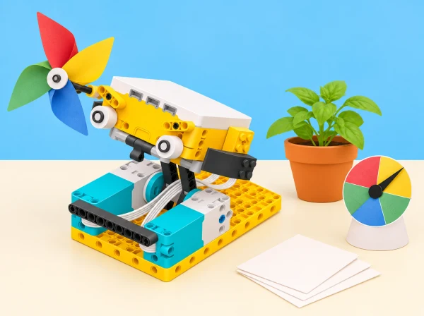

_Les dades de les targetes són registres de prova: qualsevol decisió sobre l’hort correspon al grup i al centre._

## 🌱 Situació i intenció

Adaptació de la unitat *Life Hacks* per al context d’un centre educatiu valencià. Cada sessió conserva l’objectiu oficial i el tradueix en un repte, materials i criteris propis; quan una activitat del pla és híbrida o no requereix el hub, s’indica expressament en la sessió.

## 🎯 Aprenentatges i vocabulari

- Identificar variables i distingir observacions de valors simulats o inferències.
- Planificar una recollida de dades comparable i repetir mesures mantenint constants les condicions acordades.
- Usar dades i condicions en un programa per respondre a una necessitat fictícia del festival.
- Argumentar una decisió amb gràfics i declarar la incertesa i els límits de la mostra.

## 📅 Seqüència didàctica · 8 lliçons / 10–12 sessions

La classe prepara una mostra interactiva per al pati i l’hort escolar. Cada equip passa d’una observació o necessitat a una prova amb dades, i diferencia sempre una previsió, una mesura del model i una decisió de les persones responsables. El programa no recull dades de salut ni puntua alumnes; cap control automàtic rega o modifica un espai real.

### **S1 · Un mecanisme que balla amb llum i ritme ([Break Dance](https://education.lego.com/en-us/lessons/prime-life-hacks/break-dance/), 45 min).**

#### Fase 1 · Activem i prediem

En parelles, imagineu una figura de dansa motoritzada i repartiu el muntatge perquè totes dues persones participen. Predigueu com es poden sincronitzar moviment i llum sense necessitat de música ni moviment corporal de l’alumnat.

#### Fase 2 · Explorem i construïm

Construïu la figura i comenceu sincronitzant cames amb un patró lluminós de la matriu del hub; després afegiu braços i, si el grup ho vol, una seqüència sonora.

#### Fase 3 · Expliquem i registrem

Feu que cada acció ocupe un interval repetible. Compareu el programa amb un metrònom o palmades i anoteu el temps, els graus o les rotacions del motor.

#### Fase 4 · Apliquem i millorem

Corregiu una desincronització cada vegada. Personalitzeu la coreografia per a una mostra del pati i, si ho desitgeu, programeu un senyal triat pel grup cada 30 segons per recordar una pausa activa voluntària. Com a ampliació, coordineu dues figures o useu el tercer motor i el sensor d’ultrasons si queden disponibles.

#### Fase 5 · Comprovem i reflexionem

**Evidència:** diagrama de temps, codi i demostració en què el grup explica com ha sincronitzat llum, moviments i ritme. La música i el moviment corporal són opcionals; es pot ampliar amb fraccions o polirítmies.

### **S2 · Repeticions i variables que expliquen el programa ([Repeat 5 Times](https://education.lego.com/en-us/lessons/prime-life-hacks/repeat-5-times/), 45 min).**

#### Fase 1 · Activem i prediem

Construïu en parelles un mecanisme original de comptatge per al festival, que execute cinc moviments repetits d’una bandera de paper. Representeu una variable amb un pot i cinc fitxes: què guarda, quan canvia i quin valor tindrà al final?

#### Fase 2 · Explorem i construïm

Feu que una variable numèrica compte els cicles del robot. Com a segon valor, calculeu «punts de moviment simulats» amb un factor inventat i explícit; mai calories reals ni una mesura del cos.

#### Fase 3 · Expliquem i registrem

Separeu dos ritmes —dos cicles lents i tres ràpids—, compteu-los en variables diferents i mostreu els valors. Si hi ha pauses, distingiu el temps d’acció del temps d’espera.

#### Fase 4 · Apliquem i millorem

Canvieu el nombre de repeticions i feu una taula o gràfic cicles–punts per interpretar una relació lineal simple. Qui ho necessite pot començar amb el pot i les fitxes desconnectades; com a extensió, compareu dues categories de cicle amb comptadors separats.

#### Fase 5 · Comprovem i reflexionem

**Evidència:** pseudocodi, variables amb noms clars, operació d’acumulació, taula de valors i gràfic simple. No es calculen calories ni s’arrepleguen dades corporals.

### **S3 · Pronòstic qualitatiu per al pati ([Rain or Shine?](https://education.lego.com/en-us/lessons/prime-life-hacks/rain-or-shine/), 45 min).**

#### Fase 1 · Activem i prediem

Amb connexió a internet, trieu una ciutat pública i predigueu quina categoria meteorològica poden mostrar els blocs disponibles per a les pròximes hores. No cal compartir cap ubicació personal.

#### Fase 2 · Explorem i construïm

Construïu una maqueta de previsió, introduïu el nom de la ciutat i useu els blocs meteorològics de l’app SPIKE per a mostrar si plourà. Escriviu una condició IF/ELSE.

#### Fase 3 · Expliquem i registrem

Amplieu la resposta a «parcialment ennuvolat», «ennuvolat», «pluja» o altres categories disponibles. Feu que el motor o la matriu indique la categoria i registreu l’hora, la ciutat, la font i la predicció.

#### Fase 4 · Apliquem i millorem

Cinc hores després, compareu la predicció amb el temps observat i amb una segona ciutat. Si el centre no té connexió, useu una captura o fitxa datada i identifiqueu-la com a simulació desconnectada; no afirmeu que els blocs consulten el núvol.

#### Fase 5 · Comprovem i reflexionem

Parleu de dades al núvol, latència, límits i diferència entre previsió i observació. **Evidència:** programa condicional i taula de predicció/resultat amb font i data.

### **S4 · Un indicador de vent i escala de Beaufort ([Wind Speed](https://education.lego.com/en-us/lessons/prime-life-hacks/wind-speed/), 45–60 min).**

#### Fase 1 · Activem i prediem

Trieu una ciutat pública i predigueu quina de quatre bandes de velocitat podria mostrar el valor de vent consultat. Identifiqueu per endavant el cas de calma o de dades fora d’escala.

#### Fase 2 · Explorem i construïm

Construïu un indicador mecànic amb motor i una agulla sobre quatre zones pròpies. Llegiu el valor quantitatiu que retorna el bloc meteorològic i programeu condicions IF/ELSE per als intervals: 0,5–<5,5 m/s, 5,5–<13,8 m/s, 13,8–<24,4 m/s i 24,4–32,7 m/s.

#### Fase 3 · Expliquem i registrem

Feu visible la classificació amb el marcador i representeu la direcció amb fletxes a la matriu de llum. Compareu tres localitats públiques —per exemple, València, una població de l’interior i una de costa— i registreu velocitat, direcció, categoria i font.

#### Fase 4 · Apliquem i millorem

Proveu cada límit amb dades artificials i reviseu que el codi no tinga buits ni solapaments. Com a extensió, redissenyeu el marcador perquè es recalibre amb una escala diferent; sense xarxa, treballeu amb dades d’exemple datades.

#### Fase 5 · Comprovem i reflexionem

**Evidència:** programa, taula de velocitat/direcció/categoria i nota que identifica les dades com a previsió d’una font en línia. L’indicador mecànic és una visualització, no un anemòmetre real.

### **S5 · Quanta pluja podria rebre l’hort? ([Veggie Love](https://education.lego.com/en-us/lessons/prime-life-hacks/veggie-love/), 45–60 min).**

#### Fase 1 · Activem i prediem

Predigueu com es pot representar en una escala la precipitació acumulada prevista per a la pròxima setmana i quines unitats necessitarà el marcador.

#### Fase 2 · Explorem i construïm

Muntem un «pluviòmetre de paper» accionat per motor. Consulteu els blocs meteorològics per a una ciutat i transformeu el valor previst en una posició de l’agulla.

#### Fase 3 · Expliquem i registrem

Comproveu si el marcador correspon a les unitats i rang definits. Registreu la taula de conversió i contrasteu-la amb una targeta de necessitats d’aigua de tomaca i una altra hortalissa, citant la font o marcant el valor com a simulat.

#### Fase 4 · Apliquem i millorem

Proveu una escala de temperatura i expliqueu per què cal recalibrar-la. La maqueta pot mostrar «revisar el reg» com a pregunta: no activa una vàlvula ni determina la necessitat d’una planta real només amb la pluja prevista. Sense connexió, useu una previsió guardada i datada.

#### Fase 5 · Comprovem i reflexionem

**Evidència:** taula de conversió, dues calibracions i justificació de què permet concloure la previsió i què no.

### **S6 · Un joc de memòria amb dues llistes ([Brain Game](https://education.lego.com/en-us/lessons/prime-life-hacks/brain-game/), 60–90 min).**

#### Fase 1 · Activem i prediem

Prepareu cinc fitxes planes de color en una tira. Amb un exemple de tres peces, prediu les dues llistes, el resultat de cada índex i què canviarà si la segona persona reordena una fitxa.

#### Fase 2 · Explorem i construïm

La primera persona passa la seqüència pel lector amb sensor de color i el programa guarda els resultats en una llista; la segona fa el mateix amb una altra seqüència en una segona llista. Per simplificar, comenceu amb comparació en paper abans d’afegir el sensor.

#### Fase 3 · Expliquem i registrem

El programa compara posició per posició i encén una fila o icona de la matriu quan els colors coincideixen. Registreu el resultat de cada índex amb pseudocodi o un diagrama de les dues llistes.

#### Fase 4 · Apliquem i millorem

Amplieu a cinc posicions, establiu un límit opcional d’intents i proveu casos de coincidència total, parcial i nul·la. Milloreu la resposta LED per diferenciar encert i error. Com a ampliació, registreu anònimament temps i intents per explorar-los en un gràfic; no guardeu noms ni compareu persones.

#### Fase 5 · Comprovem i reflexionem

**Evidència:** diagrama de dues llistes, pseudocodi de comparació, casos provats i regla del joc que una altra parella pot seguir. Expliqueu oralment índex, llista, probabilitat, mitjana i valor mitjà si s’ha fet l’extensió estadística.

### **S7 · Un entrenador per a practicar una habilitat ([The Coach](https://education.lego.com/en-us/lessons/prime-life-hacks/the-coach/), projecte de 2–3 sessions).**

#### Fase 1 · Activem i prediem

Cada equip escull una habilitat que algú vulga practicar, com seguir una seqüència rítmica, muntar una estructura o aprendre un recorregut de paper; participar és voluntari. Esbrineu què voldria millorar la persona i quina dada podria ajudar-hi.

#### Fase 2 · Explorem i construïm

Dibuixeu dues idees, prototipeu-les i proveu-les amb una pauta curta. Seleccioneu una solució i desenvolupeu-la amb peces SPIKE i un programa guia.

#### Fase 3 · Expliquem i registrem

Registreu una dada triada per la persona —pas completat, nombre d’intents o durada— en un quadern d’inventor amb textos, dibuixos, proves, decisions i canvis. La dada descriu l’eina i la pràctica consentida, no compara alumnes ni mesura salut.

#### Fase 4 · Apliquem i millorem

Proveu el coach, demaneu retorn, feu una iteració i presenteu què ajuda i què no pot fer. L’alternativa guiada ofereix un repte comú i blocs d’inici; qualsevol prova amb altres participants requereix consentiment i eliminació de les notes personals després.

#### Fase 5 · Comprovem i reflexionem

Tanqueu amb una exposició breu —pòster, web local o presentació oral— sobre objectiu, usuari, dades, prototip i límits. **Evidència:** problema i criteris, esbossos i proves de dues idees, prototip, quadern, taula sense identificadors i reflexió sobre privacitat.

### **S8 · Escriure el codi d’una coreografia ([Code Your Moves](https://education.lego.com/en-us/lessons/prime-life-hacks/code-your-moves/), 45 min, desconnectada).**

#### Fase 1 · Activem i prediem

Definiu «algorisme», «pseudocodi», «descomposició» i «error» amb una rutina o joc de palmades conegut per la classe. Predigueu quines instruccions necessitarà una altra parella per reproduir-lo.

#### Fase 2 · Explorem i construïm

Cada parella inventa un gest o seqüència rítmica breu, la divideix en passos numerats i marca repeticions, direccions i pauses amb paraules o pictogrames.

#### Fase 3 · Expliquem i registrem

Una altra parella executa les instruccions sense que l’autora les explique. Marqueu el punt ambigu i compareu què han entés amb què volia indicar el pseudocodi.

#### Fase 4 · Apliquem i millorem

Afegiu una precisió a la instrucció i torneu a provar. Si es vol, traduïu un dels passos a un bloc de moviment de Break Dance; aquesta transferència és una extensió i la tasca es completa sense kit, peces ni programari.

#### Fase 5 · Comprovem i reflexionem

**Evidència:** primera i segona versió del pseudocodi i anotació de l’error resolt. No cal ballar: una persona pot dirigir, dibuixar o moure fitxes sobre el paper.

## 🧰 Materials i preparació

Set SPIKE Prime, hub, motors, sensor de color i ordinador/tablet amb l’app que admet els blocs meteorològics. Les sessions S3–S5 necessiten connexió per consultar les previsions al núvol i accés habilitat als blocs de meteorologia; comproveu-ho abans de la classe. Sense xarxa, useu dades o captures datades i identifiqueu-les explícitament com a conjunt guardat, no com a consulta en viu. Afegiu targetes de color, fitxes, cartó per a l’indicador, taules de registre, paper i material de dibuix. Les dades es refereixen només a ciutats públiques, no a ubicacions personals.

## 🎯 Evidències i avaluació

El quadern recull el diagrama rítmic, pseudocodi i variables, taules amb font/hora/lloc per a pronòstics qualitatius i quantitatius, classificació Beaufort amb valors límit provats, escala calibrada de precipitació, joc de memòria amb les dues llistes i casos de comparació, prototip de coach i pseudocodi desconnectat. La rúbrica comprova que cada equip explique quin bloc transforma la dada en acció, distingisca previsió de realitat, justifique calibratge i unitats, detecte una limitació o error i revise el prototip després de provar-lo. No s’avalua si el pronòstic encerta ni la capacitat física o rendiment de cap persona.

## ♿ Participació i inclusió

Totes les coreografies es poden dirigir, representar amb pictogrames o fitxes i no requereixen moviment corporal. El joc de memòria pot començar en paper; combineu cada color amb una forma i una paraula. Oferiu gràfiques amb eixos marcats i taules ampliades, i accepteu una ciutat de dades ja preparada si els blocs en línia no estan disponibles. No recolliu dades personals, corporals, noms ni ubicacions de l’alumnat; en el projecte de coach, el participant tria les dades, pot no participar i pot demanar que les seues notes s’esborren.

## 🔗 Unitat oficial i traçabilitat

Les vuit sessions enllacen les lliçons oficials de LEGO Education: [Life Hacks](https://education.lego.com/en-us/lessons/prime-life-hacks/). Es conserven els objectius de sincronització de moviment/llum/so, variables i operacions, ús de dades meteorològiques qualitatives i quantitatives al núvol, escala de Beaufort, calibratge de precipitació, comparació d’arrays, el joc de memòria amb torns/reintents i extensió estadística anònima, disseny d’un entrenador amb dades, quadern d’inventor i presentació final, i escriptura desconnectada de pseudocodi. Les sessions de previsió en viu depenen de connexió i blocs meteorològics actius a l’app; la font, hora, ubicació consultada i mode en viu/guardat s’anoten per a poder repetir-les. El context del pati i l’hort, els materials, els guions, les dades de prova i la imatge són propis.
