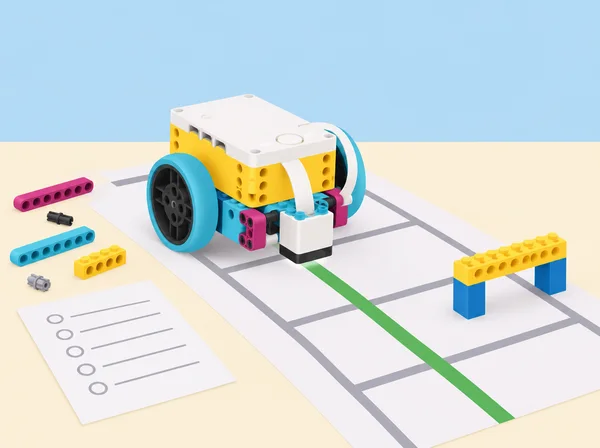

_Una bona depuració redueix el problema, prova hipòtesis i documenta els canvis._

## 🌱 Repte i intenció

El servei fictici de préstec de la biblioteca necessita traslladar una caixa lleugera entre dues zones sense eixir d’un recorregut marcat. Abans de confiar-hi, la classe aprén a aïllar errors físics, detectar problemes del programa i provar rutes per parts. La seqüència adapta les sis lliçons de la unitat 3 *Troubleshooting and Debugging* de LEGO Education *Foundations of Physical Computing*. Els models i codis concrets de l’app es consulten en el recurs oficial; ací se’n creen recorreguts, casos de prova i registres propis. No es transporten llibres reals ni s’utilitza el robot amb persones en moviment.

## 🎯 Aprenentatges i vocabulari

- Diferenciar una avaria de muntatge d’un error en la seqüència de programa.
- Formular una hipòtesi de fallada i canviar una sola variable en cada prova.
- Construir i depurar una ruta amb sensors, casos límit i registre de resultats repetits.
- Justificar que un canvi resol el problema sense ocultar els casos que encara fallen.

## 📅 Seqüència didàctica · sis lliçons

### **Lliçó 1 · Depuració del model: el plòter de la mediateca ([Broken](https://education.lego.com/en-us/lessons/prime-invention-squad/broken/), 90–135 min).**

#### Fase 1 · Activem i prediem

**Engage desconnectat:** cada equip rep un llapis sense punta, tisores i una fitxa amb quatre ovals pàl·lids que cal traçar i retallar. Abans de començar, demaneu què falla, quina part del sistema està implicada i què cal preparar; en afilar el llapis, parleu de maquinari preparat per fer la tasca. Ajunteu les formes i compareu-ne la regularitat. Connecteu la idea amb màquines CNC que repeteixen moviments amb precisió.

#### Fase 2 · Explorem i construïm

**Explore amb SPIKE:** useu el plòter X–Y del catàleg SPIKE o una versió esquemàtica en paper. Executeu el programa base sense tocar-lo, descriviu què esperàveu i què ha ocorregut, i identifiqueu les parts que sí que funcionen. Clau docent del model de referència: la roda d’alimentació de l’eix Y falta, el bastidor superior no està fixat, els engranatges d’alimentació estan invertits (el paper avança massa de pressa) i el carro que subjecta el llapis està solt. Presenteu només els símptomes; l’equip decideix quin defecte comprovar primer i prova cada reparació per separat. Si es construeix un plòter propi, prepareu quatre avaries equivalents sense afegir càrrega al motor ni forçar engranatges.

#### Fase 3 · Expliquem i registrem

**Rutina de diagnòstic:** «què veig? / què havia de passar? / quina peça o connexió ho podria explicar? / quina prova aïllada ho confirmaria?». Canvieu una sola variable, repetiu la prova i anoteu resultat i pròxim pas; no reprogramem un model que encara té una avaria mecànica.

#### Fase 4 · Apliquem i millorem

**Explain i tancament:** distingiu símptoma, causa i solució; dibuixeu el sistema per mòduls (estructura, alimentació del paper, eixos, llapis, cablejat i codi), marqueu la fallada i expliqueu com interaccionen maquinari i programa.

#### Fase 5 · Comprovem i reflexionem

**Evidències i suport:** full d’ovals, mapa d’avaries, taula hipòtesi-prova-resultat, reparació i reflexió sobre l’ajuda demanada a altres equips, temps i peces. Per començar, el docent facilita dos possibles mòduls; ampliació: redactar instruccions que permeten a un altre equip reproduir la diagnosi sense donar-li la resposta. Conserveu el model per a S2. Durada ajustable: 90 min si es treballa un muntatge preparat; fins a 135 min si cal muntar i verificar-lo.

### **Lliçó 2 · Depuració del programari: trobar el tram que falla ([Track Your Packages](https://education.lego.com/en-us/lessons/prime-kickstart-a-business/track-your-packages/), 90 min).**

#### Fase 1 · Activem i prediem

**Engage · 5 min:** en una graella, trobeu durant 3–5 minuts camins diferents d’A a B en diagonal, avançant només una casella amunt/avall/esquerra/dreta i evitant les caselles ocupades; escriviu pseudocodi per a una ruta.

#### Fase 2 · Explorem i construïm

**Explore · 20 min:** reaprofiteu el plòter X–Y de S1 o munteu-ne la base de traçat; canvieu només la fitxa indicadora per representar un altre mapa de biblioteca. Executeu el programa inicial i observeu que el model sembla bé però el recorregut falla: sospiteu primer del programari i compareu el traç amb la ruta esperada.

#### Fase 3 · Expliquem i registrem

**Explain · 20 min:** llegiu el pseudocodi en parella i apliqueu un protocol comú: 1) descriure el símptoma; 2) dir què s’esperava; 3) comprovar fixacions i cablejat; 4) repetir la prova; 5) verificar ports; 6) revisar l’últim canvi; 7) dividir el programa en blocs petits; 8) explicar el codi a la parella; 9) canviar una sola cosa; 10) tornar a provar i documentar la solució. Si el hardware està correcte, continueu la inspecció del codi; no canvieu diverses distàncies alhora.

#### Fase 4 · Apliquem i millorem

**Elaborate · 35 min:** dissenyeu un nou recorregut d’un paquet fictici en una quadrícula, afegiu una diagonal o un obstacle, escriviu el pla, programeu-lo tram a tram i compareu cada secció amb el pseudocodi. Torneu a l’últim tram fiable quan aparega una desviació.

#### Fase 5 · Comprovem i reflexionem

**Evaluate · 10 min:** un altre equip segueix el codi i el protocol sense que li expliqueu la resposta. **Evidència:** ruta dibuixada, pseudocodi, programa comentat, registre «símptoma/expectativa/prova/canvi/resultat» i consell de depuració. Adaptació: oferiu una ruta ortogonal més curta; ampliació: calibrar els moviments diagonals amb dues mesures i explicar-ne l’error.

### **Lliçó 3 · Desmuntar els passos de l’error ( *Dancer Break Down*, 45 min).**

#### Fase 1 · Activem i prediem

**Engage · 5 min:** mireu un model ballarí SPIKE en funcionament i preveieu què pot fallar en la construcció i què pot fallar en el programa.

#### Fase 2 · Explorem i construïm

**Explore · 20 min:** construïu el ballarí de la col·lecció SPIKE o useu el model preparat. Abans de programar, moveu els eixos a mà dins del rang segur i confirmeu quines parts (cames/braços) poden moure’s sense encallar-se. Llegiu la pila de blocs inicial, redacteu-ne pseudocodi i executeu-la; el programa demana un motor al port B mentre el motor de les cames està connectat al port F, per això un dels motors no respon. Comproveu el port i decidiu quina correcció preserva millor el disseny validat; normalment corregiu l’adreça del programa, no desmunteu un mecanisme ben construït.

#### Fase 3 · Expliquem i registrem

**Explain · 8 min:** contrasteu hipòtesi amb observació i expliqueu per què la prova manual del model precedia la prova del codi.

#### Fase 4 · Apliquem i millorem

**Elaborate · 7 min:** depureu dos casos breus: sincronitzar deu moviments de cames amb un senyal de llum revisant els temps; i substituir un bloc d’inici «quan es prem el sensor de força» per inici de programa quan no hi ha sensor connectat.

#### Fase 5 · Comprovem i reflexionem

**Evaluate · 5 min:** classifiqueu cada cas com a model, programa o interfície entre els dos i escriviu què provàveu abans de corregir. Evidència: pseudocodi extret dels blocs, port real/programat, defecte, canvi i resultat. Si el model no està disponible, simuleu les connexions amb un mapa de ports, però valideu després la compatibilitat amb el kit del centre.

### **Lliçó 4 · Ballar amb colors ( *Dance to the Color*, 45 min).**

#### Fase 1 · Activem i prediem

**Preparació:** manteniu el model de ballarí de S3, connecteu sensor de color i hub carregat, i proveu quins colors detecta de manera estable amb la llum de l’aula i la distància de lectura del vostre muntatge. **Engage · 5 min:** compartiu una experiència en què un pla no haja funcionat i convertiu-la en una estratègia: pseudocodi, comentaris per blocs, proves curtes, entrades esperades i inesperades, canvi aïllat.

#### Fase 2 · Explorem i construïm

**Explore · 20 min:** partiu del programa funcional que mou les cames; afegiu la condició «quan es detecta roig, mou les cames» i compareu pseudocodi amb la pila. Després afegiu braços a eixa mateixa entrada. Comenteu cada secció i registreu on apareix qualsevol error. Si no respon, distingiu lectura incerta del color (sensor/llum/distància) d’una branca o ordre mal programats.

#### Fase 3 · Expliquem i registrem

**Explain · 8 min:** cada parella descriu un error, si pertany al muntatge, al programa o a la interacció, i com ho ha sabut.

#### Fase 4 · Apliquem i millorem

**Elaborate · 7 min:** amplieu la coreografia: un color provat activa moviment ràpid i un altre moviment lent quan arranca el programa. No seleccioneu una lectura inestable només perquè el color pareix correcte a ull; registreu els valors observats.

#### Fase 5 · Comprovem i reflexionem

**Evaluate · 5 min:** autoavaluació sobre diagnosi, comentaris i ús responsable de la prova; compartiu la coreografia només si el grup vol, amb alternativa silenciosa/visual. Evidència: pseudocodi inicial i final, comentaris, taula de colors/distància/resultat i registre de depuració. La mostra és opcional i no s’enregistra cap alumne.

### **Lliçó 5 · Dissenyar una ruta nova (*Mini-Challenge: New Routes*, 90 min).**

#### Fase 1 · Activem i prediem

**Engage · 10 min:** en una quadrícula local inventada (centre cívic, biblioteca o circuit de l’Albufera), marqueu origen, destí i caselles prohibides; cerqueu en 1–2 minuts diversos camins en passos ortogonals i compareu-ne el pseudocodi.

#### Fase 2 · Explorem i construïm

**Explore · 20 min:** cada parella modifica una ruta pròpia a llapis, la revisa i la passa a retolador quan el recorregut és executable. Useu el traçador X–Y de S2 per marcar un paquet/destinació o una base mòbil SPIKE compatible amb els ports disponibles; si el sensor de línia no llig consistentment la superfície, programeu trams temporitzats i declareu-ne la precisió limitada.

#### Fase 3 · Expliquem i registrem

**Explain · 15 min:** intercanvieu pseudocodis i reviseu si indiquen gir, distància, ordre i aturada amb prou detall. Acordeu protocol de depuració: expressar problema i resultat esperat; verificar model/connexions i ports; repetir; revisar últim codi afegit; descompondre la seqüència; explicar-la a la parella; modificar una sola part i documentar consell après.

#### Fase 4 · Apliquem i millorem

**Elaborate · 35 min:** programeu ruta sencera però proveu per trams; compareu codi amb el pla, registreu els fragments que funcionen i els que no, repareu el primer punt de divergència i repetiu. Afegiu després una casella bloquejada o un gir nou com a prova límit. Canvieu precisió i nombre de maniobres abans d’optimitzar la velocitat.

#### Fase 5 · Comprovem i reflexionem

**Evaluate · 10 min:** un altre equip executa la ruta amb només el diagrama i el protocol escrit. **Evidència:** mapa abans/després, pseudocodi, projecte comentat, almenys dues iteracions i taula de temps/desviació. Valoració docent: el sistema físic i el codi coincideixen amb la predicció; autoavaluació sobre ajuda rebuda, iteració i gestió de peces. Bastida: ruta curta sense obstacles; extensió: dues rutes equivalents, una amb menys girs i una que evita una zona sensible.

### **Lliçó 6 · Professions digitals, justícia i seguretat (90 min).**

#### Fase 1 · Activem i prediem

**Preparació:** reuniu imatges o fitxes pròpies d’ocupacions i fonts valencianes fiables sobre formació i tasques; equips de quatre amb rols rotatius i registre de font/data. **Engage · 10 min:** relacioneu la unitat amb tecnologies de la informació i comunicació, serveis jurídics i seguretat pública/protecció civil. Pregunteu qui manté un servei digital, qui respon a una incidència i com es protegeixen drets i dades. Classifiqueu imatges de feines en els dos àmbits i expliqueu per què; distingiu una feina d’una família professional.

#### Fase 2 · Explorem i construïm

**Explore · 35 min:** connecteu les lliçons de depuració amb funcions com suport TIC, proves de programari, ciberseguretat, accessibilitat digital, gestió d’incidències, assessorament jurídic, emergències i protecció de la comunitat. Cada grup investiga feines concretes, tasques, entorns, habilitats i estudis/acreditacions requerits amb fonts locals datades; una dada salarial o previsió només s’inclou si hi ha font adequada i no es presenta com una promesa individual. Feu una pluja de feines i una graella «tasca / habilitat / formació / font».

#### Fase 3 · Expliquem i registrem

**Model i presentació · 20 min:** representeu un dels dos àmbits amb peces SPIKE o un mapa visual del cicle d’incidència: detectar → descriure sense culpar → verificar → protegir informació → escalar a la persona responsable. Presenteu el model en un minut i expliqueu com dues professions cooperen; eviteu equiparar depuració de classe amb ciberatac real.

#### Fase 4 · Apliquem i millorem

**Elaborate · 15 min:** creeu una xarxa de paraules de cinc minuts sobre una família professional i intercanvieu-la amb un altre equip; amplieu-la amb ocupacions noves i descriviu les habilitats compartides.

#### Fase 5 · Comprovem i reflexionem

**Evaluate · 10 min:** reflexió individual privada sobre habilitats/interessos, més observació docent de l’ús de fonts, classificació argumentada i connexió amb les lliçons; expressar preferències és voluntari. Evidències: fonts datades, mapa/model, presentació, xarxa i una norma d’equip per registrar incidents sense dades personals ni culpabilitzar ningú. La lliçó cobreix aquestes dues vies dins d’un curs que tracta múltiples famílies professionals, no totes en una sessió.

## 🧰 Materials i preparació

Un set SPIKE Prime 45678 i dispositiu amb l’app per parella; models oficials Broken, Track Your Packages i Break Dancer disponibles dins l’app quan s’usen; paper quadriculat, retoladors, regla, fulls de depuració i materials per a una ruta de taula. El docent prepara els errors de muntatge sense danyar cap motor, sensor ni cable; si no és segur alterar el kit, empra fotografies o esquemes. Verifiqueu que el sensor de color llig la superfície triada i que el model pot fer la ruta abans de la sessió. Cap obstacle ha de posar en risc persones ni peces.

## 🧪 Evidències i criteris

Diagrama de diagnòstic, pseudocodi, programa anotat, graella de casos de prova, dades del sensor, diari d’errors i reparacions, ruta iterada i presentació professional. Valoreu que l’equip diferencie maquinari i programari, descomponga el problema, prove metòdicament, use casos esperats i inesperats, torne a una versió funcional i explique per què el canvi resol el símptoma. Autoavaluació amb col·laboració, gestió del temps i cura de peces, més retorn entre equips centrat en evidència.

## ♿ Seguretat i participació

Doneu alternatives en paper per a les proves de trajecte, rutes accessibles des de la posició asseguda i rols de pilotatge, observació, registre i revisió. Manteniu el robot dins d’una superfície delimitada, amb una càrrega lleugera i sense acostar-lo a vianants, escales o vores. No useu contrasenyes ni dades reals en l’activitat de seguretat; el tema professional és una conversa sobre pràctiques responsables, no una intrusió a sistemes.

## 🔗 Referent oficial i adaptació

Adapta les sis lliçons de la unitat 3 *Troubleshooting and Debugging* del pla oficial [*Foundations of Physical Computing*](https://assets.education.lego.com/v3/assets/blt293eea581807678a/blt1b4345f429fde833/64d3828c455bf62b71f9b840/Foundation_of_Physical_Computing_Course_SPIKE_3_2022.pdf?locale=en-gb): *Model Debugging*, *Software Debugging*, *Dancer Break Down*, *Dance to the Color*, *Mini-Challenge: New Routes* i *Connecting to Careers: Information Technology and Law, Public Safety, Corrections & Security*. Conserva la diagnosi de maquinari i programari, els models CNC i ballarí de l’app, pseudocodi, comentaris, condicions de color, recorreguts autònoms, iteració i recerca professional; la temàtica, la ruta, els fulls de registre i la il·lustració són propis. Els models i els fulls oficials es consulten a LEGO Education, no es reprodueixen ací.
