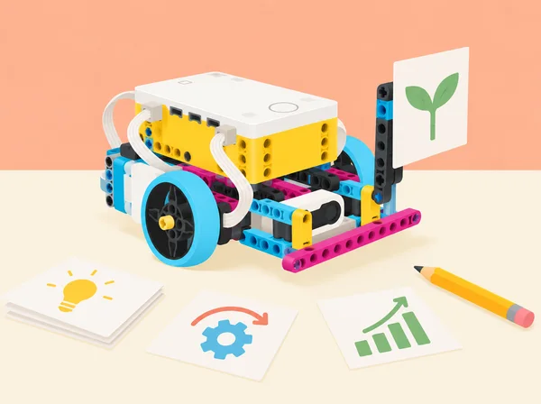
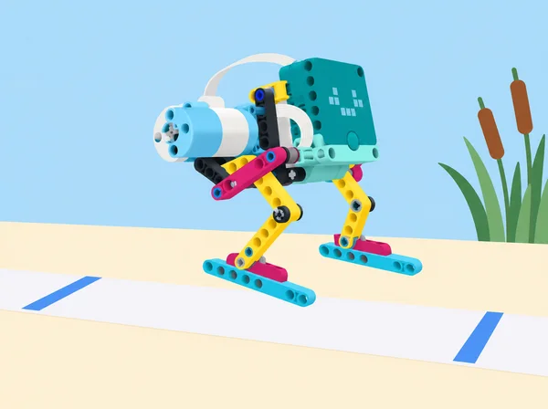

_Una idea millora quan definim criteris, fem proves i escoltem comentaris concrets._

## 🌱 Repte i intenció

Una cooperativa escolar prepara una fira de solucions útils per al centre. Els equips aprenen a crear un primer prototip, donar-se retorn respectuós i modificar el disseny amb evidències; escriuen pseudocodi abans de programar; valoren si una tasca és adequada per a l’automatització; i presenten una proposta amb claredat i sense promeses exagerades. La fitxa adapta les sis lliçons de la unitat 2 *Improving a Design* de LEGO Education *Foundations of Physical Computing*. Té punts de contacte amb *Ideas, the LEGO way!* i altres recursos, però conserva la seqüència i els objectius específics d’aquesta unitat.

## 🎯 Aprenentatges i vocabulari

- Convertir una necessitat en requisits i una proposta de prototip que es puga provar.
- Usar pseudocodi per explicar el procés abans de programar-lo.
- Iterar el disseny mecànic o digital a partir de dades i retorn d’altres equips.
- Comunicar els usos, les limitacions i les decisions d’automatització d’una proposta.

## 📅 Seqüència didàctica · sis lliçons

### **Lliçó 1 · Iteració i perseverança: el saltador de l’aiguamoll ([Hopper Race](https://education.lego.com/en-us/lessons/prime-invention-squad/hopper-race/), 90 min).**

**Repte:** construir i programar un robot sense rodes que avance per un tram de proves inspirat en les passarel·les sobre zones humides valencianes. La cursa és una maqueta segura, no una simulació d’un animal real. **Preparació:** carregueu hubs i marqueu al terra un inici i una meta separats aproximadament 90 cm, amb un corredor lliure al voltant; prepareu quadern, cinta i una taula amb espai per a tres proves. Mostreu imatges o un vídeo breu d’éssers vius o robots que es desplacen sense rodes i pregunteu com ho aconsegueixen. **Exploreu:** per parelles, munteu un saltador SPIKE Prime amb el mecanisme disponible a l’app com a punt de partida o amb una solució pròpia de potes articulades; no pot usar rodes ni peces que facen de roda. Executeu el programa inicial i registreu si arriba a la meta, el temps i si es desvia. Feu tres proves comparables amb dos valors de velocitat/potència (per exemple, 50% i 100%) i manteniu la mateixa línia, superfície i posició inicial. Modifiqueu després la geometria de les potes (una variable cada vegada) i observeu si la llargària de la gambada, l’adherència o la fricció canvien el desplaçament. Anoteu cada versió amb esbós o fotografia, canvi, predicció, resultat i explicació; useu la taula per decidir quin disseny és més eficient, no sols quin arriba primer. **Explicació i revisió:** feu una cursa curta per torns. Una parella observa la prova d’una altra i dona feedback concret basat en el que ha vist («amb les potes llargues s’ha desviat després de la segona gambada»); no toca el muntatge ni escriu en el programa alié. L’equip repeteix la seua predicció, incorpora o rebutja el suggeriment amb una raó i fa una segona cursa amb tots els models. Si s’entrellacen o ixen del corredor, el docent els retorna a l’inici només després d’aturar la prova. **Avaluació:** compareu els resultats abans/després, expliqueu com una decisió de maquinari o codi ha afectat el moviment, i identifiqueu si el feedback ha millorat el prototip. Autoavaluació: què he canviat, com ho sé, quin comentari he donat/rebut i com hem gestionat torns i peces (escala pròpia 1–3). Per a qui necessite bastida, oferiu dues formes de pota i una taula ja preparada; ampliació: variar una sola relació de potència/temps, afegir una prova sobre dues superfícies segures o dissenyar una segona fita accessible. Manteniu els prototips lleugers, velocitat baixa i mans fora del mecanisme durant l’execució.

_El repte compara prototips sense rodes i documenta com canvien amb cada iteració._

### **Lliçó 2 · Escriure pseudocodi ([Place Your Order](https://education.lego.com/en-us/lessons/prime-kickstart-a-business/place-your-order/), 45 min).**

**Activació · 5 min:** compareu abreviatures de missatges amb instruccions completes: quan estalvien temps i quan creen confusió? Acordeu que el pseudocodi descriu accions amb llenguatge clar abans de programar. **Lectura · 10 min:** observeu una seqüència de blocs de motor, llum i so (projecte SPIKE ja preparat pel docent) i escriviu què penseu que farà, sense executar-la encara. Compareu predicció i codi, detecteu instruccions absents o ambigües i convertiu-la en pseudocodi ordenat. **Modelatge · 15 min:** cada parella tria una acció d’un prototip propi —arrancar, moure una distància curta, mostrar un senyal i aturar-se— i redacta passos verificables. Intercanvieu el full: l’altra parella els ha de poder seguir sense preguntes addicionals. **Programació i depuració · 10 min:** traduïu el pla a blocs, executeu-lo i marqueu qualsevol diferència entre el que deia el pseudocodi i el comportament; reviseu primer el pla i després el codi, sense esborrar l’original. **Tancament · 5 min:** compartiu dues versions possibles del mateix pseudocodi i expliqueu què han de tindre en comú (ordre, accions, valors necessaris), encara que no usen exactament les mateixes paraules. Deseu pseudocodi inicial/revisat, codi i una nota sobre l’error que ha ajudat a trobar. El docent comprova que els hubs estan carregats; si el maquinari no està disponible, es pot fer la predicció amb captura impresa i executar la seqüència amb cartes de blocs.       **Lliçó 3 · Crear un producte nou: una màquina, moltes interpretacions (45 min).****Repte comú:** tots els equips observen el mateix mecanisme SPIKE Prime preparat pel docent: hub, motor i un braç curt que fa un moviment repetible. No s’hi afegeixen peces ni es canvia el muntatge; es pot editar el moviment, la llum o el so. **Engage · 8 min:** mostreu només el moviment i pregunteu «què podria ser aquest aparell?». Com a escalfament, doneu una forma familiar (un cercle o una roda) i un minut per escriure deu interpretacions diferents, sense jutjar-les. **Explore · 12 min:** en parella, inventeu usos per al mecanisme comú en un servei local —per exemple, avisador de torn, indicador de sala o distribuïdor de fitxes— i trieu-ne un; expliqueu qui el necessitaria i quina necessitat resol. Prepareu un nom i un anunci breu, però separeu la funció demostrada de la promesa imaginada. **Explain · 8 min:** presenteu el concepte sense revelar massa detalls abans que els altres equips imaginen què pot ser; el públic identifica què comunica el moviment, si la idea és útil i quina prova voldria veure. **Elaborate · 10 min:** incorporeu una idea escoltada canviant només programa, llum o so; no afegiu peces per mantindre una restricció comuna. Feu una presentació en directe o un guió/storyboard de comercial; vídeo opcional i sense enregistrar ningú sense autorització. **Evaluate · 7 min:** compareu quines presentacions han resultat memorables i per què, sense confondre persuasió amb evidència. Cada alumne registra què ha aportat, com ha gestionat temps/materials i una idea que milloraria. **Evidència:** llista de deu interpretacions, idea triada, programa modificat i comercial amb «què és» i «per què podria ser útil». El producte és una proposta creativa de classe, no un article llest per a vendre.       **Lliçó 4 · Compartir idees i decidir què automatitzar (45 min).****Engage · 5 min:** penseu una tasca repetitiva del centre o del trajecte escolar que voldríeu simplificar, sense incloure dades personals. **Explore · 15 min:** en parelles, genereu diverses idees sense descartar-les d’entrada; després trieu-ne una i analitzeu si té una entrada detectable, una resposta clara, una persona usuària i un risc o límit. Feu un esbós o proveu un subcomponent amb SPIKE; no cal construir el producte complet. **Explain · 10 min:** expliqueu la proposta a una altra parella i escolteu preguntes aclaridores i suggeriments amables («heu considerat…?»). El grup receptor assenyala una idea interessant i demana qui supervisa l’automatització o com es recupera si falla. **Elaborate · 10 min:** integreu una aportació i prepareu un pitch d’un minut amb necessitat, usuari, idea i raó per a donar-li suport. Es pot presentar en viu o amb un guió il·lustrat. **Evaluate · 5 min:** si la classe ho considera útil, cada alumne vota anònimament una proposta; compteu vots en una taula de freqüències i representeu-los en un gràfic de barres, comentant què mesura i què no mesura el vot. Tanqueu amb una reflexió sobre com les idees d’altres han canviat la vostra. Evidència: llista inicial, esbós, preguntes i suggeriments, versió revisada i decisió argumentada. Una majoria no demostra que una automatització siga segura o adequada: no automatitzem vigilància, cura ni decisions sobre persones.       **Lliçó 5 · Mini-repte: creativitat en un projecte (45–90 min).****Escenari:** sou un equip d’un estudi cooperatiu de disseny del barri que presenta una idea útil a una mostra escolar; necessiteu suport per a continuar desenvolupant-la, no diners reals. **Engage · 10 min:** analitzeu un anunci o una campanya pública: quin problema presenta, quina informació dona i quina emoció o argument usa per convéncer? Distingiu una afirmació comprovable d’un reclam. **Explore · 20–40 min:** trieu una necessitat no sensible del centre o de la comunitat, feu pluja d’idees i convertiu una en un prototip SPIKE Prime amb una funció demostrable (o model físic i pseudocodi si falta temps). Definiu l’usuari, dues proves i una limitació; el robot nou pot combinar hub, motor, sensor, llum i so segons el repte. **Explain · 10 min:** mostreu un primer esbós/programa a un altre equip i demaneu preguntes i una proposta de millora. Registreu què decidiu incorporar i què descarteu. **Elaborate · 15–25 min:** presenteu un pitch en viu o comercial breu (vídeo opcional i consentit) que explique per què es necessita, què és la idea i per què el públic podria donar-li suport. Podeu fer una votació anònima amb notes i un gràfic de barres; interpreteu els resultats com a resposta d’aquesta classe, no com a prova de mercat. **Evaluate · 5 min:** identifiqueu quina presentació va convèncer i per què, una dada que falta i què canviariareu en una iteració següent. L’avaluació valora idea i prototip, prova verificable, ús del feedback i comunicació clara, no popularitat ni acabat estètic. Autoavaluació breu de cooperació, gestió del temps i peces. La proposta és un prototip didàctic i no un producte de venda; anuncis i imatges han de ser originals o tindre font atribuïda.       **Lliçó 6 · Professions de màrqueting i comunicació (90 min).****Preparació:** reuniu fonts fiables i actuals sobre formació i ocupacions locals, i prepareu una graella de font, tasca, habilitat i itinerari; equips de quatre reparteixen rols que roten. **Engage · 10 min:** connecteu les activitats d’aquesta unitat (idear, prototipar, recollir feedback, fer un anunci i presentar) amb màrqueting i arts, tecnologia audiovisual i comunicació. Feu una pluja de feines conegudes i inesperades. **Explore · 30 min:** cada equip investiga totes dues famílies professionals: què fa una persona en eixa ocupació, amb qui treballa, quines habilitats aplica, quina formació o acreditació cal comprovar i quines dades d’ocupació hi ha disponibles. Anoteu font i data; si no hi ha una dada valenciana fiable, indiqueu-ho en lloc d’extrapolar xifres d’altres llocs. **Model · 15 min:** trieu màrqueting o comunicació audiovisual i representeu el procés amb peces SPIKE i un esquema: necessitat de públic → idea → contingut accessible → comprovació → difusió. Cada grup prepara una presentació d’un minut i identifica un rol creatiu, un tècnic i un d’organització. **Explain · 15 min:** presenteu els models i contrasteu ocupació concreta amb família professional; pregunteu quins interessos, tasques i habilitats comparteixen. **Elaborate · 15 min:** completeu un diagrama de Venn propi per als dos àmbits, situant al centre habilitats compartides (com explicar una idea a un públic) i als extrems rols o tasques distintius; afegiu una relació d’interdependència entre dues professions. **Evaluate · 5 min:** autoavaluació privada sobre habilitats que voldria practicar i una pregunta per a investigar; compartir és opcional. L’observació docent comprova ús de fonts, exemples de rols i capacitat de relacionar ocupacions. Evidència: graella documentada, model, presentació i Venn. Aquesta lliçó tracta dues famílies de les setze que el curs recorre al llarg del temps; no representa el catàleg sencer de professions.\n+

## 🧰 Materials i condicions

Set SPIKE Prime 45678, app SPIKE i dispositiu per parella; peces de cartó i paper, llapis, targetes de criteris, quadern de procés i una maqueta d’aula o biblioteca. Per a la mostra audiovisual, un dispositiu de gravació és opcional i sempre pot substituir-se per una presentació en directe o una seqüència de diapositives. No cal BricQ Motion ni expansió 45681. Comproveu hubs, ports i programes abans de provar el mecanisme; limiteu velocitat i massa, i atureu el hub abans de fer canvis físics.

## 🧪 Evidències i avaluació

Conserveu el criteri inicial, esbossos, prototip, pseudocodi, versions del programa, prova reproduïble, feedback rebut, registre del canvi, anàlisi d’automatització i presentació revisada. Valoreu que les decisions de millora es basen en dades o comentaris específics; que el pseudocodi es puga executar i corresponga amb el codi; que s’identifique quan automatitzar no és adient; i que el missatge separe prova i hipòtesi. L’autoavaluació d’1 a 3 revisa torns, gestió del temps i cura de peces, amb un objectiu per al repte següent.

## ♿ Participació i comunicació responsable

Repartiu rols rotatius i permeteu produir la idea amb dibuix, maqueta, pseudocodi, programació o narració. El feedback descriu accions i efectes, no qualifica les persones; ningú modifica el muntatge o el programa d’un altre equip. No es publiquen imatges, veu, interessos personals ni dades d’usuaris sense autorització. Els anuncis han d’identificar el prototip com a escolar i indicar què no s’ha provat.

## 🔗 Referent oficial i adaptació

Adapta les sis lliçons de *Improving a Design* en [*Foundations of Physical Computing*](https://assets.education.lego.com/v3/assets/blt293eea581807678a/blt1b4345f429fde833/64d3828c455bf62b71f9b840/Foundation_of_Physical_Computing_Course_SPIKE_3_2022.pdf?locale=en-gb): *Iteration and Perseverance*, *Pseudocode*, *Create a New Product*, *Share Your Ideas*, *Mini-Challenge: Creativity in Business* i *Connecting to Careers: Marketing and Arts, A/V Technology & Communications*. Manté el prototipat iteratiu, feedback concret, pseudocodi anterior a la programació, decisió d’automatitzar, idea lliure, presentació persuasiva i exploració professional; canvia la temàtica i el producte. No es copien els fulls de LEGO ni els muntatges de l’app.
