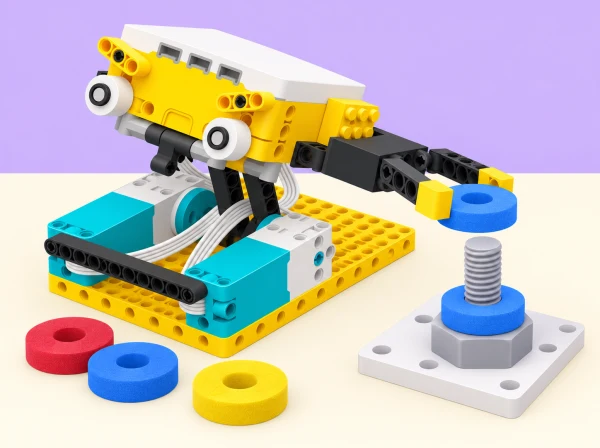

_La maqueta representa una reparació extravehicular; el prototip és SPIKE Prime i només actua sobre peces de prova lleugeres._

## 🌱 Situació i intenció

Una missió educativa fictícia manté un satèl·lit que observa la costa valenciana i zones humides com l’Albufera. L’equip de disseny ha de preparar una eina de maqueta per moure una peça grossa entre perns o guiar un cable sense perdre’l de vista. El mapa del [Parc Natural de l’Albufera](https://parquesnaturales.gva.es/va/web/pn-l-albufera) aporta el context territorial; no afirmem que hi haja cap satèl·lit específic fent aquesta missió.

El repte adapta *Astronaut Tools*: comparar què demana una tasca extravehicular (EVA) respecte d’una eina terrestre i dissenyar pensant en el client, les seues mans amb guants i la visibilitat limitada. NASA descriu que les persones en caminada espacial s’estabilitzen amb passamans i que els objectes de treball s’ancoren perquè no s’allunyen; consulteu-ne la fitxa educativa de [què és una caminada espacial](https://www.nasa.gov/learning-resources/for-kids-and-students/what-is-a-spacewalk-grades-5-8/). El nostre tauler no simula la microgravetat: és una maqueta fixa per investigar la forma, el control i la transmissió de força. Tampoc demanem a l’alumnat que es pose casc o que limite la vista; traduïm les restriccions en criteris de disseny i targetes de prova.

## 🎯 Repte i criteris d’èxit

Trieu una de tres tasques: traslladar una femella gran d’escuma d’un pern ample a un altre; guiar un cable tou entre dues guies; o girar lentament una femella de cartó fixada a un suport. Dissenyeu una pinça, selector o girador que puga completar la tasca sense colps i amb un control clar.

- La peça de prova queda controlada durant el trasllat, sense eixir del tauler.

- Una altra parella pot identificar l’entrada, el moviment i la manera d’aturar el mecanisme.

- La relació d’engranatges triada es justifica amb dades de velocitat, càrrega i èxit.

- La prova és repetible en la maqueta i no s’extrapola a una operació espacial real.

- La idea d’interfície té en compte l’adherència ampla i un contrast visual clar sense obligar ningú a restringir la vista o el moviment.

## 📅 Seqüència didàctica · 5 sessions de 50 minuts

### **Sessió 1 · Entenem la tasca i el context.**

Consulteu el mapa públic del Parc Natural i marqueu la zona valenciana que inspira la missió fictícia. Compareu imatges o esquemes de l’espai amb una eina terrestre i distingiu els fets que provenen d’una font de les hipòtesis del vostre disseny. Llegiu una breu fitxa sobre les EVA: eines i peces poden necessitar tethers/ancoratges, i els passamans ajuden la tripulació a estabilitzar-se. En la maqueta, representeu aquesta idea amb un clip ample o una safata que reté la peça, sense dir que recrea la física orbital.

En equips, seleccioneu una tasca, descriviu el client i completeu «necessitat / limitació / criteri de disseny / prova possible». Dibuixeu què canvia respecte d’una eina quotidiana: grandària i forma del mànec, contrast de la peça, visibilitat de l’acció i manera de retindre-la. **Evidència:** targeta de missió i dues necessitats amb criteris mesurables.

### **Sessió 2 · Dissenyem i comparem agafadors.**

Esbosseu dues eines: una pinça de dues peces mòbils i una cullera/guia fixa que evita agafar la peça. Assenyaleu eix, punt d’agafada, superfície de contacte i límit de tancament. Construïu primer una versió manual amb cartó o peces SPIKE sense motor i proveu-la amb peces grans d’escuma; això ajuda a comprovar la geometria abans de programar. Compareu un mànec estret amb un de més ample mitjançant plantilles, sense fer que ningú es pose guants que li impedisquen manipular amb seguretat.

Seleccioneu el disseny que millor s’ajuste a la tasca. La forma de treballar amb guants és un requisit a considerar, no una experiència física que cal imitar: mida de presa, separació de controls i contrast. **Evidència:** dos esquemes, taula de criteris i selecció argumentada. **Ampliació:** un altre equip rep només el dibuix i prova si entén on col·locar la peça.

### **Sessió 3 · Transmetem el moviment i provem engranatges.**

Construiu l’eina amb hub, motor gran o mitjà del kit, bigues i una unió mòbil. Proveu una reducció d’engranatges i una configuració que augmente la velocitat, amb la mateixa peça i recorregut. Abans de cada intent, prediu si el moviment serà més lent o ràpid i si tindrà prou força per moure la peça. Feu tres execucions per configuració; registreu temps, nombre de trasllats reeixits, si la peça rellisca i si la base s’alça o gira.

Useu dades per explicar el compromís: una reducció acostuma a donar més parell i menys velocitat a l’eix de sortida; augmentar la velocitat redueix el parell disponible, segons la relació de transmissió. No bloquegeu l’eix ni proveu la força amb els dits. Si la pinça no tanca de manera controlada, pareu i reviseu el topall o el programa. **Evidència:** diagrama d’engranatges i comparació de resultats. **Ampliació:** repetiu amb un braç més llarg i observeu com canvia l’abast i l’estabilitat.

### **Sessió 4 · Afegim una entrada i comparem sensors.**

Prepareu una marca de color ample a la targeta de la peça. Amb el sensor de color del set, feu que el programa seleccione una configuració prèviament acordada; amb el sensor de distància, proveu una activació quan un bloc gran arriba a una zona marcada. Manteniu un control manual alternatiu. Registreu activacions correctes i falses amb tres targetes de prova i dues distàncies, i expliqueu la il·luminació o l’angle que poden afectar la lectura. El sensor de color llig l’etiqueta preparada; no identifica el material, el tipus de femella o la seua duresa.

Una altra variant adapta l’exemple oficial de martell amb detecció de moviment: substituïu qualsevol impacte per una pressió lenta sobre una peça d’escuma, activada amb un gest del hub només si la classe pot fer-ho amb control. No es colpegen objectes ni persones. Compareu la llegibilitat i la previsibilitat de l’entrada automàtica amb el botó manual. **Evidència:** diagrama entrada-resposta, matriu de proves i justificació del sensor triat.

### **Sessió 5 · Iterem i fem el lliurament de missió.**

Reviseu la pinça a partir de les dades: amplieu el mànec, canvieu el límit de tancament, reduïu velocitat o afegiu una guia per al cable. Canvieu una cosa cada vegada i repetiu la tasca tres voltes. Prepareu una fitxa de lliurament inspirada en les targetes públiques de divulgació espacial: missió, objecte que manipula, components SPIKE, passos d’ús, límit conegut i alternativa manual.

Com a extensió creativa, l’equip pot demanar a una eina d’IA autoritzada variants de forma a partir dels criteris escrits. Reviseu cada idea contra el material real i les proves; anoteu l’ús d’IA. La IA no pilota ni controla el robot. Una altra parella executa la seqüència amb una targeta i una checklist, sense rebre instruccions orals addicionals. **Evidència:** prototip revisat, taula abans/després, instruccions i limitació que encara no s’ha provat.

## 🧰 Materials i preparació

SPIKE Prime 45678: hub, un motor, bigues, eixos, engranatges, sensor de color o de distància si està disponible; peces grans de cartó/escuma, perns amples de maqueta, volanderes d’escuma, cable tou, clips de retenció, cinta de paper, targetes, regla i graella de registre. No es necessita cap sensor de força extern ni cap expansió 45681.

Prepareu taulers amb perns ben fixats i objectes lleugers que no puguen rodar fora de la taula. Reviseu connexions i programa, limiteu velocitat i força i manteniu lliure la zona mòbil. Feu grups amb rols rotatius de disseny, construcció, codi, observació i registre. Si falta dispositiu, la mateixa comparació es pot fer manualment, però marqueu l’evidència com a maqueta sense automatització.

## 🧪 Evidències i avaluació

Recolliu mapa/context, targeta de missió, esbossos, criteris, esquema de transmissió, programa, registre de sis o més proves, decisions d’iteració i instruccions finals. La rúbrica formativa observa si l’equip:

- distingeix el context documentat de l’escenari fictici;

- relaciona engranatges amb velocitat/parell sense prometre un resultat universal;

- selecciona una entrada que pot justificar i ha provat amb casos diferents;

- manté la peça dins del tauler i atura el mecanisme abans de modificar-lo;

- explica una limitació i proposa una prova posterior concreta;

- escriu instruccions que una altra parella pot seguir.

Autoavaluació: «La dada que m’ha fet canviar el mecanisme és…», «el sensor que he triat només em permet inferir…» i «per a usar aquesta eina en una missió real encara caldria…». El feedback parla de la qualitat del disseny, no de la destresa física de les persones.

## ♿ Participació, seguretat i límits

No fem simulacions de discapacitat ni posem cascos opacs o guants grossos com a prova obligatòria. Convertim els requisits en decisions de disseny, oferim mànecs alternatius, controls amplis, targetes visuals i rols de participació diversos. Ningú està obligat a provar físicament l’eina. Atureu el programa i desconnecteu el hub abans d’ajustar engranatges; manteniu els dits fora de la pinça i useu només càrregues grans, lleugeres i de baixa velocitat.

La maqueta terrestre no reprodueix microgravetat, tracció ni una EVA. El prototip no és una eina espacial operativa ni una pinça per a ús corporal. Un sensor de distància/color no reconeix persones o materials; la prova només verifica els estímuls preparats a classe.

## 🔗 Referents i adaptació completa

Partim del [SPIKE Activity Brief: Astronaut Tools](https://assets.education.lego.com/v3/assets/blt293eea581807678a/blt41706aa0b48fea02/6324c4779a6b39638424b8fd/LE_14x8.5_LessonMat_Astronaut_Tools_WB_Mech_NoCrops.pdf?locale=en-us) i el seu [exemple de codi per al Motion Sensing Hammer](https://assets.education.lego.com/v3/assets/blt293eea581807678a/blt39945736557adf75/5f8801b1d8724422d0ad95fd/le_activitybrief_astronaut_tools_python.pdf?locale=en-us). S’hi conserven traslladar femelles entre perns o encaminar cables, pensar les diferències d’eines de l’espai i de la Terra, dissenyar per a guants i visibilitat, els tres conceptes de martell/selector/desmuntatge, reducció i augment d’engranatges, activació per sensors, velocitat segons la peça i exploració d’IA. Les propostes per al martell es tradueixen a pressió lenta sense impacte; les peces, guies, proves, itinerari de cinc sessions i il·lustració són propis. L’exemple de codi pertany a SPIKE Legacy: comproveu la versió de l’app i manteniu blocs com a alternativa completa.

Per contextualitzar els requisits d’una EVA, consulteu la fitxa educativa de la NASA enllaçada en la situació, que descriu guants, passamans i subjecció d’eines. La font local és el [Parc Natural de l’Albufera (Generalitat Valenciana)](https://parquesnaturales.gva.es/va/web/pn-l-albufera); l’ús com a escenari de missió és imaginari.
