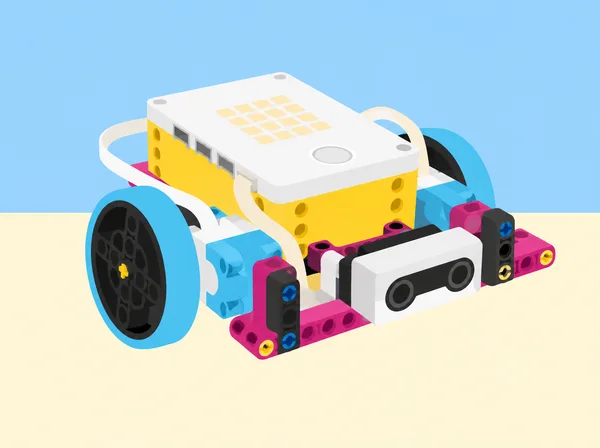
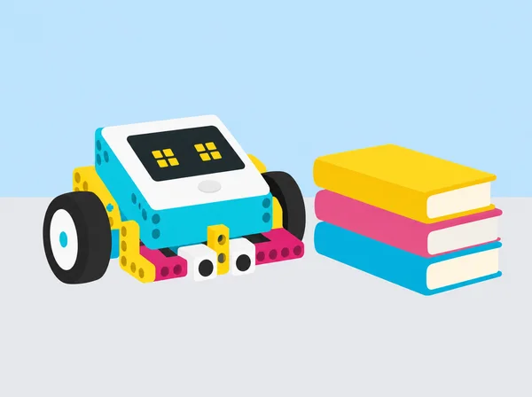

_Un mateix sistema combina peces, sensors, motors, instruccions i decisions de l’equip._

## 🌱 Repte i intenció

La classe prepara una mostra per a explicar com la robòtica pot ajudar en tasques de cura, educació i vida quotidiana. Al llarg de sis lliçons, els equips defineixen criteris per col·laborar i organitzar els materials, diferencien un robot d’una màquina programable, experimenten amb la llum, el so, els motors i els sensors, i milloren un prototip a partir de proves registrades. La seqüència adapta el mòdul *What Is a Robot?* de LEGO Education *Foundations of Physical Computing*; les preguntes, els contextos, les proves i les evidències són propis. Cap prototip es presenta com un dispositiu de servei real ni com una solució certificada.

## 🎯 Aprenentatges i vocabulari

- Explicar com interactuen estructura, actuadors, sensors i programa en un sistema robòtic.
- Provar una entrada i una eixida i descriure què canvia quan es modifica el codi.
- Construir i iterar un prototip amb rols cooperatius i proves observables.
- Relacionar la computació física amb tasques professionals sense atribuir autonomia o capacitats no provades.

## 📅 Seqüència didàctica · sis lliçons

### **Lliçó 1 · Introducció a la robòtica (45 min).**

En parelles, exploreu el set SPIKE Prime i acordeu tres normes concretes per compartir un kit, torns de construcció i programació, i lliurament a temps. Feu una pluja d’idees sobre necessitats que podria ajudar a resoldre la tecnologia; distingiu problema, persona usuària i funció tècnica. Mireu la dotació i identifiqueu hub, motors, sensors i elements estructurals sense desmuntar connexions a la força. Anoteu una primera idea de projecte final, els rols de cada membre i com els rotareu. Tanqueu amb un inventari cooperatiu de la caixa i una autoavaluació breu de participació, temps i cura dels materials.

### **Lliçó 2 · Què és un robot? (45 min).**

Definiu «robot» amb tres paraules i contrasteu exemples quotidians i industrials: què detecten, quin programa segueixen i quina tasca repetitiva o difícil fan? En una taula, compareu entrada, procés i resposta, i marqueu què és maquinari i què és programari. Amb el hub SPIKE sense accessoris, obriu la lliçó d’inici de l’app i comproveu què pot fer la matriu quan rep un programa; discutiu si el hub a soles compleix els criteris que heu acordat per a dir-ne robot. Afegiu casos que compliquen la definició, com una porta automàtica o un electrodomèstic programable. Reviseu la definició amb proves i no amb l’aparença de la màquina.

### **Lliçó 3 · So i llum (45 min).**

Representeu una funció amb el cos o amb targetes: cada grup executa un to baix, mitjà o alt i ordeneu-los de manera ascendent i descendent. Relacioneu funció i paràmetre: es reutilitza una instrucció i se’n modifica un valor. Després, cada parella crea un missatge breu d’acollida per a una biblioteca o un espai tranquil de l’escola, combinant icones de la matriu del hub i una seqüència de sons o tons de l’altaveu integrat. Planifiqueu primer amb pseudocodi; proveu inici, ordre, durada, volum i repetició. Feu una versió silenciosa o només visual, i pregunteu a una altra parella què ha entés abans d’explicar-li el missatge.

### **Lliçó 4 · Motors i sensors (45–60 min).**

Abans de connectar res, predieu la funció de cada component del set: motor mitjà i gran, sensor de distància, sensor de color, sensor de força i sensor giroscòpic del hub. Completeu una graella amb nom, predicció, prova, observació i exemple quotidià. Seguiu la pràctica guiada de l’app i amplieu-la: en un motor, proveu una arrencada progressiva al llarg de deu rotacions i canvieu-ne el sentit; amb sensors, observeu què varia en canviar distància, color, pressió o inclinació, sense confondre el sensor giroscòpic amb un sensor extern. Cada equip programa una entrada i una resposta, i després combina un motor i un sensor en una idea pròpia. Registreu ports i valors perquè un altre equip puga reproduir la prova.

### **Lliçó 5 · Fes que es moga (90 min).**

Recupereu les definicions de robot i prototip. Construïu amb les instruccions disponibles a l’app un model saltador senzill del kit SPIKE Prime i programeu-lo perquè faça un moviment controlat. Abans de cada canvi, escriviu què espereu que passe; altereu una sola variable del programa cada vegada —velocitat, durada, potència o nombre de rotacions— i anoteu resultat i següent decisió en una taula d’iteració. Depureu per parts: connexió, port, mecanisme, bloc i valor. Compareu dos intents en les mateixes condicions i expliqueu com el codi canvia el comportament del maquinari. Finalment, defenseu amb evidències si el prototip compleix els criteris consensuats per a considerar-lo robot.

### **Lliçó 6 · Professions de cura i educació (4 sessions de 60 min; 240 min).**

**Preparació docent:** seleccioneu fonts públiques accessibles sobre ocupacions i itineraris a la Comunitat Valenciana, prepareu una fitxa d’investigació i organitzeu equips de quatre amb rols rotatius (cercador de fonts, verificador, cartògraf visual i portaveu). No cal que ningú revele interessos personals. **Sessió 1 · Obrim el mapa de professions:** connecteu la robòtica amb dos àmbits, serveis humans i educació i formació. En pluja d’idees, poseu exemples de qui ensenya, acompanya, facilita l’accés a un servei o prepara recursos; amplieu la llista més enllà de les ocupacions més conegudes. Cada equip tria dues professions i completa una fitxa amb tasques reals, persones amb qui col·labora, habilitats, entorn, estudis o acreditacions que cal comprovar i una font datada. Distingiu un fet trobat d’una suposició i no copieu dades laborals d’un altre país com si descrigueren el mercat local. **Sessió 2 · Del treball a un model:** relacioneu les professions amb el que hem après de robots, motors i sensors; construïu una representació amb peces SPIKE o materials de paper i cartó. El model explica un sector o la col·laboració entre rols, no caricaturitza persones ni afirma que un robot puga substituir una tasca de cura. Prepareu una presentació d’un minut amb una idea clau i una pregunta oberta. **Sessió 3 · Contrastem i connectem:** cada grup presenta; la classe pregunta qui utilitza el servei, quines habilitats comparteixen les ocupacions i quines són específiques. Completeu un diagrama de Venn «compartit / serveis humans / educació i formació» i una xarxa de col·laboracions entre professions. Afegiu una ocupació desconeguda que hàgeu trobat i una font que la confirme. **Sessió 4 · Necessitat, suport i reflexió:** trieu una necessitat fictícia d’un espai educatiu, definiu persona usuària i criteris, i dissenyeu una ajuda segura (prototip simple o maqueta de paper). Etiqueteu entrada, resposta, persona responsable, límit i alternativa manual; expliqueu quin personal qualificat participa en el servei. Tanqueu amb una fitxa individual privada: què m’ha interessat, quina habilitat voldria practicar i quina pregunta investigaria després. Compartir-la és opcional i no s’avalua la preferència professional. **Evidències i avaluació:** fitxes de fonts, mapa visual, presentació, concepte de suport i reflexió; observeu si es distingeixen fonts i conjectures, si s’expliquen tasques i habilitats amb exemples, si el model comunica la relació entre professions i si es reconeixen els límits i la intervenció humana. Un altre grup dona una pregunta i una fortalesa concreta. El pla oficial preveu una sèrie de 240 minuts sobre aquestes dues vies professionals, investigació de tasques, habilitats i formació, representació amb peces i presentació breu; aquesta adaptació crea ocupacions, preguntes, fitxes i maqueta pròpies.

_El prototip és un recurs d’aprenentatge: l’acompanyament educatiu i les decisions continuen en mans de les persones._

## 🧰 Materials, preparació i alternatives

Un set SPIKE Prime 45678 i un dispositiu amb l’app SPIKE per parella; quadern o full de registre, targetes, paper i retoladors; connexió i hubs carregats abans de la classe. Comproveu que les lliçons d’inici i els programes seleccionats estan disponibles en la versió de l’app del centre. Quan un sensor o una funció de so no estiga disponible, representeu l’entrada amb una targeta o un comandament manual i etiqueteu-la com a simulació, sense atribuir la detecció al maquinari. Prepareu les fonts sobre professions i una alternativa impresa per a qui no tinga accés a internet. No cal cap expansió 45681 ni components externs.

## 🧪 Evidències i avaluació

Recolliu normes i rols de l’equip, definició argumentada de robot, mapa maquinari–programari, pseudocodi, programa de llum i so, graella de prediccions i observacions dels sensors, registre d’iteracions i presentació final. Valoreu si distingeixen entrada, procés i resposta; si relacionen el codi amb el moviment observat; si canvien una variable cada vegada; si justifiquen la definició amb proves; i si escolten i incorporen comentaris. L’autoavaluació de cada sessió revisa col·laboració, gestió del temps i inventari compartit, amb una escala clara d’1 a 3 i un objectiu concret per a la següent classe.

## ♿ Participació i ús responsable

Oferiu rols rotatius de programació, construcció, observació, portaveu i inventari; instruccions escrites i visuals; i opcions de resposta oral, gràfica o escrita. La tasca de so té alternativa silenciosa i cap alumne ha de compartir públicament interessos professionals personals. En les proves de sensors, no es recopilen dades personals ni es detecten persones: s’utilitzen peces, targetes i objectes. Els prototips no substitueixen el criteri ni la cura de professionals.

## 🔗 Referent oficial i adaptació

Aquesta seqüència correspon a les sis lliçons de la unitat 1 *What Is a Robot?* del curs LEGO Education [*Foundations of Physical Computing*](https://assets.education.lego.com/v3/assets/blt293eea581807678a/blt1b4345f429fde833/64d3828c455bf62b71f9b840/Foundation_of_Physical_Computing_Course_SPIKE_3_2022.pdf?locale=en-gb): *Introduction to Robotics*, *What is a Robot?*, *Sound and Light*, *Motors and Sensors*, *Make It Move* i *Connecting to Careers: Human Services and Education & Training*. Conserva els objectius, la progressió pràctica, la classificació de components, la definició amb evidències, la programació de llum/so, les iteracions i la investigació professional; adapta el context, les preguntes, els registres i el producte final. Les instruccions de muntatge LEGO continuen en l’app del fabricant; aquesta fitxa no les copia ni les representa com a creació pròpia.
