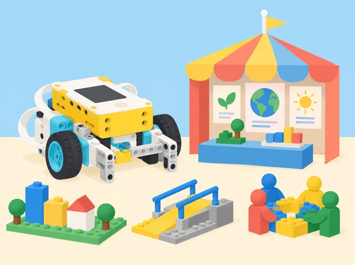

_La fira és un mapa de tasques connectades: cap professió ni itinerari és l’únic camí possible._

## 🌱 Propòsit i context

Després d’explorar les 16 famílies professionals del curs LEGO Education *Foundations of Physical Computing*, l’alumnat analitza una situació comunitària propera: organitzar una fira escolar de ciència i tecnologia perquè hi puguen participar visitants amb necessitats diverses. Una fira depén de planificació, accessibilitat, comunicació, transport, energia, manteniment, neteja, alimentació, pressupost, continguts i gestió pública; molts rols són visibles i molts altres treballen abans que arribe el públic. Els equips creen un mapa de professions i una maqueta de la fira, revisen els interessos i habilitats que cadascú ha triat compartir i investiguen opcions formatives vigents al nostre entorn. La situació adapta les tres lliçons de la unitat 9 *Careers Culminating Project*. No és una prova d’aptitud, un consell d’orientació individual ni una predicció laboral: obri possibilitats i ofereix informació contrastable sense exigir que ningú revele expectatives personals.

## 🎯 Objectius d’aprenentatge

- Analitzar una situació quotidiana i identificar professions de diversos sectors que hi intervenen directament i indirectament.

- Classificar feines per tasques, entorns, habilitats, formació i relacions amb altres rols, amb fonts actuals i citades.

- Representar visualment xarxes de treball interdependents i explicar què aporta cada rol a l’experiència dels visitants.

- Reconéixer competències transferibles desenvolupades en el curs (comunicació, col·laboració, creativitat, resolució de problemes, organització i autoregulació) i relacionar-les amb famílies de professions sense reduir-les a una única ocupació.

- Comparar una primera reflexió opcional sobre interessos amb una revisió final, respectant que les preferències poden canviar o romandre igual.

- Construir un pla d’exploració a curt termini, no una promesa de trajectòria: una pregunta, una font, una experiència segura i una persona o servei professional que podria orientar.

## 🔎 Vocabulari i continguts

**Ocupació:** conjunt concret de tasques i responsabilitats en un lloc de treball. **Família professional:** agrupació àmplia de feines que comparteixen àmbits o competències; les classificacions varien entre sistemes. **Qualificació:** formació, acreditació o experiència requerida per a una ocupació concreta, que cal comprovar amb fonts actuals. **Competència transferible:** habilitat que pot resultar útil en diversos contextos, com comunicar una decisió o treballar amb dades. **Itinerari:** combinació possible d’aprenentatges, pràctica i experiències; no és lineal ni igual per a tothom.

La guia LEGO anomena les famílies d’ocupacions “career clusters” i inclou una primera reflexió de curs per comparar-la al final. L’adaptació usa materials propis, prioritza fonts valencianes i estatals actualitzades, i evita escales de puntuació d’“ocupabilitat”: un autorecompte escolar no permet mesurar el valor ni el futur professional d’una persona.

## 🧰 Preparació docent

Prepareu una llista gran i neutral de sectors/àmbits professionals i imatges de llocs de treball diversos sense estereotips de gènere, edat, origen o discapacitat. Recopileu enllaços actuals de portals públics d’orientació, catàlegs oficials d’estudis, perfils professionals i serveis municipals o autonòmics. La docent revisa abans la qualitat, data, autoritat i abast de cada font; cap estimació d’ofertes de feina es presenta com a predicció segura. Prepareu cartó, paper, peces de SPIKE, retoladors, notes adhesives i una plantilla de xarxa d’actors que es puga fer en paper o en format digital.

Abans del curs, podeu oferir una fitxa privada i opcional sobre àrees que desperten curiositat, tasques que agraden o habilitats que es volen practicar. Expliqueu que pot quedar en blanc, respondre’s des de la perspectiva d’un personatge fictici o substituir-se per una professió investigada. No arreplegueu les respostes personals ni les compareu entre alumnat. Per a l’alumnat que no tinga una fitxa inicial, useu la reflexió del començament d’aquesta unitat com a primera mostra i deixeu clar que els períodes no són equivalents.

## 📅 Seqüència d’aprenentatge · tres lliçons

### **Lliçó 1 · Una fira que funciona per moltes mans (90 min).**

#### Fase 1 · Activem i prediem

**Activació (10–15 min):** parleu de fires, jornades de ciència o trobades escolars; mireu imatges de referència seleccionades per la docent i identifiqueu què fa una persona visitant des que planifica el trajecte fins que torna a casa. Anoteu primer necessitats i accions, no noms de professions.

#### Fase 2 · Explorem i construïm

**Exploració (25 min):** en equips de quatre, dibuixeu en cartó un mapa de la fira i els serveis del voltant: entrada, espais d’exposició, zona tranquil·la, transport públic, aigua i descans. Assigneu al grup diverses àrees professionals perquè n’investigue els rols visibles i els que preparen l’esdeveniment per avançat; exemples a explorar: muntatge, electricitat, manteniment, mediació científica, accessibilitat, disseny, gestió cultural, neteja, restauració, transport, comunicació i emergències. Cada afirmació de rol es recolza amb una font o s’etiqueta com a hipòtesi a verificar.

#### Fase 3 · Expliquem i registrem

**Representació:** construïu una maqueta modular amb peces SPIKE i cartó o una xarxa visual amb targetes. Connecteu professió → tasca → necessitat del visitant; indiqueu si el treball és abans, durant o després de la fira.

#### Fase 4 · Apliquem i millorem

**Posada en comú:** expliqueu qui es relaciona amb el públic i qui treballa entre bastidors. Altres equips afegeixen rols que falten, per exemple qui manté els lavabos accessibles o verifica el subtitulat.

#### Fase 5 · Comprovem i reflexionem

**Elaboració:** amplieu la xarxa amb qüestions de calor, llum, so, trànsit, menjar, connectivitat, salut, neteja i pagament; reviseu si les primeres idees deixaven fora algun servei o feien una suposició estereotipada. **Evidències:** mapa de professions amb fletxes i fonts, maqueta o alternativa plana, llista de tasques visibles/invisibles i una pregunta sense resposta. No es demana a ningú dir quina d’aquestes feines voldria fer.

### **Lliçó 2 · Habilitats que es practiquen i interessos que evolucionen (120 min).**

#### Fase 1 · Activem i prediem

**Activació:** useu un cas fictici: organitzar una visita en transport públic, entendre un plànol, revisar accessibilitat, comunicar informació i gestionar un pressupost. L’alumnat identifica sabers escolars, matemàtics, lingüístics, creatius i socials implicats, i quines professions podrien aportar-los.

#### Fase 2 · Explorem i construïm

**Exploració cooperativa:** els grups trien almenys cinc competències transversals de la llista (comunicació oral/escrita, col·laboració, creativitat, pensament crític, resolució de problemes, organització, lideratge distribuït i autoregulació) i construeixen amb peces un símbol, estructura o maqueta que les represente. Per cada habilitat indiquen una activitat del curs on la van practicar i un exemple professional on podria ser útil.

#### Fase 3 · Expliquem i registrem

**Contrast:** compareu les propostes amb les experiències del curs; si una professió aparentment no necessita una habilitat, investigueu si simplement es manifesta d’una altra manera o si hi ha casos on no és central. Eviteu presentar qualsevol llista com a universal o com a requisit de contractació.

#### Fase 4 · Apliquem i millorem

**Reflexió longitudinal privada:** qui ho vulga compara la fitxa inicial del curs amb una versió nova; pot anotar canvis, continuïtats o dubtes. Alternativa equivalent: comentar una professió fictícia o revisar com ha canviat una hipòtesi de l’equip. No arreplegueu ni qualifiqueu els fulls personals.

#### Fase 5 · Comprovem i reflexionem

**Feedback:** en parelles, cada persona pot oferir una observació basada en el treball compartit (“he vist que vas…”) i una pregunta sobre una habilitat que l’altra persona vulga mostrar; no es diagnostiquen talents ni es comparen notes. **Producte:** xarxa de competències i feines, comentari sobre com ha canviat/continuat una idea i una pregunta futura. L’alumnat no està obligat a compartir el comentari personal.

### **Lliçó 3 · Un pla d’exploració possible (120 min).**

#### Fase 1 · Activem i prediem

**Activació:** planificar una meta quotidiana —com preparar una excursió o triar un curs— requereix passos, informació, opcions i revisió. Compareu un pla rígid amb un pla flexible i identifiqueu dependències i incerteses.

#### Fase 2 · Explorem i construïm

**Recerca:** cada alumne tria en privat una ocupació per investigar, o selecciona un cas fictici d’una professió de la maqueta. Consulteu fonts actuals per esbrinar tres tasques concretes, estudis o acreditacions que poden requerir-se, competències, entorns de treball, feines relacionades i on trobar més orientació a la Comunitat Valenciana. Citeu data de consulta i distingiu requisits legals d’un anunci o opinió. No s’infereix un futur salari o disponibilitat de feina sense una font actual i contextualitzada.

#### Fase 3 · Expliquem i registrem

**Reflexió i model:** completeu una plantilla “connecta–crea–canvia”: què connecta aquesta ocupació, què produeix o resol, i què contribueix a millorar. Construïu un model de peces de la professió investigada o, com a alternativa, una infografia, guió o mapa d’itinerari. La comunicació oral és opcional i pot substituir-se per presentació gravada sense imatge personal o exposició del cas fictici.

#### Fase 4 · Apliquem i millorem

**Pla a curt termini:** escriviu un pas exploratori viable per a les pròximes setmanes (llegir una font, provar una tasca en club escolar, parlar amb orientació o visitar un espai públic), una habilitat que es voldria practicar, una persona/servei que podria ajudar i un pla alternatiu si canvien els interessos. No inclogueu informació de contacte privada ni compromisos amb persones adultes sense mediació docent.

#### Fase 5 · Comprovem i reflexionem

**Tancament:** el grup revisa la seua maqueta inicial i afegeix professions invisibilitzades o connexions noves. Guardeu el pla personal només si l’alumne vol; per a l’avaluació, es pot entregar el model de recerca fictici equivalent.

## 📚 Fonts i qualitat de la informació

Per a informació formativa, consulteu portals oficials d’orientació i catàlegs de Formació Professional de la Generalitat Valenciana i del Ministeri d’Educació; per a l’ocupació, useu fonts estadístiques i serveis públics d’ocupació actualitzats. La docent ha de comprovar que la pàgina continua vigent i separar les dades de l’Estat, la Comunitat Valenciana i altres territoris. L’alumnat registra títol, entitat responsable, URL i data de consulta, i compara almenys dues fonts quan parla de requisits o oportunitats. Les professions canvien i el pla personal és revisable; una estimació de vacants no garanteix una plaça futura.

## 🧪 Avaluació i evidències

Avalueu els productes públics de l’activitat, no l’autorevelació: xarxa de professions, mapa de necessitats, ús de fonts, representació de la maqueta, relació entre habilitats i tasques, i presentació/esquema final. Criteris: (1) identifica ocupacions abans/durant/després de la fira i explica el seu impacte; (2) distingeix informació verificada d’hipòtesi i cita fonts; (3) reconeix que habilitats i formació poden combinar-se per vies diferents; (4) proposa un següent pas d’exploració concret i flexible en el cas investigat; (5) revisa el mapa a partir de preguntes o evidències. La reflexió personal es queda en mans de l’alumne i no forma part de la rúbrica. Autoavaluació opcional: quina tasca del projecte m’ha agradat practicar, què voldria aprendre encara i quina ajuda podria demanar?

## ♿ Inclusió, autonomia i privacitat

Oferiu alternatives per a la reflexió personal (personatge, professió investigada o resposta en blanc), no demaneu preferències davant del grup i no useu escales de 1–10 com a mesura objectiva de capacitat. Incloeu exemples de professionals diversos i eviteu associar professions amb gènere, origen, condició socioeconòmica o discapacitat. Faciliteu mapes tàctils, lletra clara, versions en lectura fàcil, comunicació escrita/visual i rols accessibles de recerca, construcció i presentació. La docent no guarda plans personals sense motiu pedagògic justificat ni els comparteix. Els comentaris entre companys descriuen conductes observades i no etiqueten les persones.

## 🔗 Referent oficial i adaptació

Adapta les tres lliçons de la unitat 9 *Careers Culminating Project* de LEGO Education [*Foundations of Physical Computing*](https://assets.education.lego.com/v3/assets/blt293eea581807678a/blt1b4345f429fde833/64d3828c455bf62b71f9b840/Foundation_of_Physical_Computing_Course_SPIKE_3_2022.pdf?locale=en-gb): *Culminating Activity: Careers*, *My Career Interests* i *My Career Reflection and Plan*. Preserva l’anàlisi de professions que intervenen en un esdeveniment, la investigació de tasques/formació/habilitats, la representació física, el mapa de competències compartides, la comparació de reflexions inicials i finals i un pla d’acció; canvia la convenció fictícia per una fira escolar propera i fa privades les respostes d’interessos. Els documents i les il·lustracions són originals.
