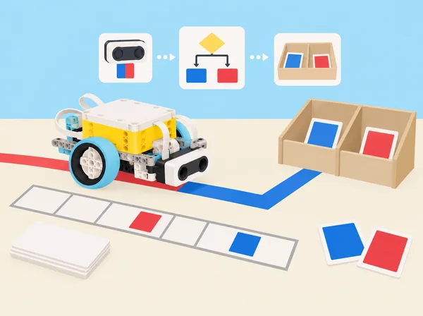

_Una llista guarda una seqüència; les condicions decideixen quina acció correspon a cada lectura._

## 🌱 Repte i context

L’escola prepara una jornada de portes obertes i necessita assajar, només en maqueta, com donar indicacions a visitants, ordenar targetes de ruta i avisar quan una seqüència no coincideix amb el pla. Els equips programaran llistes de lectures de color, compararan dues seqüències posició per posició, faran que una base seguisca una línia i cree blocs propis per reutilitzar procediments. Al mini-repte final construiran un senyalador de taula que reacciona a un moviment de maqueta i a una targeta de color acordada. La situació adapta les sis lliçons de la unitat 7 *Arrays, Boolean Expressions, and Conditionals* de *Foundations of Physical Computing*. Les targetes i rutes representen informació inventada: cap muntatge identifica persones, controla portes o protegeix cap espai.

## 🎯 Aprenentatges i continguts

- Crear i llegir una **llista** com una seqüència ordenada, distingint-ne els elements i les posicions; comprendre que l’ordre i la repetició tenen significat.

- Usar sensors per a afegir valors a una llista, interpretar les lectures que genera el sensor de color i verificar-les amb una mostra de referència, sense donar per fet que qualsevol paper es detecta igual.

- Comparar dues llistes element a element, detectar la primera diferència, i emprar condicions amb `i`, `o`, `no`, igualtat i desigualtat.

- Construir una condició composta a partir de predicats simples; predir-ne el resultat amb una taula de casos abans d’executar-la.

- Descompondre el programa en subprocediments reutilitzables (“els meus blocs”), documentar-ne la funció i depurar per components.

- Modelar el seguiment d’una línia amb sensor de color, ajustar-lo mitjançant proves i comunicar els límits del prototip.

- Relacionar el disseny de serveis escolars amb professions de turisme, acollida i administració pública.

## 🗺️ Preparació del repte

Abans de començar, munteu una base mòbil estable amb el sensor de color orientat cap avall i comproveu que els ports coincideixen amb el programa. Prepareu una pista curta sobre cartolina mate, amb trams blancs i negres i una zona d’aturada en un color que el sensor puga llegir consistentment; afegiu al costat una tira de colors que servisca de control. Feu una prova amb la llum real de l’aula, la distància al paper i el llindar de detecció. Marqueu una àrea de circulació lliure i limiteu la velocitat. Si no hi ha sensor o la lectura no és estable, l’alumnat pot introduir les lectures en una taula manual i provar la mateixa lògica sense robot; anoteu que és simulació.

Organitzeu equips de tres o quatre amb rols rotatius: disseny de casos de prova, programació, calibratge/registre i comunicació. Cada equip manté un diari breu per sessió amb predicció, canvi efectuat, resultat i següent pas. Reserveu peces del set en safates, carregueu els hubs i assegureu un dispositiu amb l’app SPIKE. La seqüència no depén d’un model “Game Master” o “Quality Check” de les lliçons LEGO ni reprodueix les seues instruccions de muntatge.

## 📅 Seqüència d’aprenentatge · sis lliçons

### **Lliçó 1 · Crear una llista llegible per màquina (90 min).**

#### Fase 1 · Activem i prediem

**Pregunta:** com guardem l’ordre d’una ruta perquè es puga llegir després? En parelles, poseu cinc targetes de color en una bossa opaca i traieu-les una per una, col·locant-les d’esquerra a dreta en una tira numerada. Registreu la seqüència dues vegades: una amb paraules i una amb codis numèrics assignats pel grup. Feu una segona extracció tornant cada targeta a la bossa abans de traure’n una altra; compareu-la amb una extracció sense reposició i expliqueu per què en una poden repetir-se colors i en l’altra no.

#### Fase 2 · Explorem i construïm

Creeu en l’app una llista anomenada `Lectures`, inicialitzeu-la buida, llegiu una targeta amb el sensor i afegiu-ne el valor en intervals acordats. Si la lectura no és estable, introduïu els valors manualment i marqueu la prova com a simulació.

#### Fase 3 · Expliquem i registrem

Abans de programar la seqüència completa, escriviu pseudocodi i traceu-lo amb cinc targetes. La versió Python és una representació textual de la lògica per a analitzar sobre paper; no s’executa en l’app SPIKE.

```pseudocode
quan comença
  buida Lectures
  repeteix 5 vegades
    valor ← llig_color()
    afegeix valor a Lectures
    espera fins a la següent targeta
  mostra Lectures
```

```python
lectures = []
for _ in range(5):
    valor = input("Color llegit: ")
    lectures.append(valor)
print(lectures)
```

#### Fase 4 · Apliquem i millorem

Proveu cinc entrades en un ordre conegut i comproveu que l’ordre registrat coincideix. Repetiu amb una lectura inesperada i reviseu què guarda la llista en cada posició.

#### Fase 5 · Comprovem i reflexionem

**Discussió i evidència:** quina informació desapareixeria si només comptàrem quants colors de cada tipus hi ha? Què significa una lectura inesperada? Tanqueu amb una definició pròpia de llista, un exemple i un contraexemple.

### **Lliçó 2 · Comparar dos itineraris (90–135 min).**

#### Fase 1 · Activem i prediem

**Pregunta:** quan són iguals dues seqüències i com localitzem el primer desacord? Cada equip rep dues rutes fictícies de cinc estacions, representades per peces o targetes en filera. Predigueu si són iguals i assenyaleu on espereu trobar el primer desacord.

#### Fase 2 · Explorem i construïm

Escriviu un algorisme que compare el primer element de cada llista, continue només si coincideixen i indique “coincidència” quan totes les posicions són iguals; si una posició difereix, deseu la primera posició discrepant i atureu la comparació.

#### Fase 3 · Expliquem i registrem

Traceu manualment tres casos —llistes iguals, diferència inicial i diferència final— i registreu les posicions consultades i el resultat. Anoteu què ha de passar quan les longituds no coincideixen.

#### Fase 4 · Apliquem i millorem

Intercanvieu el pseudocodi amb un altre equip perquè el prove amb llistes sorpresa, inclosa una seqüència de longitud desigual; anoteu si falla o produeix un fals positiu. Si l’app permet llistes i índexs, implementeu la comparació amb lectures de color de dues tires; si no, manteniu les llistes en paper i programeu la condició amb els blocs equivalents disponibles.

#### Fase 5 · Comprovem i reflexionem

Completeu una taula de veritat per a dos elements i compareu la regla “tots iguals” (AND) amb “almenys un coincideix” (OR). **Evidència:** procediment provat i explicació de per què l’ordre forma part de les dades.

### **Lliçó 3 · Llegir una línia i simplificar el programa (90 min).**

#### Fase 1 · Activem i prediem

**Pregunta:** com transforma una lectura del sensor en correccions repetides? En una primera pràctica desconnectada, una persona fa de robot i una altra dona instruccions “si lligues fosc, gira lleument cap a la línia; si lligues clar, corregeix cap a l’altre costat”. Predigueu què passarà si el robot arriba a una marca no prevista.

#### Fase 2 · Explorem i construïm

El grup identifica els subproblemes que es repeteixen. Amb la base mòbil i el sensor de color, proveu primer una regla senzilla d’aturada en una línia fosca; després seguiu una pista ampla llegint el valor reflectit/color, ajustant la direcció i repetint.

#### Fase 3 · Expliquem i registrem

Useu dades en directe per comprovar què detecta el sensor, feu una primera volta a velocitat baixa i marqueu on se n’ix o oscil·la. Anoteu la llum, l’amplària de línia, el llindar, la velocitat i l’orientació de la prova.

#### Fase 4 · Apliquem i millorem

Modifiqueu una sola cosa per prova. Afegiu deliberadament una línia de color no acordada i observeu si la regla la confon. Descomponeu el programa en blocs propis amb noms funcionals —per exemple `SeguirPista` i `AturarEnMarca`— i torneu a cridar-los des del programa principal.

#### Fase 5 · Comprovem i reflexionem

Compareu la llegibilitat del programa original i del reutilitzable. **Evidència:** pista provada, registre d’una iteració i explicació dels límits: el seguiment no és robust en qualsevol superfície o il·luminació.

### **Lliçó 4 · Condicions compostes i blocs reutilitzables (90 min).**

#### Fase 1 · Activem i prediem

**Pregunta:** què ha de ser cert perquè la maqueta done una indicació? Dissenyeu una estació fictícia que només active “continua” si el robot és dins de la zona de prova *i* ha llegit el color acordat. Predigueu què ocorre quan només una de les dues condicions es compleix.

#### Fase 2 · Explorem i construïm

Representeu la regla amb frases simples i símbols. Afegiu *o* perquè dos colors alternatius mostren “consulta el mapa”, i *no* per indicar que una condició no s’ha complit sense convertir l’absència en una alarma.

#### Fase 3 · Expliquem i registrem

Completeu taules de veritat i casos de prova, incloent valors just per damunt i per davall de la distància triada. Especifiqueu si *o* és inclusiu o exclusiu en cada regla.

#### Fase 4 · Apliquem i millorem

Programeu el comportament en blocs propis amb comentaris; si l’app admet paràmetres, feu un bloc configurable, i si no, expliqueu la limitació i reutilitzeu valors fixos. Proveu tots els casos i traceu-ne un d’inesperat. Introduïu una errada deliberada en un bloc secundari i useu la descomposició per trobar-la.

#### Fase 5 · Comprovem i reflexionem

Compareu el programa original amb la versió descomposta. **Evidència:** casos provats i explicació en llenguatge natural de “A i B”, “A o B” i “no A”, sense ambigüitat sobre l’operador *o*.

### **Lliçó 5 · Mini-repte: indicador d’accés a una maqueta (90–135 min).**

#### Fase 1 · Activem i prediem

**Repte:** prototipar un indicador de taula per a una jornada de portes obertes que detecte l’arribada d’un objecte de prova i demane una seqüència de colors fictícia per a triar una ruta dins de la maqueta. No protegeix cap porta ni controla el pas de persones. Predigueu quins errors podrien aparéixer en una seqüència llegida.

#### Fase 2 · Explorem i construïm

Definiu requisits mesurables: avís només després del marcador de proximitat; seqüència de dos o tres colors correcta i en ordre; “revisar ruta” i reinici davant d’una diferència; com a màxim un avís per intent. Escriviu pseudocodi i un diagrama d’estats abans de connectar els sensors i els llums/sons del hub.

#### Fase 3 · Expliquem i registrem

Creeu llistes per a la seqüència esperada i la llegida, combineu operadors i descomponeu avís, lectura i reinici en blocs propis. Prepareu una matriu de proves: proximitat absent/present; seqüència correcta; primer o segon color incorrecte; ordre invertit; retirada durant la lectura; reinici després d’error.

#### Fase 4 · Apliquem i millorem

Executeu la matriu, registreu fallades i feu almenys una iteració. Si el kit o l’app no ofereix una funció necessària, useu un botó del hub, una entrada manual o targetes, i identifiqueu-ho com a alternativa.

#### Fase 5 · Comprovem i reflexionem

Demostreu el prototip a un altre equip i reviseu cada requisit. **Evidència:** diagrama, codi, matriu de proves i límits declarats; no afirmeu autenticació ni seguretat real.

### **Lliçó 6 · Professions que organitzen una visita (60–90 min).**

#### Fase 1 · Activem i prediem

**Pregunta:** quins coneixements fan que un servei d’acollida siga útil, inclusiu i comprensible? Predigueu quina informació necessita una persona que arriba a una visita escolar i quina decisió ha de continuar en mans d’una persona.

#### Fase 2 · Explorem i construïm

Exploreu rols de recepció, guia, interpretació, accessibilitat, organització d’esdeveniments i administració municipal amb fonts públiques preparades per la docent. Distingiu professió, tasca diària, competències, formació i responsabilitats; compareu les necessitats d’una visita escolar, d’un museu i d’una oficina d’informació turística.

#### Fase 3 · Expliquem i registrem

Cada equip tria un perfil sense vincular-lo amb les preferències personals de cap alumne i representa amb peces o cartó un punt d’informació o part d’un itinerari accessible. Connecteu una tasca amb l’ús de llistes i condicions i anoteu una decisió que requeriria escoltar les persones usuàries.

#### Fase 4 · Apliquem i millorem

Reviseu si la maqueta ofereix indicacions comprensibles per a més d’una persona usuària. Feu un canvi de disseny a partir d’una pregunta o necessitat d’accessibilitat identificada.

#### Fase 5 · Comprovem i reflexionem

Prepareu una explicació d’un minut amb una decisió humana que el prototip no pot prendre, una pregunta per a les persones usuàries i un límit de la maqueta. Feu una galeria i una autoavaluació voluntària i privada sobre habilitats practicades i una pregunta per investigar.

## 🧩 Model de raonament

Abans de programar, representeu verbalment les condicions i després comproveu-les amb casos. Per a una estació de maqueta, `prop_i_color_correcte` només és certa si les dues proves són certes; si falta qualsevol lectura, el senyal no s’activa. Una regla inclusiva de ruta pot ser `color_blau_o_color_vermell`. Una taula de veritat amb totes les combinacions impedeix confiar només en el cas feliç i fa visible què significa cada operador. Per a llistes, escriviu les posicions inicials i compareu els elements en el mateix ordre. Aquesta notació és suport conceptual: els blocs exactes, la gestió d’índexs i els valors disponibles poden variar segons la versió de l’app.

## 🧰 Materials i organització

Set SPIKE Prime 45678, hub carregat, base mòbil amb sensor de color i, per al mini-repte, sensor de distància; dispositiu amb app SPIKE, cartolina clara/mate, cinta opaca per a línies, targetes de color de mostra, tires de seqüències, peces grans de classificació, obstacles tous, paper i quadern. No es requereixen els models oficials Game Master o Quality Check Robot. Prepareu targetes accessibles amb paraules/símbols a més del color, i una variant manual completa quan la lectura del sensor no siga fiable. Reduïu velocitat, manteniu la base dins de la pista i atureu el programa abans de reposicionar-la.

## 🧪 Avaluació i evidències

Guardeu llistes d’exemple, pseudocodi llegit per un altre equip, registres de sensor, comparador provat amb coincidència/diferència/desigualtat de longitud, taules de veritat, programa segmentat en blocs propis, registre d’iteracions del seguidor de línia i matriu de proves del mini-repte. Useu una escala descriptiva de quatre nivells per a: (1) estructura i ordre de les llistes; (2) correcció de condicions i operadors; (3) proves que inclouen casos límit i depuració documentada; (4) reutilització clara de blocs; (5) comunicació de límits i col·laboració. No puntueu només que el robot “funcione”: l’alumnat pot demostrar comprensió amb simulació en paper o explicació traçada quan hi ha limitacions de maquinari. Coavaluació: identifica una prova que falta i proposa com afegir-la.

## ♿ Accessibilitat, privacitat i cura

Permeteu treballar amb seqüències tàctils, targetes etiquetades i pseudocodi en lloc de discriminar colors visualment. Cap alumne ha d’actuar com a “visitant” sota una falsa alarma, compartir interessos professionals personals ni descriure situacions de seguretat de sa casa. Totes les dades són inventades i referides a targetes o objectes de maqueta. Eviteu tons d’alarma intensos; oferiu senyal visual, patró suau o text equivalent. Distribuïu els rols i assegureu que tothom pot contribuir a una part tècnica o de disseny sense haver de conduir el robot.

## 🔗 Referent oficial i adaptació

Adapta les sis lliçons de la unitat 7 *Arrays, Boolean Expressions, and Conditionals* del curs LEGO Education [*Foundations of Physical Computing*](https://assets.education.lego.com/v3/assets/blt293eea581807678a/blt1b4345f429fde833/64d3828c455bf62b71f9b840/Foundation_of_Physical_Computing_Course_SPIKE_3_2022.pdf?locale=en-gb): *Intro to Arrays (Lists) & Compound Conditionals*, *Comparing Arrays (Lists)*, *Conditionals and Simplifying Code*, *Conditionals and Boolean Expressions*, *Mini-Challenge: Security Alarm Using Operators* i *Connecting to Careers: Hospitality & Tourism and Government & Public Administration*. Manté la creació i lectura de llistes amb sensor, la seqüència aleatòria/reposició com a idea de repte, la comparació de seqüències, el seguiment de línia i els blocs propis, la lògica composta, la prova iterativa d’un dispositiu i la recerca professional; canvia els jocs, objectes i contextos per recursos originals d’una jornada escolar. El prototip d’indicador és expressament no segur i no es fa servir per protegir persones o espais.
