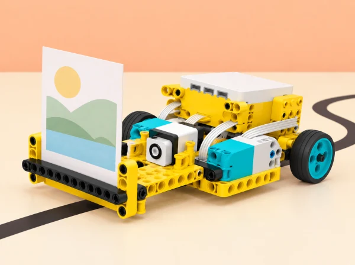

_La fira de prototips investiga necessitats reals sense donar per fet què necessita una persona._

## 🌱 Situació i intenció

Adaptació de la unitat *Invention Squad* per al context d’un centre educatiu valencià. Cada sessió conserva l’objectiu oficial i el tradueix en un repte, materials i criteris propis; quan una activitat del pla és híbrida o no requereix el hub, s’indica expressament en la sessió.

## 🎯 Aprenentatges i vocabulari

- Identificar barreres en una situació fictícia i convertir-les en requisits de disseny verificables.
- Construir alternatives de mecanisme i comparar-les amb una prova justa i el mateix criteri.
- Iterar un prototip a partir de les observacions de persones voluntàries, sense inferir necessitats individuals.
- Explicar què millora la solució, per a qui s’ha provat i quines barreres continuen presents.

## 📅 Seqüència didàctica · 6 reptes / 8–10 sessions

### **S1 · Interpretem tres senyals del museu ([Help!](https://education.lego.com/en-us/lessons/prime-invention-squad/help/), 60 min + neteja).**

#### Fase 1 · Activem i prediem

introduïu el repte amb una situació fictícia i recordeu separar observació de suposició.

#### Fase 2 · Explorem i construïm

en lloc d’interpretar un animal domèstic, fem servir una escultura pròpia de l’aiguamoll i una història de ficció en un espai triat (aiguamoll, museu o camí de l’horta). El sensor de color llig tres fitxes i activa primer una seqüència inicial de referència i després una història nova de tres sons, un per cada color. En un minut, cada parella anota tots els problemes possibles que podria tindre el personatge; no resol encara res. Per donar suport, restringiu l’escenari a un lloc i oferiu exemples de diferència entre fet observat i inferència; per ampliar, elimineu una interpretació evident i demaneu una descripció creativa del problema.

#### Fase 3 · Expliquem i registrem

compareu les llistes en parelles d’equips, expliqueu quins sons sustenten cada hipòtesi i redacteu un enunciat de problema. Després, els equips intercanvien «històries sonores»: creen tres sons propis perquè una altra parella definisca un problema diferent.

#### Fase 4 · Apliquem i millorem

establiu criteris i restriccions per a una solució (missatge interpretable, volum adequat, cap dada personal), trieu una necessitat definida, genereu almenys una resposta, reviseu-la segons els criteris i compartiu feedback positiu/constructiu. Deixeu temps per a guardar les peces.

#### Fase 5 · Comprovem i reflexionem

observeu si es defineix el problema amb detalls observables, si el grup separa definició del problema de la solució i si proposa criteris/restriccions pertinents. Autoavaluació privada en tres nivells: identificar un problema; afegir criteris i una idea; provar la idea contra els criteris i millorar-la. Acabeu amb conversa o presentació breu i feedback positiu i constructiu. **Evidència:** prediccions després de cada seqüència, llista inicial d’un minut, comparació de problemes, història pròpia de tres colors/sons, criteris, idea de solució i millora. Els sons no descriuen animals reals: són codis ficticis per practicar observació i definició de necessitats.

### **S2 · Dissenyem potes per a una prova de recorregut ([Hopper Race](https://education.lego.com/en-us/lessons/prime-invention-squad/hopper-race/), 30–45 min).**

#### Fase 1 · Activem i prediem

En parelles, munteu una base saltadora o caminadora SPIKE Prime i programeu-la perquè repetisca el moviment inicial. Definiu el criteri de la prova: arribar de la línia d’eixida a la meta amb rapidesa i sense bolcar.

#### Fase 2 · Explorem i construïm

Dissenyeu més d’un joc de potes articulades que empenyen el cos endavant; les rodes no poden fer de locomoció. Esbosseu les opcions abans de canviar el mecanisme.

#### Fase 3 · Expliquem i registrem

Anoteu longitud de pota o gambada, superfície, velocitat i nombre d’intents. Predigueu quin prototip serà més regular i què comptarà com a bolcada o arribada.

#### Fase 4 · Apliquem i millorem

Proveu cada prototip durant cinc minuts, amb tres recorreguts en la mateixa superfície. Compareu temps i regularitat, compartiu les opcions prometedores i feu una cursa final. Afegiu unes poques peces soltes al carril, repetiu i observeu com canvia la prova. Una altra parella aporta una observació constructiva abans del retest.

#### Fase 5 · Comprovem i reflexionem

**Evidència:** esbossos de diverses solucions, incloses les que no funcionen; taula de proves comparables; predicció revisada; retorn i justificació del disseny triat. Com a ampliació, calculeu velocitat mitjana en cm/s i useu distància = velocitat × temps per predir el recorregut després de 8, 16 i 24 segons; compareu predicció i mesura sense suposar velocitat constant en superfícies diferents. Prepareu una explicació breu de biomimètica: quina característica animal inspira el prototip i en què no és equivalent. Autoavaluació privada: prototip funcional, dos o més prototips o diverses iteracions amb millora; els nivells descriuen el procés i no es comparen entre persones.

### **S3 · Quin agafador serveix per a cada objecte? ([Super Cleanup](https://education.lego.com/en-us/lessons/prime-invention-squad/super-cleanup/), 30–45 min).**

#### Fase 1 · Activem i prediem

Predigueu quin agafador funcionarà millor amb peces diferents i per què. Recordeu que no hi ha un disseny millor per a tots els objectes.

#### Fase 2 · Explorem i construïm

En tàndem, construïu un controlador manual i dos agafadors: una pinça flexible per a objectes lleugers/flexibles i una boca partida per a peces més grans/pesants. Useu mostres grans i lleugeres, mai vidre ni objectes personals.

#### Fase 3 · Expliquem i registrem

Planifiqueu dues comparacions justes: (1) mides diferents amb pes semblant; (2) mides semblants amb pes diferent. Manteniu constants punt de partida, operador, temps i intents. Feu una prova modelada i després tres mostres pròpies de l’aula.

#### Fase 4 · Apliquem i millorem

Comproveu les prediccions, registreu el resultat de cada agafador i expliqueu l’efecte de la mida i la massa. Si cal bastida, useu una peça gran i una menuda; com a extensió, definiu criteris i redissenyeu un agafador abans de repetir les proves.

#### Fase 5 · Comprovem i reflexionem

**Evidència:** taula amb els dos factors separats, predicció, resultats, conclusió i retorn oral sobre avantatges i límits. Per a l’extensió matemàtica, assigneu pesos als criteris (seguretat, portabilitat, cost, facilitat) que sumen 100%, puntueu els dissenys i calculeu el resultat ponderat. Comproveu si una ponderació diferent canvia la recomanació: els pesos expressen prioritats del projecte, no una mesura objectiva universal. Presenteu una fitxa o exposició breu; no cal enregistrar vídeo.

### **S4 · Quatre causes d’una traçadora que no dibuixa ([Broken](https://education.lego.com/en-us/lessons/prime-invention-squad/broken/), 45–90 min).**

#### Fase 1 · Activem i prediem

Presenteu l’encàrrec: una traçadora XY de taula ha de dibuixar el plànol d’una exposició. El programa i el paper són propis del docent i el model contindrà errors segurs. Abans d’engegar-lo, llegiu i expliqueu cada pas del codi.

#### Fase 2 · Explorem i construïm

Repartiu la construcció en parelles: bastidor superior i mecanismes / base, carro del llapis i alimentació del paper. Inspeccioneu quatre símptomes sense activar el motor: roda d’alimentació Y absent, part superior mal fixada, engranatges invertits que avancen massa ràpid i carro del llapis fluix que distorsiona X.

#### Fase 3 · Expliquem i registrem

Per a cada símptoma, anoteu què no funciona, què hauria de passar i una reparació possible. Dibuixeu les causes candidates i trieu una comprovació que puga distingir-les. L’objectiu és trobar causes arrel, no rebre la llista de reparacions per endavant.

#### Fase 4 · Apliquem i millorem

Modifiqueu una cosa cada vegada, proveu sobre paper amb una figura de referència i documenteu el canvi. Compartiu les solucions i repetiu amb una millora pròpia. Per bastida, oferiu una safata de peces candidates o pistes sobre transmissió, fixació, alimentació i carro; no indiqueu la reparació. Per ampliar, dissenyeu una forma amb corbes, mesureu amplària i alçària del rectangle dibuixat i compareu-les amb l’espai útil calculat.

#### Fase 5 · Comprovem i reflexionem

**Evidència:** pseudocodi previ, taula error–causa–prova–reparació, dibuix inicial/final, mesura i retorn tècnic. Expliqueu per què una necessitat que supera l’espai útil requeriria actualitzar la màquina. Feu una conversa «mans fora»: una persona descriu símptoma i resultat previst, l’altra pregunta què s’ha provat i suggereix una comprovació. Atureu el motor abans de tocar engranatges, no forceu eixos i useu velocitat baixa.

### **S5 · Dissenyem una eina per a una tasca triada ([Design for Someone](https://education.lego.com/en-us/lessons/prime-invention-squad/design-for-someone/), projecte de 120+ min en diverses sessions).**

#### Fase 1 · Activem i prediem

La lliçó oficial connecta el procés de disseny amb pròtesis i funcions que una persona voldria poder fer. Investigueu tecnologies d’assistència i disseny universal sense simular discapacitats, diagnosticar ningú ni fabricar una pròtesi d’ús humà.

#### Fase 2 · Explorem i construïm

Definiu una tasca per a dues eines intercanviables de taula, per exemple agafar fruita grossa, subjectar una targeta o girar una maneta de maqueta. Delimiteu persona usuària, necessitat, criteris i restriccions. La necessitat pot ser fictícia o aportada voluntàriament per una persona adulta col·laboradora que puga modificar-la o retirar-se.

#### Fase 3 · Expliquem i registrem

Presenteu el procés i una història o recurs de disseny assistiu. Genereu diverses idees i seleccioneu-ne dues. Per donar suport, oferiu un mecanisme d’exemple i un repte concret; per ampliar, convideu una persona especialista només si està disponible. Useu peces fabricades només si el centre ja en disposa.

#### Fase 4 · Apliquem i millorem

Munteu les dues opcions i proveu-les amb el mateix protocol i càrrega. Registreu dades i un cas en què cada opció no funciona. Presenteu resultats, compareu els criteris i feu una iteració final a partir del feedback.

#### Fase 5 · Comprovem i reflexionem

**Evidència:** quadern amb necessitat, criteris/restriccions, idees, selecció, proves, dades, canvi i resultat. Avalueu identificació del problema, autonomia/creativitat i comunicació clara; feu autoavaluació privada i feedback entre iguals. Si hi ha col·laboradora real, convideu-la a valorar i modificar requisits voluntàriament; sense consultoria, anoteu que la necessitat no està validada. El producte és un prototip d’aula per a un objecte, no una pròtesi mèdica ni un dispositiu recomanat fora de classe.

### **S6 · Un ajudant per a la taula de preparació ([Design for You](https://education.lego.com/en-us/lessons/prime-invention-squad/design-for-you/), 45 min, híbrida).**

#### Fase 1 · Activem i prediem

Converseu sobre d’on venen les idees d’invents i quins problemes quotidians de l’espai de treball es podrien resoldre. Cada alumne tria una necessitat, com mantindre dreta una targeta, separar peces o ordenar etiquetes.

#### Fase 2 · Explorem i construïm

Dissenyeu individualment un ajudant d’escriptori. Feu una o dues rondes breus d’ideació, prototipatge i prova. No hi ha instruccions ni model final obligatori; podeu usar peces LEGO corrents o materials trobats. L’activitat híbrida no necessita SPIKE Prime, BricQ ni hub.

#### Fase 3 · Expliquem i registrem

Expliqueu la diferència entre prototip i model acabat. Presenteu el prototip a una parella i descriviu com heu definit la necessitat, quines idees heu provat i què heu mesurat. La parella dona feedback concret sobre una prova o millora.

#### Fase 4 · Apliquem i millorem

Anoteu com canviaria el disseny a partir del feedback. Dibuixeu una transformació futura a SPIKE Prime si és útil, però no cal construir-la ni motoritzar-la.

#### Fase 5 · Comprovem i reflexionem

**Evidència:** necessitat i criteri compartit, prototip inicial, mesura/prova, feedback rebut, esbós de revisió i autoavaluació. Comuniqueu com l’invent ha millorat l’espai; es pot fer oralment, amb text o dibuix. No és obligatori motoritzar-lo ni publicar fotos de casa o de l’aula.

## 🧰 Materials i preparació

SPIKE Prime i els seus motors per a les cinc lliçons del set, taula estable, targetes de paper, peces soltes, cartó i materials lleugers per a l’activitat híbrida final. La darrera sessió es pot fer sense cap set de robòtica; cap part no pressuposa BricQ Motion.

## 🎯 Evidències i avaluació

Carpeta d’equip: problema definit amb observacions, criteris i restriccions; dos prototips de locomoció amb tres registres per prova; taula comparativa de pinces; registre de depuració; fitxa de disseny col·laboratiu amb retorn de la persona usuària o constància que falta validar-lo; i esbós/prova d’ús de l’ajudant d’escriptori. La rúbrica observa si l’alumnat diferencia problema i solució, compara evidències amb els criteris, documenta una iteració i comunica una limitació. No es puntua si el robot «guanya» ni s’aprova un prototip per a ús real.

## ♿ Participació i inclusió

La participació de persones amb necessitats d’accessibilitat és voluntària i informada; no simulem una discapacitat amb venda o guants. Si no hi ha una persona consultora, analitzem barreres del context amb fonts fiables i marquem la validació com a pendent. Repartim rols de disseny, programació, prova i documentació.

## 🔗 Unitat oficial i traçabilitat

La seqüència adapta les sis entrades de la unitat LEGO Education [Invention Squad](https://education.lego.com/en-us/lessons/prime-invention-squad/): *Help!*, *Hopper Race*, *Super Cleanup*, *Broken*, *Design for Someone* i [*Design for You*](https://education.lego.com/en-us/lessons/prime-invention-squad/design-for-you/). Les cinc primeres especifiquen el set SPIKE Prime; la sisena és híbrida i permet peces LEGO corrents o materials reutilitzats, sense necessitat de cap hub. El context, els guions, les dades, el camp de proves, les activitats i la imatge són propis. Els muntatges i sensors es comproven amb el set disponible al centre.
