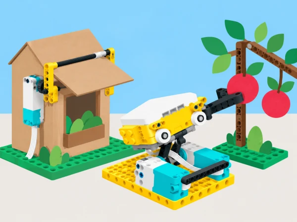

_Dos reptes d’enginyeria redissenyats per al centre i per als materials SPIKE Prime disponibles._

## 🌱 Situació i intenció

Una cooperativa escolar prepara una mostra de prototips sobre consum responsable i agricultura de proximitat. La seqüència adapta dos reptes oberts oficials de LEGO Education que combinen programació SPIKE Prime amb les peces i l’experimentació de BricQ Motion Prime. El primer investiga com automatitzar una acció quotidiana per reduir l’impacte ambiental; el segon aplica forces i disseny iteratiu a una eina de collita que no danye fruita. El context s’inspira en habitatges i horts de la Comunitat Valenciana, però els prototips només funcionen en maquetes: no controlen habitatges reals ni toquen aliments o cultius.

## 🎯 Aprenentatges i vocabulari

- Definir una regla d’automatització domèstica simulada amb entrada, condició, eixida i cancel·lació.
- Construir i comparar mecanismes de collita amb formes de fruita simulades i càrregues lleugeres.
- Relacionar forces d’interacció amb observacions qualitatives sense afirmar mesures que el set no capta.
- Provar alternatives, revisar el disseny i comunicar què no es pot concloure sobre una casa o collita reals.

## 📅 Seqüència didàctica · 7–8 sessions

Dediqueu tres sessions a [Smart House: Go Green](https://education.lego.com/en-us/lessons/spike-and-bricq-motion-prime-combined/spike-prime-and-bricq-motion-prime-smart-house-go-green/) i tres a [Protect Our Produce](https://education.lego.com/en-us/lessons/spike-and-bricq-motion-prime-combined/spike-prime-and-bricq-motion-prime-protect-our-produce/); reserveu una sessió de galeria i, si cal, una d’ampliació. En tots dos reptes, establiu criteris d’èxit abans de construir, useu idees d’exemple com a inspiració i registreu proves per poder defensar les decisions amb evidències.

### **S1 · Casa intel·ligent: detectar impactes i definir criteris.**

#### Fase 1 · Activem i prediem

Activeu coneixements previs amb la pregunta «quins hàbits de casa depenen d’una decisió que podríem automatitzar?». Anoteu maneres en què una llar pot afectar el medi, com l’ús d’energia o d’aigua, i distingiu les observacions generals de les dades que el prototip no mesurarà.

#### Fase 2 · Explorem i construïm

Reviseu les idees del brief i trieu un problema acotat: un ventilador que s’apaga quan no hi ha ningú, una finestra que s’obri o tanque amb una condició meteorològica, o una proposta conceptual que use el vent per moure un element. La classe en selecciona una per prototipar.

#### Fase 3 · Expliquem i registrem

Definiu dos o tres criteris observables: l’acció només s’activa amb les entrades acordades, el mecanisme torna a una posició segura i el model no es mou quan l’espai està buit. Registreu quines dades reals no es poden inferir d’una maqueta: consum elèctric, emissions o estalvi de la llar.

#### Fase 4 · Apliquem i millorem

Esbosseu dues idees de funció i compareu-les amb els criteris. Trieu-ne una per construir i expliqueu quin canvi faríeu si la primera proposta no poguera complir una de les condicions.

#### Fase 5 · Comprovem i reflexionem

**Evidència:** problema acotat, dos esbossos i criteris observables. El benefici ambiental és encara una hipòtesi: quina dada caldria mesurar en una casa real per comprovar-lo?

### **S2 · Casa intel·ligent: construir i programar una resposta condicional.**

#### Fase 1 · Activem i prediem

Predigueu què ha de passar quan hi ha presència i la targeta representa calor, i què ha de passar en els altres casos. Recordeu que el sensor de color llig una targeta: no mesura la temperatura de l’aula.

#### Fase 2 · Explorem i construïm

Construïu un ventilador de cartó mogut per un motor SPIKE o una finestra/persiana lleugera. Fixeu el panell al bastidor amb una frontissa o un eix estable. Useu el sensor de distància per representar presència i el sensor de color per llegir una targeta de condició.

#### Fase 3 · Expliquem i registrem

Programeu una condició composta i prepareu la matriu de quatre combinacions d’entrada amb l’eixida prevista. Si el sensor o la versió de l’app no admeten la combinació, representeu manualment la segona condició i etiqueteu-la com a simulació.

#### Fase 4 · Apliquem i millorem

Executeu les quatre proves i reviseu una que falle. Canvieu una sola variable del programa, la subjecció o el mecanisme. Com a ampliació, afegiu una tercera condició de temps o una targeta d’oratge i compareu la matriu ampliada.

#### Fase 5 · Comprovem i reflexionem

**Evidència:** maqueta, programa o esquema de control i matriu amb prediccions i resultats. Quines entrades heu mesurat amb sensors i quines heu simulat amb targetes o control manual?

### **S3 · Casa intel·ligent: comparar, argumentar i comunicar.**

#### Fase 1 · Activem i prediem

Reprengueu la matriu de quatre entrades i prediu quantes eixides coincidiran amb la versió revisada.

#### Fase 2 · Explorem i construïm

Repetiu les proves amb la mateixa disposició i registreu per a cada combinació l’entrada, l’eixida esperada i l’observada.

#### Fase 3 · Expliquem i registrem

Compteu les coincidències i argumenteu com la solució podria evitar una acció innecessària. Separeu el resultat observat del possible benefici ambiental, que no heu mesurat.

#### Fase 4 · Apliquem i millorem

Creeu un anunci breu per a una família fictícia: descriviu el funcionament, els criteris complits, el benefici com a hipòtesi i una limitació. Un altre equip pregunta què passa si canvia l’entrada i quina dada falta per afirmar que hi ha estalvi.

#### Fase 5 · Comprovem i reflexionem

**Evidència:** recompte de proves i anunci revisat amb el retorn d’un altre equip. No afirmeu estalvis d’energia o d’aigua que el grup no haja mesurat.

### **S4 · Collita delicada: forces i criteris de disseny.**

#### Fase 1 · Activem i prediem

Presenteu el repte: recollir una “fruita” d’una branca de maqueta sense danyar-la. Observeu que l’eina exerceix una força sobre el fruit i el fruit una força igual i oposada sobre l’eina.

#### Fase 2 · Explorem i construïm

Dibuixeu dues ferramentes possibles —pinça flexible, bressol o ganxo— i, si la dotació BricQ ho permet, considereu un accionament pneumàtic o un ressort. Compareu-les sense construir-les.

#### Fase 3 · Expliquem i registrem

Representeu parells de forces sobre cossos diferents per explicar la tercera llei de Newton: no es cancel·len entre si. Definiu “dany” per a la prova (deformació visible, caiguda o no poder traslladar el fruit) i manteniu constants alçada, massa aproximada, distància i zona de recepció.

#### Fase 4 · Apliquem i millorem

Trieu una proposta segons com acumula, reparteix o limita el contacte. Reviseu l’esbós per incloure un límit de tancament o una superfície que reduïsca deformacions.

#### Fase 5 · Comprovem i reflexionem

**Evidència:** dos esbossos, criteri acordat de dany i condicions comunes de prova. Quina observació permetrà comparar dissenys sense afirmar que heu mesurat la força?

### **S5 · Collita delicada: construir i programar una ferramenta.**

#### Fase 1 · Activem i prediem

Reviseu els criteris de dany i predigueu quina peça del mecanisme tocarà primer el fruit simulat.

#### Fase 2 · Explorem i construïm

Construïu l’agafador i fixeu-lo al motor SPIKE amb eixos i connectors estables. Amb BricQ Motion Prime, proveu els elements flexibles, ressorts o pneumàtics que incloga el kit. Sense BricQ, useu cartó ondulat, cinta de paper o escuma sobre una estructura SPIKE estable i registreu que és una alternativa parcial, no equivalent.

#### Fase 3 · Expliquem i registrem

Dibuixeu la connexió. Programeu dues ordres fàcils de distingir (per exemple, botó A obri i B tanca), moviments lents i repetibles, i una manera accessible d’aturar i reiniciar.

#### Fase 4 · Apliquem i millorem

Comproveu cada botó i la subjecció amb una bola de paper arrugada o una peça d’escuma. Atureu el hub abans d’ajustar cap element; no useu fruita real.

#### Fase 5 · Comprovem i reflexionem

**Evidència:** agafador, esquema de connexió i observació del contacte. El mecanisme queda estable i es pot aturar abans que la peça simulada es deforme?

### **S6 · Collita delicada: provar diverses formes i iterar.**

#### Fase 1 · Activem i prediem

Prepareu dues formes i mides de fruita simulada i prediu quina combinació serà més difícil de subjectar sense dany.

#### Fase 2 · Explorem i construïm

Proveu almenys dos dissenys amb les dues formes o mides i feu tres intents per combinació. Registreu si agafa i reté la peça, si cau o es deforma i quant tarda el trasllat.

#### Fase 3 · Expliquem i registrem

Compareu els resultats i relacioneu el contacte amb la força de reacció. El sensor de color o el de distància no mesuren la duresa del fruit; descriviu les observacions com a qualitatives si no hi ha un sensor de força adequat.

#### Fase 4 · Apliquem i millorem

Modifiqueu una sola variable mecànica o de codi —amplària, pivot, material flexible, velocitat o recorregut— i repetiu els casos amb les mateixes condicions. Si cal, assigneu recorreguts diferents amb una selecció manual o una etiqueta llegible pel sensor, sense atribuir-li una mesura de duresa.

#### Fase 5 · Comprovem i reflexionem

**Evidència:** taula de proves abans/després amb tres intents per combinació. Trieu el disseny segons el conjunt de resultats, no segons el rècord d’un únic intent.

### **S7 · Galeria de dissenys i retorn.**

#### Fase 1 · Activem i prediem

Planifiqueu una mostra amb els dos prototips, el programa o esquema manual, la matriu de la casa i la taula de proves de collita.

#### Fase 2 · Explorem i construïm

Munteu una galeria on les persones visitants puguen provar l’agafador amb una fitxa de paper i llegir els criteris de cada repte.

#### Fase 3 · Expliquem i registrem

Expliqueu les decisions amb evidències: què fa cada prototip, quines proves ha superat i quina limitació conserva. Les persones visitants responen què és convincent i quina prova falta.

#### Fase 4 · Apliquem i millorem

Useu el retorn per revisar una conclusió o proposar una millora. Qui acaba abans pot comparar una segona condició per al ventilador o redissenyar la pinça per a una altra forma simulada.

#### Fase 5 · Comprovem i reflexionem

**Evidència:** presentació, retorn rebut i una millora futura justificada. Què podem concloure sobre les maquetes i què no podem afirmar d’una casa o collita reals?

## 🧰 Materials i alternatives

SPIKE Prime amb hub, motor gran o mitjà, sensor de distància i sensor de color per a la maqueta de casa; BricQ Motion Prime si el centre vol provar-ne els elements mecànics; cartó, cinta de paper, llapis, targetes de colors mates, regla i materials lleugers per a simular fruits (paper arrugat, boles d’escuma o peces grans). El set SPIKE Prime no inclou un sensor de temperatura ambiental: les condicions de clima es representen amb targetes. La situació es pot completar sense BricQ amb cartó i components SPIKE, però aquesta alternativa no reprodueix els materials ni totes les possibilitats físiques del kit BricQ.

## 🧪 Evidències, límits i seguretat

Carpeta de procés amb criteris i prediccions, esbossos alternatius, codi condicional, matriu de quatre entrades, taula d’iteracions de collita, retorn dels visitants i argument final. Valoreu la coherència entre problema, criteris, programa i proves; que la modificació responga a dades; i que l’equip separe allò observat d’allò que només suposa. No connecteu cap prototip a la xarxa elèctrica, no inferiu estalvi energètic d’una maqueta, no useu fruita ni branques reals i manteniu qualsevol moviment a baixa velocitat. Atureu el hub abans d’ajustar peces.

## ♿ Participació, accessibilitat i seguretat

Assigneu rols rotatius de muntatge, programació, observació i registre; permeteu que una persona contribuïsca amb un esquema o una predicció sense manipular el mecanisme. Feu totes les proves a baixa velocitat, atureu el hub abans d’ajustar peces i useu només càrregues de paper o escuma. Les targetes de clima i els fruits simulats no es presenten com a dades o materials reals.

## 🔗 Reptes oficials adaptats

La proposta adapta els dos reptes de LEGO Education [Prime Combined](https://education.lego.com/en-us/lessons/spike-and-bricq-motion-prime-combined/): [*Smart House: Go Green*](https://education.lego.com/en-us/lessons/spike-and-bricq-motion-prime-combined/spike-prime-and-bricq-motion-prime-smart-house-go-green/) i [*Protect Our Produce*](https://education.lego.com/en-us/lessons/spike-and-bricq-motion-prime-combined/spike-prime-and-bricq-motion-prime-protect-our-produce/). S’han contrastat els objectius, fases de disseny, idees d’exemple, condicions compostes, tercera llei de Newton, proves iteratives i reflexió del pla docent i els briefs públics. L’original declara SPIKE Prime, BricQ Motion Prime, dispositiu amb l’app SPIKE i un brief per grup; per això les alternatives de cartó ací identificades són adaptacions parcials de material i no equivalències. El context, les activitats, les explicacions, les dades, les imatges i els instruments d’avaluació són propis.
