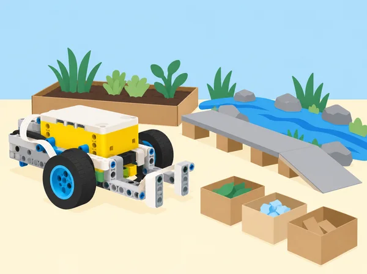

_El prototip representa una idea que s’ha d’investigar, provar i situar dins dels seus límits reals._

## 🌍 Repte i propòsit

Els equips trien una necessitat documentada de l’entorn, la descomponen en parts i desenvolupen un model programat que il·lustra una possible contribució. El producte final inclou una afirmació concreta sobre el problema, fonts i persones afectades consultades amb cura, esbossos, pseudocodi, maqueta SPIKE Prime, codi documentat, proves repetides, canvis després del feedback, anàlisi de l’impacte i presentació. Aquesta situació adapta el projecte final de 500 minuts de *Foundations of Physical Computing*, que ofereix sis àmbits: recursos naturals, transport, salut/STEM, fabricació, gestió pública/emergències i agricultura. Cada equip tria un repte delimitat dins d’un àmbit; no cal que tots els grups inventen robots mòbils ni que automatitzen una tasca.

El model és una representació escolar, mai una màquina preparada per operar en ecosistemes, hospitals, trànsit, incendis o explotacions reals. Cap prototip transporta persones, intervé en fauna/flora, pren decisions mèdiques, actua en una emergència o gestiona substàncies i càrregues perilloses. El treball se centra en definir bé el problema, usar maquinari disponible, recollir evidència proporcionada i explicar què faltaria per provar una solució fora de l’aula.

## 🎯 Resultats d’aprenentatge

- Investigar diverses necessitats possibles i justificar una elecció en base a fonts, viabilitat temporal, criteris i impacte social/ambiental.

- Descompondre el problema; planificar on fan falta motor, sensors, llums, sons, condicions, bucles i blocs propis, sense afegir tecnologia si no resol una necessitat.

- Construir i programar un prototip propi, depurar per parts, documentar les versions i incorporar feedback pertinent.

- Planificar proves repetibles amb resultats esperats i observats, descriure limitacions del sensor/mecanisme i no generalitzar des d’una sola execució.

- Treballar amb rols equilibrats en equips de 2–4, compartir decisions i deixar evidència del procés al diari d’enginyeria.

- Comunicar una proposta, la seua interacció persona–ordinador, efectes socials i ambientals, riscos no resolts i pròxima prova necessària.

- Avaluar el producte, el procés d’equip i la pròpia participació amb criteris coneguts des de l’inici.

## 🧭 Sis àmbits per triar el repte

L’equip pot triar qualsevol repte viable relacionat amb els àmbits oficials; les propostes següents són punts d’arrancada locals, no encàrrecs tancats. Abans de triar, compareu-ne l’interés, l’evidència disponible, els materials necessaris i les persones/entitats amb què caldria parlar. Si el tema tracta una necessitat d’un grup concret, no el definiu en nom seu: feu servir fonts públiques o una consulta voluntària, anònima i supervisada.

- **Recursos naturals i cura ambiental:** dissenyar una estació de triatge de residus nets de maqueta, comptar usos de recursos simulats o mostrar com es podria registrar una neteja d’un espai dibuixat. No es recullen residus en hàbitats ni es manipula fauna/flora; el comptador no identifica materials de manera universal.

- **Transport i logística:** moure fitxes entre punts d’una mediateca simulada, dissenyar una ruta de material escolar o explorar recorreguts lunars com a ficció científica. No es prova prop de trànsit, no es transporten persones i no s’afirma que el sensor garantisca evitar obstacles. Per a projectes marins, tot és en una maqueta seca; no s’introdueixen robots a l’aigua ni s’acosta l’equip a ecosistemes.

- **Salut, ciència i STEM:** crear un joc de seqüències, memòria o agudesa matemàtica amb diferents formats de resposta. No es mesura salut, capacitat cognitiva o diagnòstic; les tasques són lúdiques, modificables i sense classificació personal.

- **Fabricació:** simular una cadena de muntatge amb peces grans, fitxes de color, zona d’emmagatzematge i comanda fictícia; registrar errors de triatge i dissenyar una indicació de revisió humana. No es fabriquen productes destinats a consum ni s’usa maquinària real.

- **Administració pública i preparació davant d’incidències:** construir una maqueta que organitza informació pública fictícia, mostra un missatge preparat o ajuda a explorar rutes sobre un plànol inventat. No crea alertes, ordres d’evacuació, recerca/rescat ni instruccions que competisquen amb emergències oficials; en la Comunitat Valenciana, qualsevol conversa sobre inundacions/incendis remet a informació pública i protocols vigents revisats per la docent.

- **Agricultura i alimentació:** simular el moviment de caixes buides, comptar torns d’una tasca fictícia o mostrar dades d’humitat inventades per practicar condicions. No es controla reg real, no es decideix tractament d’aliments i no es manipulen pesos, eines ni productes químics.

## 🧰 Materials i organització

Set SPIKE Prime 45678 i dispositiu amb l’app SPIKE per parella; sensors, hub, motors i peces necessaris per a cada proposta; materials de maqueta lleugers (cartó, paper, cinta, targetes de colors mate, fitxes grans, tubs de paper i regles); ordinador/dispositiu per a recerca; diari d’enginyeria; rúbrica i calendari de sessions. No compartiu peces entre sets durant el muntatge; feu inventari ràpid a l’inici/final i registreu si falta material. Si el projecte necessita sensors externs, càmeres, transmissió a Internet, accessoris comercials o programari addicional, l’equip ha de redissenyar el prototip per al material disponible o marcar l’element com a proposta futura no provada.

Equips de 2–4 persones; ningú treballa tot sol en aquesta tasca. Rols rotatius possibles: recerca i fonts, disseny/muntatge, programació/proves, registre/comunicació. Els rols no assignen permanentment el codi a una sola persona: cada membre explica almenys un component i participa en una decisió. La docent actua de mentora mitjançant preguntes i fa revisions de fase; les revisions confirmen que l’equip pot continuar, no garanteixen que el model funcione en un ús real.

## 📅 Desenvolupament del projecte · quatre fases

### **Investiguem i delimitem · 2–3 sessions (100–120 min)**

#### Fase 1 · Activem i prediem

Feu una rotació breu per les sis propostes (cinc minuts de presentació per àmbit). Individualment, cada alumne anota dues preguntes o necessitats possibles sense revelar dades personals. Predigueu quines necessitats es poden investigar de manera segura i quines dades caldria consultar abans de proposar una solució.

#### Fase 2 · Explorem i construïm

Examineu fonts recomanades i verificables. En grup, genereu almenys tres problemes delimitats i compareu qui es veu afectat, què se sap, què encara és incert i quina acció queda dins de les possibilitats escolars. Escriviu una frase de problema (“A [context fictici/espai investigat] costa… perquè…; volem explorar si…”) i dues o tres idees de solució.

#### Fase 3 · Expliquem i registrem

Definiu una persona usuària com a perfil de disseny sense atribuir-li experiències que no s’han consultat. Registreu les fonts, les preguntes obertes, els efectes socials i ambientals possibles i els límits del que es pot afirmar.

#### Fase 4 · Apliquem i millorem

Analitzeu interacció humà–ordinador, biaix, accessibilitat, conseqüències imprevistes, privacitat i materials. Feu un primer càlcul de viabilitat: temps disponible, set, peces, sensors i dades. Si falta informació o hi ha risc de confondre maqueta amb aplicació real, ajusteu la pregunta o trieu un altre repte.

#### Fase 5 · Comprovem i reflexionem

Mostreu a la docent el problema, les fonts, la idea triada, l’efecte social/ambiental i els límits. **Evidència:** frase del problema, fonts consultades, dues o tres idees inicials i una justificació de la selecció.

### **Planifiquem el model i revisem el disseny · 2 sessions (100–120 min)**

#### Fase 1 · Activem i prediem

Recupereu la necessitat i els criteris acordats. Abans d’esbossar, cada membre dibuixa una idea i prediu quina entrada, acció i resposta observable podria resoldre una part del problema.

#### Fase 2 · Explorem i construïm

Feu esbossos des de dalt i de costat, marqueu dimensions i peces que es mouen, connectors/ports, punts d’entrada i eixida, llums/sons i llocs on el sensor pren una lectura. Escriviu pseudocodi i, quan ajude, diagrama de flux; descomponeu el programa en subcomponents o blocs propis.

#### Fase 3 · Expliquem i registrem

Definiu una funció mesurable per a cada component i què constitueix un resultat correcte. El pla explica com el sensor i el motor col·laboren; no és necessari usar-los tots si el repte es resol millor amb entrada manual, llum o so. Prepareu casos de prova abans de construir, incloent almenys un cas límit i un d’error.

#### Fase 4 · Apliquem i millorem

Demaneu feedback a dos companys: s’entén què intenta fer el projecte? quina part podria fallar o excloure algú? què funciona o resulta atractiu? Registreu cada comentari, si s’accepta o es rebutja, i la justificació. Després de la revisió docent, documenteu qualsevol canvi del disseny.

#### Fase 5 · Comprovem i reflexionem

Reviseu amb la docent l’esbós, el maquinari/programari, el pseudocodi, els criteris i el feedback. **Evidència:** esbós anotat, pseudocodi, casos de prova i registre de les decisions de disseny.

### **Construïm, programem i iterem · 3–4 sessions (180–200 min)**

#### Fase 1 · Activem i prediem

Trieu un subcomponent prioritari i formuleu què espereu que passe quan reba una entrada. Abans de construir, acordeu una aturada manual clara i les condicions inicials de la primera prova.

#### Fase 2 · Explorem i construïm

Construïu una prova mínima d’un sol subcomponent i programeu una resposta observable. Abans d’afegir funcionalitats, proveu si la base o el mecanisme es mou com s’espera i si la lectura del sensor és consistent en l’entorn previst.

#### Fase 3 · Expliquem i registrem

Documenteu la primera versió en una taula amb condicions inicials, predicció, resultat i observació. Integreu subsistemes d’un en un; comenteu blocs, anomeneu variables i proveu les condicions esperades i inesperades.

#### Fase 4 · Apliquem i millorem

Feu almenys dues iteracions justificades: una pot ser mecànica (estabilitat, agarre, alineació) i una altra de programació (llindar, ordre, bucle o condició). Canvieu una variable per prova sempre que siga possible. Si la prova falla, conserveu el resultat i decidiu si reviseu hipòtesi, mecanisme, sensor o criteri.

#### Fase 5 · Comprovem i reflexionem

La docent revisa codi, interacció, seguretat, registre i una iteració. L’equip només passa a la mostra quan pot demostrar una funció reduïda i explicar-ne els límits. **Evidència:** dues versions comparables i decisions justificades amb dades. L’èxit és el procés informat, no una automatització completa.

### **Presentem, avaluem i tanquem · 1–2 sessions (80–100 min)**

#### Fase 1 · Activem i prediem

Prepareu una presentació breu de 3–5 minuts amb necessitat, font principal, criteris, model i programa. Trieu una prova que funciona i una que ha fallat o queda pendent; predigueu quins límits o preguntes convé explicar amb més claredat.

#### Fase 2 · Explorem i construïm

Feu una demostració amb espai delimitat, velocitat baixa i aturada controlada. Si el prototip és inestable, presenteu un vídeo només del model o executeu la prova amb simulació en paper, explicant quin format s’ha utilitzat.

#### Fase 3 · Expliquem i registrem

Incloeu el feedback incorporat, els efectes previstos i els límits. Altres equips fan preguntes i donen una observació favorable, una pregunta i una proposta; cada equip anota quin comentari canviaria el disseny amb més temps.

#### Fase 4 · Apliquem i millorem

Avalueu el producte amb la rúbrica docent/equip, després el funcionament cooperatiu i finalment la participació individual. Useu les preguntes rebudes per concretar una millora possible, sense presentar-la com a resultat provat.

#### Fase 5 · Comprovem i reflexionem

Desmunteu els models, classifiqueu peces, feu inventari dels sets i registreu elements que falten o sobren. Cada persona pot completar una autoavaluació confidencial sobre contribució, feedback, temps i gestió de material, amb exemples del rol. **Evidència:** presentació, retorn rebut, rúbrica i inventari final.

## 🗂️ Documents del portafolis

- **Problema i recerca:** tres opcions considerades, criteris de selecció, frase del problema, fonts/autor/data de consulta i efectes socials/ambientals previstos.

- **Disseny:** esbossos, model del maquinari, ports/sensors/motors, pseudocodi, subcomponents, diagrama i requisits d’accessibilitat.

- **Construcció:** llista de materials, versions del model i del codi, fotos de la maqueta sense dades personals, comentaris i problemes trobats.

- **Proves:** criteris, casos, prediccions, lectures, resultats, repeticions, error/incertesa, decisions d’iteració i comparació amb una alternativa manual.

- **Comunicació i reflexió:** guió, preguntes/feedback, canvis incorporats, afirmació final proporcionada a les proves, limitacions i pròxim pas.

## 📊 Rúbrica transparent

Docent i equip valoren sis dimensions amb escala de tres nivells; el nivell mitjà significa que s’han complit els requisits principals, no és un judici sobre l’alumne. La rúbrica completa s’explica abans de triar el tema.

- **1. Pla i col·laboració:** 3 — diari complet des d’idees i recerca fins a decisions i obstacles; repartiment equitatiu, feedback cuidat i aportació de totes les persones. 2 — pla i registre de la major part del procés; repartiment generalment equilibrat. 1 — documentació escassa i tasques concentrades sense revisió.

- **2. Programa:** registre de per què convé programar i com s’usa llum/so, blocs propis, seqüències/bucles i condicions. 3 — codi original ben descompost, comentat i justificat, amb repetició/condicions adequades. 2 — codi funcional i explicable, amb una estructura reutilitzable. 1 — programa incomplet o sense estructura explicable. No es penalitza una alternativa manual/visual si és la millor solució justificada al problema.

- **3. Disseny d’enginyeria:** ús intencional i justificat de motors/sensors, estabilitat, interacció i iterations. 3 — model fa la funció delimitada, s’ha iterat amb proves i feedback i l’equip explica els canvis. 2 — hi ha funció demostrable i alguna revisió. 1 — model o iteracions sense relació clara amb criteris.

- **4. Procés de resolució:** 3 — defineix problema, compara opcions, investiga, fa proves, depura, revisa feedback i tria segons criteris. 2 — recorre la major part del procés amb evidència parcial. 1 — passa ràpid d’una idea a un model sense provar alternatives.

- **5. Artifact computacional:** 3 — tria les eines adequades, descompon, programa, depura i millora, i justifica la funció que resol el problema. 2 — construeix/programa i corregeix els errors principals. 1 — prototip i codi inicial sense correcció o argumentació suficient.

- **6. Comunicació:** 3 — mostra el model amb evidències en més d’un format, contesta preguntes i declara límits. 2 — comunica la proposta i la demostració de manera comprensible. 1 — la presentació no permet entendre el problema, el funcionament o les proves.

La rúbrica no exigeix incorporar cada suggeriment de feedback, un nombre fix de sensors o un motor quan no és pertinent. Valora la justificació i la qualitat de les proves en relació amb el repte que l’equip ha delimitat.

## ♿ Ètica, accessibilitat i seguretat

La docent examina abans els temes relacionats amb salut, dades personals, espècies protegides, emergències i transport. Useu només dades públiques, fictícies o anonimitzades; cap persona ha d’explicar una experiència mèdica, situació de desastre o necessitat personal. Demaneu permís abans de consulta; escolteu fonts d’usuari expertes sense convertir cap company en portaveu d’un grup. Les interaccions tenen alternatives (botó, instrucció visual, text, resposta manual), i el prototip no es fa passar per producte accessible acabat. Manteniu motors lents, trajecte de maqueta lliure, càrregues lleugeres i cap peça voladora; no introduïu aigua, menjar, animals, eines tallants, foc o accessos reals. Les simulacions d’emergència no alteren protocols escolars; s’usen missatges neutres de pràctica i la docent atura qualsevol activitat confusa.

## 🔗 Referent oficial i adaptació

Adapta el projecte final de 500 minuts de LEGO Education [*Foundations of Physical Computing*](https://assets.education.lego.com/v3/assets/blt293eea581807678a/blt1b4345f429fde833/64d3828c455bf62b71f9b840/Foundation_of_Physical_Computing_Course_SPIKE_3_2022.pdf?locale=en-gb). Conserva l’elecció entre sis àmbits (recursos naturals, transport —amb quatre opcions—, salut/STEM, fabricació, gestió pública/emergències i agricultura), la investigació i delimitació de dues o tres necessitats, quatre fases amb revisions, esbossos/ports/sensors/motors/subcomponents/llums/sons/pseudocodi, revisió entre iguals, programació i iteració, mostra final, sis criteris de rúbrica, autoavaluació i inventari. Adapta exemples que en la font proposen recollida oceànica, vehicles mèdics o de desastre a models segurs de taula; no reprodueix el manual LEGO ni afirma validar cap servei real.
