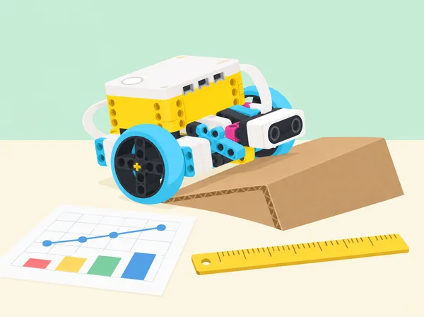
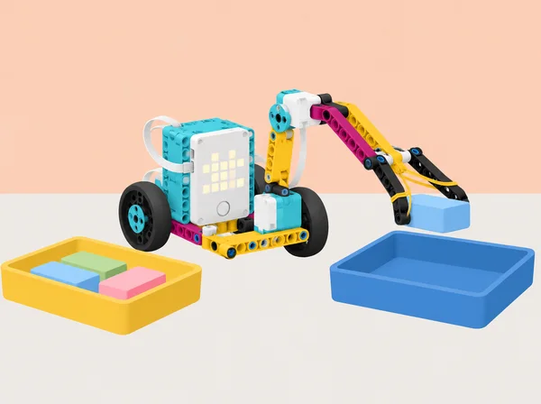

_Comparar prototips demana controls comuns, mesures útils i conclusions proporcionades a les proves._

## 🌱 Repte i intenció

La classe obri un laboratori d’enginyeria que investiga quan una màquina és útil, com les proves milloren un disseny i quines decisions tenen conseqüències per a les persones i el medi. La unitat adapta les vuit lliçons de *Testing and Evaluating Solutions* en el curs LEGO Education *Foundations of Physical Computing*. Cada pràctica formula criteris observables, manté condicions de comparació justes i separa dades mesurades d’interpretacions. Els models són prototips escolars, no dispositius mèdics ni recomanacions per a agricultura real.

## 🎯 Aprenentatges i vocabulari

- Definir una pregunta de prova, variables i criteris abans de comparar dos prototips.
- Registrar intents repetits amb unitats i condicions constants i descriure la variabilitat.
- Comparar una tasca humana i una robòtica sense convertir el resultat en una classificació general.
- Usar evidències per revisar un prototip i explicar quan les dades són insuficients.

## 📅 Seqüència didàctica · huit lliçons

### **Lliçó 1 · Provar prototips: el pont mòbil de l’escola (45 min).**

**Repte i criteris · 5 min:** cal travessar una separació entre dues taules amb una maqueta de carretera que puga obrir-se perquè passe una caixa alta de cartó. Acordeu abans dos criteris mesurables (per exemple, salvar un espai d’uns 20 cm i sostindre una càrrega de prova lleugera) i el límit de materials. **Ideació · 5 min:** mireu imatges o esquemes d’un pont mòbil, registreu una observació i dibuixeu almenys dues solucions; trieu-ne una amb una raó. **Prototip · 15 min:** amb peces SPIKE Prime i cartó, feu una primera versió; si incorpora moviment, planifiqueu el codi i assigneu rols de construcció/programació. **Prova i revisió · 15 min:** mesureu la separació, col·loqueu una càrrega comuna (fitxes o saquet de tela lleuger) durant un temps acordat i anoteu si el pont aguanta. Registreu la primera fallada; afegiu el requisit que el tauler es moga prou per deixar passar una caixa alta. Modifiqueu només la zona necessària, torneu a provar estabilitat i moviment, i depureu el codi en relació amb el mecanisme. **Comunicació · 5 min:** mostreu l’esbós inicial/final, una dada i el canvi que ha millorat el resultat. Evidències: criteris, esbossos, prototip, programa, taula abans/després i explicació del procés de disseny (definir, investigar, idear, triar, construir, provar, comunicar i redissenyar). L’avaluació mira com treballen junts estructura i codi, no que el primer pont tinga èxit. Useu taula estable, càrrega petita i mans fora de davall del pont durant les proves; si només hi ha paper/cartó, feu una maqueta de moviment manual sense motor.

### **Lliçó 2 · Persona i robot davant de la mateixa tasca (90 min).**

**Engage · 10 min:** observeu imatges de braços robòtics en fabricació, classificació o enviament; feu anotacions individuals sobre tasques, entorns i per què algú podria triar una màquina encara que una persona siga més ràpida. **Prepareu un protocol just · 10 min:** marqueu dos marcs de safata a uns 30 cm, poseu-hi tres blocs rectangulars iguals drets dins d’un marc i acordeu que es trasllada un bloc per vegada mantenint-lo dret; si cau, torna a l’origen. **Construiu i proveu · 35 min:** en parelles, munteu una mà robòtica d’obrir/tancar, comproveu-ne el recorregut i ajusteu un bloc de motor si cal. Cadascú fa tres intents amb el gripper i tres amb la mà pròpia. En una tanda una persona transfereix i l’altra cronometra/registra; canvieu rols i repetiu. Anoteu els sis temps, caigudes i observacions per parella i mètode, sense eliminar cap intent. **Analitzeu · 20 min:** calculeu mitjana o rang, feu un gràfic comparatiu i redacteu una afirmació basada en les dades: en aquesta tasca, en aquestes condicions, quin mètode ha estat més ràpid o constant? Afegiu una situació diferent on una persona puga adaptar-se millor. **Comuniqueu i avalueu · 15 min:** compartiu una gràfica i una limitació (disseny del gripper, aprenentatge, nombre de proves, escala); discutiu supervisió, accessibilitat, seguretat i qualitat. Evidència: protocol constant, dades completes, gràfic i conclusió condicionada, no un rànquing de capacitats humanes. Tasca neutral amb peces, sense demanar que ningú represente una discapacitat ni registrar dades personals; qui no vulga fer el moviment pot assumir programació, cronometratge o anàlisi.

### **Lliçó 3 · Comparar pinces i agafadors (90 min).**

**Pregunta d’enginyeria:** quin tipus de gripper convé per a cada objecte i quins efectes socials té automatitzar la recollida? Observeu imatges de braços en classificació i neteja, i anoteu avantatges i costos possibles (seguretat, temps, manteniment, inversió i canvis en les tasques laborals). En parelles, dissenyeu dues terminacions diferents per al mateix braç SPIKE Prime (per exemple pinça suau i pala ampla) i una comparació manual amb la mateixa ruta. Abans de construir, definiu un protocol i una matriu d’objectes nets i segurs: una forma rígida regular, una peça ampla i plana i una peça lleugera que es puga deformar; mesureu o registreu dimensions i massa aproximada. Manteniu constants distància, orientació inicial i safata. Cada mètode té tres intents per objecte; una caiguda torna al punt d’origen i també compta. Registreu èxit, caigudes, temps i marques/deformació; no feu servir residus reals ni objectes fràgils o biològics. Presenteu dades en taula o gràfic i justifiqueu amb proves quin agafador és més ràpid, més fiable o menys agressiu per a cada classe d’objecte: pot no haver-hi un únic guanyador. Proposeu un canvi de disseny o programa que puga millorar el cas més feble i expliqueu a qui beneficiaria i quina limitació conserva. **Evidència:** esbossos, criteris, dades de tots els intents, gràfic, afirmació amb una dada i balanç de conseqüències positives/negatives. Autoavaluació sobre si l’argument es recolza en evidència i si s’ha escoltat feedback. No es prova amb persones, aliments ni residus reals; el prototip no és una eina de neteja operativa.

_Per comparar dos agafadors, manteniu constant el trajecte i registreu cada intent, incloses les caigudes._

### **Lliçó 4 · Tasques repetitives, potència i precisió (90 min).**

**Engage:** parleu de tasques repetitives i d’exposició a riscos; l’activitat és observacional, ningú no ha de mantindre una postura o repetir gestos corporals. **Explore:** construïu una base SPIKE Prime mòbil, mesureu la circumferència de les rodes i prediu distància a partir de rotacions; registreu rotacions, potència i distància real. Aclariu que el control «speed» de l’app ajusta potència del motor, i contrasteu si el recorregut teòric per volta canvia amb la potència o si canvia sobretot la precisió real. Repetiu a 100%, 60%, 30% i 10%, mantenint recorregut, bateria, superfície i posició inicial. Proveu el sensor de força com a topall; a potència baixa pot faltar força per a activar-lo, cosa que cal anotar com a límit. **Extensió de repetició:** fixeu un marcador en paper gran, redissenyeu-ne el suport i programeu una seqüència avant-enrere-avant perquè dibuixe el mateix traç diverses vegades. Compareu coincidència de les línies a cada potència, ajusteu-ne una variable i estimeu l’error. Eviteu que la tinta travesse el paper o arribe a terra. **Explain:** feu un gràfic distància/rotacions/potència i discutiu factors que alteren la precisió. **Evaluate:** justifiqueu amb dades per què un robot pot convenir per a una tasca repetida i quines condicions humanes (supervisió, manteniment, accessibilitat, criteri i qualitat) continuen sent necessàries. Evidència: circumferència mesurada, taula de prova, gràfic, traços superposats i conclusions prudents; el programa no mesura energia ni substitueix un estudi de seguretat laboral.

### **Lliçó 5 · Gir, velocitat i precisió (90 min).**

Comenceu amb una demostració corporal opcional sense contacte: dues persones amb una vara lleugera poden representar el centre i les rodes; qui preferisca pot usar fletxes i peces sobre la taula. Identifiqueu gir de punt (rodes en sentits oposats), pivot (una roda parada) i arc (ambdues en el mateix sentit a velocitats diferents). En grup, programeu una base SPIKE de dues rodes per a cada tipus; predigueu trajectòria i amplada d’espai necessària, mesureu angle aproximat i desviació respecte a una cantonada marcada. Repetiu tres vegades amb baixa i alta potència mantenint superfície, rodes, càrrega, posició inicial i bateria; mostreu variabilitat, no només la prova més bona. Dissenyeu després un recorregut propi amb obstacle lleuger, decidiu on convé cada gir i demaneu a un altre equip una observació concreta. Reviseu un únic valor, citeu qualsevol codi o idea que hàgeu reutilitzat i anoteu de qui prové. Evidència: dibuix dels tres girs, programa comentat, taula d’angles/desviacions i justificació de la ruta. No convertiu graus de motor en angle garantit sense calibratge; autoavaluació de cooperació, prova repetida i feedback incorporat.

### **Lliçó 6 · Pujada, dades i energia potencial (90 min).**

**Engage · 10 min:** compareu dues rodes unides per eix en superfície plana i en una rampa baixa; prediu com canvien moviment i velocitat, i repetiu amb pendent major. **Explore · 35 min:** mesureu la massa del vehicle i el desnivell de la rampa de cartó; construïu el model SPIKE de pujada i programeu un ascens autònom. Repetiu per a diverses inclinacions, guardant potència del motor, temps, si arriba a dalt i dades del sensor del hub. Observeu al gràfic la inclinació i potència a mesura que la base puja; relacioneu inici, tram pla i baixada amb la traça i repetiu per veure variació. **Explain · 15 min:** cada equip explica què representen les línies, per què el sensor pot no marcar zero i què pot causar una corba inicial en la potència. **Elaborate · 20 min:** calculeu per a cada desnivell l’estimació d’energia potencial gravitatòria *Eₚ = m·g·h* i representeu-la en un gràfic; compareu l’estimació amb la resposta real del model sense dir que el sensor ha mesurat energia. Manteniu massa i superfície constants; si no puja, separeu hipòtesis de tracció, càrrega, inclinació i potència. **Evaluate · 10 min:** redacteu què ha canviat en les dades quan ha pujat, una incertesa de mesura i una millora. Useu rampa recolzada en una base plana i estable, no poseu pesos damunt del robot i manteniu mans fora de la seua trajectòria.

### **Lliçó 7 · Dissenyar per a una necessitat (90–135 min).**

**Marc ètic:** partim del repte oficial sobre una pròtesi, però no simulem una discapacitat, no demanem que ningú es pose l’aparell i no afirmem que una maqueta servisca a una persona. Investigueu amb fonts o relats públics seleccionats pel docent com el codisseny, els materials, el confort i el control intervenen en dispositius assistius; ningú no està obligat a compartir experiència pròpia. En equip, feu pluja d’idees per a un escenari fictici d’interacció amb un objecte de maqueta (mà de suport de taula que sosté una targeta, o agafador fix que obri una capsa gran), genereu almenys tres solucions, compareu pros/contres i trieu-ne una amb criteris. Esbosseu, redacteu pseudocodi o diagrama de flux i distribuïu treballs; construïu un mecanisme SPIKE que no s’acoble al cos i proveu-lo amb diverses formes lleugeres. Registreu cada iteració amb criteri, prova i canvi. Una altra parella dona feedback preguntant i descrivint la maqueta, sense reconstruir-la ni programar-la per vosaltres. Presenteu què resol, què no, com s’allibera manualment i què requeriria converses amb persones usuàries, personal clínic/rehabilitador i proves especialitzades. Evidències: idees alternatives, criteris, esbós, pseudocodi, proves i presentació. És una maqueta escolar de baixa força, mai un producte mèdic ni una recomanació d’ús.

### **Lliçó 8 · Professions de salut, agricultura i recursos naturals (90 min).**

**Preparació docent:** compartiu imatges o targetes pròpies d’ocupacions i fonts actuals sobre formació/tasques a la Comunitat Valenciana; no atribuïu al context local estadístiques o llicències d’un altre país. **Engage · 10 min:** classifiqueu ocupacions entre ciències de la salut i agricultura, alimentació i recursos naturals; distingiu lloc de treball, feina concreta i família professional, i connecteu-les a proves, disseny assistiu, energia, materials i sensors tractats en la unitat. **Explore · 30 min:** grups de quatre investiguen ocupacions conegudes i una que no coneixien; anoten tasques, competències, entorn, itinerari/acreditacions i una font datada. Si les fonts ofereixen perspectives d’ocupació, registreu any i territori; si no, deixeu-ho en blanc. **Model · 20 min:** construïu una representació visual amb peces o cartó d’una via professional i expliqueu com diverses feines cooperen per a una necessitat concreta (per exemple, producció hortícola sostenible o tecnologia de rehabilitació, sense dades de salut personals). Prepareu una presentació d’un minut. **Explain · 15 min:** cada equip presenta; el públic pregunta quines feines hi ha, què comparteixen i què és propi d’una ocupació. **Elaborate · 10 min:** feu una xarxa de paraules de cinc minuts sobre una família i intercanvieu-la; afegiu una feina nova descoberta. **Evaluate · 5 min:** reflexió individual privada sobre interessos/habilitats i observació docent de la qualitat de les fonts i les connexions entre rols. Evidència: graella amb citació/data, model, presentació i xarxa; compartir interessos és voluntari.

## 🧰 Materials i controls

Set SPIKE Prime 45678, hub, dos motors, sensor de força si es prova l’aturada, app SPIKE i els models de Driving Base/Going the Distance; cartró, regle, paper quadriculat, fitxes lleugeres, safates i quadern de dades. Mesureu només allò que l’instrument pot observar: distància, temps, encerts, massa i alçada quan hi haja balança/regle. Les dades d’energia són estimacions amb supòsits explícits. El sensor de força no és una cèl·lula de càrrega calibrada i el sensor de distància no mesura pressió, duresa ni força.

## 🧪 Evidències i avaluació

Recolliu els criteris inicials, esbossos, taules de proves, mesures comunes, programes, registre de modificacions, gràfic de pujada, comparació persona/robot i presentació de la maqueta d’agafador. Valoreu el control de variables, la repetició d’intents, la lectura de dades, la interpretació proporcionada i la capacitat d’anomenar incerteses. Autoavaluació de col·laboració, temps i cura dels materials; coavaluació que demana una dada favorable, una limitació i una prova futura.

## ♿ Accessibilitat, ètica i seguretat

Permeteu participar des de rols de muntatge, codi, mesura, anàlisi o comunicació, sense exigir moviments repetitius a l’alumnat. La comparació humà/robot tracta adequació d’una tasca concreta i no de valor o capacitat de les persones. Les pròtesis es tracten amb llenguatge respectuós, sense simulacions de discapacitat ni testimonis personals obligatoris; no es prova cap mecanisme sobre el cos. Manteniu càrregues lleugeres, rampa baixa i prototips aturats mentre s’ajusten.

## 🔗 Referent oficial i adaptació

Adapta les huit lliçons de *Testing and Evaluating Solutions* del curs [*Foundations of Physical Computing*](https://assets.education.lego.com/v3/assets/blt293eea581807678a/blt1b4345f429fde833/64d3828c455bf62b71f9b840/Foundation_of_Physical_Computing_Course_SPIKE_3_2022.pdf?locale=en-gb): *Testing Prototypes*, *Human vs. Robot*, *Comparing Robotic Grabbers*, *Repetitive Tasks*, *Turns, Speed, & Accuracy*, *Uphill Climb*, *Mini-Challenge: Design for Someone* i *Connecting to Careers: Health Science, Agriculture, Food, & Natural Resources*. Conserva la progressió de provar, comparar, mesurar i iterar, la relació entre velocitat i precisió, els girs, la pujada amb gràfiques i el repte de mà programable; adapta la càrrega a proves escolars segures i explicita els límits d’ús del prototip.
