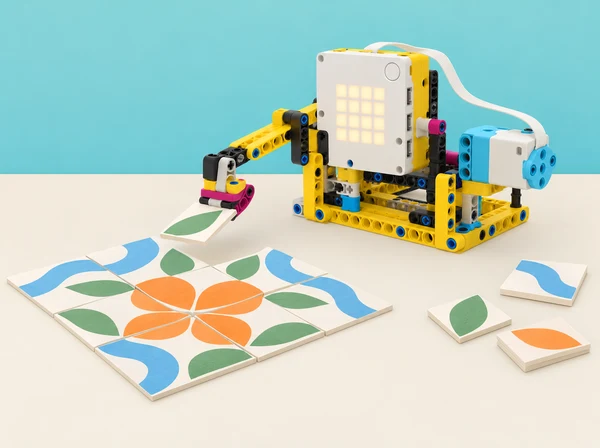

_Un bucle fa que una mateixa acció es repetisca; el comptador i la condició determinen quan toca parar._

## 🌱 Repte i sentit

Una associació cultural de la comarca vol preparar per a la fira escolar un mosaic modular inspirat en séquies, bancals i formes vegetals de l’horta. Cada equip dissenya una petita màquina de taula que repeteix un moviment amb un motor SPIKE Prime: pot desplaçar un indicador, fer avançar una fitxa gran o assenyalar una casella cada vegada. El codi ha de produir un patró recognoscible, comptar les repeticions i acabar en el moment previst. No es tracta de reproduir una tècnica artesanal ni d’automatitzar treball manual real; és una maqueta computacional i artística.

Aquesta situació adapta la unitat 4 de Course 1, *Doing Reps with Loops*, de LEGO Education *Introduction to Python Programming*. La progressió tracta bucles comptats en *Warm Up Loop with Leo*, registre de repeticions i compte arrere en *Counting Reps with Leo*, ritme en *Dance Loop with Coach*, selecció condicional de moviments en *Setting Conditions for Yoga*, comportament persistent en *Infinite Moves*, creació de model/algoritme repetitiu en *Leading the Team with Loops* i millora amb feedback en *Ideas for Leading Your Team with Loops*. Es canvia l’exercici corporal per un procés de composició de mosaic, conservant els conceptes de control i seqüència.

## 🎯 Aprenentatges i vocabulari

- Identificar un patró d’instruccions repetides i substituir còpies literals per un bucle `for` quan el nombre de repeticions és conegut.

- Interpretar `range(n)` com un conjunt de n iteracions i predir quantes vegades s’executa el cos del bucle.

- Usar una variable comptadora per registrar repeticions, mostrar un recompte i construir una seqüència de compte arrere sense confondre el valor mostrat amb l’índex del programa.

- Comparar un moviment repetit amb pausa fixa i un patró rítmic; documentar temps i diferències entre ordre i moviment físic real.

- Seleccionar una seqüència segons una condició explícita de disseny (p. ex. tipus de fitxa o patró acordat), i provar els dos camins d’eixida.

- Explicar per què un bucle infinit no té finalització pròpia, definir-ne una condició d’eixida o un mecanisme d’aturada manual i no executar-lo sense supervisió.

- Descompondre una composició repetitiva en estructura, nombre de mòduls, ordre, pausa i reinici; usar un cicle de disseny propi.

- Oferir feedback sobre el comportament i el codi amb criteris observables i registrar com una modificació afecta la repetició.

**Iteració:** una volta del cos del bucle. **Comptador:** variable que registra quantes voltes o elements s’han processat. **Bucle comptat:** repetició amb una quantitat coneguda d’iteracions. **Condició:** expressió que pot resultar vertadera o falsa. **Bucle infinit:** repetició que no acaba mentre no s’interrompa. **Patró:** ordre que es reconeix perquè alguns elements es repeteixen.

```python
# Exemple de Python general: genera una llista de passos previsibles
for index in range(4):
    print("col·loca la fitxa", index + 1)
```

El codi sols imprimeix text i no controla SPIKE Prime. Per a moviment, pausa, matriu del hub i parada, adapteu la sintaxi a l’API Python de l’app instal·lada; les versions de SPIKE poden diferir. Confirmeu ports i velocitats amb el model immobilitzat abans d’executar-lo a la pista.

## 🧰 Materials i preparació docent

Un SPIKE Prime 45678 per equip, hub carregat, un motor mitjà i peces Technic per a un mecanisme de baixa força i recorregut curt, plataforma estable, fitxes grans planes de cartó o paper, quadrícula impresa, retoladors, cinta de paper, regle, diari d’enginyeria i dispositiu amb SPIKE Python i consola. El motor només mou un indicador o empeny una fitxa lleugera per una canaleta oberta; no s’usa eina de tall, pinça de força ni material menut. El mural final es pot completar amb peces de paper sense mecanisme.

Definiu límits de velocitat i angle, topalls mecànics i espai segur perquè l’accessori no caiga de la taula. Cada equip tria un mòdul gràfic senzill (per exemple, alternança de dues formes o seqüència de tres colors) i una forma d’entrada manual. Prepareu codi de demostració amb un `for` curt, un comptador, una condició i un exemple de bucle infinit només per a lectura en paper. Expliqueu que qualsevol codi que continua sense pausa pot congelar l’app o repetir moviment: la demostració d’infinit es traça mentalment o s’executa sense motors, i la professora manté accés a parar el programa.

Rols rotatius: lectura/escriptura Python, construcció segura, registre i revisió de patrons. Acordeu com es representa el pas real del motor: una fitxa moguda, una llum o una anotació. Si no es disposa de motor, useu una tira de paper amb marcadors per simular la mateixa lògica.

## 📅 Seqüència didàctica · set lliçons

### **Lliçó 1 · Quatre repeticions, una instrucció (45 min).**

**Activació (7 min):** presenteu una tira amb quatre caselles i demaneu a l’alumnat com descriuria el mateix gest de col·locar una fitxa quatre vegades. Compareu quatre línies idèntiques amb “repeteix quatre voltes”. **Model (10 min):** feu traça en paper d’un `for index in range(4)` amb una ordre d’eixida; compteu iteracions començant per zero i diferencieu índex de número de fitxa visible. **Programació (18 min):** escriviu un programa SPIKE simple segons l’API local perquè un indicador faça un moviment curt, torne i pause quatre vegades. Comenceu amb actuador immobilitzat o desconnectat; després executeu amb angle limitat i velocitat baixa. **Validació (7 min):** l’equip anota el nombre esperat i el nombre observat; si el motor es mou contínuament, pareu i comproveu la indentació, el rang i la crida. **Eixida (3 min):** dibuixeu el flux d’una iteració i expliqueu què passa en acabar la quarta.

### **Lliçó 2 · Comptar fitxes i fer compte arrere (45 min).**

**Problema (5 min):** com sap l’operador quantes caselles del mosaic queden? **Variables i recompte (12 min):** representeu una seqüència de cinc fitxes amb comptador que augmenta; prediu els valors abans d’executar. **Comptador i eixida (18 min):** modifiqueu el programa perquè cada iteració actualitze el nombre col·locat i el mostre a consola o a la matriu si la funció local està disponible. Creeu una segona versió amb compte arrere des del nombre total fins a zero. Distingiu el recompte de cicles del sensor: la seqüència no detecta per si sola que una fitxa s’ha mogut correctament. **Proves de frontera (7 min):** proveu 1, 0 i 5 iteracions en simulació; reviseu si zero repeticions deixa el programa en un estat clar i si l’últim missatge és “acabat”. **Tancament (3 min):** descriviu un error *off-by-one* i com la traça l’ha fet visible.

### **Lliçó 3 · Ritme de passos i pauses (45 min).**

**Escolta/observació (6 min):** feu una seqüència no sonora amb palmell sobre la taula o targetes, i una versió lenta i una ràpida. La participació corporal és opcional; també es poden ordenar targetes. **Planificació (8 min):** convertiu un patró A-B-A en instruccions temporitzades. Pregunteu què es repeteix i què canvia en cada volta. **Implementació (18 min):** programa una sèrie de moviments curts amb pauses explícites; proveu amb el motor sense càrrega primer. Si la versió d’app no permet la funció de pausa prevista, feu una versió amb observació manual entre ordres i identifiqueu la limitació. **Comparació (8 min):** mesureu el temps total de dues seqüències amb mateixos moviments però pauses distintes; compareu durada prevista i real. **Reflexió (5 min):** identifiqueu quina part de la coreografia depén del bucle i quina del valor de cada moviment.

### **Lliçó 4 · Si la fitxa és d’un tipus, canvia el patró (45 min).**

**Regla desconnectada (8 min):** definiu una condició visible sense dependre només del color: forma circular → seqüència A; forma quadrada → seqüència B. Els equips classifiquen targetes i descriuen la decisió “si… altrament…”. **Flowchart (8 min):** dibuixeu entrada manual, condició, dues branques i punt de reunió. **Programa i traça (17 min):** implementeu les branques a Python amb una variable triada en codi o confirmació manual; cada branca conté un patró curt de bucle. No afegiu sensor: l’objectiu és comprendre el control, no fer veure que el robot identifica formes. **Casos de prova (8 min):** executeu cada condició i un valor no previst; anoteu quina branca s’activa i quina resposta ofereix el programa a l’entrada desconeguda. **Sortida (4 min):** expliqueu per què el codi no ha de dependre d’una regla visual no especificada.

### **Lliçó 5 · Repetir fins que algú ature: bucle infinit (45 min).**

**Comparació (7 min):** mireu un fragment finit amb `range(3)` i un d’infinit teòric com `while True`. Sense executar el segon, descriviu quin té eixida automàtica. **Usos i riscos (10 min):** discutiu casos en què el codi podria esperar una interacció constant i per què cal una condició de parada, pausa segura i control manual. **Laboratori en paper (15 min):** traceu fragment infinit en una graella, localitzeu si existeix un canvi a la condició i afegiu un criteri de parada (comptador màxim, botó o estat explícit). Si es mostra en editor, és només sortida textual sense motors/connectivitat; mai es deixa el bucle executant sense supervisió. **Model de moviment (8 min):** proposeu com seria una “mostra contínua” del mosaic amb indicador que alterna; expliqueu quin mecanisme podria trencar-se i com es comporta el programa en pausa. **Tancament (5 min):** cada alumne escriu una regla per evitar moviment persistent no intencionat.

### **Lliçó 6 · Liderar un equip amb un patró propi (90–120 min).**

**Encàrrec (10 min):** dissenyeu un mòdul per al mosaic de la fira que use almenys una repetició i comunique clarament quan s’ha acabat. Pot moure un indicador, alternar dues fitxes o fer avançar un marcador; no ha d’emular postures físiques ni obligar persones a fer exercicis. **Exploració d’idees (12 min):** cada membre fa un esbós; l’equip tria una regla amb criteris de llegibilitat, nombre de peces, repeticions i estabilitat. Feu timeline/flowchart amb una iteració ampliada i marca de parada. **Construcció (20 min):** creeu suport i topalls amb peces de la dotació, de manera que el moviment no arrossegue el hub ni deixe caure fitxes. **Programa (20 min):** dividiu en inici, repetició de mòdul, recompte/estat final i retorn a posició inicial. Useu `for` si el total és conegut; justifiqueu qualsevol altra estructura. Comentaris expliquen el patró triat i el mecanisme de parada. **Proves (18 min):** feu un intent amb 1, 3 i el total pactat, primer sense fitxa i després amb càrrega lleugera. Anoteu cicles previstos/observats, desalineació, caigudes i temps; canvieu una única peça o valor per iteració. **Presentació (10–20 min):** cada equip mostra com es llig el codi i quin canvi ha fet més fiable el patró. Rols de portaveu rotatius perquè qui no programa habitualment també comunique.

### **Lliçó 7 · Feedback per millorar el mosaic (30–45 min).**

**Preparar evidències (7 min):** els autors exposen diagrama, programa, patró acabat, un resultat repetit i una pregunta. **Revisió (10 min):** una parella externa segueix el pseudocodi i observa un cicle complet; no canvia el codi ni reconstrueix el model. La pauta pregunta: es pot predir el nombre de moviments? l’aturada és visible? el ritme i el recompte concorden? **Feedback (5 min):** formuleu una observació, una pregunta i una suggerència concreta. Els autors poden demanar aclariment. **Iteració (12 min):** trieu una millora, registreu per què i repetiu el cas amb les mateixes condicions. **Reflexió (3–11 min):** compareu dades abans/després, indiqueu quin punt no es pot resoldre amb el temps disponible i valoreu la col·laboració sense comparar persones.

## 🧪 Evidències, avaluació i producte

El portafolis conté patró inicial, descomposició, traça de `range`, taula de comptador i compte arrere, cronologia del ritme, diagrama de branques, anàlisi escrita de bucle infinit, comentaris Python, disseny mecànic, casos 0/1/n, resultats repetits, feedback i registre d’una iteració. El producte final és un mòdul de mosaic de taula i una nota de programa que explica quantes voltes s’executa, què varia, quan finalitza i com s’atura si hi ha una incidència.

Quatre criteris: **raonament de repetició** (prediu quantitat i traça un bucle); **comptador/condició** (actualitza i mostra un recompte coherent, interpreta ambdues branques); **disseny segur** (limita repeticions i moviment i incorpora finalització); **prova/reflexió** (contrasta resultat, documenta feedback i millora una causa). Nivells: amb modelatge, amb suport, autònom i transferit amb justificació. La qualitat visual del mosaic no substitueix l’evidència de control del programa.

## ♿ Inclusió, seguretat i sostenibilitat

Oferiu bucles com a targetes manipulables, traça en taula, `for` en pseudocodi i oportunitats iguals per a construir, programar i documentar. El patró s’explica amb forma, posició i text, no sols amb color o ritme sonor. Feu pauses entre assajos; els sons són opcionals. El mecanisme usa baixa potència, recorregut limitat i fitxes grans; mans fora de parts mòbils i cablejat mentre funciona. No executeu bucles infinits amb motors ni deixeu equips funcionant sols. Reutilitzeu paper i cartó per a les peces decoratives i recicleu els materials al final.

## 🔗 Referent oficial i decisions d’adaptació

Adapta la unitat 4 *Doing Reps with Loops* del curs LEGO Education [*Introduction to Python Programming · Course 1*](https://assets.education.lego.com/v3/assets/blt293eea581807678a/blt834b554cdaa246f7/6584064fd082f7672425e7ea/File_1_Units12345_Intro_to_Python_Course_TG_Course.pdf?locale=en-us): *Warm Up Loop with Leo*, *Counting Reps with Leo*, *Dance Loop with Coach*, *Setting Conditions for Yoga*, *Infinite Moves*, *Leading the Team with Loops* i *Ideas for Leading Your Team with Loops*. Es conserven la seqüència d’instruccions amb `for` i quantitat en `range`, variable de recompte/compte arrere, ritme, control condicional, comprensió d’un bucle infinit, repte obert de model repetitiu i feedback. La guia oficial inclou un model de màquina de repeticions i un repte avançat de disseny/programació de 90–120 minuts; l’adaptació usa mosaics de cartó i moviment limitat. El codi de maquinari es valida amb la Knowledge Base de l’app local; no es copia cap construcció LEGO ni material d’alumnat.
