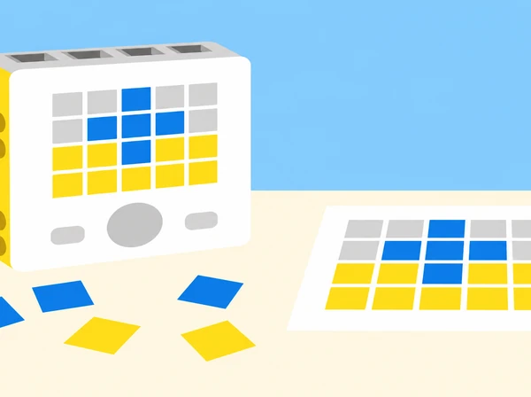

_El hub, els sensors i els actuadors són maquinari; Python descriu les instruccions que els coordinen._

## 🌱 Repte i sentit

La biblioteca del centre prepara una setmana de portes obertes i vol provar un petit punt d’informació que anuncie, amb un patró de llum i un senyal sonor opcional, si una taula està disponible, ocupada o necessita ajuda. L’equip no registra persones ni dades reals: treballa amb targetes de situació creades a classe i un hub SPIKE Prime. L’encàrrec és dissenyar un codi de senyals fàcil d’aprendre, escriure’l en Python, comprovar-lo amb diferents persones i condicions, i explicar què pot i què no pot comunicar el prototip.

Aquesta situació adapta les sis lliçons de la unitat 1 *Communicating Ideas: Hardware and Software* de LEGO Education *Introduction to Python Programming · Course 1*: *Importing Libraries*, *Communicating with Light*, *Pair Programming*, *Communicating with Sounds*, *Digital Sign* i *Ideas to Support Your Design*. Afig una setena sessió pròpia d’orientació professional, marcada com a ampliació i no comptada com una lliçó d’eixa unitat. El recorregut manté el fil d’introducció a les biblioteques, ús de matriu lluminosa i so, treball en parelles, depuració elemental, missatge multimodal, revisió amb feedback i connexió amb professions. El context i la producció són propis, i la resposta sonora sempre és opcional.

## 🎯 Aprenentatges i vocabulari

- Descriure la relació entre maquinari (hub, ports, matriu, altaveu i dispositius) i programari (instruccions Python que organitzen la seua resposta).

- Explicar que una biblioteca és codi reutilitzable que aporta funcions, i que importar-la permet accedir-hi quan la versió instal·lada ho admet.

- Obrir, llegir i executar un programa curt; localitzar errades senzilles de nom, ordre, indentació o crida amb ajuda de la consola.

- Crear una seqüència lluminosa amb patró, durada i pausa deliberats; distingir una seqüència fixa d’una entrada interactiva.

- Crear i comparar patrons sonors curts, regular volum i oferir una alternativa visual equivalent sense so.

- Descompondre un missatge en estats i senyals; provar si el codi s’interpreta correctament sense dependre només del color, el so o la memòria.

- Practicar programació per parelles alternant qui escriu i qui revisa, verbalitzar prediccions i citar codi o idees reutilitzats quan corresponga.

- Recollir feedback, documentar una modificació i relacionar les tasques amb funcions professionals de programació, disseny d’interacció, accessibilitat i suport tècnic.

**Maquinari:** parts físiques que capten o produeixen accions. **Programari:** instruccions i dades que utilitza el dispositiu. **Biblioteca:** conjunt de codi reutilitzable. **Importar:** incorporar una biblioteca al programa. **Matriu:** conjunt de píxels lluminosos del hub. **Depurar:** investigar una diferència entre el resultat esperat i l’observat.

```python
# Fragment conceptual de Python; adapteu la biblioteca a l'app SPIKE disponible.
# primer es defineix el senyal; després es prova una instrucció cada vegada
missatge = "AJUDA"
print(missatge)
```

El fragment és Python general i no controla maquinari. Els noms d’importació i les funcions per a matriu, so i botons varien entre versions de SPIKE; el professorat comprova l’exemple corresponent en la Knowledge Base de l’app local abans d’executar-lo.

## 🧰 Materials i preparació docent

Un set SPIKE Prime per parella, hub carregat, dispositiu amb l’app SPIKE i editor Python disponible, diari d’enginyeria, targetes mate amb símbols grans i paraules curtes, cartó per a una base de mostrador, retoladors, cinta de paper, temporitzador i versions impreses dels patrons. Un robot mòbil no és imprescindible: el hub es pot usar fixat en un suport estable, que és més pertinent per a un senyal. No calen materials externs de LEGO ni s’atribueix cap capacitat de reconeixement automàtic a la maqueta.

Abans de la primera sessió, confirmeu connexió al hub, idioma/layout de l’editor, API Python present i accés a consola. Proveu una expressió innocent abans de connectar motors; en aquesta situació no necessitem cap motor. Consulteu els noms oficials de les funcions de matriu i so de la vostra versió. Prepareu un exemple que funcione i còpies amb un error intencional de codi; eviteu errors que puguen activar un actuador. Definiu un nivell baix de volum i una alternativa sense so.

Formeu parelles amb rols que canvien a cada sessió: *pilota* (escriu o manipula el dispositiu) i *navegant* (llegeix el criteri, prediu i registra). Reserveu torns perquè ambdues persones escriguen codi i expliquen decisions. Abans d’usar el senyal amb persones, expliqueu que és un prototip d’aula, no un sistema operatiu del centre ni un canal d’emergència.

## 📅 Seqüència didàctica · sis lliçons oficials i una ampliació pròpia

### **Lliçó 1 · La caixa d’eines del programa (45 min).**

#### Fase 1 · Activem i prediem

**Activació (5 min):** compareu una recepta amb un programa: ingredients i utensilis són recursos; les instruccions n’organitzen l’ús. Traslladeu l’analogia amb cura: una biblioteca és codi reutilitzable, no una peça física.

#### Fase 2 · Explorem i construïm

**Inventari del set (7 min):** obriu un set per parella i localitzeu el hub, els tres motors i els tres sensors. Poseu les peces damunt la taula, identifiqueu-les sense connectar cap motor i completeu al diari tres columnes: «component», «què pot fer segons la documentació» i «què encara hem de comprovar». Torneu a col·locar cada peça al seu espai abans d’obrir l’editor; no compartiu peces entre sets.

#### Fase 3 · Expliquem i registrem

**Lectura de l’exemple (7 min):** obriu la plantilla Python de l’app i localitzeu les importacions, la funció principal i la línia que envia un text a la matriu. En el material de Course 1, l’exemple parteix de `from hub import light_matrix`, `import runloop` i `await light_matrix.write("Hi!")`; tracteu-lo com a exemple de la versió de la guia, perquè els noms poden variar en l’app actual. Relacioneu `light_matrix` amb la matriu del hub i `runloop` amb l’execució del programa.

#### Fase 4 · Apliquem i millorem

**Pràctica i depuració (18 min):** amb l’hub connectat i cap motor en ús, executeu primer l’exemple funcional i observeu el text que es desplaça i l’estat de connexió de l’app. Canvieu només el text per una salutació curta. Després, en una còpia, ometeu una importació o canvieu una lletra del nom i executeu-la per observar l’error de consola; assenyaleu la línia, corregiu-la i torneu a provar. No feu errors deliberats sobre un muntatge en moviment.

#### Fase 5 · Comprovem i reflexionem

**Registre i eixida (8 min):** completeu l’esquema maquinari → biblioteca importada → instrucció → resposta observada i expliqueu què no podria fer el programa si faltara la biblioteca. Anoteu la versió de l’app i la forma d’importació que heu comprovat. Abans d’eixir, autoavalueu en una escala d’1 a 3 la gestió del temps i la cura del material; contrasteu amb la parella que totes les peces han tornat al lloc correcte i que les dues persones han participat.

### **Lliçó 2 · La llum pot donar informació? (45 min).**

#### Fase 1 · Activem i prediem

**Activació (5 min):** quines figures podem dibuixar en una matriu de cinc per cinc? Predigueu si un triangle, un rectangle i una icona triada pel grup es reconeixeran amb només 25 píxels; anoteu per què convé esbossar abans de programar.

#### Fase 2 · Explorem i construïm

**Disseny en paper (8 min):** dibuixeu una graella de 5 × 5 al diari i retalleu 25 quadrats de paper de colors per poder representar cada píxel. Proveu una figura senzilla —rectangle, triangle o símbol propi del centre— i marqueu només les caselles que s’han d’il·luminar. Escriviu un pseudocodi de quatre passos: netejar la matriu, mostrar la figura, esperar i esborrar-la. No cal utilitzar alhora les 25 peces.



_La graella de paper permet predir i revisar el patró abans d’escriure el programa._

#### Fase 3 · Expliquem i registrem

**Programació en parella (20 min):** partiu d’un exemple verificat en la Knowledge Base de la versió local. Mostreu una icona, espereu cinc segons i netegeu la matriu; després canvieu només la constant de la icona i el comentari corresponent. Compareu `show_image` —que representa una figura— amb `write` —que desplaça una cadena de caràcters—. La persona navegant llig el pseudocodi i registra la predicció; la pilota edita. Intercanvieu els rols. No copieu una API d’una altra versió sense provar-la abans.

#### Fase 4 · Apliquem i millorem

**Depuració i prova amb companys (8 min):** si la figura no correspon a l’esbós, compareu files i caselles amb la graella. En una còpia segura, canvieu la majúscula d’una constant d’imatge, obriu la consola i localitzeu la línia que assenyala l’error; corregiu-la i torneu a executar. Pregunteu què canviaria si s’ometera `sleep_ms` i contrasteu la predicció amb l’execució. Després, mostreu la icona a una altra parella sense revelar la clau i registreu la interpretació anònimament.

#### Fase 5 · Comprovem i reflexionem

**Autoavaluació (4 min):** expliqueu per a què serveix la pausa, què indica el comentari que comença per `#` i quina diferència heu observat entre mostrar una icona i desplaçar una paraula. Anoteu una errada que heu resolt, una prova que falta i una modificació mesurable; una prova amb una parella no és suficient per afirmar que el codi serà accessible per a tothom.

### **Lliçó 3 · Una parella, un programa revisable (45 min).**

#### Fase 1 · Activem i prediem

**Activació (5 min):** imagineu un cotxe amb quatre persones i distingiu qui condueix de qui interpreta el mapa i avisa d’un gir. Traslladeu la comparació a la programació: totes dues persones pensen, però en cada torn una escriu i l’altra revisa el codi i el criteri.

#### Fase 2 · Explorem i construïm

**Primer torn (12 min):** trieu una icona del repertori que mostra la Knowledge Base i escriviu-la en un programa curt. La persona que pilota l’editor explica què canviarà abans d’escriure; la navegant comprova nom de la constant, ordre de les línies i crida abans de prémer executar. Mostreu el resultat al grup des del hub aturat i estable.

#### Fase 3 · Expliquem i registrem

**Intercanvi i registre (10 min):** canvieu de rol i programeu una segona icona triada per la nova pilot. Cada parella comparteix les dues figures amb el grup; l’alumnat registra en notes adhesives només el nom de la icona que prefereix, sense posar-hi el seu nom. Organitzeu les notes en columnes per fer un recompte de preferències i parleu de com canvia la tasca quan cal acordar categories i comptar resultats.

#### Fase 4 · Apliquem i millorem

**Joc de depuració (10 min):** en una còpia del programa, la pilot introdueix un error segur en el nom d’una icona o en l’ordre de dues instruccions; no s’activen motors ni mecanismes. La navegant descriu què esperava, llegeix la línia indicada per la consola i proposa una correcció sense prendre el teclat. Canvieu els papers i feu una segona ronda. Tanqueu distingint entre reutilitzar una idea o fragment documentat i presentar-lo com a propi; afegiu atribució quan corresponga.

#### Fase 5 · Comprovem i reflexionem

**Autoavaluació (8 min):** cada membre anota què ha fet en cada rol, com ha ajudat la parella i quina pràctica vol millorar. Puntueu de l’1 al 3 la gestió del temps i del material; comproveu que les dues persones han escrit codi, que el programa acaba en un estat conegut i que totes les peces tornen al seu espai. La preferència del grup no s’interpreta com una avaluació individual.

### **Lliçó 4 · Sons, pauses i alternatives (60 min).**

#### Fase 1 · Activem i prediem

**Repte sense paraules (5 min):** en parelles, una persona comunica un ordre de tres targetes de colors sense parlar ni escriure; primer pot mostrar la pila i després ha d’inventar un codi sonor acordat. Predigueu quina part de la informació es perd si no es coneix el codi. Qualsevol alumne pot triar una alternativa silenciosa.

#### Fase 2 · Explorem i construïm

**Beep del hub (15 min):** obriu una plantilla nova i seleccioneu la funció de beep que apareix en la Knowledge Base de l’app instal·lada. En una taula, relacioneu els arguments amb freqüència, durada en mil·lisegons i volum. Executeu una nota breu i canvieu només un argument per prova; anoteu valor i resultat. Manteniu el volum baix i no connecteu actuadors.

#### Fase 3 · Expliquem i registrem

**Partitura i explicació (12 min):** composeu una seqüència original de tres sons; representeu-la amb una partitura de símbols i escriviu el codi de manera que cada crida tinga un comentari breu. Expliqueu què representa cada valor numèric i quina biblioteca s’importa. Afegiu a cada missatge una alternativa visual i textual equivalent.

#### Fase 4 · Apliquem i millorem

**Proves de límit i so enregistrat (23 min):** en una còpia, proveu una freqüència inferior a 100 i distingiu «el programa s’executa» de «l’oïda humana percep el beep»; no assumiu que un resultat silenciós és una errada de sintaxi. Després consulteu l’app per a distingir el beep generat pel mòdul de so del hub d’un efecte pregravat, com un so de l’app que ix pels altaveus del dispositiu. Verifiqueu quin dispositiu sona i quin import necessita la funció; canvieu una sola opció i documenteu-ho. Si el grup ho tria, creeu un patró curt amb tres notes o efectes sense reproduir una cançó comercial. Un equip revisor segueix la partitura i comunica què ha entés; cap so és obligatori i no s’usen alarmes sobtades.

#### Fase 5 · Comprovem i reflexionem

**Autoavaluació (5 min):** compareu beep del hub i so de l’app: on s’escolta cadascun i quin tipus de paràmetres o nom necessita? Anoteu una prova de programació, una limitació d’audició/entorn i l’alternativa visual o textual que conserva el missatge.

### **Lliçó 5 · El cartell digital de la biblioteca (90 min).**

#### Fase 1 · Activem i prediem

**Definir el missatge (10 min):** la biblioteca vol anunciar una activitat fictícia de la setmana cultural —per exemple, intercanvi de llibres o lectura de relats locals— i necessita un cartell que cride l’atenció sense confondre’s amb un avís oficial. Trieu públic, missatge breu i acció esperada; feu un esbós de paper i identifiqueu què pot aportar una versió lluminosa o sonora. No anuncieu horaris reals ni disponibilitat que el prototip no puga verificar.

#### Fase 2 · Explorem i construïm

**Storyboard i proves de comprensió (12 min):** compareu el cartell estàtic amb el senyal digital. Representeu la seqüència: iniciar, mostrar la icona, desplaçar el text, opcionalment emetre un so suau i acabar o tornar a l’inici. Una altra parella interpreta l’esbós sense que li expliquen el context; reviseu paraules ambigües i prepareu també una lectura sense so.

#### Fase 3 · Expliquem i registrem

**Construcció i codi (30 min):** munteu un suport estable de taula amb el hub visible i proveu cada funció per separat. El programa mostra una icona de 5 × 5, escriu una frase curta a la matriu i, si el grup ho acorda, afegeix un efecte de so no intrusiu; cada part té un comentari que n’explica la intenció. Manteniu els noms i ordres que documenta la versió instal·lada i anoteu si el so ix del hub o del dispositiu. La maqueta no usa sensors per afirmar que l’activitat ha començat ni que hi ha places disponibles.

#### Fase 4 · Apliquem i millorem

**Ronda de proves (20 min):** proveu la icona, la frase i el conjunt; feu també una interrupció i torneu a iniciar el programa. Registreu la interpretació del missatge i si la durada dona temps per llegir-lo. **Revisió creuada (10 min):** una altra parella observa el cartell sense llegenda i explica què anuncia i quina acció entén. Recolliu només comentaris anònims i canvieu una propietat; repetiu una prova per comprovar si la versió millorada comunica amb més claredat.

#### Fase 5 · Comprovem i reflexionem

**Comunicació (8 min):** presenteu el cartell, el codi comentat i una targeta que explique el públic, el missatge, la instrucció d’aturada i l’alternativa sense so. Declareu que l’activitat anunciada és fictícia i que el prototip no verifica informació, no substitueix cartelleria accessible ni avisos oficials i no està preparat per instal·lar-se al centre.

### **Lliçó 6 · Millorar una idea amb feedback (45 min).**

#### Fase 1 · Activem i prediem

**Modelatge del feedback (5 min):** recordeu la targeta digital creada en la sessió anterior i modeleu una resposta concreta, amable i útil. El feedback no consisteix a fer la tasca per l’altre equip: no reconstruïu el model ni escrigueu dins del seu programa; descriviu què heu observat, feu una pregunta i oferiu una opció perquè els autors decidisquen.

#### Fase 2 · Explorem i construïm

**Revisió entre equips (10 min):** l’equip B mostra el seu cartell, el programa i un cas de prova mentre l’equip A registra comentaris; després intercanvien rols. La pauta demana quatre aportacions: una cosa que agrada, una que ja funciona bé, una alternativa que es podria provar i un punt confús o millorable amb la raó. Qui rep el feedback pot demanar aclariments; no es jutja la persona que ha escrit el codi.

#### Fase 3 · Expliquem i registrem

**Conversa i selecció (5 min):** compareu els comentaris rebuts, identifiqueu una fortalesa que convé preservar i trieu una proposta de revisió. Si no l’adopteu, escriviu per què i quina altra prova necessiteu.

#### Fase 4 · Apliquem i millorem

**Iteració documentada (20 min):** modifiqueu el vostre propi cartell o programa, mai el del grup revisor. Repetiu un cas que havia generat confusió i un altre que ja funcionava; registreu versió anterior, suggeriment, canvi, resultats i decisió final. Presenteu què heu incorporat i què heu deixat pendent amb una justificació.

#### Fase 5 · Comprovem i reflexionem

**Autoavaluació (5 min):** al diari, expliqueu quin feedback heu donat i rebut, com l’heu utilitzat i com vos heu sentit en els dos papers. Puntueu de l’1 al 3 la gestió del temps i la cura del set; tanqueu amb una acció concreta per a millorar la pròxima revisió entre iguals.

### **Lliçó 7 · Professions que uneixen codi i persones · ampliació pròpia (45–60 min).**

#### Fase 1 · Activem i prediem

**Mapa de tasques (10 min):** mireu el treball fet i assigneu-ne parts a funcions professionals —desenvolupar software, dissenyar una interacció, provar accessibilitat, documentar, reparar dispositius— sense afirmar que una persona real fa una única funció.

#### Fase 2 · Explorem i construïm

**Investigació guiada (15 min):** per equips, redacteu tres preguntes sobre habilitats, col·laboració i decisions d’ètica/accés. Useu fonts professionals o una entrevista autoritzada si el centre en disposa; no inventeu respostes ni exigiu dades personals sobre itineraris familiars.

#### Fase 3 · Expliquem i registrem

**Producte (15 min):** creeu una fitxa de professió connectada amb una tasca del projecte, una competència observable i una pregunta oberta.

#### Fase 4 · Apliquem i millorem

**Galeria i síntesi (5–20 min):** presenteu prototips i professions en una mostra de classe, amb opció d’exposar text, diagrama o explicació oral.

#### Fase 5 · Comprovem i reflexionem

Tanqueu relacionant un canvi de disseny amb una necessitat d’usuari i una responsabilitat de qui construeix tecnologia.

## 🧪 Evidències, avaluació i producte

El portafolis inclou diagrama maquinari/programari, nota de versions i imports, traça d’un programa inicial, pseudocodi, storyboard, taula d’estats i senyals, programa Python comentat, dues proves de depuració, observacions anònimes de comprensió, iteració justificada, pauta de parelles i fitxa de connexió professional. El producte és un prototip de senyal digital de taula més una targeta d’ús que explique la selecció d’estat, alternatives de percepció, procediment d’aturada i limitacions.

Avalueu amb quatre criteris: **comprensió del sistema** (diferencia hardware/software i identifica per què importa la biblioteca); **programació** (construeix una seqüència de llum/so coherent i localitza una errada elemental); **disseny de comunicació** (manté alternatives i revisa interpretacions a partir de proves); i **col·laboració/reflexió** (alterna rols, documenta atribució, usa feedback i connecta tasques amb professions). Nivells suggerits: amb modelatge, amb suport, autònom, i transferència justificada. No s’avalua que el robot “funcione” a seques: importa poder explicar la relació entre instrucció, component, resultat i prova.

## ♿ Inclusió, privacitat i seguretat

Presenteu la informació amb text, símbol, llum i opció sonora suau; mai feu que el color siga l’única pista. Oferiu patrons imprimibles, lectura de codi en parella, text ampliat, pauses, rols alternatius i prova sense sons. Eviteu parpellejos ràpids o seqüències que puguen causar molèstia; deixeu que qualsevol alumne observe o trie una altra manera de participar. No capteu dades personals, imatges, converses ni presència de persones. Manteniu el model en una taula estable; els motors no són necessaris. El senyal és una simulació didàctica, no alarma, servei de biblioteca real ni instrucció d’evacuació.

## 🔗 Referent oficial i decisions d’adaptació

Adapta les sis lliçons oficials de la unitat *Communicating Ideas: Hardware and Software* de LEGO Education [*Introduction to Python Programming · Course 1*](https://assets.education.lego.com/v3/assets/blt293eea581807678a/blt834b554cdaa246f7/6584064fd082f7672425e7ea/File_1_Units12345_Intro_to_Python_Course_TG_Course.pdf?locale=en-us): *Importing Libraries*, *Communicating with Light*, *Pair Programming*, *Communicating with Sounds*, *Digital Sign* i *Ideas to Support Your Design*. Afig una setena sessió pròpia, *Career Connections*, com a ampliació professional, no com a lliçó de la unitat. La guia consultada treballa amb SPIKE Prime, Python, journals i parelles; aquesta adaptació conserva eixos objectius, canvia el context per un senyal escolar simulat i produeix procediments, exemples, instruments i imatge propis. No es reprodueixen materials d’alumnat ni codi complet. Les APIs d’SPIKE depenen de la versió i cal validar-les localment.
