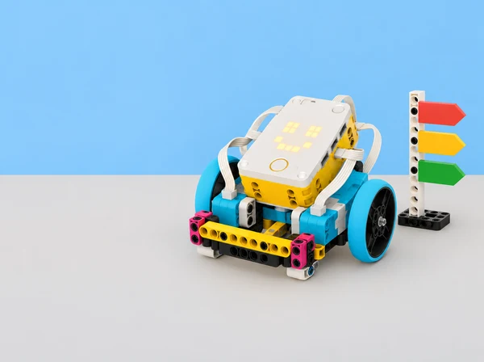

_El hub, els sensors i els actuadors són maquinari; Python descriu les instruccions que els coordinen._

## 🌱 Repte i sentit

La biblioteca del centre prepara una setmana de portes obertes i vol provar un petit punt d’informació que anuncie, amb un patró de llum i un senyal sonor opcional, si una taula està disponible, ocupada o necessita ajuda. L’equip no registra persones ni dades reals: treballa amb targetes de situació creades a classe i un hub SPIKE Prime. L’encàrrec és dissenyar un codi de senyals fàcil d’aprendre, escriure’l en Python, comprovar-lo amb diferents persones i condicions, i explicar què pot i què no pot comunicar el prototip.

Aquesta situació adapta les set lliçons de la unitat 1 *Hardware and Software* de LEGO Education *Introduction to Python Programming · Course 1*: *Importing Libraries*, *Communicating with Light*, *Pair Programming*, *Communicating with Sounds*, *Digital Sign*, *Ideas to Support Your Design* i *Career Connections*. Manté el fil d’introducció a les biblioteques, ús de matriu lluminosa i so del hub, treball en parelles, depuració elemental, missatge multimodal, revisió amb feedback i connexió amb professions. El context i la producció són propis, i la resposta sonora sempre és opcional.

## 🎯 Aprenentatges i vocabulari

- Descriure la relació entre maquinari (hub, ports, matriu, altaveu i dispositius) i programari (instruccions Python que organitzen la seua resposta).

- Explicar que una biblioteca és codi reutilitzable que aporta funcions, i que importar-la permet accedir-hi quan la versió instal·lada ho admet.

- Obrir, llegir i executar un programa curt; localitzar errades senzilles de nom, ordre, indentació o crida amb ajuda de la consola.

- Crear una seqüència lluminosa amb patró, durada i pausa deliberats; distingir una seqüència fixa d’una entrada interactiva.

- Crear i comparar patrons sonors curts, regular volum i oferir una alternativa visual equivalent sense so.

- Descompondre un missatge en estats i senyals; provar si el codi s’interpreta correctament sense dependre només del color, el so o la memòria.

- Practicar programació per parelles alternant qui escriu i qui revisa, verbalitzar prediccions i citar codi o idees reutilitzats quan corresponga.

- Recollir feedback, documentar una modificació i relacionar les tasques amb funcions professionals de programació, disseny d’interacció, accessibilitat i suport tècnic.

**Maquinari:** parts físiques que capten o produeixen accions. **Programari:** instruccions i dades que utilitza el dispositiu. **Biblioteca:** conjunt de codi reutilitzable. **Importar:** incorporar una biblioteca al programa. **Matriu:** conjunt de píxels lluminosos del hub. **Depurar:** investigar una diferència entre el resultat esperat i l’observat.

```python
# Fragment conceptual de Python; adapteu la biblioteca a l'app SPIKE disponible.
# primer es defineix el senyal; després es prova una instrucció cada vegada
missatge = "AJUDA"
print(missatge)
```

El fragment és Python general i no controla maquinari. Els noms d’importació i les funcions per a matriu, so i botons varien entre versions de SPIKE; el professorat comprova l’exemple corresponent en la Knowledge Base de l’app local abans d’executar-lo.

## 🧰 Materials i preparació docent

Un set SPIKE Prime per parella, hub carregat, dispositiu amb l’app SPIKE i editor Python disponible, diari d’enginyeria, targetes mate amb símbols grans i paraules curtes, cartó per a una base de mostrador, retoladors, cinta de paper, temporitzador i versions impreses dels patrons. Un robot mòbil no és imprescindible: el hub es pot usar fixat en un suport estable, que és més pertinent per a un senyal. No calen materials externs de LEGO ni s’atribueix cap capacitat de reconeixement automàtic a la maqueta.

Abans de la primera sessió, confirmeu connexió al hub, idioma/layout de l’editor, API Python present i accés a consola. Proveu una expressió innocent abans de connectar motors; en aquesta situació no necessitem cap motor. Consulteu els noms oficials de les funcions de matriu i so de la vostra versió. Prepareu un exemple que funcione i còpies amb un error intencional de codi; eviteu errors que puguen activar un actuador. Definiu un nivell baix de volum i una alternativa sense so.

Formeu parelles amb rols que canvien a cada sessió: *pilota* (escriu o manipula el dispositiu) i *navegant* (llegeix el criteri, prediu i registra). Reserveu torns perquè ambdues persones escriguen codi i expliquen decisions. Abans d’usar el senyal amb persones, expliqueu que és un prototip d’aula, no un sistema operatiu del centre ni un canal d’emergència.

## 📅 Seqüència didàctica · set lliçons

### **Lliçó 1 · La caixa d’eines del programa (45 min).**

**Activació (7 min):** compareu una recepta amb un programa: ingredients i utensilis són recursos, mentre que instruccions en descriuen l’ús. Traslladeu l’analogia sense dir que una biblioteca és un dispositiu: és codi reutilitzable. **Exploració guiada (10 min):** identifiqueu les parts físiques disponibles en el hub SPIKE i dibuixeu una taula amb “component”, “què pot fer” i “què no sabem encara”. Obriu un exemple Python del projecte local, llegiu-ne les importacions i localitzeu una funció que s’hi utilitza; si el fitxer no és llegible en l’editor, el docent projecta un exemple mínim verificat. **Pràctica (20 min):** importeu la biblioteca exacta de la Knowledge Base de la versió instal·lada, executeu un programa mínim que no moga cap motor, observeu el missatge de consola i proveu què passa en una còpia si s’omet l’import o es canvia el nom. No executeu un error deliberat sobre un muntatge en moviment. **Registre i eixida (8 min):** completeu un esquema maquinari → instrucció → resposta i expliqueu per què el programa necessita importar funcions que no són part del nucli bàsic. Anoteu versió de l’app i API usada, perquè és una condició de reproduïbilitat.

### **Lliçó 2 · La llum pot donar informació? (45 min).**

**Pregunta d’investigació:** quins patrons de llum es poden distingir amb rapidesa sense dependre del color? **Modelatge (8 min):** el docent mostra tres missatges temporals en la matriu (per exemple, disponible, ocupat, demanar suport), descrits també per forma o ritme. L’alumnat dibuixa el patró abans de veure’l de nou i anota interpretacions alternatives. **Programació en parella (22 min):** partiu d’un exemple funcional de la biblioteca local; canvieu primer només una representació gràfica, després la pausa i després l’ordre. La persona navegant llig l’objectiu en veu alta, prediu l’eixida i registra diferències; la pilota escriu. Intercanvieu els rols a mitja tasca. Afegiu comentaris que expliquen el propòsit del senyal, no cada caràcter. **Prova amb usuaris (10 min):** mostreu els senyals a dues parelles sense donar la clau; feu que indiquen què creuen que significa cadascun. Recolliu només respostes anònimes del grup, sense atribuir-les a persones. **Tancament (5 min):** trieu una ambigüitat i escriviu una modificació mesurable; no conclogueu que el codi és accessible només perquè un grup l’ha entés.

### **Lliçó 3 · Una parella, un programa revisable (45 min).**

**Demostració (5 min):** modeleu el protocol: llegir enunciant, predir abans d’executar, escriure canvis menuts, provar, explicar i intercanviar. **Repte (25 min):** cada parella rep un programa curt de missatge lluminós amb una errada elemental controlada i una tasca de modificació. El navegant no dicta línia per línia: pregunta “quina eixida esperem?” i assenyala la part pertinent. La pilota verbalitza abans de canviar; després de cada prova anoten resultat i causa possible. Canvieu rols, editeu un segon missatge i compareu si el programa continua tenint les mateixes propietats. **Debat d’autoria (8 min):** distingiu prendre una idea, reutilitzar un exemple i presentar codi d’una altra persona com si fora propi. Afegiu un comentari que cite l’exemple consultat quan siga aplicable. **Reflexió (7 min):** cada membre anota una contribució pròpia i una pregunta tècnica; comproveu que ambdues persones han manipulat l’editor, no sols observat.

### **Lliçó 4 · Sons, pauses i alternatives (45 min).**

**Escolta crítica (7 min):** proveu sons breus a volum baix i compareu to, nombre d’impulsos i pausa. No useu alarmes estridents ni sons sobtats. **Exploració Python (20 min):** useu una funció oficial de so validada per al hub per crear un patró d’un, dos o tres senyals; anoteu què fa cada argument segons la documentació i ajusteu una sola propietat per prova. Una parella treballa primer amb patrons dibuixats si el so no està disponible. **Regla de comunicació (10 min):** associeu cada so amb un patró visual i un text curt equivalent; feu una prova amb el so desactivat i expliqueu si encara es pot identificar l’estat. **Depuració (5 min):** reviseu un error preparat de crida o seqüència en paper, localitzeu-lo i corregiu-ne només una causa. **Eixida (3 min):** redacteu quan el senyal sonor no seria adequat i com conservar el mateix accés a la informació.

### **Lliçó 5 · El cartell digital de la biblioteca (90 min).**

**Definir el problema (10 min):** cada equip tria tres estats ficticis del mostrador. Per a cadascun especifica destinatari, significat, patró visual, patró sonor opcional, durada i què ha de fer una persona usuària. Eviteu “lliure/ocupat” si no hi ha un sensor que ho comprove: l’operador selecciona manualment la targeta i el model només mostra eixa selecció. **Storyboard i proves de comprensió (12 min):** dibuixeu la seqüència d’entrada, missatge i retorn a estat inicial; una altra parella intenta interpretar icones i ritmes. Reviseu el vocabulari ambigu abans de programar. **Construcció i codi (30 min):** creeu una maqueta estable de taula amb hub visible, targetes grans i una interfície d’entrada viable en la versió local (botons del hub o selecció al programa). Dividiu el programa en passos que es puguen llegir: seleccionar estat, mostrar senyal, esperar o acabar. Afegiu llum i, si s’escau, so complementari. Manteniu els noms i ordres documentats per l’app instal·lada i proveu cada funció per separat. **Ronda de casos (20 min):** proveu els tres estats previstos, una entrada desconeguda i una interrupció/reset. Registreu entrada, senyal observat, interpretació de companys i canvi fet; comproveu si el programa queda en un estat comprensible en reiniciar. **Revisió creuada (10 min):** altres alumnes reben el cartell sense llegenda i expliquen la interpretació; cap equip recull noms ni identifica respostes individuals. **Comunicació (8 min):** presenteu una targeta d’ús amb clau dels senyals, instrucció d’aturada i límit principal: el prototip no detecta disponibilitat real, no substitueix avisos oficials i no s’ha d’instal·lar al centre com a equip de seguretat.

### **Lliçó 6 · Millorar una idea amb feedback (45 min).**

**Preparació (8 min):** cada parella documenta objectiu, versió inicial, casos provats i una incertesa. **Intercanvi (12 min):** l’equip revisor prova els senyals en silenci primer i amb so opcional després, fent servir una pauta d’observació: “he vist/escoltat…”, “he interpretat…”, “una prova que falta…”. Es comenta el disseny i el codi, no l’habilitat de qui el va escriure. **Decisió (5 min):** els autors classifiquen cada suggeriment com adoptar, aparcar o rebutjar amb una raó. **Iteració (15 min):** canvieu una propietat; repetiu un cas que havia generat confusió i un senyal que ja es comprenia per comprovar que no s’ha degradat. Deseu un registre abans/després. **Autoavaluació (5 min):** expliqueu com ha canviat la coordinació pilot/navegant i quina instrucció encara voldríeu consultar a la documentació.

### **Lliçó 7 · Professions que uneixen codi i persones (45–60 min).**

**Mapa de tasques (10 min):** mireu el treball fet i assigneu-ne parts a funcions professionals —desenvolupar software, dissenyar una interacció, provar accessibilitat, documentar, reparar dispositius— sense afirmar que una persona real fa una única funció. **Investigació guiada (15 min):** per equips, redacteu tres preguntes sobre habilitats, col·laboració i decisions d’ètica/accés. Useu fonts professionals o una entrevista autoritzada si el centre en disposa; no inventeu respostes ni exigiu dades personals sobre itineraris familiars. **Producte (15 min):** creeu una fitxa de professió connectada amb una tasca del projecte, una competència observable i una pregunta oberta. **Galeria i síntesi (5–20 min):** presenteu prototips i professions en una mostra de classe, amb opció d’exposar text, diagrama o explicació oral. Tanqueu relacionant un canvi de disseny amb una necessitat d’usuari i una responsabilitat de qui construeix tecnologia.

## 🧪 Evidències, avaluació i producte

El portafolis inclou diagrama maquinari/programari, nota de versions i imports, traça d’un programa inicial, pseudocodi, storyboard, taula d’estats i senyals, programa Python comentat, dues proves de depuració, observacions anònimes de comprensió, iteració justificada, pauta de parelles i fitxa de connexió professional. El producte és un prototip de senyal digital de taula més una targeta d’ús que explique la selecció d’estat, alternatives de percepció, procediment d’aturada i limitacions.

Avalueu amb quatre criteris: **comprensió del sistema** (diferencia hardware/software i identifica per què importa la biblioteca); **programació** (construeix una seqüència de llum/so coherent i localitza una errada elemental); **disseny de comunicació** (manté alternatives i revisa interpretacions a partir de proves); i **col·laboració/reflexió** (alterna rols, documenta atribució, usa feedback i connecta tasques amb professions). Nivells suggerits: amb modelatge, amb suport, autònom, i transferència justificada. No s’avalua que el robot “funcione” a seques: importa poder explicar la relació entre instrucció, component, resultat i prova.

## ♿ Inclusió, privacitat i seguretat

Presenteu la informació amb text, símbol, llum i opció sonora suau; mai feu que el color siga l’única pista. Oferiu patrons imprimibles, lectura de codi en parella, text ampliat, pauses, rols alternatius i prova sense sons. Eviteu parpellejos ràpids o seqüències que puguen causar molèstia; deixeu que qualsevol alumne observe o trie una altra manera de participar. No capteu dades personals, imatges, converses ni presència de persones. Manteniu el model en una taula estable; els motors no són necessaris. El senyal és una simulació didàctica, no alarma, servei de biblioteca real ni instrucció d’evacuació.

## 🔗 Referent oficial i decisions d’adaptació

Adapta les set lliçons de la unitat 1 *Hardware and Software* de LEGO Education [*Introduction to Python Programming · Course 1*](https://assets.education.lego.com/v3/assets/blt293eea581807678a/blt834b554cdaa246f7/6584064fd082f7672425e7ea/File_1_Units12345_Intro_to_Python_Course_TG_Course.pdf?locale=en-us): *Importing Libraries*, *Communicating with Light*, *Pair Programming*, *Communicating with Sounds*, *Digital Sign*, *Ideas to Support Your Design* i *Career Connections*. Les durades de referència són 45, 45, 45, 45, 45–90, 30–45 i 60–90 minuts respectivament. La guia consultada treballa amb SPIKE Prime, Python, journals i parelles; aquesta adaptació conserva eixos objectius, canvia el context per un senyal escolar simulat i produeix procediments, exemples, instruments i imatge propis. No es reprodueixen materials d’alumnat ni codi complet. Les APIs d’SPIKE depenen de la versió i cal validar-les localment.
