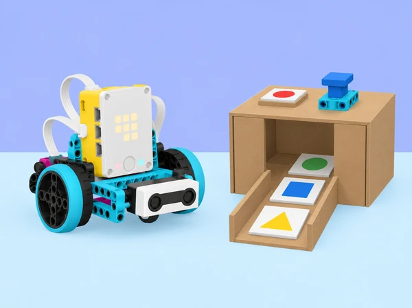

_Una decisió composta és més fàcil d’explicar si fem visibles les condicions i provem cada combinació._

## 🌱 Repte i context

La biblioteca de l’aula vol provar una estació didàctica que indica si una caixa de material compartit està preparada per a una activitat. En una maqueta de cartó, les fitxes de color representen un codi d’activitat inventat per la classe, un sensor de força representa una confirmació física i la matriu de llums de la SPIKE hub comunica l’estat. L’alumnat defineix quines condicions s’han de complir perquè aparega una resposta, construeix una maqueta sense cap pany funcional i programa una simulació en Python.

La situació adapta la unitat 8 *Compound Conditionals and Logic Operators* de LEGO Education *Introduction to Python Programming · Course 2*. Parteix d’una conversa segura sobre privacitat i controls digitals, practica condicions imbricades i operadors lògics amb taules de veritat, investiga una seqüència de dues comprovacions amb sensors i culmina en un joc cooperatiu de pistes dissenyat i provat per un altre equip. No és un sistema de seguretat ni valida contrasenyes reals; no es recopila ni es comparteix cap credencial personal.

## 🎯 Aprenentatges i vocabulari

- Representar una decisió com a condicions observables, resultats possibles i casos que han de continuar bloquejats.

- Escriure i explicar `if`, `elif`, `else`, condicions imbricades i expressions booleanes en Python.

- Combinar expressions amb `and`, `or` i `not`; distingir “totes”, “almenys una” i “cap/aquesta no”.

- Construir taules de veritat i taules de proves per cobrir cada combinació pertinent, incloses entrades absents o desconegudes.

- Separar comprovació digital, acció del mecanisme i senyal de feedback per a poder provar i revisar cada part.

- Descriure amb exemples com els controls físics i digitals poden protegir informació, i explicar què no garanteix una maqueta.

- Donar i incorporar feedback sense revelar dades reals, ni presentar el prototip com un dispositiu apte per a protegir béns o persones.

**Booleà:** valor de veritat `True` o `False`. **Condició composta:** expressió que combina condicions més simples. **Imbricada:** condició dins d’una altra branca. **Cas de prova:** conjunt d’entrades i resultat esperat. **Autenticació:** comprovació d’identitat en un sistema; en aquesta activitat no s’autentica cap persona, només es simulen entrades fictícies.

```python
codi_valid = (fitxa == "blava")
confirmacio = boto_premut

if codi_valid and confirmacio:
    print("Mostra de prova autoritzada")
else:
    print("Revisa les entrades")
```

El fragment és Python general il·lustratiu; `boto_premut` i `fitxa` són valors de simulació. L’accés a ports i sensors SPIKE s’ha d’escriure segons la Knowledge Base de la versió de l’app instal·lada.

## 🧰 Materials i preparació

Un set SPIKE Prime per equip, hub carregat, dispositiu amb app SPIKE i Python disponibles, sensor de força i sensor de color, cables, peces Technic per a un indicador mòbil opcional, cartó reutilitzat per a una estació oberta de taula, fitxes grans amb símbols i colors, fulls per a taules de veritat, diari d’equip i temporitzador de classe. Tot el sistema és visible i accessible: no construïu panys, caixes tancades ni mecanismes que retinguen objectes. També es pot fer tota la seqüència sense motor, només amb sensors, LEDs o simulació en paper.

Prepareu entrades fictícies i comprovables: tres fitxes de símbols geomètrics, un polsador/sensor de confirmació, un cas sense fitxa i un cas de valor desconegut. No useu contrasenyes reals, noms, inicials, dates de naixement ni codis d’accés del centre. Si voleu tractar bons hàbits de contrasenya, feu servir un exemple inventat en paper i parleu de llargària i unicitat sense demanar que ningú revele les seues. Comproveu els sensors, ports i forma d’aturar el programa amb l’app local; les API i funcions canvien entre versions. No connecteu ni desconnecteu sensors amb l’execució activa.

Rols rotatius: qui escriu la condició; qui llig els casos de prova; qui cuida la maqueta i el hub; qui registra resultats. Abans de cada execució, tot l’equip prediu la branca que s’activarà. No hi ha cap moviment motoritzat obligatori.

## 📅 Seqüència didàctica · sis lliçons

### **Lliçó 1 · Protegim la informació sense compartir secrets (45 min).**

#### Fase 1 · Activem i prediem

**Conversa d’entrada (8 min):** presenteu targetes amb situacions fictícies: un dispositiu demana un codi inventat; una persona comparteix la clau amb tota la classe; una pantalla mostra un nom; un usuari crea una clau llarga única. L’alumnat classifica què podria protegir la informació i què caldria esborrar o no compartir. No es demana que ensenyen cap codi real.

#### Fase 2 · Explorem i construïm

**Descomposició (10 min):** identifiqueu el problema del programa fictici: la resposta “correcte/incorrecte” no explica què passa si falta una dada o si la sessió acaba. Escriviu una especificació simple: una fitxa de prova concreta activa un missatge neutre; qualsevol altra entrada, inclòs cap valor, mostra “revisa la consigna”.

#### Fase 3 · Expliquem i registrem

**Python en paper i editor (20 min):** traceu `if/elif/else` amb tres valors simulats i representeu cada pas amb fletxes.

#### Fase 4 · Apliquem i millorem

En parelles, traduïu una regla a pseudocodi i a Python general sense guardar la dada introduïda en cap fitxer ni consola. Si useu editor real, tots els valors són de mostra.

#### Fase 5 · Comprovem i reflexionem

**Tancament (7 min):** classifiqueu les afirmacions “el programa compara aquesta entrada” i “el programa sap qui és la persona”; expliqueu per què la primera no demostra la segona. Feu una llista de coses que la maqueta mai no farà.

### **Lliçó 2 · Una condició dins d’una altra, amb límits visibles (45 min).**

#### Fase 1 · Activem i prediem

**Activació (5 min):** joc de decisions desendollat: s’avança a la següent targeta només si es compleix la condició externa; dins de l’espai habilitat, una segona condició selecciona una de dues respostes. L’alumnat explica quan la segona regla ni tan sols es consulta.

#### Fase 2 · Explorem i construïm

**Disseny (10 min):** dibuixeu una maqueta d’estació oberta per retornar material de joc a una safata. Regla d’exemple: si hi ha sessió activa, aleshores comprova que el color siga un dels dos acceptats; si no hi ha sessió, mostra instruccions d’inici. El color no representa una identitat.

#### Fase 3 · Expliquem i registrem

**Python (20 min):** escriviu una condició imbricada amb valors introduïts manualment i marqueu amb claudàtors l’abast de cada bloc. Proveu les rutes: sessió inactiva; activa amb color A; activa amb color B; activa amb color no admés. Compareu-la amb una cadena de `if/elif/else` i discutiu quina forma fa més clara la regla en aquest cas.

#### Fase 4 · Apliquem i millorem

**Prova física opcional (5 min):** useu el sensor de color amb targetes grans; manteniu motor inactiu i compareu el valor llegit amb l’entrada esperada.

#### Fase 5 · Comprovem i reflexionem

**Registre (5 min):** anoteu quina condició es consulta primer, quina branca no s’ha visitat i per què una condició imbricada pot ser difícil de llegir si acumula massa nivells.

### **Lliçó 3 · AND, OR i NOT en una taula de veritat (45 min).**

#### Fase 1 · Activem i prediem

**Modelatge corporal (8 min):** representeu amb dos gestos la condició A “fitxa de pràctica blava” i B “polsador físic activat”. El grup mostra `and` només quan A i B són certes, `or` quan almenys una és certa i `not` quan una condició no es compleix. Parleu explícitament de què significa OR inclusiu: si les dues són certes, continua sent cert.

#### Fase 2 · Explorem i construïm

**Taula en equip (12 min):** completeu les quatre combinacions de A/B i els resultats esperats per A and B i A or B; afegiu una columna per not A. Compareu entre equips i expliqueu qualsevol fila discrepant.

#### Fase 3 · Expliquem i registrem

**Programa de simulació (18 min):** feu que un indicador de llum/console comunique els quatre estats: cap comprovació; només A; només B; totes dues.

#### Fase 4 · Apliquem i millorem

Useu `and`, `or` i `not` en regles amb propòsit distint; no els afegiu tots a una única expressió sense necessitat. Si connecteu sensor i botó, manteniu el motor desactivat.

#### Fase 5 · Comprovem i reflexionem

**Minirepte (7 min):** trobeu i corregiu una regla amb `or` on l’especificació demana `and`. Predigueu quin cas incorrecte passava abans de canviar-la i com la taula permet demostrar la correcció.

### **Lliçó 4 · Dues comprovacions, una resposta prudent (45–90 min).**

#### Fase 1 · Activem i prediem

**Pregunta de disseny (10 min):** com podem combinar una fitxa de color i la pressió d’un sensor de força per donar una resposta de prova? Definiu primer la regla en llenguatge natural, per exemple: l’assaig s’accepta si la fitxa és blava *i* el sensor es prem després que aparega la fitxa; si la fitxa no es reconeix, el sistema no interpreta el polsador com a acceptació.

#### Fase 2 · Explorem i construïm

**Maqueta i pseudocodi (10–15 min):** col·loqueu el sensor de color de manera fixa i reserveu el sensor de força com a entrada manual; representeu en paper què vol dir “després” (estat/ordre de passos) en lloc de fingir simultaneïtat si el codi no l’està comprovant. Un equip pot prototipar amb fitxes mentre un altre dissenya l’arbre de decisions.

#### Fase 3 · Expliquem i registrem

**Implementació (15–30 min):** convertiu la regla en funcions petites, una per llegir cada entrada i una per decidir/mostrar estat. Creeu variables booleans amb noms que descriguen la condició. Afegiu branca per a sensor sense lectura, pressió abans d’hora, pressió absent i una combinació no prevista. Només la consola, la llum o una bandera mecànica de recorregut curt mostren la decisió; el dispositiu no controla cap accés real.

#### Fase 4 · Apliquem i millorem

**Proves (10–25 min):** executeu una taula de casos, incloent totes dues entrades falses, només A, només B i totes dues certes. Repetiu una combinació tres vegades per observar si el sensor dona lectures estables, i indiqueu si cada cas passa al codi o a la lectura del sensor.

#### Fase 5 · Comprovem i reflexionem

**Reflexió:** quina dada rep el programa? quina regla ha definit l’equip? quina afirmació no podem fer sobre la seguretat d’un objecte real?

### **Lliçó 5 · Escape room de l’aula: obrir una ruta de pistes simulada (90 min).**

#### Fase 1 · Activem i prediem

**Encàrrec (10 min):** cada equip crearà una estació de repte de taula amb dues comprovacions lògiques, un senyal clar i una via alternativa perquè el joc es puga completar sense sensor si cal. No es tanca ningú dins d’un espai ni es creen claus secretes. Les “pistes” són fitxes públiques i fictícies; el resultat activa una targeta de pròxima instrucció, no un pany. **Ideació (12 min):** cada membre esbossa una microprova; l’equip n’escull una amb tres criteris: comprensible sense ajuda, comprovable amb quatre o més casos i resoluble amb els sensors presents. Escriviu instruccions curtes i la resposta correcta en un sobre docent separat.

#### Fase 2 · Explorem i construïm

**Construcció (18 min):** feu un escenari o recorregut de cartó i col·loqueu estacions d’entrada; si un motor mou una fletxa o senyal, delimiteu recorregut i velocitat. L’estació sempre queda oberta i l’aturada és accessible.

#### Fase 3 · Expliquem i registrem

**Programa (20 min):** formuleu almenys una regla amb `and` i una amb `or` o `not`, comenteu-les amb una frase de llenguatge natural i tracteu explícitament entrada invàlida o desconeguda. Dibuixeu arbre de decisió i convertiu-lo a blocs Python indentats.

#### Fase 4 · Apliquem i millorem

**Validació entre equips (20 min):** un altre equip intenta resoldre el repte sense que li expliquen la resposta; prova cas correcte, incomplet, ambigu i no previst. Registra si les instruccions són clares, si el programa ofereix una resposta sense revelar dades i si cada pista és accessible.

#### Fase 5 · Comprovem i reflexionem

**Iteració i mostra (10 min):** l’equip creador millora una instrucció o una condició i demostra la versió revisada. Si no es pot provar amb sensor, marca clarament aquella part com a simulada en paper.

### **Lliçó 6 · Feedback, revisió i límits del prototip (30–45 min).**

#### Fase 1 · Activem i prediem

**Visita de prova (10 min):** una altra parella usa l’estació de pistes; l’equip autor observa sense donar indicacions i anota els punts on cal ajuda o la lògica produeix una eixida sorprenent. No s’enregistren veus, noms ni respostes personals.

#### Fase 2 · Explorem i construïm

**Feedback específic (8 min):** feu servir “he observat…”, “la regla diu…”, “aquest cas encara no està provat…”. El feedback tracta d’una condició, una instrucció o una resposta, no de la capacitat dels autors.

#### Fase 3 · Expliquem i registrem

**Decisió (5 min):** l’equip marca suggeriments adoptats o rebutjats i la raó basada en especificació/prova.

#### Fase 4 · Apliquem i millorem

**Revisió (10 min):** canvieu una branca, una expressió o el text de la indicació; repetiu la mateixa fila de la taula i una fila diferent.

#### Fase 5 · Comprovem i reflexionem

**Autoavaluació (5–12 min):** expliqueu la diferència entre la condició del programa i una garantia de ciberseguretat; identifiqueu una entrada que hauria de continuar sense resposta. Puntueu en privat treball col·laboratiu, documentació i gestió del temps, amb una acció de millora per al següent repte.

## 🧪 Evidències i avaluació

Recolliu la conversa inicial amb idees anònimes, diagrama de decisions, taules de veritat per `and/or/not`, pseudocodi, codi Python amb comentaris, configuració del sensor, matriu de proves esperades/no previstes, registre de falsos resultats o lectures inestables, instruccions de l’estació i una nota sobre privacitat i límits. El repte final es valora en quatre dimensions: **raonament lògic** (interpreta cada operador i explica la precedència/agrupació amb parèntesis si cal); **programació i proves** (condicions correctes, alternatives i entrades absents cobertes); **disseny d’interacció** (instrucció i feedback entenedors, recorregut o control inclusiu); **responsabilitat** (no demana dades reals i no atribueix garanties al prototip). Useu descriptors “amb suport / en progrés / autònom / ho justifica i transfereix”. La maqueta no es qualifica com a dispositiu de seguretat real.

## ♿ Inclusió, privacitat i seguretat

Cap alumne revela contrasenyes, patrons de desbloqueig o comptes; tots els codis de la situació són públics i temporals. No useu dades identificables ni pantalles amb informació privada. Presenteu condicions amb text, símbols, gest i color alhora; oferiu versions de gran format, lectura assistida, paper i entrada manual. Les pistes no requereixen rapidesa física, audició, distinció de colors ni moviment per l’aula. L’estació és oberta, sense pany, atrapament o obstacle a les eixides; cap prova bloqueja el pas ni exclou una persona d’una activitat. Els motors, si s’usen, mouen només una fletxa lleugera dins d’un recorregut curt i delimitat. Atureu-los abans de tocar la maqueta.

## 🔗 Referent oficial i adaptació

Adapta les sis lliçons de la unitat 8 *Compound Conditionals and Logic Operators* del curs LEGO Education [*Introduction to Python Programming · Course 2*](https://assets.education.lego.com/v3/assets/blt293eea581807678a/blt5436c2a0ac31fc17/65e9d0ef2a3929468f30be14/File_2_Units_678910_Intro_to_Python_Course_TG_Course_2.pdf?locale=en-us): *Password Protection*, *Make it Physically Safe*, *Make a Safer Safe*, *Security Operating with Logic*, *Escape Room* i *Ideas to Help with Escape Room*. Manté l’exploració de protecció digital i física, condicions imbricades, operadors lògics, entrades de sensor en dos passos, restriccions de disseny, proves, col·laboració i retorn entre equips. L’adaptació transforma la caixa forta i l’escapada en un joc de taula obert per a la biblioteca/aula, evita representar panys reals i substitueix qualsevol contrasenya per valors ficticis que no s’emmagatzemen. La guia marca lliçons de 45 minuts, dues de 45–90 minuts i el projecte Escape Room de 90 minuts; ací la durada flexible es dedica a construcció, combinacions de prova i revisió accessible.
