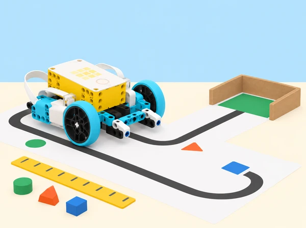

_El sensor dona una lectura; el programa n’indica les unitats, la transforma i l’usa en una decisió que podem provar._

## 🌱 Repte i context

Una classe vol comparar, amb dades fictícies i proves en maqueta, diverses maneres d’arribar a una activitat de barri. Els equips construeixen o adapten una base SPIKE Prime, mesuren el seu moviment en una ruta de paper, llegeixen entrades dels sensors, converteixen unitats i calculen velocitat o gir. Després dissenyen una ruta de transport escolar en miniatura i expliquen què pot demostrar un prototip, què depén de la prova i què no es pot inferir sobre les rutes o preferències reals de l’alumnat.

Aquesta situació adapta les set lliçons de la unitat 9 *Data and Math Functions* de LEGO Education *Introduction to Python Programming · Course 2*: obtindre dades amb sensors; variar velocitat amb operacions; usar variables i comparacions per comptar moviments; transformar graus de motor en canvis de direcció; practicar càlculs en un aparcament de maqueta; dissenyar un vehicle/ruta de transport fins a l’escola; i fer feedback i millores. L’objectiu no és entrenar una habilitat física ni fer un pla real de mobilitat, sinó comprendre la cadena mesura → càlcul → decisió → comprovació.

## 🎯 Aprenentatges i vocabulari

- Llegir dades de sensors SPIKE, interpretar el valor i la unitat, mostrar-lo en consola i reconéixer quan una lectura no és vàlida o no està disponible.

- Canviar un valor numèric amb addició/resta i relacions matemàtiques sense eixir dels límits segurs de potència o recorregut.

- Usar variables per comptar, estimar distància i calcular velocitat; convertir mil·límetres a centímetres i mil·lisegons a segons.

- Aplicar `<`, `<=`, `>`, `>=`, `==` i `!=` en regles que separen casos de prova.

- Explicar soroll, llindar, calibratge, repetició i error de mesura; comparar previsió amb observació sense presentar una dada com a exacta.

- Representar direcció i velocitat en una ruta simulada, relacionant magnituds del motor amb girs aproximats i comprovant les instruccions en una pista segura.

- Documentar les decisions, comunicar limitacions i revisar una solució amb les perspectives d’altres equips.

**Lectura:** valor que retorna el sensor en una instantània de la prova. **Mostreig:** moment o freqüència amb què llegim dades. **Calibrar:** ajustar una regla de lectura a les condicions i materials reals de la prova. **Variable:** nom que guarda una dada que pot canviar. **Velocitat:** distància recorreguda dividida pel temps. **Mitjana:** suma de valors dividida pel nombre de mesures; no oculta la dispersió entre intents.

```python
distancia_mm = 235
distancia_cm = distancia_mm / 10
temps_s = 5
velocitat_cm_s = distancia_cm / temps_s
print("cm:", distancia_cm, "cm/s:", velocitat_cm_s)
```

El fragment Python usa dades de mostra per explicar unitats. La mesura física, els ports i el moviment del vehicle s’han d’implementar amb les funcions disponibles en l’app SPIKE local; la compatibilitat entre versions s’ha de provar abans de classe.

## 🧰 Materials i preparació

Un set SPIKE Prime per equip amb hub carregat i base mòbil estable (o una plataforma amb una sola roda motriu si l’equip vol estudiar el gir), dos motors, sensor de força, sensor de distància i sensor de moviment integrat a l’hub; dispositiu amb SPIKE Python, cinta de paper, cartó per a carrils i aparcament, regla o cinta mètrica, cronòmetre extern opcional, targetes de forma/color per a fites, calculadora i diari de dades. No és necessari usar tots els sensors alhora: adapteu el repte al maquinari disponible.

Prepareu una ruta recta curta amb topall de cartó tou, carrils independents i una zona d’aturada clara. Mesureu distàncies manualment abans d’executar. Verifiqueu que el sensor de distància té camp de visió lliure, que la superfície de la ruta no rellisca i que el hub mostra lectures en la consola. El sensor de distància del repertori SPIKE retorna mil·límetres; feu explícita la conversió a centímetres. El sensor de moviment de l’hub dona orientació/angle, que no és directament un recompte de passos humans: aquesta situació evita recollir dades corporals i, si usa l’angle, gira el hub o un suport amb cura sobre la taula. Consulteu la Knowledge Base per a API actual i límits de motors.

Prepareu un full de dades amb columnes per a hipòtesi, entrada, unitat, valor esperat, valor mesurat, diferència, decisió de codi i observacions. Assigneu rols rotatius de programació, conducció, mesura i registre. Acordeu un límit de velocitat baix i una ordre d’aturada abans d’engegar motors.

## 📅 Seqüència didàctica · set lliçons

### **Lliçó 1 · Llegir i mostrar dades del sensor (45 min).**

#### Fase 1 · Activem i prediem

**Activació (7 min):** compareu quina informació caldria per descriure un trajecte en una maqueta: distància, durada, pressió sobre un botó, gir. Diferencieu una estimació d’una lectura mesurada.

#### Fase 2 · Explorem i construïm

**Exploració de l’editor (8 min):** connecteu hub SPIKE i mireu dades en viu del sensor de força; després acosteu/allunyeu un cartó del sensor de distància. El model es mou amb la mà només si està apagat. Anoteu què varia i què es manté.

#### Fase 3 · Expliquem i registrem

**Programa de lectura (15 min):** examineu tres patrons en Python: llegir una vegada i imprimir; llegir en bucle amb pausa; llegir només quan el sensor de força es prem. Compareu quin és millor per respondre una pregunta concreta i per què imprimir sense pausa ompli massa la consola. Creeu una versió mínima que llegisca distància i escriga `mm:` amb la unitat.

#### Fase 4 · Apliquem i millorem

**Conversió i test (10 min):** compareu mm amb cm dividint per deu i proveu objectes a distàncies conegudes (per exemple 100, 200 i 300 mm, ajustades a la taula). Si no hi ha lectura, no la tracteu com zero: anoteu “absent/desconeguda”.

#### Fase 5 · Comprovem i reflexionem

**Sortida (5 min):** indiqueu quina part és dada mesurada, quina és conversió i quina és unitat de representació. Expliqueu un error que s’introduiria si es mostrara 200 com a cm quan el sensor retorna mm.

### **Lliçó 2 · Ajustar velocitat amb operacions i límits (45 min).**

#### Fase 1 · Activem i prediem

**Discussió (5 min):** parleu de com es regula un ritme i per què un valor de programa no equival automàticament a la mateixa distància en diferents superfícies.

#### Fase 2 · Explorem i construïm

**Base i control (10 min):** prepareu una base SPIKE en pista recta. En Python, guardeu la velocitat en una variable numèrica, mostreu-la com a text a la matriu del hub (conversió explícita amb `str()` quan calga) i escriviu una funció de recorregut que use el valor actual.

#### Fase 3 · Expliquem i registrem

**Modificar amb botons (15 min):** configureu un botó per reduir i un altre per augmentar un pas acordat, per exemple 20 unitats; definiu mínim i màxim per impedir ordres negatives o massa ràpides. Proveu primer el límit en pseudocodi i després a velocitat baixa, mantenint fixa la distància i les condicions de la pista.

#### Fase 4 · Apliquem i millorem

**Dades (10 min):** per a tres valors de velocitat, feu tres intents i mesureu distància final i temps. Calculeu mitjanes i anoteu també rang (mínim–màxim), no sols una xifra central.

#### Fase 5 · Comprovem i reflexionem

**Reflexió (5 min):** expliqueu si augmentar la potència va canviar el temps, la distància o ambdós, i quines altres variables (bateria, fricció, alineació) podrien explicar diferències.

### **Lliçó 3 · Comptar oscil·lacions sense comptar-les dues vegades (45 min).**

#### Fase 1 · Activem i prediem

**Situació (5 min):** mostreu una sèrie de lectures d’angle d’un hub que gira a una banda i torna: 0°, 40°, 82°, 95°, 66°, −10°, −81°, −90°. Pregunteu quantes oscil·lacions s’hi veuen i per què comptar cada lectura per damunt de 75° donaria un nombre massa gran.

#### Fase 2 · Explorem i construïm

**Model i control de valors (10 min):** en una taula, apliqueu comparacions `>`, `<`, igualtat i desigualtat a les lectures i establiu un llindar com a part del model, no com a veritat universal.

#### Fase 3 · Expliquem i registrem

**Programa de comptatge (20 min):** useu el sensor de moviment integrat a l’hub en una base de taula o feu servir seqüències de dades prèviament preparades. Manteniu una variable `comptat_en_aquesta_banda` per sumar només quan l’angle travessa el llindar i rearmeu-la quan torna a la zona neutra. Afegiu un botó per acabar i mostrar el recompte. Imprimiu lectura crua i estat del comptador en consola perquè es puga auditar.

#### Fase 4 · Apliquem i millorem

**Validació (7 min):** feu una seqüència amb 0, 1, 3 moviments complets i diversos valors que oscil·len a prop del llindar; compareu recompte previst i observat.

#### Fase 5 · Comprovem i reflexionem

**Debrief (3 min):** què canviaria si el llindar fora 60° o 90°? Especifiqueu que és un comptador de rotacions de demostració, no un podòmetre ni una mesura fiable d’activitat física d’una persona.

### **Lliçó 4 · Moure i girar amb proporcions conegudes (45 min).**

#### Fase 1 · Activem i prediem

**Planificació (7 min):** dibuixeu una ruta de dos trams amb un gir a l’esquerra o a la dreta; convertiu cada tram en una ordre (avançar, aturar, girar) i marqueu les unitats.

#### Fase 2 · Explorem i construïm

**Programa inicial (15 min):** en una base SPIKE, controleu parell de motors per a avançar i useu variables per a velocitat i graus de gir. Mostreu el valor triat a la matriu/console. Expliqueu que el gir d’un vehicle depén de la separació de les rodes, la superfície, la velocitat i el lliscament: la relació entre una rotació i un quart de volta al terra és una aproximació del model d’exemple, no constant universal.

#### Fase 3 · Expliquem i registrem

**Prova matemàtica (13 min):** mesurau el gir resultant en una quadrícula gran de cartó per a dos valors de motor, repetiu tres vegades i calculeu desviació de l’angle previst. Relacioneu divisió/multiplicació amb l’ajust; canvieu una variable cada vegada.

#### Fase 4 · Apliquem i millorem

**Depuració (7 min):** analitzeu un fragment desconnectat al qual falta la quantitat de graus d’una crida de motor. Llegiu el missatge d’error i identifiqueu si assenyala exactament la línia problemàtica; corregiu-lo en una còpia i traceu quan s’executa la crida.

#### Fase 5 · Comprovem i reflexionem

**Tancament (3 min):** anoteu quina dada s’ha de tornar a calibrar després de canviar rodes o superfície.

### **Lliçó 5 · Aparcament de maqueta i gestió de dades (45 min).**

#### Fase 1 · Activem i prediem

**Repte (5 min):** estacionar la base en una zona ampla de cartó identificada amb forma i color, sense tocar límits ni competir en velocitat. És una simulació, no una funció de conducció autònoma segura.

#### Fase 2 · Explorem i construïm

**Mesura i algoritme (10 min):** mesureu longitud i amplada de la zona, distància d’aproximació i amplària de la base. Escriviu pseudocodi per avançar, llegir distància, reduir velocitat abans de la zona i aturar-se; declareu tolerància explícita i casos d’entrada absent.

#### Fase 3 · Expliquem i registrem

**Implementació (15 min):** useu comparacions numèriques per detectar “més lluny que”, “dins de la tolerància” o “lectura no vàlida”; convertiu mm/cm de manera explícita. Una marca de color pot ajudar a indicar posició, però no substitueix el sensor de distància si necessiteu una lectura mètrica. Afegiu parada manual i velocitat mínima per als últims centímetres.

#### Fase 4 · Apliquem i millorem

**Proves (10 min):** tres punts d’inici, dues distàncies i dues situacions de sensor (lectura/cap lectura). Registreu intents, error en cm i si el prototip ha quedat dins de la zona. No compareu resultats entre equips com a classificació: identifiqueu factors que poden variar.

#### Fase 5 · Comprovem i reflexionem

**Debrief (5 min):** un valor de distància pot ser prou precís per aquesta maqueta? Què caldria abans d’aplicar-lo a un vehicle real? Resposta esperada: un prototip educatiu no és un dispositiu de seguretat ni de transport real.

### **Lliçó 6 · Un trajecte escolar simulat (45 min).**

#### Fase 1 · Activem i prediem

**Definició (7 min):** cada equip tria un punt d’origen fictici, un destí escolar de maqueta i dues opcions de ruta construïdes amb paper. No es demana a ningú que revele el seu trajecte, domicili, mode de transport o temps personal. Redacteu una pregunta mesurable: quina ruta té menys longitud de pista? quina requereix menys girs?

#### Fase 2 · Explorem i construïm

**Disseny (8 min):** establiu restriccions: base SPIKE ha de seguir una ruta de cartó, evitar una zona marcada, aturar-se en una parada i comunicar la velocitat triada. L’equip proposa un vehicle i un procediment de prova en un esbós amb dues alternatives.

#### Fase 3 · Expliquem i registrem

**Construcció/programació (18 min):** construïu o ajusteu la base i programeu un recorregut amb una funció per avançar, una per girar i una rutina de registre. El programa calcula la longitud de ruta sumant trams i pot convertir la lectura de distància en unitats comunes. Afegiu un control d’aturada; no sobrecarregueu el model amb pesos.

#### Fase 4 · Apliquem i millorem

**Comprovació (8 min):** executeu ruta A i B tres vegades, registreu trams, durada, girs, lectures de distància i fallades. La taula només descriu el prototip sobre aquella superfície; no és una comparació de modes de transport ni un estudi de trànsit.

#### Fase 5 · Comprovem i reflexionem

**Mostra (4 min):** expliqueu quines dades han influït en una decisió de disseny i quines no s’han mesurat.

### **Lliçó 7 · Feedback i millora del trajecte (45 min).**

#### Fase 1 · Activem i prediem

**Preparació (7 min):** cada equip comparteix un diagrama de ruta, el codi comentat, un gràfic/taula amb intents i una pregunta sobre calibratge o accessibilitat.

#### Fase 2 · Explorem i construïm

**Prova creuada (12 min):** l’equip revisor usa una còpia de la ruta o repeteix el procediment amb permís. Dona feedback concret sobre llegibilitat, unitats, casos de sensor absent, seguretat de la pista i coherència entre objectiu i mesura. No se sol·liciten dades de trajecte de persones.

#### Fase 3 · Expliquem i registrem

**Planificació de canvi (5 min):** els autors trien una millora a partir d’una evidència (recol·locar sensor, corregir conversió, canviar llindar, aclarir unitat o dividir una funció).

#### Fase 4 · Apliquem i millorem

**Iteració (13 min):** feu el canvi i repetiu almenys el cas que va motivar-lo i un altre cas per assegurar que no s’ha degradat la resposta.

#### Fase 5 · Comprovem i reflexionem

**Avaluació individual (8 min):** expliqueu per què una mitjana sola pot ocultar la variació, quin càlcul del projecte podeu recrear i una limitació que contaríeu a qui veja la maqueta. Autoavaluació privada d’ús del temps, cura del material i col·laboració, amb una acció següent concreta.

## 🧪 Evidències i criteris d’avaluació

Portafolis: esquema dels sensors i ports reals; captures o transcripció de dades de mostra sense informació personal; conversió entre mm/cm i ms/s; codi Python comentat; pseudocodi i mapa de ruta; mesures manuals, repeticions, mitjanes i rangs; taula de casos de sensor absents; mesura de girs; registre de depuració; decisions de redisseny; diagrama o taula comparativa de rutes de maqueta; feedback entre iguals; i explicació de límits del prototip.

Valoreu quatre dimensions: **tractament de dades** (registra valor, unitat i condicions de mesura); **raonament matemàtic** (converteix unitats i calcula distància/temps amb operacions adequades); **programació** (variables, comparacions, condicions, sortida i aturada comprovables); i **mètode experimental** (repeteix, compara, registra incertesa i modifica una variable cada vegada). Afegiu comunicació i col·laboració al retorn final. Una ruta que es completa una vegada no demostra fiabilitat; un càlcul ben documentat que troba una fallada també és una evidència valuosa.

## ♿ Accessibilitat, privacitat i seguretat

Oferiu mesures amb regle sobre paper si la connexió o el sensor no està disponible; totes les proves poden fer-se en taula. Les fites tenen forma, símbol i color; eviteu dependre d’una única pista visual o auditiva. Hi ha rols de registre, disseny de ruta, codi i observació, amb rotació. No mesureu ni publiqueu dades corporals, passos, activitat, domicilis o trajectes personals d’alumnes. Les rutes són inventades i les dades són del robot o de targetes sintètiques. Manteniu la base sobre una superfície horitzontal amb marges i topalls tous, velocitat baixa i aturada manual; no feu circular robots per passadissos amb persones ni a prop d’escales. Desconnecteu motors abans d’ajustar la construcció.

## 🔗 Referent oficial i adaptació

Adapta les set lliçons de la unitat 9 *Data and Math Functions* del curs LEGO Education [*Introduction to Python Programming · Course 2*](https://assets.education.lego.com/v3/assets/blt293eea581807678a/blt5436c2a0ac31fc17/65e9d0ef2a3929468f30be14/File_2_Units_678910_Intro_to_Python_Course_TG_Course_2.pdf?locale=en-us): *Get Moving to Get Data*, *Bike Riding for Data*, *Counting Your Steps*, *Make It Move*, *Parking Lot*, *My Transportation* i *Ideas to Help with My Transportation*. Conserva lectura de sensors i consola, distància en mm amb conversió a cm, ajust de velocitat amb variable, sensor de moviment i llindars/estat per a evitar dobles recomptes, càlcul de distància i velocitat, girs amb operacions, depuració de crides, aparcament, disseny de transport, planificació i feedback. El repte de passos corporals es transforma en gir del hub/seqüència sintètica i declara explícitament que no és un pedòmetre; el trajecte és una maqueta i les dades no són sobre mobilitat personal. Les instruccions de construcció i els programes complets oficials no es reprodueixen; els exemples de codi de la fitxa són conceptuals i l’API es comprova en la versió local.
