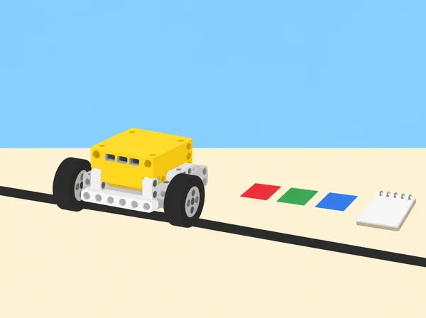

_Depurar és reunir evidència: observar la maqueta, provar el codi i modificar una causa cada vegada._

## 🌱 Repte i intenció

Un equip prepara una maqueta interactiva d’indicacions per a una fira escolar. Una base SPIKE Prime recorre una ruta curta, llig targetes de color i comunica l’estat mitjançant llum, so o un moviment controlat. El repte no és fer que funcione a la primera: cal poder determinar per què una prova ha fallat, si la causa és la construcció, un cable/port, la sintaxi Python, la lògica, les dades del sensor o la interacció d’aquestes parts. La situació adapta les sis lliçons de la unitat 6 *Troubleshooting and Debugging* de LEGO Education *Introduction to Python Programming · Course 2*. A diferència de les situacions SPIKE basades en blocs, totes les proves de programa d’aquesta fitxa es fan en Python textual i s’acompanyen de pseudocodi, consola i registre d’errors. Els programes motors funcionen a velocitat baixa i en una pista de taula delimitada.

## 🎯 Objectius i vocabulari

- Aplicar un procés de disseny: definir el problema, investigar, idear, triar una solució, construir un prototip, provar-lo, comunicar-lo i redissenyar-lo.

- Distingir entre prototip físic i programa; verificar la mecànica sense codi abans d’executar Python.

- Llegir un traceback i identificar la línia que orienta una investigació; fer hipòtesis i provar-les sense canviar moltes coses alhora.

- Diferenciar error de sintaxi (gramàtica Python), error d’execució (excepció mentre corre) i error de lògica (el codi s’executa però el resultat no és l’esperat).

- Diagnosticar problemes de maquinari revisant muntatge, ports, connexions i peça mòbil de manera ordenada.

- Escriure pseudocodi/comentaris, usar casos esperats i inesperats, registrar canvis i oferir feedback específic i aplicable.

**Bug:** defecte en el codi o muntatge que causa un resultat no desitjat. **Depuració:** procés de localitzar, entendre i corregir una causa amb proves. **Prototip:** model inicial usat per comprovar una idea, no producte final certificat. **Iteració:** canvi informat seguit d’una nova prova.

## 🧰 Materials i preparació

Un set SPIKE Prime 45678, hub carregat, dispositiu amb la versió de l’app SPIKE que permeta obrir projectes Python i consola, base mòbil senzilla amb sensor de color opcional, cables i motors, targetes mate d’alt contrast, cinta de paper, cartó i diari d’enginyeria. Confirmeu abans de classe que l’entorn Python detecta el hub i quina API de SPIKE està disponible; les funcions concretes i missatges d’error poden variar entre versions. Consulteu la documentació/Knowledge Base integrada en la mateixa versió, i no copieu codi sense llegir-lo. Prepareu una pista que no requerisca precisió mil·limètrica, una llista de ports/muntatge previstos, dues proves positives, dues negatives i fragments d’error deliberadament segurs que l’alumnat només corregirà en un entorn desconnectat abans de fer-los córrer. No provoqueu fallades que puguen fer eixir el robot de la taula o atrapar dits.

En parelles, alterneu rols cada 10–15 minuts: pilot de teclat i observador/a que llig el pseudocodi, comprova la consola i registra predicció/observació. L’equip també necessita una persona responsable del maquinari en cada prova; cap cable es canvia amb motors en marxa.

## 📅 Seqüència didàctica · sis lliçons

### **Lliçó 1 · Provar un prototip abans de programar (45 min).**

**Activació:** compareu objectes de disseny que funcionen a la primera amb aquells que necessiten millores i introduïu el cicle: definir, investigar, idear, seleccionar, construir, provar, comunicar i redissenyar. **Repte:** crear amb cartó i peces una senyalística de taula per a una fira escolar: el missatge ha de ser llegible a una distància acordada, mantindre’s dret i donar una indicació equivalent en dues modalitats (per exemple, llum i forma visible). Definiu criteris mesurables i restriccions (temps, peces i mida) abans de construir; dibuixeu dues solucions possibles i trieu-ne una amb raó. **Prova:** poseu a prova estabilitat amb una bufada suau o un toc lleuger estandarditzat, llegibilitat des de dos punts i comprensió amb targetes de resposta voluntàries i anònimes. No es fa prova amb peses o líquids. **Registre:** fotografieu/dibuixeu versió 1, anoteu què ha passat i canvieu una propietat; una nova prova comprova si el canvi ha millorat el criteri. En una mini-extensió, decidiu quin senyal podria mostrar la SPIKE hub matrix i quin missatge necessita una targeta o text alié al hub. **Reflexió:** què ha ensenyat una fallada que no s’hauria pogut saber mirant només l’esbós? Per què cap mesura sola demostra que el senyal és comprensible per a tothom?

### **Lliçó 2 · El moviment esperat i el primer traceback (45 min).**

**Activació:** mireu un moviment mecànic curt triat per la docent o analitzeu una base real LEGO SPIKE parada; descriviu cada moviment en verbs i ordre. Abans d’encendre motors, gireu cada element a mà només si el muntatge ho permet amb seguretat i anoteu punts d’encallament, joc mecànic o moviment asimètric. **Pseudocodi:** “posiciona el mecanisme; repeteix tres vegades: avança el braç una quantitat fixa; torna’l; pausa”. Traduïu només aquest fragment a Python amb funcions de la Knowledge Base de l’app instal·lada. Després la docent proporciona una còpia incompleta que té un error de sintaxi deliberat (puntuació o indentació) en un fragment curt de prova; no executeu l’original fins a revisar-lo. Llegiu la consola, localitzeu la línia indicada i corregiu el caràcter necessari; compareu la interpretació amb pseudocodi. **Debugging a pas curt:** deseu una còpia inicial, feu una sola edició, torneu a executar amb l’eixida assegurada i anoteu error abans/després. Si apareix un altre missatge, llegiu-lo complet abans d’editar. **Preguntes:** què fa el traceback i què no pot dir? Per què provar el moviment sense programa redueix possibles causes? Tanqueu amb una explicació de sintaxi com a “gramàtica que Python pot llegir”, no com a mesura d’intel·ligència.

### **Lliçó 3 · Una resposta per cada entrada: depuració lògica (45 min).**

**Planificació de proves:** creeu pseudocodi i una taula entrada → resposta esperada per a tres o quatre targetes del sistema de senyalística. Una targeta pot activar llum A, una altra so opcional i una altra el moviment d’un motor; les targetes no assignades han de deixar el mecanisme aturat i donar una indicació neutral. **Implementació:** programau en Python la lectura del sensor de color segons les funcions documentades en l’app. Comenceu amb un color, proveu lectura en viu amb sensor fix i registreu el valor retornat, després afegiu una segona condició. No suposeu que paper, impressió i llum ambiental produeixen valors exactes: feu una targeta de referència i un mecanisme d’entrada manual com a alternativa. **Prova sistemàtica:** compareu el resultat real amb la taula: cada color esperat; un color no assignat; absència de targeta; targeta girada o amb llum canviada. Si no apareix una excepció però la resposta no correspon a l’especificació, és un possible error de lògica o calibratge, no un error de sintaxi. Canvieu una condició/llindar i repetiu; no retoqueu programa i llum alhora. Registreu cada entrada, valor llegit, branca executada i canvi fet. Acabeu explicant per què “el programa acaba sense error” no prova que faça el que volíem.

### **Lliçó 4 · Quan el problema és el maquinari? (90 min).**

**Investigació:** la base rep una ruta de prova que hauria de desplaçar-se fins a una marca, però no ho fa. Primer confirmeu el programa de referència amb motors aturats o valors de prova segurs; després seguiu una llista de verificació sense reescriure codi: hub carregat/connectat, port declarat vs port ocupat, connector complet, motor lliure, orientació del sensor, cable sense tensió i muntatge sense fricció. Dividiu cada diagnòstic en subcomponents i proveu-los per separat. **Casos de fallada controlats:** feu que la docent prepare estacions amb un cable desconnectat (hub aturat), port intencionadament incorrecte al codi però sense activar motors, i sensor que no arriba a veure la marca. Cada equip descriu el símptoma abans de corregir una cosa. Si hi ha codi d’error d’API o port buit, deseu el traceback i relacioneu-lo amb el mapa de ports. **Proves:** manteniu la mateixa ruta i una velocitat baixa; després d’una correcció, feu tres intents i anoteu inici, port/sensor usat, resultat i variació. En cada prova, assegureu una aturada manual i manteniu mans fora de rodes/engranatges. **Conclusió:** distingiu “Python ha demanat el motor equivocat”, “el motor no respon per connexió/muntatge” i “el sistema es mou però la ruta no arriba a la marca”. Digueu quina evidència us permet afirmar cada diagnòstic, i quina alternativa cal si la peça o el sensor no està disponible.

### **Lliçó 5 · Debug-inator: caçar errors sense crear risc (45 min).**

**Estacions de codi desconnectades:** rebeu tres fragments Python de la maqueta amb un error cadascun: (1) sintaxi, com una puntuació/indentació que impedeix interpretar el programa; (2) execució, com una adreça de port no ocupada; (3) lògica, com una comparació amb el valor de color equivocat. Predigueu abans si el programa arriba a executar-se, si s’aturarà amb excepció o si produirà resultat equivocat; marqueu la línia o condició sospitosa i escriviu una prova que ho confirme. **Laboratori segur:** els errors de sintaxi/lògica es poden corregir en simulació o paper; només correu fragments de maquinari després de comprovar connexions, velocitat i espai. L’error de runtime del port buit s’investiga amb el motor aturat i la consola disponible, no es deixa girar un muntatge mal connectat. **Repte:** cada parella dissenya un cas de depuració amb una entrada, un resultat esperat i una observació que permet diferenciar dues causes possibles; intercanvieu casos amb altra parella. **Registre:** tipus d’error, missatge o símptoma, hipòtesi, experiment mínim, correcció i resultat posterior. La consola no pot revelar per si sola un error de lògica: l’especificació i les proves donen el resultat esperat contra el qual comparar.

### **Lliçó 6 · Feedback que ajuda a depurar (30–45 min).**

**Preparació:** cada equip tria una funció petita del prototip i prepara un programa comentat, un cas de prova i una incertesa; no cal mostrar codi personal ni tota la maqueta. **Intercanvi:** l’equip revisor executa (o traça en paper) el test sense tocar el projecte original, descriu el resultat i ofereix feedback específic: “he observat…”, “esperava…”, “potser falta provar…”. No dona ordres ni altera el codi/robot alié. L’equip autor decideix quin suggeriment adopta, quin no i per què. **Redisseny:** apliqueu una millora, torneu a executar el mateix cas i un cas inesperat, i registreu si el canvi va resoldre el problema o va crear-ne un altre. **Reflexió individual:** descriviu una contribució pròpia i com vau donar o rebre feedback; escala d’1–3 per a ús del temps i cura de peces, sense classificar habilitats personals. Tanqueu amb una ronda oral o escrita: una pràctica que ajuda a detectar errors, un límit de la consola i una prova que falta abans de dir que el prototip està llest.

## 🧪 Evidències i avaluació

El quadern conserva cicle de disseny, pseudocodi, criteris del prototip, fragments Python comentats, traceback o símptoma, classificació de cada error, mapa de ports, casos esperats/inesperats, registre de tres intents després d’una reparació, feedback rebut i decisió de redisseny. Avalueu si l’alumne (1) diferencia disseny, maquinari i programari; (2) interpreta error de sintaxi, d’execució o de lògica amb evidències; (3) canvia una causa cada vegada; (4) prova casos rellevants i documenta; i (5) explica què queda sense resoldre. L’avaluació docent usa preguntes i observació, coavaluació específica i autoavaluació privada, com recomana la guia. Un programa no rep valoració alta només perquè acaba sense excepció: s’ha de comparar amb les especificacions i les proves.

## ♿ Inclusió, privacitat i seguretat

Oferiu l’opció de seguir pseudocodi en paper, usar simulació o fer rol d’observació, sense excloure ningú de la resolució. Compartiu fragments de codi preparats, no dades personals ni projectes identificables. Feedback dirigit al codi i al resultat, mai a la capacitat de la persona. Llums i sons tenen alternativa visual/textual i volum baix. Limiteu velocitat, immobilitzeu el vehicle abans de canviar ports i no poseu mans en engranatges; no provoqueu errors de port amb motor en marxa. Abans de la sessió, docent verifica compatibilitat de biblioteca/API amb la versió de l’app usada per l’alumnat.

## 🔗 Referent oficial i adaptació

Adapta les sis lliçons de la unitat 6 *Troubleshooting and Debugging* del curs LEGO Education [*Introduction to Python Programming · Course 2*](https://assets.education.lego.com/v3/assets/blt293eea581807678a/blt5436c2a0ac31fc17/65e9d0ef2a3929468f30be14/File_2_Units_678910_Intro_to_Python_Course_TG_Course_2.pdf?locale=en-us): *Testing Prototypes*, *Break Dancer Break Down*, *Dance to the Beat?*, *Testing for Trouble*, *Debug-inator* i *Ideas to Help with the Debug-inator*. Manté disseny iteratiu, diagnòstic separat de model/programa, lectura de traceback, sintaxi/lògica/runtime, resposta per color, verificació de ports i peces, proves fora de rang i feedback de companys; transforma pont i ball en senyalística i trajecte escolar propis. La guia usa l’API Python de SPIKE i consola; aquesta adaptació demana verificar funcions en la versió local abans d’executar codi.
