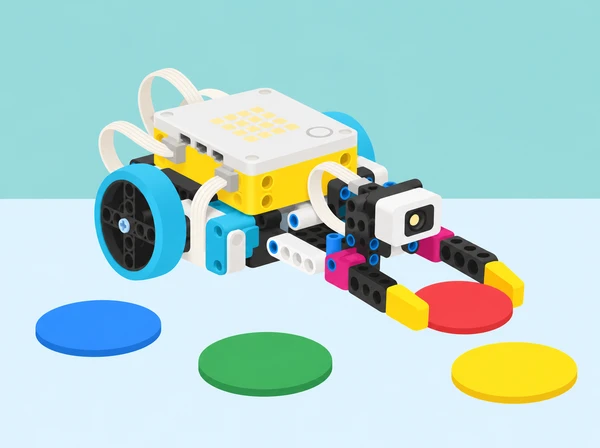

_Una funció concentra una acció; els paràmetres permeten reutilitzar-la amb valors diferents._

## 🌱 Repte i sentit

La comunitat educativa vol preparar una jornada de reutilització de materials i necessita ordenar fitxes netes de cartó, paper i envasos simulats en una maqueta de taula. Un equip construeix un mecanisme simple amb peces SPIKE Prime i escriu en Python un programa que classifica mostres de colors acordats. El robot no identifica materials reals ni decideix què es recicla: en aquesta maqueta, el color és una etiqueta creada per la classe, i les persones comproven i validen la classificació. La pregunta d’enginyeria és com separar un procediment llarg en accions amb nom, com repetir-lo amb dades diferents i com demostrar que la reutilització manté el comportament esperat.

La seqüència adapta les sis lliçons de la unitat 7 *Functions* de LEGO Education *Introduction to Python Programming · Course 2*. Progressa des de la descomposició d’una acció, passa per diverses funcions i funcions amb paràmetres, i arriba a un prototip ambiental investigat, provat i revisat amb feedback. La programació és Python textual: el pseudocodi ajuda a planificar, però no substitueix les funcions i crides de Python.

## 🎯 Aprenentatges i llenguatge

- Descompondre una tasca en subproblemes i donar noms clars a accions que es repetiran.

- Definir una funció amb `def`, indentació i cos; explicar la diferència entre definir-la i cridar-la.

- Crear i cridar diverses funcions en un ordre deliberat, evitant duplicar instruccions.

- Usar paràmetres com a noms d’entrada dins d’una funció i arguments com a valors concrets en la crida; anticipar errors de quantitat o ordre.

- Separar lectura del sensor, decisió de classificació i actuació mecànica perquè es puguen provar independentment.

- Provar casos coneguts i no assignats, registrar resultats, depurar una causa cada vegada i justificar redissenys.

- Comunicar límits del prototip: una lectura de color no és identificació material ni una recomanació real de reciclatge.

**Funció:** bloc de codi amb nom que es pot executar quan es crida. **Paràmetre:** nom declarat entre els parèntesis de la definició; rep una dada quan la funció és cridada. **Argument:** valor concret que passem en una crida. **Descomposició:** dividir una tasca complexa en parts que es poden entendre, construir i provar. **Cas de prova:** entrada, comportament esperat i resultat observat.

```python
def mostrar_estat(etiqueta, color):
    print(etiqueta, color)

mostrar_estat("Mostra A", "blau")
```

En l’exemple, `etiqueta` i `color` són paràmetres; `"Mostra A"` i `"blau"` són arguments. És Python general vàlid per entendre la idea. Les ordres SPIKE de motors, sensors i runloop s’han de consultar en la Knowledge Base de la versió de l’app instal·lada: no s’ha de copiar aquest exemple com si fóra un programa de maquinari complet.

## 🧰 Materials i preparació docent

Un set SPIKE Prime per equip, hub carregat, dispositiu amb app SPIKE i editor Python disponible, sensor de color del set, un motor i peces Technic per a una pinça o porta de triatge senzilla, cartó per a canals i contenidors, fitxes grans de colors mats, cinta de paper, diari de disseny, cronòmetre extern opcional i ordinador/projector per mostrar fragments curts. El model pot ser fix sobre la taula: la base mòbil no és necessària per a la tasca. Eviteu instruccions de construcció privades o copiar models de marca; cada equip dissenya una solució amb peces de la seua caixa.

Abans de classe, comproveu que l’editor Python detecta el hub, que el sensor i motor estan connectats als ports acordats i que es pot aturar l’execució. Les versions de l’app poden oferir API diferents. Prepareu quatre etiquetes de color provades amb la llum de l’aula, una etiqueta sense correspondència, una entrada manual alternativa per si el sensor falla i còpies desconnectades de crides correctes i incorrectes. Desactiveu motors abans de connectar o canviar cables. Poseu el mecanisme a baixa velocitat, amb topalls de recorregut i dits lluny de la pinça.

Equips de 2–3 persones: programació/lectura del codi, cura del mecanisme i registre de proves. Feu rotació de rols a cada lliçó. La persona que observa té dret a demanar una pausa abans d’executar qualsevol canvi físic.

## 📅 Seqüència didàctica · sis lliçons

### **Lliçó 1 · Una tasca, moltes accions amb nom (45 min).**

**Activació (8 min):** demaneu que descriguen oralment un gest repetible —per exemple, alçar un cartell i tornar-lo a la posició inicial— i marqueu on reapareixen les mateixes instruccions. Escriviu-les en pseudocodi i pregunteu què canviaria si repetírem el gest amb un altre missatge. **Model (10 min):** compareu una seqüència amb les mateixes línies copiades tres vegades i una seqüència que defineix `saludar()` una vegada i la crida en tres punts. No executeu encara el mecanisme; feu traça en paper per comprovar definició, crida i ordre. **Repte (20 min):** construir una xicoteta aleta/indicador articulat amb un motor SPIKE que faça un senyal d’inici, un senyal de “mostra preparada” i un retorn a la posició inicial. Descomponeu el comportament en `preparar()`, `indicar()` i `tornar()`; definiu-los amb `def` i crideu-los en l’ordre del pseudocodi. Consulteu la Knowledge Base per a ordres de motor compatibles. Proveu primer cada funció amb mecanisme desconnectat o sense càrrega, després amb un moviment curt i lent. **Evidència i conversa (7 min):** dibuixeu les crides com una línia temporal i expliqueu quina instrucció s’executa primer i per què el codi dins una definició no corre fins que la funció és cridada. **Extensió:** canvieu l’ordre de dues crides i predigueu el comportament abans de provar-lo.

### **Lliçó 2 · Dues pinces, dues funcions de captura (45 min).**

**Pregunta d’investigació:** com pot el mateix programa controlar accessoris amb agafades diferents? Dissenyeu en esbós dues puntes intercanviables —una ampla i lleugera per a una fitxa gran i una més estreta per a una fitxa menuda— sense que cap peça puga caure de la taula. No cal fabricar ambdues si el temps o les peces no ho permeten: una pinça i una palanca de cartó poden representar la segona variant. **Descomposició (8 min):** feu una seqüència com ara esperar ordre, tancar fins a límit segur, indicar captura i obrir. Marqueu quines accions són comunes i quines depenen de la forma de l’accessori. **Construcció i Python (25 min):** creeu dues funcions amb noms que expliquen la diferència (per exemple, `agafar_fitxa_gran()` i `agafar_fitxa_menuda()`) i un programa principal que crida la funció adequada segons una etiqueta triada per l’equip. Compareu aquest disseny amb una llarga còpia de codi duplicat: compteu quines línies canvien i quines es repeteixen. Calibreu cada recorregut amb la pinça buida, sense posar dits en la zona de tancament. **Proves (7 min):** proveu tres vegades una mateixa fitxa amb cada variant; registreu si l’agafa, si llisca, si es deforma i si la deixa al contenidor. **Reflexió:** per què ajuda tindre funcions separades quan cada accessori necessita un moviment distint? En quins casos seria millor compartir una funció comuna i canviar només una dada?

### **Lliçó 3 · Una funció, entrades diferents: paràmetres (45 min).**

**Activació corporal (7 min):** feu un gràfic humà de preferències amb quatre opcions neutres (per exemple, quin tipus de missatge visual es comprén millor); compteu les respostes sense guardar noms. Relacioneu categories i quantitats amb la necessitat d’enviar dades a una mateixa acció. **Modelatge (10 min):** escriviu una funció de programari general `informar(etiqueta, color)` i crideu-la amb dos conjunts d’arguments. L’alumnat assenyala què és fix i què varia. Contrasteu-la amb una funció sense paràmetres i observeu que definir paràmetres obliga a proporcionar arguments en cridar-la. **Estació SPIKE (20 min):** el sensor llig una de quatre fitxes mat provades; el programa assigna una resposta de la maqueta (posició curta/mitjana/llarga del motor i missatge de consola). Separeu la funció que informa de les dades i la part que llig el sensor: una funció d’actuació rep arguments ja decidits per la regla. Per exemple, el programa pot cridar `indicar(20, "paper")` o `indicar(45, "cartró")`; traduïu les posicions a l’API disponible només després de consultar-la. Incloeu un color sense assignació que no tanque la pinça i mostre “sense lectura”. **Depuració guiada (8 min):** compareu crides amb dos arguments, un argument i arguments intercanviats. Predigueu quines fallen immediatament i quines podrien executar-se però mostrar una etiqueta incorrecta. Registreu definició, crida, error/sortida i correcció. **Eixida:** cada alumne completa “el paràmetre és…, el valor concret que he passat és…”.

### **Lliçó 4 · Una estació de triatge automàtica en maqueta (90 min).**

**Repte i criteris (12 min):** programar un prototip que reba una fitxa d’una en una i la porte al contenidor assignat pel codi de colors acordat per la classe. No es tracta d’identificar el material real. Fixeu criteris: no agafar fitxes no assignades; col·locar la fitxa dins una zona marcada; mantindre les peces senceres; respondre amb un indicador comprensible; permetre una aturada manual. Registreu les limitacions abans de construir. **Ideació i maqueta (18 min):** esbosseu dos mecanismes possibles (braç/pinça, porta desviadora o canal accionat); compareu nombre de peces, recorregut i risc d’encallament; seleccioneu-ne un i construïu-lo amb una fitxa de prova, sense reproduir cap model oficial. **Pseudocodi (10 min):** descriviu una volta: esperar activació; llegir color; seleccionar regla; cridar funció de triatge amb arguments; mostrar confirmació o “no reconegut”; esperar nova mostra. **Programa (20 min):** organitzeu funcions per responsabilitat: per exemple, `llegir_mostra()`, `informar_resultat(etiqueta, posicio)` i una rutina d’actuació de cada mecanisme. La lectura del sensor de color, els valors previstos i les ordres del motor depenen de la versió de l’app i han de consultar-se en la Knowledge Base. Manteniu separada la regla escolar de classificació de l’acció física del robot. **Proves (20 min):** creeu una taula amb entrada, resultat esperat, observació i decisió: cada color assignat, un color no assignat, absència de fitxa, peça girada i dos intents seguits. Feu tres assajos per color assignat; compteu encerts sobre intents, errors de lectura, encallaments i temps aproximat, sense presentar el recompte com una certificació. Canvieu només una variable cada vegada (llum, posició del sensor, llindar, geometria o argument). **Tancament (10 min):** expliqueu un error que la funció reusable ha evitat i un límit del sensor que l’equip encara ha de comunicar a l’usuari.

### **Lliçó 5 · Investigar una necessitat de l’entorn escolar (90 min).**

**Exploració (15 min):** trieu amb el centre un flux de materials nets que existisca a l’aula o en una activitat escolar: repartir targetes, ordenar peces reutilitzables o tornar material a safates. No manipuleu residus reals ni fotografieu persones. Si no hi ha temps per a una visita, useu una planta de l’espai o un escenari inventat clarament identificat com a simulació. Escriviu qui fa la tasca, què costa o es confon i quina dada permetria prendre una decisió millor; no convertiu una observació puntual en afirmació sobre tota l’escola. **Defineix i idea (15 min):** formuleu una necessitat en una frase neutral, seleccioneu usuari i condicions d’ús, i redacteu dos criteris mesurables i dues restriccions (temps, peces, estabilitat o accessibilitat). Esbosseu individualment dues solucions abans de consensuar un prototip. **Construcció i funcions (30 min):** munteu una ajuda de taula que classifique o indique el pas d’una fitxa simulada. Decomposeu-la en subproblemes: rebre, detectar o seleccionar, actuar, informar i reiniciar. Escriviu funcions amb noms coherents, paràmetres per a les dades variables i comentaris per explicar decisions no òbvies. Eviteu una funció monolítica que llig sensor, tria categoria, mou motor i imprimeix tot a la vegada. **Pla de prova i revisió (20 min):** prepareu casos normals, frontera/no assignat i repetició; deixeu un marge físic al voltant de l’accessori i una parada manual. Executeu-los, registreu predicció/resultat i canvieu un element per iteració. **Comunicació (10 min):** escriviu una targeta d’ús que explique entrada, resultat, què fer amb “sense lectura” i què el prototip no pot determinar. Si la necessitat s’ha identificat al centre, demaneu a una persona adulta que confirme que la descripció és respectuosa i no conté dades personals.

### **Lliçó 6 · Idees per millorar i retorn entre equips (45 min).**

**Preparació (8 min):** cada equip deixa un programa curt comentat, una taula amb almenys dos casos, la targeta d’ús i una pregunta oberta. Compartiu només dades simulades i codi necessari per entendre la maqueta; no publiqueu informació del centre. **Revisió (12 min):** un altre equip segueix pseudocodi o prova la maqueta amb el permís de l’equip autor. El retorn descriu evidència amb una pauta: “he observat…”, “esperava…”, “un cas que encara provaria és…”. No es canvia ni es reescriu el projecte d’un altre grup. **Decisió (5 min):** l’equip autor marca quina idea adopta, quina deixa per més avant i amb quina evidència ho justifica. **Redisseny (12 min):** feu una única millora: aclarir un nom, reorganitzar crides, validar un argument, afegir resposta a entrada no assignada o fer més llegible l’indicador. Repetiu el cas que va motivar-la i un cas diferent per comprovar que no s’ha trencat una resposta existent. **Autoavaluació (8 min):** cada persona registra una contribució pròpia, una ajuda que ha rebut, una pràctica de codi que entén millor i una pregunta que queda oberta. Escala privada d’1–3 per a ús del temps i cura del material, amb un objectiu de millora, sense comparar alumnat.

## 🧪 Evidències, avaluació i producte final

El portafolis d’equip conté: definició de la necessitat i límits; dos esbossos i una decisió amb criteris; pseudocodi; mapa de funcions i crides; codi Python comentat; explicació de paràmetres i arguments amb un exemple propi; taula d’entrades esperades/no assignades i resultats; registre de depuració; proves repetides; feedback rebut i decisió de redisseny; i una targeta d’ús amb les limitacions del prototip. El producte final és una maqueta de triatge de fitxes netes, una demostració de menys de dos minuts i una explicació oral o escrita que distingeix dada, regla i actuació.

Observeu quatre dimensions amb descriptors: **estructura** (identifica i crida funcions en un ordre coherent), **paràmetres** (diferencia definició, paràmetre i argument i comprova quantitat/ordre), **validació** (prova casos assignats i no assignats, registra evidència i explica un canvi), i **comunicació/col·laboració** (documenta el codi, respon al feedback i declara límits). En cada dimensió, useu nivells “encara necessita modelatge / ho fa amb suport / ho fa amb autonomia / ho transfereix i ho justifica”. La valoració no depén només que el robot es moga: una funció ben provada i una limitació ben comunicada també són evidència d’aprenentatge.

## ♿ Accessibilitat, seguretat i sostenibilitat

Permeteu pseudocodi oral, tauler de crides en paper, fragments Python amb tipografia ampliada o lectura compartida; els rols de disseny, registre, proves i programació tenen valor equivalent i roten. Les etiquetes s’identifiquen amb color i forma/textura o símbol triat per l’alumnat, sense dependre només de la visió del color. Useu peces grans, netes i lleugeres; manteniu la pinça a la taula, amb velocitat limitada, recorregut curt i aturada manual. No executeu canvis mentre hi ha mans prop del mecanisme. No introduïu residus, menjar, líquids ni objectes punxants. Recolliu i reutilitzeu les fitxes. Eviteu dades personals, etiquetes amb noms, imatges d’alumnes i afirmacions sobre pràctiques ambientals del centre que no s’hagen comprovat.

## 🔗 Referent oficial i decisions d’adaptació

Adapta les sis lliçons de la unitat 7 *Functions* del curs LEGO Education [*Introduction to Python Programming · Course 2*](https://assets.education.lego.com/v3/assets/blt293eea581807678a/blt5436c2a0ac31fc17/65e9d0ef2a3929468f30be14/File_2_Units_678910_Intro_to_Python_Course_TG_Course_2.pdf?locale=en-us): *Turtle Trouble*, *Clean Up with Multiple Functions*, *Clean Indicator*, *Automate the Clean Up*, *Taking Care of My Environment* i *Ideas to Help with My Environment*. Conserva la progressió de descomposició i funcions, diverses funcions per a mecanismes diferents, paràmetres i depuració de les crides, triatge amb dades, repte de disseny ambiental en context autèntic, documentació, proves i feedback. La tortuga i la neteja de residus es transformen en una necessitat de circulació de materials nets triada localment; les regles de colors són una simulació acordada per l’aula, i no es diu que el sensor reconega materials. S’han creat relat, activitats, evidències i il·lustració propis; no es copien instruccions de construcció ni codi complet del fabricant. La guia oficial especifica lliçons de 45 minuts, amb activitats de 90 minuts per a l’automatització i el projecte ambiental, i una sessió final de feedback; aquesta proposta manté sis lliçons i distribueix la durada segons la disponibilitat del centre.
