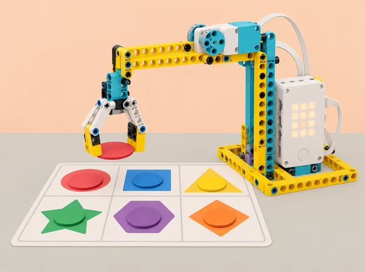

_Una regla de joc és un contracte: cal poder anticipar la resposta, provar-la i entendre la puntuació._

## 🌱 Repte i sentit

Una escola prepara una fira de jocs cooperatius inspirada en les festes i fires locals. Un grup crea una estació interactiva amb SPIKE Prime: la inclinació del hub pot seleccionar una direcció, un mecanisme lleuger pot recollir una fitxa de paper, el sensor de color pot llegir una peça de prova i un marcador de llum o moviment comunica el resultat. Les regles han de ser públiques, provar-se amb casos previstos i inesperats i permetre una partida sense rapidesa física, so obligatori ni informació personal.

Aquesta proposta adapta la unitat 5 *Playing Games with Simple Conditions* de LEGO Education *Introduction to Python Programming · Course 1*: *Controlling Motion with Tilt*, *Claw Machine*, *Charting Game Decisions*, *Guess Which Color*, *Guessing Game*, *Score!*, *Game Time* i *Ideas to Help with Game Time*. Progressa des de l’entrada d’inclinació i la condició simple cap a un mecanisme amb bucle, diagrama de decisions, sensor de color, condicions `if/elif/else` i depuració, puntuació amb matriu/moviment, disseny de joc i revisió entre equips. Totes les regles, taulers i exemples d’aquesta fitxa són propis.

## 🎯 Aprenentatges i vocabulari

- Explicar que una condició Python avalua una expressió i decideix si executa una branca.

- Llegir valors d’inclinació o orientació del sensor de moviment del hub en la forma que expose l’API local; mapar-los a accions limitades i reversibles.

- Relacionar un bucle de joc amb la ronda d’una partida i definir explícitament quan comença, continua i acaba.

- Descompondre les regles en un diagrama de flux abans d’implementar-les, incloent resposta per entrada desconeguda i cas de partida acabada.

- Programar una decisió basada en color amb valors mesurats en la llum real de l’aula; distingir el color llegit de la interpretació o regla que l’equip li assigna.

- Usar `if`, `elif`, `else` i comparacions per seleccionar una resposta; depurar sintaxi, indentació, branca inaccessible o condició invertida.

- Gestionar puntuació amb una variable i un senyal de matriu o moviment senzill, comprovant que la puntuació s’actualitza una vegada per esdeveniment.

- Provar el joc amb diferents persones, demanar consentiment, oferir modes d’accés alternatius i aplicar feedback específic.

**Condició:** expressió booleana que és vertadera o falsa. **Branca:** camí que s’executa segons la condició. **Sensor de moviment del hub:** component integrat que informa orientació/inclinació dins dels límits de la seua API. **Estat:** situació actual del joc (espera, ronda, puntuació, acabat). **Puntuació:** comptador acordat pel disseny, no mesura de valor personal. **Cas límit:** entrada que posa a prova una frontera o situació no ordinària.

```python
# Python general: tres respostes explícites per a una entrada ja triada
if direccio == "nord":
    resposta = "avança una casella"
elif direccio == "sud":
    resposta = "torna a la zona inicial"
else:
    resposta = "espera i demana una nova selecció"
```

Aquest exemple usa dades fictícies i no llig inclinació ni controla el robot. Els noms i mètodes de lectura de sensor, motors, llums, matriu i bucle asíncron varien segons la versió de l’app SPIKE. Adapteu el codi a la documentació local i comenceu les proves amb motors aturats.

## 🧰 Materials i preparació docent

Un set SPIKE Prime 45678 per equip, hub carregat, sensor de color, motor mitjà, peces per a una urpa o porta lleugera amb recorregut limitat, tauleta/ordinador amb SPIKE Python, fitxes grans mates amb colors i formes coincidents, cartó, cinta, paper, marcador i diari de programació. El sensor de moviment està integrat al hub. Cap material exigeix el set d’expansió. Si el model d’urpa resulta difícil, substituïu-lo per un indicador articulat o joc en pantalla/tauler: l’objectiu curricular és la decisió programada, no la destresa mecànica.

Proveu prèviament els colors i eviteu fons brillants o llum directa. Definiu una urpa que només s’acoste a fitxes planes de cartó, amb topalls, baixa potència i ample suficient perquè no puga atrapar dits. Trieu un tauler que puga jugar-se assegut; creeu regles impreses amb icona, paraula i color. Prepareu tres variants de joc: selecció per inclinació, selecció manual en targeta i simulació de lectures. Acordeu que les puntuacions són del joc/equip, no de l’alumnat.

Rols rotatius de programació, lectura de regles, prova, accessibilitat/observació i cura del model. El joc es prova en una taula tancada i estable; cap robot es mou cap a una persona ni es deixa executar sense supervisió.

## 📅 Seqüència didàctica · huit lliçons

### **Lliçó 1 · Inclina i tria una acció (45 min).**

**Activació (7 min):** amb una targeta gran de brúixola, definiu com una inclinació podria representar “dreta”, “esquerra” o “espera”. Oferiu una opció manual equivalent. **Exploració de dades (10 min):** consulteu el sensor de moviment del hub i anoteu com canvien les lectures en quatre orientacions segures, sense sacsejar ni deixar caure el hub. **Condició (18 min):** escriviu pseudocodi per una sola regla; programeu una indicació lluminosa o una rotació curta amb motors alçats/apagats de manera segura. Si la lectura travessa un llindar, determineu si cal una zona neutra per evitar que canvis menuts facen alternar les ordres. **Proves (7 min):** proveu inclinació clara a cada costat, hub pla i lectura intermèdia. **Eixida (3 min):** expliqueu quin llindar és convencional i per què no és universal entre hubs.

### **Lliçó 2 · Urpa de taula amb regles de captura (45 min).**

**Definir la ronda (6 min):** el jugador selecciona una de tres zones i el mecanisme intenta agafar una fitxa gran. Especifiqueu qui inicia, quants intents hi ha i què vol dir “capturar”. **Construcció ràpida (12 min):** dissenyeu una palanca/urpa de cartó o peces Technic amb límit de recorregut; poseu la fitxa dins d’una safata plana. **Programa (17 min):** creeu un bucle finit d’intents, una acció d’obrir/tancar i una condició per a resultat triat manualment. No afirmeu que el motor sap si ha agafat la fitxa sense sensor; l’operador confirma en el prototip inicial. **Prova (7 min):** executeu primer sense peça, després amb fitxa lleugera i pareu abans d’ajustar el mecanisme. **Reflexió (3 min):** quin esdeveniment és entrada, quin és l’acció i quin cal que una persona confirme?

### **Lliçó 3 · Dibuixar totes les decisions abans de jugar (45–90 min).**

**Pluja d’idees (8 min):** proposeu un minijoc de fira que use una elecció i fins a tres resultats. **Diagrama (12 min):** creeu flowchart amb estat inicial, entrada, condicions en ordre, eixida per a cada cas, puntuació i finalització. Afegiu ruta per entrada desconeguda i cas cancel·lat. **Traça de casos (15 min):** una altra parella segueix el diagrama amb targetes; marqueu si arriba sempre a una resposta i si hi ha branca inassolible. **Implementació (si 45 min: prototip textual; si 90 min: codi, 25 min):** implementeu primer les branques sense sensor, usant valors fixos; compareu l’ordre de les condicions i les igualtats amb el diagrama. **Revisió (10 min):** proveu totes les entrades previstes i una d’absent. **Producte (15 min):** afegiu instrucció de joc en llenguatge clar i pictogrames. Si cal, dediqueu aquesta ampliació en sessió pròpia.

### **Lliçó 4 · Una fitxa, un color, una resposta (45 min).**

**Calibratge (10 min):** col·loqueu fitxes planes sota el sensor de color a una distància constant i registreu lectura retornada per cada color; feu tres lectures per peça i repetiu amb una altra llum si és possible. No suposeu valors exactes ni que tots els colors siguen distingibles. **Regla del joc (8 min):** assigneu a cada color un moviment o missatge, amb símbol/forma complementària. **Python condicional (17 min):** implementeu una branca per color reconegut i una eixida neutral per “cap/altre”. Executeu primer amb motors quiets; després permeteu una acció visual o de motor curt i segur. **Casos (7 min):** proveu colors reconeguts, desconegut, absència de fitxa i targeta girada. Registreu lectura, branca i eixida. **Tancament (3 min):** descriviu com la llum i la distància afecten la decisió.

### **Lliçó 5 · Endevina la regla i depura el programa (45 min).**

**Model (7 min):** trieu una targeta secreta que compleix una propietat pública com “color primari” o “forma amb tres costats”; el joc retorna “sí/no/torna a provar” sense emmagatzemar cap dada personal. **Construcció de regla (10 min):** escriviu una seqüència de `if/elif/else` i un bucle finit de torns; dibuixeu casos per cada branca i valors que no hi pertanyen. **Depuració (18 min):** analitzeu tres programes curts amb errors preparats: indentació/sintaxi, condició invertida i `else` massa prompte. Feu predicció, corregiu una línia i proveu-ho amb els casos de la taula. Després implementeu la vostra versió en Python general o al hub quiet. **Revisió de joc (7 min):** comproveu si es pot jugar sempre dins del nombre màxim de torns. **Eixida (3 min):** diferencieu error de sintaxi de regla lògica errònia.

### **Lliçó 6 · Marcador visible i puntuació justa (45 min).**

**Definir puntuació (6 min):** creeu una regla senzilla, per exemple un punt per encert fins a un màxim de tres; la puntuació representa l’estat del joc i no compara capacitats. **Implementació (18 min):** incorporeu variable `punts`, actualitzeu-la una vegada després d’un esdeveniment vàlid i representeu el resultat amb matriu del hub o moviment d’indicador. Anoteu si s’actualitza en acció repetida o entrada sostinguda: no permeteu comptar una mateixa entrada diverses vegades accidentalment. **Casos de prova (12 min):** encert, error, torn repetit, partida acabada, puntuació màxima i reinici. Compareu valor de variable amb llum/moviment observat. **Depuració (6 min):** feu una prova d’increment i una de reinici, corregiu discrepància. **Reflexió (3 min):** proposeu una manera de mostrar participació sense classificar persones.

### **Lliçó 7 · Construir un joc complet per a la fira (90 min).**

**Brief de disseny (10 min):** cada equip defineix objectiu, regles en tres passos, nombre de rondes, respostes, marcador i alternatives d’accés. El joc ha d’usar condicions Python i un component SPIKE; sensor de color/inclinació és opcional si la lectura ja s’ha calibrat. **Planificació (12 min):** feu diagrama complet d’estats i matriu de casos: inici, cada resultat, entrada ambigua, no reconeguda, màxim de punts, nova ronda, cancel·lació/reinici. **Construcció (18 min):** munteu suport estable amb parts disponibles; delimiteu peça mòbil i zona de mans. **Programa (25 min):** implementeu primer el joc en parts petites: entrada, condició, resposta, puntuació i final; documenteu qualsevol exemple de codi reutilitzat. **Prova interna (15 min):** executeu tots els casos del pla; verifiqueu que cada ronda acaba i que el reinici neteja la puntuació. **Preparar la mostra (10 min):** escriviu instruccions clares, mode sense so/color i què fer si hi ha lectura invàlida. No s’avalua qui aconsegueix més punts sinó la coherència entre especificació i codi.

### **Lliçó 8 · Feedback i millora de la fira (30–45 min).**

**Ronda de prova (10 min):** convidats d’un altre equip llegeixen les instruccions i proven el minijoc. Els autors observen i no donen pistes durant la primera ronda; no es recullen noms ni es registren les puntuacions individuals. **Feedback (8 min):** revisor escriu una cosa entesa, una regla confusa i un cas límit que afegiria. **Decisió (5 min):** equip autor tria un suggeriment i n’explica relació amb l’objectiu. **Iteració (10 min):** canvieu una condició, missatge, entrada o regla; executeu novament el cas que va motivar el canvi i un cas que ja funcionava. **Presentació (3–12 min):** demostreu el joc, el diagrama i una limitació. Si la mostra pública no és possible, feu una revisió en paper o entre equips.

## 🧪 Evidències, avaluació i producte final

Recolliu regles inicials, captures/dibuixos de lectura de sensor sense dades personals, diagrames de flux, taula de veritat/casos, pseudocodi, versions de `if/elif/else`, fragments depurats, registre de puntuació, prova de matriu/actuador, instruccions de joc, observació anònima entre parelles i comparació abans/després. Producte: joc de fira d’una estació, jugable tant en mode manual com en mode robot, amb regla, puntuació i instrucció accessibles.

Avalueu quatre dimensions: **lògica condicional** (preveu i codifica les branques); **integració i estat** (sensor o entrada, resposta, puntuació i reinici concorden); **proves i depuració** (prova casos no estàndard i corregeix amb evidència); **disseny inclusiu/col·laboració** (regles transparents, alternatives, rols i feedback específic). Nivells: necessita modelatge, ho resol amb suport, treballa autònomament, ho transfereix i justifica. Valoreu que el joc responga segons l’especificació, no la destresa, rapidesa o puntuació de qui hi juga.

## ♿ Inclusió, privacitat i seguretat

Cada regla combina símbol i paraula amb color; hi ha mode manual i mode sense so, i els torns no depenen de velocitat de reacció. Permeteu llegir, explicar, programar, registrar o construir amb valor equivalent. No useu contrasenyes, cares, noms ni dades personals. Manteniu joc i mecanisme a taula, urpa limitada a fitxes de cartó, velocitat baixa i motors aturats en qualsevol ajust. Sensor i inclinació no són dispositius de seguretat ni garanteixen una detecció. Cap peça s’apropa a cossos; supervisió contínua.

## 🔗 Referent oficial i decisions d’adaptació

Adapta la unitat 5 *Playing Games with Simple Conditions* del curs LEGO Education [*Introduction to Python Programming · Course 1*](https://assets.education.lego.com/v3/assets/blt293eea581807678a/blt834b554cdaa246f7/6584064fd082f7672425e7ea/File_1_Units12345_Intro_to_Python_Course_TG_Course.pdf?locale=en-us): *Controlling Motion with Tilt*, *Claw Machine*, *Charting Game Decisions*, *Guess Which Color*, *Guessing Game*, *Score!*, *Game Time* i *Ideas to Help with Game Time*. Es conserva la pràctica de sensor de moviment, bucle d’interacció, representació de decisions, sensor de color amb condicions, `if/elif/else` i depuració, moviment/matriu com a resposta de joc, projecte integrat amb seqüència d’esdeveniments i revisió per companys. El joc de fira, el tauler, les regles i l’avaluació són propis; la instrucció de maquinari i els noms d’API s’han de validar en l’app disponible. Les durades oficials indexades indiquen jocs de 45 minuts, projecte de 90 minuts i revisió de 30–45 minuts; la planificació ací permet dividir el projecte en més d’una sessió.
