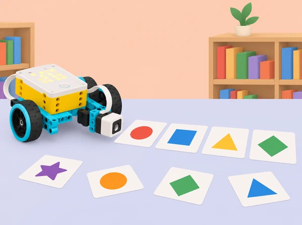

_Les llistes donen ordre i estructura a les dades; les targetes i la lectura del sensor fan visible la seqüència._

## 🌱 Repte i relat

La biblioteca prepara una activitat de microrelats del barri: cada grup crea una seqüència curta a partir de targetes de lloc, objecte i acció, i una maqueta SPIKE ajuda a triar o revelar la pròxima targeta. En Python, les targetes s’organitzen en llistes; el programa consulta posicions, compara una llista d’elements amb una altra i usa una lectura de color per donar una pista d’índex. Cada història és fictícia, acordada i sense dades personals. No usem els textos de l’alumnat com a dades d’entrenament ni els publiquem sense permís.

La situació adapta les sis lliçons de la unitat 10 *Lists* de LEGO Education *Introduction to Python Programming · Course 2*: crear i consultar llistes de lletres amb condicions; construir una rutina seqüenciada amb valors del sensor de moviment; comparar dues llistes en un joc de raonament; afegir a una llista dades de proves d’un mecanisme; fer un joc de paraules amb més d’una llista i el sensor de color; i donar/usar feedback. Canviem ioga, salts i jocs de marca per seqüències de moviment de maqueta, mesures mecàniques no corporals i microrelats de llocs imaginaris o coneguts del municipi, mantenint explícits l’ordre, les dades i la comparació.

## 🎯 Aprenentatges i vocabulari

- Crear una llista en Python, accedir a valors per índex i explicar que la numeració comença en zero.

- Usar una variable d’índex i una condició composta per recórrer o validar elements triats.

- Organitzar dues llistes relacionades (per exemple, llocs i accions), comparar-les i detectar correspondències, diferències o posicions sense parella.

- Afegir dades mesurades de proves a una col·lecció i documentar-ne unitats, condicions i interpretació.

- Combinar una lectura de sensor amb una selecció de llista de manera que l’entrada no reconeguda tinga resposta explícita.

- Descompondre el joc en lectura, selecció, verificació, missatge i moviment; provar funcions i condicions sense dependre que el mecanisme funcione perfectament.

- Fer feedback específic sobre l’ordre, la regla i l’accessibilitat del joc, i revisar el codi sense reescriure el treball d’un altre equip.

**Llista:** seqüència ordenada de valors que es guarda amb un sol nom. **Element:** una dada dins d’una llista. **Índex:** posició numèrica d’un element, habitualment des de 0 en Python. **Correspondència:** relació prevista entre elements de dues llistes. **Lectura del sensor:** valor que el dispositiu detecta en unes condicions concretes; no és una etiqueta semàntica que Python entenga automàticament.

```python
llocs = ["plaça", "hort", "biblioteca"]
accions = ["saluda", "observa", "comparteix"]

posicio = 1
print(llocs[posicio], accions[posicio])
```

Aquest exemple general associa valors que comparteixen índex; si les llistes no tenen la mateixa llargària, cal tractar-ho abans d’accedir-hi. En SPIKE, la lectura del sensor, els ports i les funcions de llum/so/motor s’han de consultar en la Knowledge Base de la versió local.

## 🧰 Materials i preparació

Un set SPIKE Prime per equip, hub carregat, app SPIKE amb Python disponible, sensor de color, sensor de força opcional per a una entrada de confirmació, sensor de moviment de l’hub si es prova una seqüència de gir del dispositiu, motor i peces Technic per a un indicador lent opcional, targetes grans de formes/colors, cartó i cinta de paper, regle, diari de programació i ordinador o paper per a codi compartit. La construcció pot ser estàtica: cap activitat depén d’un robot mòbil ni de reproduir instruccions LEGO.

Prepareu paquets de targetes amb símbol, color i paraula impresos amb contrast suficient; un color no reconegut; exemples on les llistes tenen llargàries diferents; i llistes buides per parlar de límits. Comproveu quins colors reconeix el sensor sota la llum de l’aula, amb targetes planes i a una distància fixa. El sensor pot retornar valors inestables segons el material, per això prevegeu mode de selecció manual. Per a les proves del mecanisme, useu una fitxa gran i lleugera, recorregut curt i motor a baixa potència. Eviteu registrar dades de moviment o salut d’alumnes; si es gira l’hub per obtindre valors d’orientació, subjecteu-lo amb un suport i considereu-los dades del dispositiu.

Organitzeu rols rotatius: qui redacta i explica la llista; qui prova índexs i casos buits; qui prepara targetes/sensor; qui registra resultats i accés a la història. Acordeu prèviament que qualsevol relat inventat és voluntari, respectuós i revisat pel grup.

## 📅 Seqüència didàctica · sis lliçons

### **Lliçó 1 · Lletres, targetes i índexs (45 min).**

#### Fase 1 · Activem i prediem

**Activació (7 min):** mostreu una paraula curta formada per targetes separades i demaneu com indicar-ne “la tercera lletra”. Compareu comptar des d’un o des de zero amb una llista d’índexos dibuixada.

#### Fase 2 · Explorem i construïm

**Modelatge (8 min):** en Python, creeu una llista petita de lletres i accediu als primers, darrers i intermedis valors amb índex. Proveu què passa amb índex 0, índex igual a la llargària i llista buida, primer a paper i després en una còpia al dispositiu. Expliqueu l’error fora de rang sense tractar-lo com un fracàs personal.

#### Fase 3 · Expliquem i registrem

**Repte (20 min):** inventeu un títol de microrelat amb un repertori de targetes de llocs o objectes. Escriviu una llista de símbols admissibles, una condició que determine si una entrada està present i una alternativa si no ho està. Per exemple, una condició composta revisa que l’índex siga major o igual que zero *i* menor que la longitud de la llista abans d’accedir-hi. L’alumnat no guarda noms ni paraules atribuïbles a companys.

#### Fase 4 · Apliquem i millorem

**Proves i documentació (7 min):** feu una taula d’índex → element esperat amb mínim cinc casos, inclosos els límits.

#### Fase 5 · Comprovem i reflexionem

**Sortida (3 min):** expliqueu per què l’índex 2 selecciona el tercer element.

### **Lliçó 2 · Seqüències amb moviment i dades del hub (90 min).**

#### Fase 1 · Activem i prediem

**Entrada (10 min):** observeu un patró de moviments d’un personatge de paper o d’una fletxa articulada: inclinació, retorn, pausa; escriviu-lo com una seqüència ordenada.

#### Fase 2 · Explorem i construïm

**Sensor i valors (15 min):** consulteu la documentació del sensor de moviment integrat al hub, feu una lectura amb hub quiet sobre la taula i una altra després d’una rotació controlada en un suport. Registreu eixos, valors i convenció de la biblioteca local; no confongueu un valor angular amb una instrucció d’orientació. Si la funció no està disponible, useu valors sintètics lliurats per la docent.

#### Fase 3 · Expliquem i registrem

**Llistes i programa (25 min):** creeu una llista curta d’estats/angles de mostra i associeu-los amb una llista de missatges o accions per a una seqüència de moviment representada per una fletxa/maqueta. Mostreu com un bucle i un índex poden visitar cada element per ordre; per a qui ja ho domineu, compareu un bucle amb crides repetides. No convertiu els valors a posicions motores sense calibratge.

#### Fase 4 · Apliquem i millorem

**Disseny (15 min):** cada equip proposa una seqüència de tres gestos del senyal escolar, amb alternativa visual equivalent.

#### Fase 5 · Comprovem i reflexionem

**Proves (15 min):** proveu la llista amb valors repetits, una llista més curta i una lectura inesperada; comproveu que no se sol·licita un índex inexistent. Si s’activa motor, manteniu-lo en mode lent amb topall. **Reflexió (10 min):** quines dades es van recollir? quines es van inventar? quina acció del prototip és simbòlica i quina està realment connectada al moviment mesurat?

### **Lliçó 3 · Comparar dues llistes: joc de parelles (90 min).**

#### Fase 1 · Activem i prediem

**Repte (8 min):** una guia fictícia combina llista de llocs amb llista de pistes, però les correspondències s’han desordenat. L’equip ha de detectar què concorda, què falta i què sobra.

#### Fase 2 · Explorem i construïm

**Creació de llistes (15 min):** definiu `llocs` i `pistes` amb valors de ficció i una taula de parelles esperades; incloeu un valor que aparega en una sola llista i un element duplicat deliberat.

#### Fase 3 · Expliquem i registrem

**Programa de comparació (25 min):** recorregueu les llistes amb índex i compareu elements a cada posició; marqueu parella correcta, discrepància i llargària desigual. Distingeix “les llistes són iguals element a element” de “cada llista conté els mateixos valors en qualsevol ordre”. Si l’alumnat fa servir operadors de pertinença o mètodes no ensenyats en aquest entorn, verifiqueu-los en Python general; documenteu clarament qualsevol funció usada.

#### Fase 4 · Apliquem i millorem

**Joc per torns (20 min):** una parella crea una ronda de parelles amb targetes, l’altra executa el codi o fa traça manualment. Es permeten pistes accessibles en paraules i símbols; no es cronometra la lectura.

#### Fase 5 · Comprovem i reflexionem

**Validació (15 min):** proveu llistes iguals, una discrepància en primera/última posició, llistes de llargària diferent, duplicats i llista buida. **Tancament (7 min):** cada equip diu quin cas el codi detecta i quin cas encara no cobreix.

### **Lliçó 4 · Una col·lecció de proves per a un mecanisme (90 min).**

#### Fase 1 · Activem i prediem

**Pregunta (8 min):** quantes proves fan falta per saber si un indicador motoritzat obri prou una portella de cartó sense eixir del seu recorregut?

#### Fase 2 · Explorem i construïm

**Modelatge de dades (12 min):** dissenyeu una taula d’intents amb valor de comandament (graus/velocitat), posició manual observada i resultat (arriba a la marca: sí/no). Acordeu unitats i escala; no mesureu força humana.

#### Fase 3 · Expliquem i registrem

**Experiment (15 min):** munteu un braç articulat segur amb peces disponibles, fixe el cos del mecanisme i utilitzeu fitxes lleugeres. Enregistreu una línia base amb tres ordres i cinc repeticions d’un valor seleccionat.

#### Fase 4 · Apliquem i millorem

**Llistes Python (20 min):** guardeu els resultats simulats o recollits en una llista amb valors uniformes (per exemple, tots enters o tots booleans per separat). Recorreu la llista per comptar quantes proves han arribat i quantificar la proporció d’èxit; parleu de per què barrejar paraules, valors buits i nombres en una sola llista complica càlculs.

#### Fase 5 · Comprovem i reflexionem

**Anàlisi i millora (20 min):** compareu valors i modifiqueu una variable cada vegada. Mostreu com la llista canvia quan es repeteix el test i per què cal separar dades inicials de dades posteriors. **Comunicació (15 min):** feu un gràfic senzill, descriviu variació, i redacteu una afirmació proporcional a les dades: “en aquesta mostra, el mecanisme va…”, no “sempre funciona”. Si no hi ha temps o materials, useu un conjunt de dades fictici identificat com a simulat.

### **Lliçó 5 · Joc de paraules amb sensor de color i llistes (90 min).**

#### Fase 1 · Activem i prediem

**Idea i llenguatge (10 min):** creeu microfrases en llenguatge respectuós a partir de tres conjunts de paraules: llocs, accions i objectes. L’escenari pot ser la biblioteca, la plaça fictícia, un mercat o un lloc inventat per la classe; no s’hi inclouen noms de persones ni informació privada.

#### Fase 2 · Explorem i construïm

**Arquitectura de dades (15 min):** prepareu diverses llistes amb elements ordenats i una taula color → índex o categoria. Manteniu-les de longitud coneguda, no buides, i definiu una eixida neutra per a color no reconegut. Expliqueu com l’ordre altera les possibles combinacions.

#### Fase 3 · Expliquem i registrem

**Sensor i codi (25 min):** fixeu el sensor de color sobre un suport i passeu una targeta a la vegada. Python llig el color amb API comprovada en l’app, el transforma en un índex acordat i selecciona una paraula de la llista si l’índex és vàlid. Connecteu la lectura amb una matriu de llum o senyal d’un motor només si afegeix informació; el text generat pot mostrar-se a consola i targeta física. No suposeu que una lectura de color equival a una lletra.

#### Fase 4 · Apliquem i millorem

**Creació del joc (15 min):** cada equip escriu regles clares (nombre de targetes, ordre de selecció, repeticions permeses) i prova amb entrada manual i sensorial.

#### Fase 5 · Comprovem i reflexionem

**Partides i cobertura (15 min):** una altra parella juga; l’equip registra si totes les combinacions previstes es poden executar, si apareix índex fora de rang o si una paraula queda descontextualitzada. **Revisió lingüística (10 min):** l’equip comprova que el resultat és respectuós i s’entén sense una pista cultural desconeguda. Ofereix alternativa de lectura, pictogrames o dictat si és necessari.

### **Lliçó 6 · Feedback que millora codi i joc (30–45 min).**

#### Fase 1 · Activem i prediem

**Mostra curta (5 min):** cada grup prepara targetes, llistes, comentaris del programa, una prova que ha passat, una que ha fallat i una pregunta.

#### Fase 2 · Explorem i construïm

**Feedback modelat (8 min):** practiqueu “he observat que la llista…”, “esperava que el color…”, “potser falta provar la llista buida…”. No reconstruïu el model ni editeu el programa d’un altre equip.

#### Fase 3 · Expliquem i registrem

**Intercanvi (10–15 min):** parelles d’equips roten pel joc, anoten què és clar i quins casos no es resolen; no copien ni fotografien textos d’alumnes.

#### Fase 4 · Apliquem i millorem

**Decisió i iteració (7–10 min):** l’equip autor decideix quina idea incorpora, explica per què i modifica una part de la llista, condició o instrucció. Repetiu el mateix cas que va generar el feedback i un cas nou.

#### Fase 5 · Comprovem i reflexionem

**Autoavaluació (5 min):** expliqueu amb un exemple el paper de l’índex i com una entrada de sensor s’ha convertit en element; assenyaleu un límit del generador de microrelats i un següent pas de millora.

## 🧪 Evidències i avaluació

Portafolis d’equip: llistes anotades; taula índex–element; codi amb comentaris i gestió d’índex fora de rang; diagrama que relaciona colors amb índexs; lectures de sensor i condicions de calibratge; llistes comparades amb casos iguals/diferents i llargàries distintes; dades de proves mecàniques amb unitats; resultat del joc de paraules; instruccions de partida; feedback rebut i canvi incorporat. Valoreu quatre dimensions: **ús de llista i índex** (consulta valors i preveu límits); **comparació i condicions** (distingeix ordre, correspondència i casos absents); **integració de dades** (relaciona sensor, valor, regla i sortida); **disseny col·laboratiu** (documenta, prova, incorpora o justifica feedback i ofereix accés alternatiu). Una execució afortunada no substitueix la prova de llistes buides, divergents o no reconegudes.

## ♿ Accessibilitat, privacitat i seguretat

Les llistes es poden treballar amb targetes físiques grans, text ampliat, dictat, símbols i seqüències d’àudio opcional; no cal llegir ràpid ni distingir colors sense alternativa. La sortida del sensor també es pot seleccionar manualment. Els microrelats són ficticis o de llocs públics triats amb cura; no s’hi guarden noms, domicilis, històries personals ni trajectes. Eviteu compartir codi o text fora de l’aula sense acord. Manteniu el robot sobre taula i freneu abans de manipular-lo; si hi ha moviment, establiu límits suaus i allunyeu les mans. La seqüència de moviments és d’una maqueta, no una rutina física obligatòria ni una avaluació corporal.

## 🔗 Referent oficial i adaptació

Adapta les sis lliçons de la unitat 10 *Lists* del curs LEGO Education [*Introduction to Python Programming · Course 2*](https://assets.education.lego.com/v3/assets/blt293eea581807678a/blt5436c2a0ac31fc17/65e9d0ef2a3929468f30be14/File_2_Units_678910_Intro_to_Python_Course_TG_Course_2.pdf?locale=en-us): *Listing Letters*, *Stretch Your Muscles and Lists*, *Mind Games*, *Jumping for Lists*, *Word Games with Lists* i *Ideas to Help with Word Games with Lists*. Manté l’estructura de llista/índex i condicions compostes, valors de sensor i seqüenciació, comparació de dues llistes, registre de dades de proves, integració de llistes i sensor de color en un joc, i feedback entre equips. Les referències a ioga/salts es transformen en estats d’un mecanisme de taula i mesures de prototip, sense capturar informació corporal d’alumnes. L’escenari de vocabulari, fitxes, dades d’exemple i imatge són propis; el programa i la construcció s’adapten a la dotació real i no copien instruccions oficials. L’app i l’API s’han de verificar en el dispositiu local.
