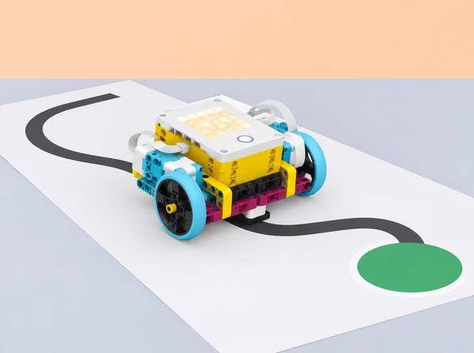

_El moviment només es considera repetible després de mesurar-lo en la mateixa superfície i amb el mateix muntatge._

## 🌱 Repte i sentit

Una classe prepara una mostra de prototips per a una jornada escolar. Un equip ha d’idear un dispositiu SPIKE Prime que moga una fitxa de missatgeria per una ruta delimitada, la deixe en una zona de destinació i torne a un punt d’inici. Pot ser una base mòbil o un mecanisme de taula amb moviment acotat: la solució no està predeterminada. Les proves se centren en com els motors responen a temps, velocitat, posició i graus, com es coordinen dos motors i quines variables físiques alteren el trajecte.

Aquesta proposta adapta la progressió de la unitat 2 *Motors* de LEGO Education *Introduction to Python Programming · Course 1*: control individual de motors amb paràmetres, moviments cap a posicions/quantitats definides, automatització d’una tasca, sincronització de dos motors i desplaçament d’un model sense rodes, trajecte amb passos i girs i feedback entre equips. La situació situa eixos objectius en un servei escolar fictici; no representa una solució real de mobilitat ni assumeix que el robot navegue sense supervisió.

## 🎯 Aprenentatges i vocabulari

- Identificar el motor com a actuador i descriure com el programa Python li envia ordres segons la biblioteca i la versió de l’app.

- Comparar moviment per temps, velocitat, posició i angle de gir del motor; entendre que graus de l’eix no equivalen automàticament a graus de gir del robot.

- Fer que dos motors actuen individualment i en parella; explicar què canvia quan giren alhora o en sentits diferents.

- Descompondre una tasca automàtica en inici, acció, espera, senyalització i aturada; escriure-la abans com a pseudocodi.

- Programar i traçar una seqüència de trams i girs per arribar a una fita en una pista coneguda.

- Calibrar una relació motor-distància amb la mateixa roda, superfície, càrrega i bateria, i documentar les fonts de variació.

- Fer proves repetides amb una variable canviada cada vegada, registrar diferències i decidir si un canvi millora el criteri triat.

- Donar feedback específic sobre el disseny i el codi sense prendre el control del projecte d’un altre equip.

**Actuador:** component que produeix moviment o una altra eixida. **Velocitat:** ritme de gir ordenat al motor. **Posició:** angle de l’eix respecte d’un referent definit. **Graus:** unitat angular per descriure una rotació. **Calibratge:** obtindre una relació de treball amb proves del muntatge real. **Repetibilitat:** semblança entre resultats d’assajos repetits sota condicions comparables.

```python
# Python general per a descriure el pla; no controla motors SPIKE
trams = ["recte", "gir dret", "recte", "aturada"]
for tram in trams:
    print("provar:", tram)
```

Aquest fragment no és codi de motor. L’API exacta (ports, motor individual, parella, `runloop`, posició, velocitat i frenada) depén de la versió local de l’app SPIKE. Consulteu-ne la Knowledge Base i proveu les ordres amb la base suspesa o en una pista segura abans d’adaptar-les.

## 🧰 Materials i preparació docent

Un set SPIKE Prime 45678 per equip, hub carregat, dos motors, rodes i peces Technic per a una base mòbil baixa o un mecanisme acotat, dispositiu amb editor Python i consola, cinta de paper, cartó per a fites i topalls tous, regla, transportador opcional, fitxa lleugera de missatgeria, diari d’enginyeria i temporitzador. Per al repte de moviment sincronitzat sense rodes, oferiu una construcció articulada lleugera de baixa altura feta amb les peces de la caixa; no cal que imite un animal ni reproduïsca cap model oficial.

Trieu una zona plana sense vores, escales ni trànsit; marqueu carrils amples i una zona de parada. Càrrega i distància han de ser lleugeres i curtes. Abans de començar, comproveu la bateria, el port i orientació dels motors, les rodes lliures, el mecanisme sense fricció i una ordre d’aturada. Ajusteu velocitat baixa i limiteu el recorregut; ningú no sosté la base mentre els motors giren. Prepareu una base de referència i tres distàncies de prova, però deixeu que l’alumnat calibre el seu propi prototip.

Rols rotatius de Python/prova, construcció/seguretat i mesura/registre. Cada equip manté una configuració de prova fixa durant una comparació i escriu quan ha canviat superfície, rodes, muntatge o càrrega. No compareu resultats de robots diferents com si les seues magnituds foren transferibles.

## 📅 Seqüència didàctica · sis lliçons

### **Lliçó 1 · El motor respon a temps i velocitat (45 min).**

#### Fase 1 · Activem i prediem

**Activació (7 min):** compareu dues maneres de fer moure una roda una distància aproximada: fer-la girar durant un temps o demanar un nombre de graus/rotacions. Dibuixeu una predicció del que podria variar entre una superfície llisa i una altra amb més fricció.

#### Fase 2 · Explorem i construïm

**Prova aïllada (10 min):** amb la base elevada i fixada, executeu amb supervisió una ordre breu a velocitat baixa; comproveu quin motor i port responen. Atureu abans de canviar cables o configuració.

#### Fase 3 · Expliquem i registrem

**Exploració Python (18 min):** seguiu un exemple validat per a l’API local; canvieu només temps o velocitat en cada assaig, primer mantenint l’altra magnitud fixa. Passeu després a la pista curta i mesureu distància real amb regla. Feu dues repeticions per valor i anoteu bateria/superfície.

#### Fase 4 · Apliquem i millorem

**Interpretació (7 min):** representeu velocitat ordenada i distància observada en una taula; distingiu una ordre del programa d’una mesura del trajecte.

#### Fase 5 · Comprovem i reflexionem

**Eixida (3 min):** expliqueu en quin cas temporal seria més fàcil de programar i en quin caldria més calibratge.

### **Lliçó 2 · Posició, camí curt i graus (45 min).**

#### Fase 1 · Activem i prediem

**Pregunta (5 min):** si un eix està en una posició coneguda, quina ordre el porta a una altra posició amb menys moviment?

#### Fase 2 · Explorem i construïm

**Estació segura (8 min):** useu un motor sense càrrega amb una marca visual de referència a l’eix; anoteu posició inicial i no poseu dits prop de l’eix.

#### Fase 3 · Expliquem i registrem

**Investigació guiada (22 min):** proveu en Python un moviment fins a una posició i un moviment per un nombre de graus, amb la funció que documenta l’app local. Predigueu direcció i angle, observeu si el motor fa el camí esperat i contrasteu una rotació positiva amb una de negativa. Repetiu amb una posició a cada costat del punt de referència i compareu recorreguts.

#### Fase 4 · Apliquem i millorem

**Transferència a la roda (7 min):** calculeu circumferència amb mesura aproximada i compareu-la amb la distància que avança una rotació; expliqueu per què lliscament, pressió i diàmetre real alteren el resultat.

#### Fase 5 · Comprovem i reflexionem

**Registre (3 min):** dibuixeu l’eix i indiqueu què significa posició en la prova concreta, sense confondre-la amb orientació del robot.

### **Lliçó 3 · Automatitzar una acció útil (45 min).**

#### Fase 1 · Activem i prediem

**Definició (7 min):** trieu una acció repetible de la mostra: alçar una barrera de cartó, desplaçar una fitxa per una canaleta o girar un indicador. Escriviu entrada, acció del motor, resultat i condició d’aturada.

#### Fase 2 · Explorem i construïm

**Ideació/mecanisme (10 min):** dibuixeu dues alternatives mecàniques i valoreu estabilitat, nombre de peces, recorregut i risc de pinçament.

#### Fase 3 · Expliquem i registrem

**Programa per etapes (18 min):** programeu una posició inicial coneguda, una acció limitada i retorn/aturada. Verifiqueu primer el mecanisme a mà amb motors apagats; després proveu sense càrrega i amb una fitxa gran i lleugera. L’objectiu és automatitzar una tasca clara, no construir un model decoratiu.

#### Fase 4 · Apliquem i millorem

**Proves i millora (7 min):** executeu tres intents i registreu si arriba, s’atura i retorna sense encallar. Si canvieu topall o posició inicial, torneu a mesurar.

#### Fase 5 · Comprovem i reflexionem

**Reflexió (3 min):** identifiqueu què és una decisió del codi i què és una propietat física del muntatge.

### **Lliçó 4 · Dos motors, un moviment coordinat (45 min).**

#### Fase 1 · Activem i prediem

**Activació (5 min):** amb una analogia corporal no competitiva, proveu a dos costats d’una corda lleugera com és avançar alhora i què passa si cada costat actua en un moment diferent. No estireu l’alumnat ni useu forces; també es pot simular amb dos marcadors en paper.

#### Fase 2 · Explorem i construïm

**Exploració (10 min):** proveu els dos motors per separat amb la base elevada; comproveu direcció, port i resposta.

#### Fase 3 · Expliquem i registrem

**Construcció (15 min):** creeu una plataforma de taula amb dues potes articulades o un mecanisme sense rodes de baixa altura, inspirat en el problema de coordinar motors del repte *Hopper Run*, però amb una forma original i sense perseguir cap distància o velocitat. El mecanisme ha de romandre dins del carril i tenir topalls.

#### Fase 4 · Apliquem i millorem

**Programació (10 min):** useu la crida de parella documentada per fer-los moure simultàniament durant un interval curt; compareu amb instruccions consecutives. Analitzeu simetria, ordre, fricció i desequilibri.

#### Fase 5 · Comprovem i reflexionem

**Conversa (5 min):** justifiqueu per què un robot sense rodes pot avançar i quins límits presenta el vostre prototip.

### **Lliçó 5 · Una ruta amb passos i girs (45–90 min).**

#### Fase 1 · Activem i prediem

**Encàrrec i criteris (10 min):** planifiqueu un lliurament fictici des de la biblioteca a tres parades de maqueta. L’èxit significa passar per l’ordre correcte de fites i quedar dins d’una zona final àmplia; no s’exigeix precisió d’un servei real.

#### Fase 2 · Explorem i construïm

**Mapa i pseudocodi (10 min):** dibuixeu quadrícula de trams, girs i pauses. Feu recompte d’ordres, determineu quin motor-parella s’utilitza per recta i com es genera el gir amb diferència de girs entre rodes.

#### Fase 3 · Expliquem i registrem

**Calibratge (15 min):** feu una recta d’una longitud curta amb tres proves i estimeu graus de roda necessaris; feu un gir de quart aproximat i mesureu orientació amb quadrícula/transportador. Useu relacions com a estimacions específiques del vostre robot, no constants universals.

#### Fase 4 · Apliquem i millorem

**Implementació Python (20 min):** traduïu la ruta en crides documentades, separant recta, gir i parada. Proveu cada funció en solitari, després encadeneu dues ordres i finalment la ruta completa a baixa velocitat. Manteniu un botó o via manual per aturar.

#### Fase 5 · Comprovem i reflexionem

**Diagnòstic (10 min):** si se’n va de la marca, canvieu una variable per iteració (graus, alineació, velocitat o superfície); documenteu quin error disminueix. **Si es disposa de més temps:** repetiu tres vegades la ruta completa i compareu dispersió i causes, sense fer una cursa de velocitat.

### **Lliçó 6 · Prova entre equips i feedback de disseny (30–45 min).**

#### Fase 1 · Activem i prediem

**Preparació (8 min):** cada equip deixa la ruta, codi comentat, criteri d’arribada i resultats inicials visibles.

#### Fase 2 · Explorem i construïm

**Revisió (12 min):** un segon equip prediu el moviment abans d’executar, prova amb consentiment dels autors i registra comportament; no edita el programa ni reconstrueix el mecanisme. El feedback segueix “he observat…”, “la predicció diu…”, “un cas més que provaria…”.

#### Fase 3 · Expliquem i registrem

**Decisió (5 min):** autors trien una recomanació i expliquen si l’adopten, la deixen per al futur o la descarten amb motiu.

#### Fase 4 · Apliquem i millorem

**Iteració (12 min):** canvieu una característica, repetiu el cas anterior i un cas de control per assegurar que no s’ha perjudicat un tram correcte.

#### Fase 5 · Comprovem i reflexionem

**Tancament (3–8 min):** mostreu gràfic/taula de predicció i resultat, descriviu limitacions del robot i valoreu quina prova ha sigut més informativa que una demostració única.

## 🧪 Evidències i avaluació

El dossier conté esquema de maquinari i ports, registre de versió de l’app/API, diagrama de posicions, pseudocodi de ruta, codi Python anotat, prediccions, taula de temps/velocitat/graus i distància mesurada, proves del mecanisme automatitzat, comparació de crides individuals i de parella, mapa de ruta, tres resultats finals, feedback, canvi seleccionat i explicació de límits. El producte és una maqueta de lliurament i una nota tècnica d’una pàgina que separa instrucció, resposta física i evidència.

Avalueu amb quatre criteris: **model del motor** (interpreta temps, velocitat, posició i graus sense confondre magnituds); **programació** (organitza crides i coordina motors a partir d’un pseudocodi); **enginyeria experimental** (manté condicions, registra més d’un intent i justifica un ajust); **col·laboració i comunicació** (participa en el feedback i declara què encara no funciona). Per a cadascun, descriviu quatre nivells: amb modelatge, amb suport, de manera autònoma i amb transferència justificada. Un recorregut que no arribe a la fita encara pot aportar evidència rigorosa si està ben diagnosticat.

## ♿ Inclusió, seguretat i sostenibilitat

Oferiu pista impresa, simulació de moviments en paper i accés a consola amb lectura compartida. Distribuïu rols entre codi, construcció, mesura i comunicació, i feu-los rotar. Permeteu més temps i trams grans; la velocitat no és criteri d’èxit. Useu carrils delimitats, zona de parada, càrrega tova, distància curta i baixa potència; apagueu motors abans d’ajustar eixos, rodes o cables. Manteniu dits, cabells i roba lluny d’elements en moviment. Recupereu totes les peces després de la prova i no useu passadissos, rampes altes o escales.

## 🔗 Referent oficial i decisions d’adaptació

Adapta Unit 2 *Motors* del curs LEGO Education [*Introduction to Python Programming · Course 1*](https://assets.education.lego.com/v3/assets/blt293eea581807678a/blt834b554cdaa246f7/6584064fd082f7672425e7ea/File_1_Units12345_Intro_to_Python_Course_TG_Course.pdf?locale=en-us). El PDF oficial consultat confirma les lliçons *Hopper Run* (dos motors simultanis i model sense rodes) i *Race Day* (programa amb seqüència de passos i girs i ús de la parella de motors), a més de la sessió de feedback *Ideas to Help with Race Day*. La progressió de motors individuals, posició i automatització s’ha contrastat amb els objectius indexats del pla oficial; les funcions de Python s’han de validar en l’app del centre. El repte, el context, el guió docent, els fulls de registre i la imatge són propis; no es reprodueixen instruccions de construcció LEGO ni s’afirma que la maqueta completa siga un model oficial.
