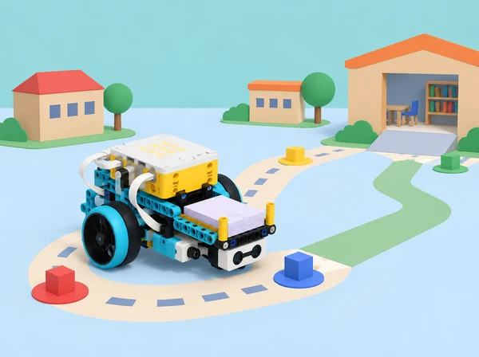

_El projecte final integra mecànica, Python, sensors, dades, proves iteratives i comunicació de límits._

## 🌱 Repte de projecte i traçabilitat

La comunitat escolar necessita moure materials compartits (targetes, peces grans o llibres de maqueta) entre dos punts d’una aula o biblioteca simulada. Cada equip investiga una necessitat concreta, defineix criteris d’èxit i restriccions, compara idees, construeix una base SPIKE Prime o un mecanisme de transport, programa amb Python una ruta repetible i documenta proves i millores. La mostra final explica la solució i les dades que la sustenten.

És una adaptació de la branca *Transportation Project* anunciada com a projecte culminant de LEGO Education *Introduction to Python Programming · Course 2*. El projecte mobilitza les competències de final de curs que la guia enumera: dissenyar i iterar un prototip, usar algoritmes, dades, sensors, bucles i condicions compostes, depurar maquinari/programari, escriure pseudocodi, descompondre el problema, documentar proves i feedback, considerar biaix/accessibilitat i comunicar la solució. La guia accessible diu que el projecte ocupa entre 10 i 12 lliçons de 45–60 minuts i que té diari i rúbrica pròpia, però el PDF publicat no inclou un guió detallat d’aquestes sessions ni els descriptors de la rúbrica. Per això, aquesta seqüència de deu lliçons és una proposta didàctica original, traçada als resultats publicats, i no una adaptació pas a pas d’instruccions no disponibles.

## 🎯 Resultats d’aprenentatge i vocabulari

- Investigar i reformular una necessitat de transport de materials de maqueta sense recopilar trajectes personals ni exposar persones a vehicles.

- Definir criteris mesurables (arribar a destí, mantindre la càrrega, respectar zona d’aturada) i restriccions de temps, peces, dimensions i seguretat.

- Descompondre ruta, seguiment de línia/fites, decisions, aturada, càrrega i feedback en funcions/subproblemes.

- Escriure en Python una seqüència de moviment amb funcions, variables, llistes, bucles, condicionals, lògica booleana i dades de sensor, segons els conceptes treballats en Course 2.

- Calibrar i registrar distància, color o contacte només quan el sensor disponible siga adequat; distingir dada mesurada, regla escrita per l’equip i decisió del programa.

- Depurar errors mecànics, de connexió, sintaxi, execució o lògica amb hipòtesis i proves controlades.

- Iterar a partir de resultats i comentaris, documentar els canvis i comunicar límits del prototip i evidència d’èxit.

- Treballar en equip amb rols rotatius i considerar si la interfície, la pista i la càrrega són accessibles a persones amb diferents capacitats.

**Necessitat:** dificultat observada i descrita sense atribuir defectes a una persona. **Criteri:** condició que defineix si la solució compleix el propòsit. **Restricció:** límit que el disseny ha de respectar. **Iteració:** canvi basat en una prova seguit d’una nova prova. **Prototip:** model per aprendre i comparar, no un sistema certificat de transport. **Evidència:** registre o observació que permet a una altra persona valorar una afirmació.

## 🧰 Recursos, organització i preparació

Per equip: set SPIKE Prime, hub carregat, app amb Python i consola, base mòbil de dos motors o estructura alternativa dissenyada per l’alumnat, sensor de color/distància/força només si ajuda a un criteri definit, fitxes grans simulant càrregues, cartó per a carrils i topalls, cinta de paper, regle, cronòmetre opcional, diari de projecte, llapis i ordinador per a la mostra. No calen sensors addicionals, càmeres, telèfons personals ni connexió a Internet durant la prova. Les instruccions de muntatge i API es consulten en la versió de l’app i el set locals; les API de Python varien segons versió.

La docent prepara una zona tancada de taula o terra llis amb marges, una ruta de prova assequible a tots els equips, una càrrega fictícia i lleugera, una estació d’eixida i una destinació marcada amb forma i text gran. Preveu una ruta manual en quadrícula i un programa de simulació si el robot o un sensor fallen. Cap maqueta transporta objectes fràgils, menjar, líquids ni persones. Els motors s’aturen abans de manipular el robot i funcionen a baixa velocitat; s’eviten desnivells, passadissos oberts i escales.

Durant les deu lliçons, roten quatre responsabilitats: investigació/documentació, construcció/seguretat, Python/proves i comunicació/accessibilitat. Totes les persones han de tenir oportunitat de llegir o explicar una part del programa i una evidència. La docent fa minirevisions al final de les lliçons 2, 4, 6 i 8 perquè el projecte puga redirigir-se sense perdre el calendari.

## 📅 Projecte en deu lliçons

### **Lliçó 1 · Escoltar, observar i definir el repte (45–60 min).**

**Entrada (10 min):** presenteu el mandat: traslladar materials lleugers entre dos punts d’una maqueta de classe amb un prototip SPIKE. Doneu un escenari escolar fictici; no pregunteu qui porta materials a casa ni com arriba a escola. **Investigació (15 min):** els equips examinen una escena de maqueta o parlen amb una persona usuària adulta voluntària sobre què fa que una entrega siga clara, accessible i ordenada. Registren necessitats anònimes com a observacions i preguntes, no opinions sobre individus. **Definició (20 min):** redacten una frase de problema, usuari, objectiu, dos criteris d’èxit i tres restriccions. Possible criteri: la càrrega de prova arriba a una àrea de destinació en 3 de 4 intents, sense caure i amb aturada manual accessible. Acordeu si la ruta segueix una línia de cinta, fites de color o ordres prefixades; no assumiu sensor disponible fins a comprovar la caixa. **Tancament (5–15 min):** cada equip explica una pregunta que cal investigar i una cosa que el seu prototip no pretén resoldre.

### **Lliçó 2 · Investigar dades, materials i restriccions (45–60 min).**

**Mapa del sistema (10 min):** dibuixeu origen, trams, girs, zona de càrrega, destinació i punts on el robot s’hauria d’aturar. **Exploració (15 min):** mesureu amplària de pista, longitud dels trams, massa relativa (lleugera/mitjana, no cal una bàscula), distància de detecció i limitacions del sensor. Consulteu les funcions disponibles en la Knowledge Base i anoteu port, unitat i rang llegible. **Recerca aplicada (15 min):** compareu dues solucions manuals i dos mecanismes de maqueta (base amb safata, empenyedor, pinça sense tancament arriscat). Analitzeu estabilitat, accessibilitat i cost de peces; no copieu models LEGO protegits. **Actualització (10–20 min):** reviseu criteris amb la informació, anoteu allò que no s’ha pogut comprovar i afegiu la restricció de fer servir només càrrega de prova lleugera. La docent valida que el repte és possible amb peces i temps locals.

### **Lliçó 3 · Generar opcions i triar amb criteris (45–60 min).**

**Ideació individual (8 min):** cada membre dibuixa una idea sense discutir ni jutjar-la. **Posada en comú (12 min):** l’equip combina aportacions i prepara com a mínim tres conceptes diferents, inclosa una opció no motoritzada. **Matriz de decisió (15 min):** compareu cada idea per seguretat, estabilitat de càrrega, nombre de funcions Python, adaptació a usuaris, peces necessàries i facilitat de provar; useu escala 1–3 amb comentari, no una falsa puntuació científica. Si un valor falta, marqueu-lo desconegut. **Selecció (10 min):** anoteu idea triada, compromís que comporta i una característica d’una opció alternativa que es podria incorporar. **Revisió ràpida (5–15 min):** presenteu l’esbós a un altre equip i pregunteu què ha entés del criteri d’èxit abans de construir.

### **Lliçó 4 · Planificar el programa i els casos de prova (45–60 min).**

**Descomposició (10 min):** convertiu la ruta en mòduls: iniciar, conduir tram, llegir fita, corregir, arribar/aturar, comunicar error. Creeu una funció o procediment per a cada acció que realment es repetisca. **Algoritme (15 min):** dibuixeu diagrama o pseudocodi de la ruta, incloent sensor absent, fita no reconeguda, càrrega que es mou i botó d’aturada. Ensenyeu on usarien llista d’instruccions o punts, condicions compostes, bucle, paràmetre de velocitat i registre de dades. **Plà de proves (15 min):** prepareu cas nominal, ruta amb gir, color no assignat, càrrega més ampla, arrencada mal orientada i aturada manual. Per a cada cas, prediu resultat i decisió si falla. **Preparació (5–20 min):** deseu una còpia en paper/ordinador i establiu qui revisa ports i qui pot autoritzar arrencada. La docent comprova que cap regla depén d’un sensor no disponible.

### **Lliçó 5 · Construir el prototip i validar la mecànica (45–60 min).**

**Muntatge per subsistemes (20–25 min):** construïu base, suport de càrrega i sensor si escau. Proveu la safata buida, després amb una càrrega de cartó molt lleugera; observeu estabilitat en recta i gir. No subjecteu càrrega amb persones ni useu pinces que tanquen sobre dits. **Validació manual (10 min):** empenyeu la base apagada al llarg del recorregut només si el muntatge ho permet; busqueu encallament, cable que arrossega, roda que frega o centre de càrrega alt. **Programa mínim (10–15 min):** sense codi autònom complet, escriviu una única ordre de moviment curta amb la funció API que heu verificat. **Registre (5–10 min):** dibuixeu la versió 1, anoteu què funciona i què no, i decidiu un ajust. La construcció no es valora per semblança amb cap model comercial, sinó per com respon als criteris acordats.

### **Lliçó 6 · Escriure el primer programa Python integrat (45–60 min).**

**Organització del codi (10 min):** poseu constants i ports al principi, funcions amb noms clars al mig i seqüència principal al final. Comenteu la unitat de velocitat/distància i l’origen dels llindars. **Ruta base (20 min):** programeu un únic tram, una aturada controlada i la seqüència cap al següent tram. Afigueu lectura de sensor només després de comprovar-la aïlladament. Si el model no disposa del sensor, feu servir fites o ordres manuals identificades com a simulació. **Condicions i llistes (10 min):** representeu punts de ruta o accions en una llista si ajuda a reduir repetició; combineu amb una condició per a dades no reconegudes. No feu una seqüència tan llarga que siga impossible depurar. **Primer assaig (10–20 min):** executeu una ruta curta amb la zona lliure, velocitat baixa i una persona responsable d’aturar. Guardeu la sortida de consola i registreu posició final, detecció, temps i error observat. Pregunteu-vos si eixa única prova demostra el criteri; la resposta ha de ser no.

### **Lliçó 7 · Calibrar, provar i depurar amb evidència (45–60 min).**

**Hipòtesi (5 min):** trieu una causa probable per a una fallada: orientació, fricció, unitat, llindar, ordre, dada absent o funció API incorrecta. **Proves repetides (20 min):** feu tres intents del mateix cas nominal amb inici i superfície constants. Afegiu després un cas de fita absent o diferent. Anoteu valor que llig sensor, valor esperat, resposta, aturada i variació. **Depuració (15 min):** canvieu una sola causa i repetiu. Classifiqueu problema de muntatge, connexió, sintaxi, execució o lògica; si la consola no reporta error però el destí falla, reviseu especificació/lectura en lloc d’assumir que el codi és correcte. **Actualització (5–20 min):** compareu les dades amb criteris i decidiu si continueu o simplifiqueu l’abast. Documenteu qualsevol funció, exemple o fragment extern reutilitzat i doneu-ne atribució; registreu versió d’app/API.

### **Lliçó 8 · Revisar accessibilitat i millorar el sistema complet (45–60 min).**

**Prova d’ús (10 min):** una parella d’un altre equip observa la pista i usa les instruccions sense que els autors facen de guia. Hi ha alternativa si el sensor no distingeix un color? La meta està marcada amb paraula/símbol i color? L’aturada és fàcil de trobar i la ruta no necessita reflexos ràpids? **Retorn (10 min):** reviseu interacció i codi amb frases d’evidència: “he vist…”, “no he sabut…”, “esperava…”. No es valora l’habilitat personal, sinó l’accessibilitat de l’artefacte. **Redisseny (20 min):** cada equip tria un canvi d’estructura, programa o instrucció; actualitza el pseudocodi, aplica una edició cada vegada i torna a executar dos casos. **Revisió crítica (5–20 min):** busqueu un cas esbiaixat (una entrada que no es veu, una única forma de respondre), un sensor que no s’ha calibrat o una afirmació que excedeix les dades. Registreu limitació i compensació.

### **Lliçó 9 · Tancar documentació, demostració i rúbrica (45–60 min).**

**Diari tècnic (15 min):** completeu el problema, criteris/restriccions, tres idees, diagrama, mapa de ports, codi comentat, pla i resultats de prova, fallada important, canvi fet, feedback i limitació. **Preparar mostra (15 min):** guió de tres minuts: necessitat; usuari/criteris; construcció; fragment Python clau; taula amb proves repetides; millora; què no resol. Incloeu una forma estàtica o vídeo/simulació si el robot no està disponible, sense presentar-la com una execució real. **Rúbrica d’equip (10 min):** autoapliqueu descriptors publicats ací: estructura i correcció Python; relació maquinari–programari; proves i depuració; accessibilitat/ús; comunicació amb evidències. Cada dimensió té “inicial / en desenvolupament / competent / transferible”, amb una frase que cita una mostra del diari. **Assaig i revisió (5–20 min):** parelles revisen si cada afirmació de presentació té una dada o una observació al darrere.

### **Lliçó 10 · Fira de prototips i reflexió final (45–60 min).**

**Preparar estacions (5 min):** delimiteu espai, carril, càrrega i zona de públic; programeu una demostració curta amb aturada fàcil. **Mostra (20–25 min):** cada equip presenta i demostra almenys un cas d’èxit i una condició que el seu sistema no resol. Els visitants poden preguntar sobre dada, sensor, decisió, mecanisme i prova; no es comparen equips per rapidesa o nombre de peces. **Galeria amb feedback (10 min):** el públic deixa una nota específica basada en allò que ha observat i una pregunta respectuosa. **Auto/coavaluació (10 min):** cada membre explica la seua contribució i una aportació d’una altra persona que ha canviat el projecte. Compareu estimació inicial i final del criteri, no valor personal. **Tancament (5–10 min):** l’equip formula un següent experiment que faria amb més temps i una advertència clara: el model de taula és educatiu, no autònom ni apte per a transportar materials o persones en espais reals.

## 📦 Producte final i evidències

La mostra inclou un prototip de transport per a fitxes o paquets buits i lleugers, programa Python que usa almenys una funció pròpia, un sensor SPIKE quan siga pertinent/disponible, i una parada; trajecte i instruccions accessibles; diari de disseny; pseudocodi/diagrama; codi comentat amb atribució; mapa de ports; taula amb criteri, intent, resultat, dada, unitat i ajust; documentació d’una fallada i la seua depuració; revisió entre iguals; estimació de límits/impacte; i una presentació de 3 minuts.

Rúbrica formativa (4 nivells per dimensió): **ús de Python** —programa poc estructurat / seqüència parcial / funcions i control de flux coherents / estructura documentada que es pot reutilitzar i justificar; **integració física** —muntatge o ports no verificats / acció bàsica / mecanisme i sensors responen als criteris / el grup explica calibratge i alternatives; **prova/iteració** —resultat anecdòtic / una prova registrada / casos variats i una revisió basada en dades / repeticions comparables, causes aïllades i límits explícits; **disseny per a les persones** —no hi ha instrucció/aturada clara / una barrera reconeguda / alternatives d’entrada i indicadors / perspectives revisades amb iteració; **comunicació/equip** —afirmacions sense registre / evidència parcial / rols i aportacions explicats amb respecte / decisions i desacords documentats amb arguments i proves. La rúbrica s’utilitza per orientar millores, no per certificar un transportista real.

## ♿ Accessibilitat, dades i seguretat

El repte pot ser resolt en simulació, amb una maqueta estacionària o amb un vehicle de taula. La ruta es representa amb símbols, text ampliat, formes i colors redundants; es pot donar una ordre manual per a provar la lògica. No es fan enquestes identificables, no es registren domicilis ni trajectes de l’alumnat i no s’avalua capacitat física. Es recullen només dades del prototip i d’entrades sintètiques. Qualsevol observació sobre l’espai escolar s’anonimitza i es valida amb l’adult responsable. Els motors funcionen en una zona controlada de baixa velocitat; cap equip prova al passadís, prop d’escales, persones o càrrega fràgil. En cas d’error, s’atura el robot abans de canviar peces o cables.

## 🔗 Referent oficial, abast i adaptació

El referent és el projecte culminant de *Introduction to Python Programming · Course 2* de LEGO Education, que s’anuncia com a *Environmental Impact or Transportation Project*. La guia declara que els projectes tenen 10–12 lliçons de 45–60 minuts i inclouen documentació amb diari i rúbrica; també explicita disseny iteratiu, debugging de maquinari/programari, dades, sensors, condicions compostes, pseudocodi, descomposició, accessibilitat, biaix i presentació. Aquest itinerari adapta la branca de transport a la logística de materials de maqueta de l’escola i ofereix un artefacte, dades, restriccions, proves, rols i rúbrica originals. El PDF consultable no desglossa el guió docent ni els criteris detallats del projecte de 10–12 lliçons, per tant no atribuïm a LEGO la seqüència de deu sessions ací creada ni afirmem que reproduïsca els seus materials privats. La construcció i l’API Python s’ajusten al set i la versió SPIKE presents al centre.
