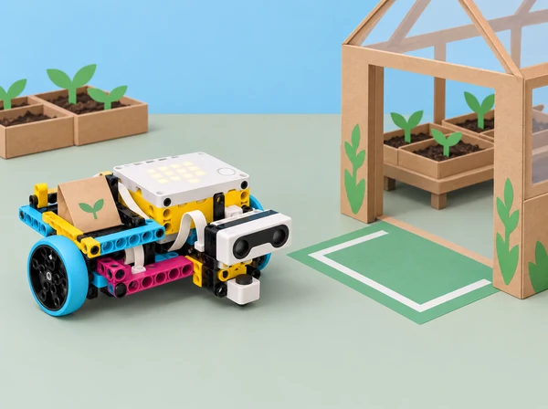

_Una decisió automatitzada necessita una entrada ben provada, un llindar justificat i una aturada segura._

## 🌱 Repte i sentit

La classe crea una maqueta d’un viver escolar per transportar un paquet fictici de llavors des de la taula de preparació fins a una zona de recepció. El prototip SPIKE Prime espera una ordre de la persona operadora mitjançant el sensor de força, avança amb una càrrega lleugera i utilitza el sensor de distància per reduir el recorregut o aturar-se davant d’una barrera de cartó. L’equip ha de decidir quines entrades pot llegir, quines condicions les interpreten i com evitar que una lectura incerta es convertisca en una acció no desitjada.

Aquesta situació adapta les sis lliçons de la unitat 3 *Sensor Control* de LEGO Education *Introduction to Python Programming · Course 1*: *Start Sensing*, *Charging Rhino*, *Cart Control*, *Safe Delivery*, *Grasshopper Troubles* i *Ideas to Help Your Grasshopper*. Conserva el treball amb sensor de força i condicionals, relació entre potència i moviment, sensor de distància/ultrasons, ús segur dels sensors en un model mòbil, depuració d’un prototip i feedback de millora. El context de viver i les dades són simulats; no es presenta el robot com a transportador autònom ni com a sistema de seguretat.

## 🎯 Aprenentatges i vocabulari

- Interpretar el sensor de força com una entrada que pot detectar una pressió, alliberament o colp segons la funció disponible; diferenciar l’acció humana de la lectura del programa.

- Usar condicionals per decidir si el prototip espera, comença, continua o s’atura; descriure les condicions en pseudocodi abans de programar-les.

- Relacionar potència dels motors amb distància, temps, estabilitat i energia del moviment, sense suposar una relació fixa independent del muntatge.

- Descriure el sensor de distància com una mesura basada en ultrasons, reconéixer unitat, rang i factors que poden alterar la lectura.

- Programar la resposta del vehicle amb llindar de distància i aturada; explicar que el llindar s’ha d’ajustar a la geometria i la velocitat de la base.

- Fer una entrega segura simulada: càrrega lleugera, ruta plana, zona d’arribada ampla i supervisió manual durant tota la prova.

- Depurar separadament sensor, condició, potència, muntatge i lògica; provar una causa cada vegada i mantindre un registre.

- Donar i rebre feedback amb evidència observable, seleccionar un suggeriment i repetir un cas de prova abans/després.

**Entrada:** dada rebuda pel programa, com ara la pressió del sensor. **Condicional:** instrucció que tria una acció segons si una expressió és vertadera o falsa. **Llindar:** valor a partir del qual s’activa una regla. **Ultrasons:** so d’alta freqüència usat pel sensor per estimar separació respecte d’un objecte. **Potència:** intensitat ordenada al motor, que no determina per si sola la velocitat real. **Fals positiu/negatiu:** activació o absència d’activació que no concorda amb el criteri de prova.

```pseudocode
# Pseudocodi conceptual, no és una API executable de SPIKE
si s'ha confirmat_l'ordre:
    avançar_a_velocitat_baixa()
si distancia_llegida < llindar_d'aturada:
    aturar_i_mostrar_arribada()
```

Les crides reals del sensor, lectura no disponible, ports i motors varien segons la versió de l’app SPIKE. Consulteu la Knowledge Base instal·lada i eviteu assumir que una lectura absent equival a zero: definiu què fa el robot davant d’una lectura invàlida i com pot aturar-lo manualment una persona.

## 🧰 Materials i preparació docent

Un set LEGO Education SPIKE Prime 45678 per equip, hub carregat, base de dos motors o plataforma estable, sensor de força, sensor de distància, peces per a un suport senzill de càrrega, paquet gran i lleuger de cartó/paper, cartó per a barrera i topalls tous, cinta de paper, regla o cinta mètrica, diari d’enginyeria i dispositiu amb l’app SPIKE que permeta Python i consola. Eviteu càrregues amb llavors reals, terra, aigua o elements menuts; no necessitem el sensor de color en aquest repte.

Prepareu un carril pla de menys d’un metre, amb marge lateral, punt d’inici marcat, una barrera gran i mat, i zona de parada lluny de la vora. Col·loqueu el sensor de distància frontalment i sense obstruccions pròximes al camp de lectura; proveu cartó perpendicular i en angle per mostrar variació. Fixeu un llindar inicial conservador, executeu sense càrrega primer i a velocitat baixa. Comproveu la parada del programa, el cablejat i els ports abans d’afegir moviment. Si no hi ha Python o sensor disponible, l’alumnat pot fer les mateixes taules amb lectures preparades, però identifiqueu-ho com a simulació.

Rols rotatius: Python/condicions, construcció/seguretat, mesura/registre i observació de feedback. Cada prova ha d’indicar el punt d’inici, càrrega, llindar, potència seleccionada, superfície i posició de l’obstacle; canvieu-ne només una per iteració.

## 📅 Seqüència didàctica · sis lliçons

### **Lliçó 1 · Un botó inicia una decisió (45 min).**

#### Fase 1 · Activem i prediem

**Activació (7 min):** feu una breu dinàmica de “comença/congela” amb una targeta que l’adult pressiona i allibera; l’alumnat descriu quina observació marca cada estat. Sense córrer ni tocar altres persones, traduïu-ho a “esperar ordre / començar / aturar”.

#### Fase 2 · Explorem i construïm

**Predicció de sensor (8 min):** observeu el sensor de força i formuleu què podria distingir: premut, soltat, colpejat. Diferencieu allò que heu observat d’allò que suposàveu.

#### Fase 3 · Expliquem i registrem

**Python (18 min):** connecteu el sensor al port confirmat, obriu un exemple oficial de la Knowledge Base i llegiu-ne cada línia. En un primer programa imprimiu l’estat si la funció ho permet; en un segon, afegiu una condició perquè una pressió curta active una llum de confirmació o permeta iniciar una acció motoritzada breu. No useu motor fins que la lògica d’entrada funcione amb actuadors quiets.

#### Fase 4 · Apliquem i millorem

**Proves (8 min):** feu cinc proves amb pressió clara, sense tocar-lo i amb contacte accidental molt suau; anoteu estat esperat i retorn observat.

#### Fase 5 · Comprovem i reflexionem

**Eixida (4 min):** escriviu una condició en paraules i indiqueu quina resposta segura convé si el sensor no respon.

### **Lliçó 2 · La potència canvia el viatge (45 min).**

#### Fase 1 · Activem i prediem

**Repte inspirat en *Charging Rhino* (5 min):** imagineu una base que necessita “carregar-se” abans de portar el paquet; relacioneu força/pressió amb una ordre explícita, no amb energia elèctrica real ni amb cap animal automatitzat.

#### Fase 2 · Explorem i construïm

**Prova mecànica (10 min):** sense obstacle, mesureu el recorregut amb una potència baixa i temps fix. Feu tres repeticions i registreu distància, dispersió i irregularitats.

#### Fase 3 · Expliquem i registrem

**Comparació controlada (18 min):** repetiu amb un segon valor de potència, mantenint temps, càrrega, superfície i punt d’inici; establiu una parada manual i un límit segur. Compareu distància i temps, i expliqueu per què la potència ordenada no és una velocitat física calibrada.

#### Fase 4 · Apliquem i millorem

**Lectura del sensor de força (8 min):** afegiu inici per pressió però manteniu la resta inalterada; demaneu a una persona operadora que inicie cada intent.

#### Fase 5 · Comprovem i reflexionem

**Conclusió (4 min):** anoteu quina configuració sembla controlable dins d’aquesta pista, no quina seria “millor” universalment.

### **Lliçó 3 · El sensor de distància orienta una parada (45 min).**

#### Fase 1 · Activem i prediem

**Investigar (7 min):** compareu com una persona pot estimar si hi ha espai davant d’un vehicle i què necessita fer un robot si l’obstacle és més pròxim del que esperava.

#### Fase 2 · Explorem i construïm

**Lectures sense moviment (12 min):** connecteu el sensor de distància; poseu una barrera de cartó a tres posicions mesurades amb regla i registreu la lectura retornada, unitat i diferència. Repetiu una posició amb el cartó perpendicular i lleugerament inclinat. No toqueu ni tapeu el sensor durant la lectura.

#### Fase 3 · Expliquem i registrem

**Programa de control (16 min):** planifiqueu “llegir; si lectura vàlida i menor que el llindar, aturar; si no, avançar molt poc; tornar a llegir”. Implementeu primer la branca de decisió amb motors quiets i missatges de consola. Després afegiu moviment curt, a potència baixa i amb supervisió.

#### Fase 4 · Apliquem i millorem

**Casos límit (7 min):** proveu obstacle llunyà, pròxim, superfície obliqua, absència d’objecte en rang i lectura invàlida simulada. Definiu parada segura explícita.

#### Fase 5 · Comprovem i reflexionem

**Eixida (3 min):** justifiqueu el llindar segons dades de la vostra prova.

### **Lliçó 4 · Entrega segura per una ruta curta (45–90 min).**

#### Fase 1 · Activem i prediem

**Especificació (10 min):** el prototip parteix d’una línia, espera pressió de la persona operadora, avança amb un paquet lleuger, llig una barrera i s’atura abans de tocar-la; la persona confirma l’arribada. Fixeu criteris: queda dins del carril, porta la càrrega sense desplaçar-la, no xoca i té parada manual.

#### Fase 2 · Explorem i construïm

**Pseudocodi i taula (10 min):** detalleu estats, lectures, llindar i eixides abans de programar. Separeu “no hi ha lectura” de “no hi ha obstacle”.

#### Fase 3 · Expliquem i registrem

**Implementació per capes (20 min):** proveu el sensor de força; després el de distància amb motores quiets; després motor en recta sense càrrega; finalment combineu inici, motor i aturada amb paquet. L’adult comprova el codi i la pista entre capes.

#### Fase 4 · Apliquem i millorem

**Proves de seguretat (15 min):** feu tres intents amb la barrera en una mateixa posició, tres amb una altra i una prova amb el paquet retirat. Registreu aturada, contacte, desviació lateral i dades de sensor. Si arriba massa ràpid, reduïu velocitat/recorregut abans d’acostar l’obstacle.

#### Fase 5 · Comprovem i reflexionem

**Extensió (fins a 90 min):** dissenyeu una maqueta de viver amb dues parades àmplies i ajusteu el flux amb una targeta de “confirmar”, sense afirmar que el robot evita qualsevol persona o obstàcle real.

### **Lliçó 5 · Depurar el salt del llagostí (*Grasshopper Troubles*) (45 min).**

#### Fase 1 · Activem i prediem

**Observació (5 min):** reviseu el model d’entrega i el cicle de prova. El títol oficial introdueix problemes del prototip “grasshopper”; ací el transformem en una base que fa un avanç curt erràtic o atura fora de la zona.

#### Fase 2 · Explorem i construïm

**Classificació de possibles causes (10 min):** agrupeu pistes en maquinari/port, orientació i lectura del sensor, llindar/condició, potència/temps i geometria/rodes. No canvieu totes les categories de cop.

#### Fase 3 · Expliquem i registrem

**Estacions de diagnòstic (18 min):** investigueu tres símptomes: sensor en port diferent, barrera mal orientada i llindar massa estricte. Els errors de connexió s’inspeccionen amb motors aturats. Per cada cas, formuleu hipòtesi, proveu la lectura a mà o amb consola i canvieu només una causa.

#### Fase 4 · Apliquem i millorem

**Retest (8 min):** repetiu el mateix inici i obstacle tres voltes; anoteu si l’error es manté.

#### Fase 5 · Comprovem i reflexionem

**Reflexió (4 min):** distingiu error de codi, dada/sensor i resposta mecànica; identifiqueu què no es pot concloure amb una sola prova.

### **Lliçó 6 · Idees per millorar el prototip (*Ideas to Help Your Grasshopper*) (30–45 min).**

#### Fase 1 · Activem i prediem

**Preparar una revisió (7 min):** mostreu especificació, pseudocodi, configuració del llindar i dades d’almenys tres proves, inclosa una fallida.

#### Fase 2 · Explorem i construïm

**Intercanvi (10 min):** una altra parella prediu què passarà, observa un intent i formula feedback basat en el registre: “he vist que…”, “el criteri diu…”, “encara provaria…”. No toca el robot ni edita el programa dels autors.

#### Fase 3 · Expliquem i registrem

**Decisió (5 min):** l’equip autor tria un suggeriment, n’explica el motiu i registra una alternativa aparcada.

#### Fase 4 · Apliquem i millorem

**Iteració (12 min):** fa un sol canvi a llindar, potència, suport del sensor o topall; repeteix el cas problema i un cas de control.

#### Fase 5 · Comprovem i reflexionem

**Compartir (3–8 min):** comuniqueu canvi, resultat i límit pendent. L’objectiu és usar perspectives externes per refinar disseny, no que tots els prototips siguen idèntics.

## 🧪 Evidències, avaluació i producte final

El dossier inclou mapa de ports, diagrama d’estats, pseudocodi, valors de sensor amb unitats, comprovació de llindar, taula potència/temps/distància, codi Python comentat, casos vàlids i invàlids, registre d’aturada i desviació, depuració d’una causa, feedback, canvi i retest. El producte és un prototip de taula amb una ruta de lliurament de llavors simulada, una targeta d’operació i una explicació de les condicions en què s’ha provat.

Avalueu: **lectura de sensor** (relaciona mesura, unitat i situació de prova); **condicional** (correspon entrada amb acció i defineix resposta per a lectura invàlida); **integració segura** (combina sensor i motor amb llindar documentat i parada manual); i **depuració/comunicació** (prova causes separades, dona feedback concret i reconeix límits). Quatre nivells: necessita modelatge, avança amb suport, treballa amb autonomia i transfereix/justifica. Un prototip que s’atura abans d’arribar pot demostrar assoliment si la decisió i les dades són coherents amb l’especificació.

## ♿ Inclusió, privacitat i seguretat

Oferiu lectura de dades en taula impresa, simulació d’entrades en paper, pseudocodi dictat o compartit, pantalla ampliada i rols equivalents de prova, disseny i registre. Utilitzeu targetes amb paraula, símbol i forma, no només color. La pressió s’aplica suaument i el sensor no es colpeja. Moviments sempre curts, lents, sobre superfície plana i amb supervisió; mans lluny de rodes, eixos i mecanismes. No es fan proves amb animals, plantes vives, persones com a obstacles, escales ni passadissos oberts. No es capturen imatges ni dades personals. La maqueta no és un dispositiu certificat d’evitació ni es pot deixar funcionant sense supervisió.

## 🔗 Referent oficial i decisions d’adaptació

Adapta les sis lliçons de la unitat 3 *Sensor Control* del curs LEGO Education [*Introduction to Python Programming · Course 1*](https://assets.education.lego.com/v3/assets/blt293eea581807678a/blt834b554cdaa246f7/6584064fd082f7672425e7ea/File_1_Units12345_Intro_to_Python_Course_TG_Course.pdf?locale=en-us): *Start Sensing*, *Charging Rhino*, *Cart Control*, *Safe Delivery*, *Grasshopper Troubles* i *Ideas to Help Your Grasshopper*. La guia oficial especifica force sensor i condicionals per a *Start Sensing*; sensor de distància, moviment i ultrasons per a *Cart Control*; investigació de potència i moviment per a *Charging Rhino* i *Safe Delivery*; i depuració/feedback per a les dues darreres lliçons. El context de viver, el guió, instruments d’avaluació i imatge són originals. Les API i la resposta a lectures absents depenen de la versió local de SPIKE i s’han de validar abans de classe; no es copien les construccions ni pàgines d’alumnat LEGO.
