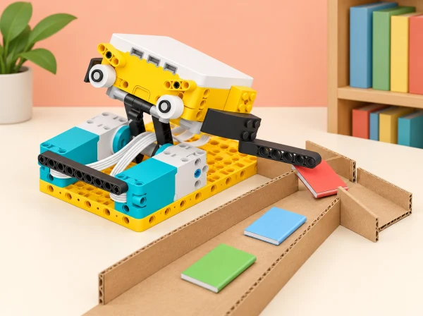

_Les dades descriuen el model mecànic, no l’activitat física ni la salut de l’alumnat._

## 🌱 Situació i intenció

Adaptació de la unitat *Training Trackers* per al context d’un centre educatiu valencià. Cada sessió conserva l’objectiu oficial i el tradueix en un repte, materials i criteris propis; quan una activitat del pla és híbrida o no requereix el hub, s’indica expressament en la sessió.

## 🎯 Aprenentatges i vocabulari

- Investigar relacions entre moviment, inclinació, cicles de motor i energia en una maqueta.
- Repetir proves amb controls i representar les lectures en gràfics amb unitats i condicions descrites.
- Comparar prediccions i mesures, identificar valors atípics i estimar el marge d’error.
- Comunicar què permet inferir el model i què no demostra sobre energia o moviment en situacions reals.

## 📅 Seqüència didàctica · 6 sessions

La unitat oficial combina indagació científica, registre de dades i disseny. En aquesta adaptació, els fenòmens es mesuren en mecanismes de maqueta: ningú no ha de fer exercici ni compartir dades corporals. Cada equip manté un quadern amb hipòtesi, variables controlades, dades repetides, gràfic i una conclusió que indique el marge d’incertesa.

### **S1 · Gràfiques d’orientació i marge d’error ([Stretch with Data](https://education.lego.com/en-us/lessons/prime-training-trackers/stretch-with-data/), 45–60 min).**

#### Fase 1 · Activem i prediem

**Pregunta:** com podem reproduir un moviment llegint una gràfica generada per un sensor? En lloc de demanar a l’alumnat que seguisca postures de ioga, fixem el hub en un suport rígid i segur i el movem a mà —lentament, sense deixar-lo caure— en tres orientacions acordades.

#### Fase 2 · Explorem i construïm

Subjecteu el hub en un suport rígid amb la matriu LED orientada cap a l’equip i marqueu dues posicions que es puguen repetir amb seguretat; no el poseu al cap ni a cap part del cos. Adapteu el programa de l’app perquè transmeta en directe les lectures del giroscopi al gràfic de línies. Feu el primer moviment entre les posicions acordades i anoteu què varia en una sola sèrie (pitch, roll o yaw), d’acord amb l’eix i la convenció que indique la versió de l’app del centre.

#### Fase 3 · Expliquem i registrem

Compareu la traça obtinguda amb una gràfica de mostra pròpia, sense reproduir la làmina LEGO. Marqueu en quin ordre es produeixen els canvis i intenteu seguir una segona gràfica ajustant el moviment del suport. Repetiu el mateix trajecte a dos ritmes i descriviu com la velocitat altera la forma de la línia, encara que les posicions inicial i final siguen iguals.

#### Fase 4 · Apliquem i millorem

Adapteu el programa per a representar dos valors alhora i planifiqueu una seqüència que combine dos moviments. Abans d’executar-la, dibuixeu quina traça espereu; després compareu la predicció amb les dades en directe i canvieu una sola part del moviment per millorar la correspondència.

#### Fase 5 · Comprovem i reflexionem

Una altra parella interpreta la gràfica sense veure el moviment original i ofereix un comentari concret; qui ha programat anota què canviaria. Autoavalieu tres criteris: el programa registra dades reals en el gràfic, la traça es pot relacionar amb un moviment i l’explicació diferencia pitch, roll i yaw segons el marc de referència emprat. **Evidència:** hipòtesi, programa i gràfica pròpia anotada, comparació de dues velocitats, prova amb dos valors i retorn entre parelles. Si falla la connexió USB/Bluetooth, useu una mostra pròpia identificada com a dada enregistrada abans; la pendent d’un tram recte amb y = mx + b queda com a extensió matemàtica amb temps addicional. No es recullen dades corporals ni es presenta el model com una mesura d’exercici o salut.

### **S2 · Energia elèctrica per pujar ([This Is Uphill](https://education.lego.com/en-us/lessons/prime-training-trackers/this-is-uphill/), 60–75 min).**

#### Fase 1 · Activem i prediem

**Pregunta:** què necessita un vehicle quan puja i volem que mantinga una velocitat semblant? Relacioneu el model amb la transferència d’energia: en la maqueta l’energia prové del motor elèctric; en una bicicleta real, la persona ciclista hi aporta energia amb l’esforç. Escriviu una hipòtesi sobre com canviaran la lectura del motor i l’angle de la rampa.

#### Fase 2 · Explorem i construïm

Construïu una bicicleta de maqueta o un vehicle equivalent que registre en directe, amb l’app connectada per USB o Bluetooth, la variable de consum del motor i l’angle de pendent. Primer feu una passada en pla amb la mateixa càrrega i programa que usareu després; anoteu què mostren les dues línies respecte del temps. Manteniu constant el vehicle, la càrrega, la velocitat programada i el punt d’inici. La lectura de consum del programa és una dada del model, no una mesura directa d’energia en joules.

#### Fase 3 · Expliquem i registrem

Col·loqueu una planxa estable sobre una base baixa i ferma —per exemple, la caixa del set— i feu una passada de pujada sense canviar cap altra variable. Compareu la lectura del motor i l’angle amb la línia base en pla. Expliqueu per què el motor necessita aportar més energia elèctrica per mantindre aproximadament la velocitat mentre el vehicle guanya energia potencial; la gràfica no mesura tota l’energia del sistema ni demostra que la velocitat haja sigut perfectament constant.

#### Fase 4 · Apliquem i millorem

Dissenyeu una ruta curta amb tram pla, pujada i baixada. Abans de provar-la, dibuixeu les dues traces que espereu al llarg del temps; després executeu el vehicle, compareu la predicció amb les lectures i expliqueu en quin tram s’ha separat més. Si hi ha temps, exporteu el CSV i representeu el consum del motor respecte de l’angle de pendent; investigueu si les dades donen suport a una relació proporcional, sense pressuposar que siga lineal.

#### Fase 5 · Comprovem i reflexionem

**Comprovació:** el programa registra les dues variables en una gràfica; l’equip interpreta què passa en pla i en pendent; i l’explicació relaciona amb vocabulari científic la transferència d’energia i el límit de la lectura. Cada persona tria un nivell d’autoavaluació (encara necessite ajuda / ho faig amb autonomia / puc dissenyar una prova nova) i una parella aporta una observació i una proposta de millora. **Evidència:** hipòtesi, gràfiques de línia base, pujada i ruta mixta, registre de condicions i conclusió al quadern. Si falla la connexió, useu dades de mostra clarament identificades com a tals.

### **S3 · Alçada màxima i energia potencial ([Time for Squat Jumps](https://education.lego.com/en-us/lessons/prime-training-trackers/time-for-squat-jumps/), 45–60 min).**

#### Fase 1 · Activem i prediem

**Pregunta:** quina alçada màxima assoleix el nostre model i com la relacionem amb l’energia potencial? Recordeu la relació Ep = m × g × h: coneixem o podem mesurar la massa i usem g com a valor constant; la incògnita és l’altura. Substituïm el salt humà per un elevador de maqueta que mou un marcador lleuger en una guia vertical estable, sense saltar ni mesurar el cos de ningú.

#### Fase 2 · Explorem i construïm

Fixeu el sensor de distància del set a un suport immòbil, alineat amb el marcador, i comproveu que el punt de lectura es manté dins del rang del sensor. Ajusteu el programa perquè registre en directe la distància i compareu-la amb una regla. Marqueu la lectura del marcador en repòs i la lectura mínima mentre puja: si el sensor i el suport no es mouen, l’altura recorreguda és la diferència entre aquestes lectures. Proveu primer dos recorreguts i ajusteu el mecanisme si el marcador ix del feix o s’enganxa.

#### Fase 3 · Expliquem i registrem

Feu tres intents per cadascuna de tres altures previstes. Registreu altura prevista, distància inicial, distància mínima, altura calculada i lectura amb regla; compareu la variació entre intents i expliqueu què pot causar-la. Després, com a ampliació, estimeu l’altura a partir de l’acceleròmetre integrat al hub, un vídeo lateral amb escala o el temps de moviment. Anoteu les condicions i compareu cada mètode amb la mesura de regla, que també té un marge d’error.

#### Fase 4 · Apliquem i millorem

Subjecteu al mateix marcador dues masses lleugeres conegudes, d’una en una, i manteniu l’altura final igual. Calculeu Ep amb la massa i l’altura mesurades; compareu els resultats i expliqueu quin factor ha canviat. Si useu acceleració integrada, vídeo o temps, etiqueteu el resultat com a estimació: la integració acumula error i cap d’aquests mètodes dona directament una altura exacta.

#### Fase 5 · Comprovem i reflexionem

**Comprovació:** el programa registra dades del sensor en un gràfic; l’equip interpreta els valors, calcula Ep amb unitats i explica com intervenen massa i altura. Feu una autoavaluació amb els mateixos tres nivells de la unitat i una revisió entre parelles: «Quina dada sosté el càlcul?» i «Quin límit cal explicar?». **Evidència:** codi o blocs, gràfica, taula de nou proves de distància/regla, càlcul amb masses conegudes i nota sobre incertesa. Exportar CSV és opcional. No afirmem haver mesurat un salt humà ni un valor energètic exacte.

### **S4 · Comptatge de cicles, velocitat i energia cinètica ([Watch Your Steps](https://education.lego.com/en-us/lessons/prime-training-trackers/watch-your-steps/), 60–75 min).**

#### Fase 1 · Activem i prediem

**Pregunta:** què pot inferir un acceleròmetre sobre un moviment repetit i quina incertesa té el recompte? Substituïm els passos de les persones per cicles d’un carro de maqueta en una guia recta: un cicle és anar d’una marca final a l’altra i tornar, sense eixir de la pista. Si la pista fa 30 cm, cada cicle representa 60 cm de recorregut. Fixem el hub sempre en la mateixa orientació i llegim l’acceleració en els tres eixos.

#### Fase 2 · Explorem i construïm

Fixeu el hub perpendicular al terra i en la mateixa orientació durant totes les proves. Connecteu-lo a l’app i enregistreu l’acceleració mentre una persona mou el carro entre les dues marques a ritme regular, guiat per un metrònom; no pugeu el carro a cap persona. Observeu la gràfica i acordeu com reconéixer els dos canvis de sentit d’un cicle. Ajusteu els valors mínim/màxim del programa amb una prova curta perquè un pic de retorn no es compte dues vegades; contrasteu el primer resultat amb un recompte manual sobre el vídeo o la gràfica.

#### Fase 3 · Expliquem i registrem

Feu tres recorreguts de tres, cinc i set cicles, i registreu per a cada un el temps, els cicles manuals i el recompte automàtic. Compareu les diferències i calculeu l’error relatiu del programa com |automàtic − manual| / manual × 100. En una quarta prova, estimeu la distància com a cicles detectats × 60 cm i la velocitat mitjana com a distància/temps. Per a una massa de maqueta mesurada, calculeu Ek = ½ × m × v². Són estimacions del tram: el carro pot variar de velocitat, els cicles no són idèntics i l’energia calculada amb la velocitat mitjana no és la mitjana exacta de l’energia instantània.

#### Fase 4 · Apliquem i millorem

Canvieu una sola condició —l’orientació del hub, la textura de la pista o el llindar— i repetiu una passada de la mateixa distància. Anoteu si apareix algun fals recompte i expliqueu com la posició del hub i la variabilitat del moviment alteren els mínims/màxims que usa el programa. Torneu a la configuració inicial i descriviu quina correcció milloraria el recompte sense ocultar les lectures discrepants.

#### Fase 5 · Comprovem i reflexionem

**Comprovació:** el programa registra acceleració en una gràfica, l’equip explica què ha comptat com a cicle i calcula distància/velocitat/energia amb unitats i un límit explícit. Autoavalieu si heu calibrat el recompte, interpretat la gràfica i explicat l’error; una parella revisa una prova i proposa una millora concreta. **Evidència:** gràfica acceleració/temps, registre de les tres proves de calibratge i la quarta prova, recomptes manual i automàtic, càlculs i nota de marge d’error. Si la lectura no és estable, treballeu dades acceleromètriques de mostra LEGO, identificades com a dades proporcionades. Com a ampliació, munteu de manera segura un telèfon o una tauleta al mateix carro i compareu les lectures amb les del hub; cap dispositiu va sobre una persona ni s’hi registren dades personals.

### **S5 · Rotació de roda, distància, velocitat i energia ([Aim for It](https://education.lego.com/en-us/lessons/prime-training-trackers/aim-for-it/), 60–75 min).**

#### Fase 1 · Activem i prediem

**Pregunta:** què expliquen tres gràfiques diferents —rotacions de roda, distància i velocitat al llarg del temps— sobre el moviment d’un objecte? Com depén l’energia cinètica de la massa i de la velocitat? Dibuixeu una predicció per a un vehicle de rodes lliures que rep una empenta i després es desplaça sense motor; marqueu on espereu la velocitat màxima.

#### Fase 2 · Explorem i construïm

Construïu un vehicle de rodes lliures amb un motor SPIKE connectat a una roda perquè l’encoder registre les rotacions; no activeu el motor durant el recorregut. Connecteu el hub a l’app per USB o Bluetooth, peseu el vehicle complet i mesureu la circumferència de la roda. En una pista horitzontal lliure, inicieu cada prova des de la mateixa línia amb una empenta suau i semblant; deixeu que el vehicle avance i s’ature tot sol, sense perseguir-lo ni bloquejar les rodes. Enregistreu rotacions respecte del temps i anoteu les condicions de cada assaig.

#### Fase 3 · Expliquem i registrem

Observeu els pics de la gràfica de rotacions i proposeu què poden representar en la lectura del sensor. Convertiu les rotacions en distància (rotacions × circumferència) i traceu distància/temps; després estimeu la velocitat en cada tram amb la pendent de la gràfica. Identifiqueu la velocitat màxima inicial i calculeu-ne una estimació d’energia cinètica amb la massa mesurada: Ek = ½ × m × v². Compareu la predicció amb les dades i expliqueu que la velocitat i l’energia canvien mentre el vehicle perd velocitat; el càlcul no és l’energia exacta de tot el recorregut.

#### Fase 4 · Apliquem i millorem

Adapteu el repte de *street curling*: cada equip té tres intents per acostar el vehicle al centre d’una diana ampla i tova. Després de cada intent, mesureu des de la part frontal del vehicle fins al centre; sumeu les tres distàncies i compareu el total entre equips. Manteniu la mateixa línia de llançament. Si investigueu l’efecte de la massa, utilitzeu un impulsor mecànic amb la mateixa posició i recorregut d’alliberament en cada prova; sense un impuls regular, descriviu les diferències com a observacions i no les atribuïu només a la massa. Afegiu peces LEGO lleugeres, peseu de nou el vehicle i actualitzeu les gràfiques i el càlcul de velocitat/energia. Com a ampliació, dissenyeu i compareu l’impulsor amb les empentes manuals; no puntueu la força ni la rapidesa de cap persona.

#### Fase 5 · Comprovem i reflexionem

**Comprovació:** el programa registra les rotacions, el grup interpreta les gràfiques, calcula la velocitat i relaciona massa i velocitat amb l’energia cinètica. Autoavalieu si podeu fer cada pas amb les dades del grup; una altra parella revise el càlcul i done una suggerència concreta. **Evidència:** massa i circumferència mesurades, gràfiques rotació/distància/velocitat, càlcul d’Ek amb unitats, les tres distàncies a la diana i una conclusió sobre variabilitat. Si feu la comparació de masses, conserveu les dues gràfiques i els dos càlculs. Useu només càrregues lleugeres ben fixades i una zona d’aturada lliure.

### **S6 · Disseny d’un circuit que mostre transferències ([The Obstacle Course](https://education.lego.com/en-us/lessons/prime-training-trackers/the-obstacle-course/), 2–3 sessions de 45–60 min).**

#### Fase 1 · Activem i prediem

**Repte obert:** dissenyeu per parelles un joc d’obstacles de maqueta que mostre com un objecte passa d’una posició elevada o emmagatzemada a una altra de moviment. Abans de construir, recupereu què heu observat sobre energia potencial i cinètica en les sessions anteriors i escriviu una hipòtesi sobre una lectura que podria mostrar el canvi. El prototip ha d’incloure un moviment de pèndol, balancí o pujada/baixada, una dada que es puga registrar i una manera clara d’explicar el resultat.

#### Fase 2 · Explorem i construïm

Cada parella dibuixa dues o tres idees i explica com recollirà dades en cadascuna. Trieu-ne una amb criteris de funcionament, estabilitat, seguretat i llegibilitat de la dada. Per iniciar el disseny es poden oferir cinc models reduïts: una barra horitzontal oscil·lant, un anell que es balanceja, una tirolina de maqueta amb carro lleuger, una plataforma que puja i baixa o un balancí de dues peces. Construïu només una versió de baixa altura amb peces SPIKE Prime i materials lleugers; abans de connectar el hub, comproveu manualment el moviment i subjecteu cordills, eixos i càrregues.

#### Fase 3 · Expliquem i registrem

Executeu el prototip més d’una vegada i registreu moltes dades per a la variable triada —per exemple, acceleració, inclinació o rotacions— amb el hub i l’app connectats. Anoteu què representa cada eix i unitat, quina part del moviment espereu que produïsca cada canvi i quines condicions heu mantingut constants. Graveu un vídeo curt del mecanisme en funcionament per poder comparar el moviment visible amb la gràfica; el sensor no mesura directament l’energia potencial o cinètica del sistema.

#### Fase 4 · Apliquem i millorem

Reviseu si les dades i el vídeo sostenen la hipòtesi. Canvieu una sola part —altura, recorregut, massa lleugera o posició del sensor— i repetiu l’assaig; compareu les gràfiques abans/després i anoteu una limitació. Com a ampliació, compareu el mateix prototip amb un segon dispositiu de registre si està disponible, o proposeu una altra prova de transferència d’energia que no implique persones. Si el centre disposa d’un ascensor i hi ha una activitat supervisada adequada, l’adult pot registrar amb el hub ben subjectat l’acceleració de la cabina i comparar-la amb la d’un elevador de maqueta; no es fixa cap sensor a una persona. En la posada en comú, les parelles s’entrevisten per torns: una presenta el model mentre l’altra pren notes i pregunta; després intercanvien els rols. Poden convertir l’entrevista en una entrada de portafolis o un vídeo sense dades personals ni imatges identificables.

#### Fase 5 · Comprovem i reflexionem

Presenteu el prototip, la gràfica i el vídeo o una seqüència dibuixada; expliqueu quin problema heu identificat, com funciona la solució i quines dades donen suport a la idea de transferència. **Criteris d’èxit:** identificar els elements clau del problema; construir una solució pròpia que funcione; registrar i interpretar una dada rellevant; comunicar el disseny amb claredat. Autoavalieu el procés amb tres nivells i doneu a una altra parella un comentari basat en una evidència i una proposta útil. **Evidència:** esbossos de dues o tres idees, criteris de tria, prototip provat, dades amb eixos/unitats, vídeo, canvi justificat i retorn entre equips.

## 🧰 Materials i preparació

Set SPIKE Prime i l’app compatible per a enregistrar dades del hub, motors i sensors; peces per a vehicle, suport de gir, elevador i pista; taula o rampa curta i estable; masses de maqueta lleugeres, regle, cinta de paper i ordinador opcional per obrir CSV. Abans de classe, proveu els ports, la connexió i els blocs d’adquisició de dades de la versió instal·lada. Fixeu el hub segons cada muntatge, deixeu el recorregut lliure i limiteu altura, velocitat i massa.

## 🎯 Evidències i avaluació

El quadern de cada equip —elaborat ací com a alternativa pròpia al quadern d’inventor de LEGO— mostra una hipòtesi, el protocol i les variables controlades, les dades repetides, una gràfica amb eixos i unitats, el marge o la font d’error i una conclusió limitada al que realment s’ha mesurat. La llista d’observació docent comprova quatre indicadors: el programa registra dades del sensor en una gràfica; l’equip relaciona la traça amb el moviment del model; interpreta la magnitud científica tractada en la sessió (orientació, transferència d’energia, altura, acceleració o velocitat); i comunica una conclusió amb les limitacions de la mesura. No s’avalua el resultat físic ni qui fa moure el model.

En cada sessió, l’alumnat fa una autoavaluació amb tres nivells visuals: «interprete una gràfica amb ajuda», «dissenye una prova i explique les dades» i «propose una prova nova, en revise el protocol i defense una conclusió». Després, una parella revisora assenyala una evidència concreta i formula una pregunta o suggeriment útil. Aquesta escala pròpia manté la progressió d’autoavaluació i retorn entre iguals dels plans oficials sense copiar-ne els materials.

## ♿ Participació, diferenciació i preparació

Abans de les sessions, el docent comprova l’app SPIKE, la connexió USB/Bluetooth, els blocs de registre i la configuració dels sensors del muntatge; prepara dades de mostra datades per si no es pot enregistrar en directe. Les durades de la seqüència corresponen al treball d’aula; la preparació prèvia i la posada en comú posterior es poden distribuir en altres moments. Si l’accés a un set és limitat, l’alumnat completa el quadern amb les dades de la sessió i les mostres pròpies, en lloc de presentar dades inventades com si foren capturades.

Les ajudes i ampliacions conserven les opcions de les lliçons originals en contextos de maqueta: a S1 es pot treballar només amb el hub subjectat i un gràfic de mostra, o bé construir un suport propi i intercanviar gràfiques amb una altra parella; a S2 es comença explicant una proporcionalitat directa amb una taula senzilla i s’amplia amb un protocol creat per l’equip; a S3 es redueix el muntatge al hub i al sensor disponible i es comparen estimacions amb vídeo o temps; a S4 es fixa el hub perpendicular a la superfície i es compten cicles manualment abans d’ajustar el programa, amb comparació opcional d’un mateix carro amb hub i tauleta; a S5 es pot limitar l’anàlisi a distància-temps, o dissenyar un vehicle lliure i un impulsor més regular; a S6 es donen quatre o cinc exemples de mecanismes perquè l’equip en trie un, o es fa una pluja d’idees col·lectiva abans del disseny autònom. Vídeos, taules de lectura gran i peces per representar les dades permeten participar sense controlar el robot; els rols de mesura, programació, registre i comunicació roten.

## 🔗 Unitat oficial i traçabilitat

La seqüència es correspon sessió per sessió amb les sis lliçons de la unitat LEGO Education [Training Trackers · SPIKE Prime](https://education.lego.com/en-us/lessons/prime-training-trackers/): *Stretch with Data* treballa pitch/roll/yaw i la lectura de gràfiques; *This Is Uphill* compara consum del motor i pendent; *Time for Squat Jumps* relaciona altura i energia potencial; *Watch Your Steps* explora l’acceleració i la velocitat; *Aim for It* transforma rotació en distància, velocitat i energia cinètica; *The Obstacle Course* integra el disseny d’un repte i el registre de dades. S’adapta el sistema de mesura del cos a models controlats, mantenint aquests objectius científics i computacionals. No es registren moviments, rendiment ni cap dada de salut de persones.
