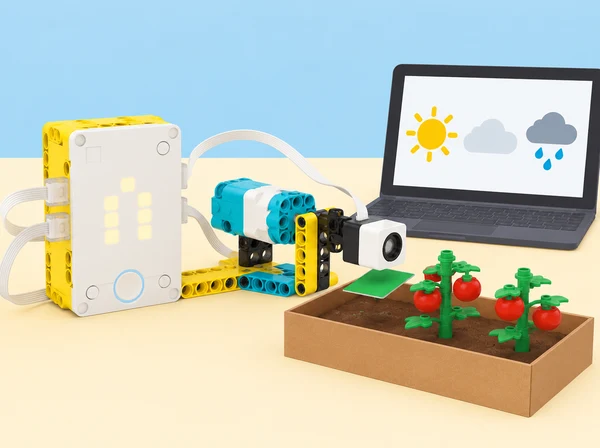
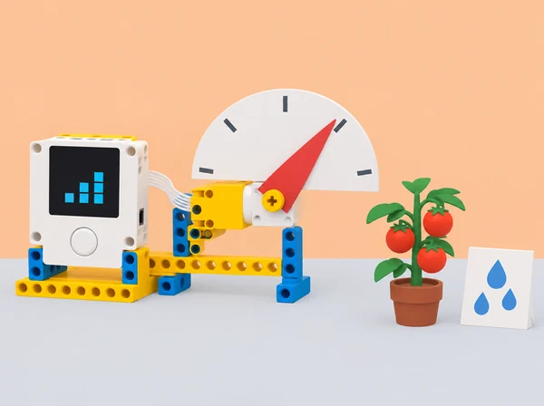

_L’indicador representa una dada de previsió; no mesura la humitat del sòl ni decideix el reg d’un hort real._

## 🌱 Repte i intenció

La classe prepara un indicador visual que ajude a parlar de les necessitats d’aigua d’un hort escolar. La situació adapta *Veggie Love* de LEGO Education: construïm un «tomato-meter», consultem dades meteorològiques quantitatives del núvol per a una ciutat i fem que una agulla represente la precipitació prevista acumulada per a la setmana. Investiguem la relació entre dada, escala i decisió sense convertir la maqueta en una recomanació agronòmica: el reg real depén també del sòl, l’espècie, el cultiu i les observacions de l’hort. La conversa inicial també contrasta per què alguns cultius o regions tenen períodes de creixement diferents; no s’assumeix que una previsió setmanal determine per si sola la necessitat d’aigua.

## 🎯 Aprenentatges i vocabulari

- Interpretar una sèrie setmanal de precipitació amb font, dates i unitats explícites.
- Calibrar una escala de maqueta i provar els valors als límits i entre intervals.
- Programar un indicador que represente les dades sense confondre previsió amb mesura del sòl.
- Argumentar una decisió per a un hort de maqueta i deixar clar que no controla un reg real.

## 📅 Seqüència didàctica · 3 sessions

### **S1 · De la previsió a una pregunta investigable (45–60 min).**

Activeu idees prèvies sobre estacions, cultius i pluja: què necessitaria saber una persona que cuida tomaqueres? Distingiu precipitació prevista, pluja observada i humitat del sòl. En parelles, construïu o adapteu un indicador de paper amb agulla motoritzada; cada equip tria una ciutat i executa el programa amb els blocs de dades meteorològiques disponibles a l’app SPIKE. Registreu ciutat, moment de consulta, unitat retornada i període de la dada. Si no hi ha connexió o els blocs no estan disponibles, useu una captura datada o una taula preparada pel docent i etiqueteu-la com a dada arxivada. **Evidència:** diagrama de la maqueta i fitxa que diferencia dada en viu, dada guardada i variable que no es mesura.

### **S2 · Calibrem el tomato-meter amb la precipitació setmanal (45–60 min).**

Feu que la pantalla mostre la suma de precipitació prevista per a la setmana i decidiu quina escala física representa aquest valor. Marqueu mínim, màxim i divisions abans de moure l’agulla; programeu una resposta proporcional entre dada i angle del motor, proveu almenys tres valors i compareu lectura esperada i posició observada. Si els equips necessiten suport, proporcioneu una primera regla de conversió; com a ampliació, canvieu el rang o les divisions i torneu a calibrar el mateix model. Ajunteu-vos amb una altra parella per detectar desajustos i explicar-los. **Evidència:** taula de valor, posició predita, posició mesurada i error, amb una iteració documentada.

### **S3 · Recalibrem per a una altra dada i comuniquem els límits (45–60 min).**

Sense canviar el muntatge, reinterpreteu l’escala per mostrar la temperatura prevista de la setmana: identifiqueu per què no es pot reutilitzar la conversió de precipitació i definiu un rang nou. Qui ja domine el procés pot crear targetes pròpies de «necessitats d’aigua» per a cultius ficticis i provar com de ràpid es recalibra l’indicador. Com a extensions matemàtiques, conserveu la mateixa escala per representar velocitat del vent al llarg del temps o temperatura en més d’un moment i expliqueu si cal recalibrar-la. Compareu ciutats o períodes amb dades datades. Com a extensió de llengua i medi, entrevisteu una persona agricultora o horticultora —o useu una font divulgativa fiable si no és possible— per comparar l’indicador escolar amb eines reals de camp; no demaneu ubicacions privades ni recomanacions de reg per a un cultiu concret. Redacteu una explicació per a l’hort escolar i incloeu què caldria comprovar abans de prendre una decisió real; no presenteu la previsió com una mesura del sòl ni com una instrucció de reg. **Evidència:** dues escales calibrades, targeta explicativa amb font i data, i una conclusió que separe observació, interpretació i decisió pendent.

_L’agulla representa la previsió triada; ni la planta ni la targeta són sensors d’humitat o de pluja observada._

## 🧰 Materials i preparació

Set SPIKE Prime, hub, motor i peces per a un indicador de paper; ordinador o tauleta amb l’app SPIKE i els blocs de previsió meteorològica activats; paper, retoladors i regla. Abans de classe, comproveu que la connexió, la ubicació seleccionable i les dades requerides funcionen en el dispositiu del centre. Prepareu una taula meteorològica datada com a alternativa equivalent per a analitzar dades quan el servei no estiga disponible. No cal sensor d’humitat: el kit SPIKE Prime no el proporciona.

## 🧪 Evidències i avaluació

Recolliu l’esbós i el muntatge, el registre de consulta, la regla de conversió, les proves amb valors diferents, l’error d’escala, la recalibració i la comunicació final. Valoreu si l’alumnat tria una escala coherent amb les unitats, representa proporcionalment el valor, explica com l’ha transformat i recalibra el mecanisme quan canvia la variable. Autoavaluació amb tres indicadors: faig moure l’agulla segons una dada; represente la precipitació setmanal; recalibre per representar temperatura. El retorn entre parelles ha d’indicar una millora concreta i una limitació.

## ♿ Participació, privacitat i límits

Repartiu rols de consulta, programació, lectura d’escala i documentació, amb instruccions visuals i codis redundants a color. Consulteu només ciutats públiques, no ubicacions personals. L’indicador comunica una previsió i la seua transformació; no és un pluviòmetre ni un sensor de sòl, no determina si una planta necessita aigua i no substitueix l’observació de les persones responsables de l’hort.

## 🔗 Lliçó oficial adaptada

Aquesta fitxa adapta [Veggie Love](https://education.lego.com/en-us/lessons/prime-life-hacks/veggie-love/), cinquena lliçó de [Life Hacks](https://education.lego.com/en-us/lessons/prime-life-hacks/): muntatge en parelles del tomato-meter, selecció d’una ciutat, lectura de precipitació prevista, moviment proporcional de l’agulla, suma setmanal, ajuda entre parelles, extensió a la temperatura, recalibració, targetes de necessitats d’aigua i avaluació de la fiabilitat de l’escala. La situació, les explicacions, els registres i la imatge són propis; les instruccions i el full d’alumnat del fabricant continuen a l’app SPIKE.
