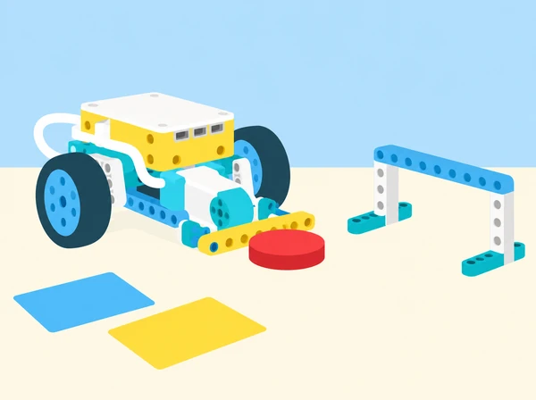

_Cinc reptes propis per practicar cooperació, ideació, programació i revisió en equip._

## 🌱 Situació i intenció

El centre prepara una jornada de prototips on cada equip haurà d’explicar una idea, construir un mecanisme i convidar altres grups a provar-lo. La classe adapta íntegrament la col·lecció suplementària oficial de SPIKE Prime: cooperació, generació d’idees, comunicació d’un objecte, control de distància i joc de taula. Les missions, targetes, regles i imatge són originals i pensades per a un taller escolar valencià.

## 🎯 Aprenentatges i vocabulari

- Participar en una ronda d’ideació i seleccionar una proposta amb criteris compartits.
- Construir i programar un mecanisme de taula que resolga un repte delimitat.
- Provar la proposta, incorporar el retorn i explicar què s’ha canviat.
- Repartir rols i documentar contribucions sense premiar només la rapidesa o el resultat final.

## 📅 Seqüència didàctica · 5 sessions

Cada lliçó oficial dura 30–45 minuts; les sessions següents reserven també temps per documentar, provar amb una altra parella i fer retorn. Les targetes de treball i els criteris són propis. Organitzeu equips de 2–3 persones, roteu qui pren decisions i qui manipula el prototip, i conserveu una llibreta de proves comuna.

### **Sessió 1 · Les mans cooperen per moure mostres · [Pass the Brick](https://education.lego.com/en-us/lessons/prime-extra-resources/pass-the-brick/).**

**Activació (5 min):** què vol dir que tot l’equip avance cap a un objectiu compartit? Formeu un nombre parell d’equips de 2–3 persones i trieu qui coordina la primera prova. Durant 5 minuts, munteu i proveu una pinça pròpia amb peces SPIKE i sis fitxes grans de mostra, treballant cap a un objectiu compartit. Després feu tres reptes més i canvieu qui coordina abans de cadascun: (1) cada membre trasllada d’una en una les sis fitxes entre dues safates; (2) disposeu de 3 minuts per apilar peces grans per torns; si cau la torre, qui ha col·locat l’última peça explica què ha observat i coordina una reconstrucció amb ajuda de l’equip, sense penalització personal; (3) emparelleu equips: una pinça passa una fitxa a l’altre equip a mig camí i la segona pinça la duu fins a la safata final. El hub pot obrir/tancar la pinça amb els botons esquerre/dret; com a extensió, feu servir la inclinació o un sensor de força. Per facilitar-ho, reduïu el nombre de reptes o doneu a la persona coordinadora 1–2 minuts previs per ordenar les instruccions i proporcioneu una pauta clara. Com a ampliació, afegiu requisits com moure la fitxa blava al final, col·locar una peça roja al fons de la torre o treballar només amb una mà; observeu com canvien la planificació i l’ajuda entre iguals. **Registre:** passades, caigudes i temps per ronda. Registreu que cada membre ha tingut un torn i una responsabilitat identificable. Tanqueu amb retorn entre iguals i autoavaluació: hem treballat cap a una meta comuna? Hem ajudat cada persona a contribuir i assolir un repte?

### **Sessió 2 · Idees en temps limitat · [Ideas, the LEGO way!](https://education.lego.com/en-us/lessons/prime-extra-resources/ideas-the-lego-way/).**

**Repte propi:** millorar una rutina quotidiana del centre sense donar per fet que cal automatitzar-la (preparar material per a una eixida, organitzar l’esmorzar o deixar el taller a punt). Obriu amb 5 minuts de conversa sobre una rutina del centre que es podria millorar i què fa difícil aquesta tasca; no pressuposarem que automatitzar-la siga la millor solució. En la fase d’exploració (8 min), cada persona genera idees durant 3 minuts i després en dibuixa o construeix individualment una durant 5 minuts amb paper, llapis, tisores, cinta o peces LEGO. El hub SPIKE pot fer de compte arrere amb els programes de 3 i 5 minuts; un temporitzador extern o docent també és vàlid. En la fase d’explicació (10 min), compartiu les idees en equip durant 5 minuts i dediqueu-ne 5 a triar-ne una amb criteris acordats: necessitat concreta, persona beneficiària, facilitat d’ús i manera de comprovar-la. En la fase d’elaboració (15 min), construïu durant 5 minuts una maqueta conceptual —no cal que funcione— i useu el temps restant per preparar un vídeo explicatiu, una presentació oral o un document creatiu individual que descriga la millor idea de cada persona; reserveu també temps de recollida. **Avaluació:** comprovem si cada persona ha generat diverses idees, ha usat eines per expressar-les, ha participat en la selecció amb criteris i pot explicar la proposta a altres. Feu autoavaluació individual i feedback constructiu entre iguals. Per simplificar, limiteu la conversa a una tasca concreta, treballeu com a classe sencera per controlar els temps o useu un rellotge extern en lloc del hub; com a ampliació, feu una posada en comú general o repetiu una segona sessió un altre dia per comparar com han evolucionat les idees. No es puntua la quantitat de peces ni s’exigeix una solució robòtica.

### **Sessió 3 · Inventem una cosa i n’expliquem l’ús · [What is this?](https://education.lego.com/en-us/lessons/prime-extra-resources/what-is-this/).**

**Seqüència (3 + 12 + 10 + 15 min):** obriu amb preguntes sobre què fa que una explicació siga convincent i com distingim una prova d’una afirmació. En parelles, observeu i proveu una maqueta pròpia amb un motor que gire un element d’un costat a l’altre, però sense revelar-ne la funció. Inventeu un ús útil per a una persona o un espai del centre; definiu nom, usuari, necessitat, acció, benefici i límit, i modifiqueu mecanisme o programa perquè es puga comunicar millor. Per exemple, podria mostrar per torn etiquetes d’una exposició. Una segona parella ha d’inferir la funció a partir d’una demostració i una presentació d’un minut, sense pistes: després pregunteu quina característica n’ha servit de prova i quin detall convé millorar. Com a entrada opcional, el sensor de força pot iniciar/aturar el mecanisme i el de distància detectar acostament. Per simplificar, centreu la sessió en un àmbit concret (per exemple, el pati o una joguina) i doneu al grup una targeta que ajude a definir l’usuari. Com a ampliació, cada equip incorpora almenys un sensor al model final, o repetiu la sessió un altre dia amb la consigna de no reutilitzar cap idea de la primera volta. També podeu organitzar una fira escolar del prototip o un intercanvi de rols «equip emprenedor / equip patrocinador», sempre demanant que les afirmacions es recolzen en les proves. **Evidència:** diagrama entrada–acció–propòsit, primera i segona explicació i retorn rebut; valoreu si l’alumnat descriu la funció, relaciona les característiques amb la necessitat i defensa una afirmació amb proves, no que el concepte siga un producte fabricable. Feu una autoavaluació breu i un comentari constructiu entre equips.

### **Sessió 4 · Estimar, calcular i parar · [Going the Distance](https://education.lego.com/en-us/lessons/prime-extra-resources/going-the-distance/).**

**Seqüència (3 + 12 + 10 + 15 min):** activeu preguntant com aprendríeu a usar un objecte: manual, guia ràpida o prova i error. Munteu en parelles una base de conducció pròpia; podeu repartir bastidor i frontal en dues parts i unir-les després. Per estalviar temps, feu els dos reptes calculats només amb la base i afegiu el frontal amb el sensor de força per a la prova final. Poseu el robot a un metre d’una fitxa dreta i programeu-lo perquè avance fins a quedar-ne tan a prop com puga sense tocar-la. Mesureu la circumferència de la roda i estimeu les rotacions; per a les rodes LEGO Rhino de diàmetre 5,6 cm, una volta equival aproximadament a 17,6 cm, però mesureu les rodes de la vostra base perquè l’estructura pot variar. Registreu càlcul, programa i error. Reutilitzeu el càlcul per resoldre un segon objectiu: una distància total de 120 cm des de l’eixida, amb una única prova. Expliqueu per què les rotacions són més transferibles que els segons quan canvia la velocitat. Finalment, afegiu un sensor de força al davant de la base i programeu que els motors paren quan toque suaument una paret de cartó ampla: compareu control calculat i retroacció del sensor. El sensor de força inclòs al set SPIKE Prime és el necessari per a aquesta prova (no el confongueu amb el sensor de distància); si el centre no el té disponible, anoteu una activació manual com a alternativa adaptada, no com un equivalent al sensor. **Matemàtiques i diferenciació:** feu una taula de voltes i distàncies. Per a la roda Rhino oficial (diàmetre 5,6 cm), cinc voltes són uns 88 cm; mesureu la roda real de la base, comenceu amb voltes senceres i programeu per rotacions o graus, no per segons. Com a extensió, compareu velocitats del 75% i del 25%, o proveu rodes més menudes. Predigueu també quantes voltes calen per a 2,5 m, 400 cm i 3500 mm, justificant les conversions. L’avaluació comprova si l’equip usa les observacions per a millorar el programa, segueix un mètode sistemàtic i aplica el càlcul d’un metre al repte nou d’una sola prova; cada alumne explica i defensa el mètode amb arguments. No col·loqueu les mans en la trajectòria.

### **Sessió 5 · Creem un joc de taula cooperatiu · [Goal!](https://education.lego.com/en-us/lessons/prime-extra-resources/goal/).**

**Seqüència (5 + 10 + 10 + 15 min):** acordeu un objectiu comú, assigneu rols concrets (control del mecanisme, registre/puntuació i observació de la seguretat; en parelles, es poden combinar i després alternar) i decidiu com donar resposta honesta als errors. Distingiu el treball en equip amb una persona coordinadora de la col·laboració entre iguals, on tothom comparteix decisions i idees. En parelles, munteu un mecanisme propi per impulsar una fitxa lleugera i proveu el programa. Feu el repte de referència: anoteu quants gols podeu marcar en un minut. Després cada equip dissenya un repte nou incorporant idees de totes les persones i convida un altre equip a jugar-lo: dibuixeu la pista, les regles, la puntuació i com es reinicia. Repartiu els rols també en l’equip visitant i recolliu-ne retorn; en una segona ronda, barregeu els equips perquè apliquen els suggeriments rebuts. Es pot afegir un segon disc, obstacles lleugers, zones de punts de colors o un sensor de força com a accionador; adapteu el joc perquè siga segur per a totes les persones. **Extensió matemàtica:** manteniu el mateix disc i camp, feu proves a diversos nivells de potència del motor i mesureu sempre des del mateix punt la distància recorreguda; representeu-ne la relació en una gràfica. Registreu per separat el nombre de tirs, tirs a porteria, gols i passades encertades, i calculeu estadístiques senzilles per comparar partides. **Evidència:** reglament il·lustrat, rols assumits, dades del minut inicial i del repte propi, explicació de com s’han combinat les idees del grup, comentaris de l’equip visitant i una millora provada en la segona ronda. Puntuar més no substitueix col·laborar ni fer un joc comprensible i segur.

## 🧰 Materials i preparació

Set SPIKE Prime amb hub, motor gran i motor mitjà, sensor de força per al repte de parada, peces per a una pinça i un accessori propulsor, cinta de paper o cartó, regla o cinta mètrica, safates, sis fitxes grans lleugeres, targetes i cronòmetre (pot ser un temporitzador del hub). Per a prototips conceptuals, paper i llapis. El sensor de distància és una extensió possible a la sessió 3, no un requisit de l’adaptació. La base Rhino LEGO no és necessària: munteu una base escolar estable que puga avançar i aturar-se. Delimiteu la pista i comproveu el mecanisme amb velocitat baixa abans de començar.

## 🧪 Evidències i avaluació

Carpeta de procés: (1) registre de passades, caigudes, temps i retorn cooperatiu; (2) idees individuals, criteris de selecció i maqueta; (3) funció, diagrama i explicació amb prova de comprensió d’una altra parella; (4) càlcul de roda, valors del programa, distància d’error i comparació entre parada calculada i sensor de força; (5) regles visuals, intents, tirs a porteria, gols i passades encertades. Observeu si l’alumnat treballa cap a un objectiu comú, facilita que cada membre hi contribuïsca i aplica les dades per a millorar. En cada evidència useu tres nivells descriptius: *amb ajuda* (contribueix quan rep una pauta concreta), *autònom* (explica i aplica el procediment) i *transfereix* (ajuda a altres i justifica una millora amb dades). Doneu retorn sobre una acció observable, no sobre trets personals; reserveu autoavaluació i valoració entre iguals al final de cada sessió.

## ♿ Participació i seguretat

Els rols permeten contribuir sense manipular peces ni parlar davant del grup: es pot dibuixar, registrar dades, revisar instruccions o fer observacions. Delimiteu el camp de joc i manteniu els mecanismes a baixa velocitat; no useu projectils rígids, no apunteu a persones i no poseu mans davant d’un mecanisme en moviment.

## 🔗 Catàleg oficial adaptat

Aquesta seqüència reinterpreta les cinc lliçons compatibles amb SPIKE Prime de LEGO Education [Supplementary Lessons](https://education.lego.com/en-us/lessons/prime-extra-resources/): [*Pass the Brick*](https://education.lego.com/en-us/lessons/prime-extra-resources/pass-the-brick/), [*Ideas, the LEGO way!*](https://education.lego.com/en-us/lessons/prime-extra-resources/ideas-the-lego-way/), [*What is this?*](https://education.lego.com/en-us/lessons/prime-extra-resources/what-is-this/), [*Going the Distance*](https://education.lego.com/en-us/lessons/prime-extra-resources/going-the-distance/) i [*Goal!*](https://education.lego.com/en-us/lessons/prime-extra-resources/goal/). S’han revisat individualment els objectius, els temps, els passos públics, les extensions i els criteris d’avaluació de cada pla docent. Les adaptacions preserven les quatre rondes de cooperació de la primera lliçó; les cinc fases de temps limitat i el prototip conceptual de la segona; l’observació, definició, modificació i presentació de la tercera; els tres reptes progressius de mesura, estimació i parada sensorial de la quarta; i el minut de joc, disseny d’un repte propi i extensió de dades de la cinquena. Els contextos, les explicacions, les dades, les regles i els materials auxiliars són propis. LEGO remet les instruccions de construcció i fulls d’alumnat a l’app SPIKE; per això la cobertura ací és completa respecte dels cinc plans públics, no una reproducció de materials privats de l’app. La il·lustració és pròpia i correspon al repte de joc. La col·lecció [Prime Combined](https://education.lego.com/en-us/lessons/spike-and-bricq-motion-prime-combined/) s’audita a banda perquè les seues activitats declaren també el set BricQ Motion Prime.
