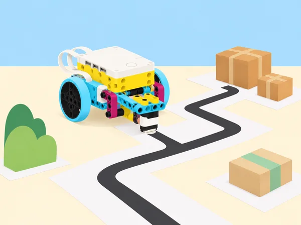
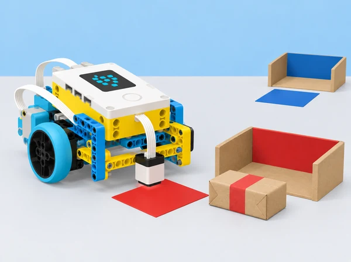

_Els sensors proporcionen entrades concretes; les regles i decisions del programa les defineix l’equip._

## 🌱 Repte i intenció

La biblioteca escolar organitza una circulació simulada de capses lleugeres entre prestatges, punts de recepció i places de càrrega. En huit lliçons, l’alumnat combina sensors, motors i condicions; registra com la potència afecta una parada; depura un moviment rítmic activat per color; dissenya un laberint; classifica paquets de paper; i coordina bases mòbils en una maqueta d’aparcament amb i sense sensor. La seqüència adapta la unitat 5 *Sensors* del curs LEGO Education *Foundations of Physical Computing*. La biblioteca és un escenari didàctic: no es desplacen llibres reals ni es fa cap afirmació que aquest prototip siga segur o apte per a un servei autònom.

## 📅 Seqüència didàctica · huit lliçons

### **Lliçó 1 · Els sensors activen respostes (90 min).**

Amb una base SPIKE, definiu en pseudocodi quan s’ha d’aturar el vehicle: en acostar-se a una paret més que el llindar acordat o en detectar una targeta de color determinada. Programeu una condició amb sensor de distància o de color i un motor; afegiu comentaris que expliquen la regla i la condició d’aturada. Proveu una entrada esperada i una inesperada i registreu la predicció, lectura i resposta. Si el sensor o la versió de l’app no permet l’exemple, useu una targeta manual i marqueu-ho com a simulació. L’aturada es prova amb un obstacle tou de taula, a velocitat baixa i sense col·locar-hi persones.

### **Lliçó 2 · Sensors i dades (90 min).**

Programeu que la base s’acoste a un mur de cartó i s’ature quan el sensor de distància indique la separació objectiu. Abans d’executar, escriviu el pseudocodi. Repetiu amb diversos nivells de potència del motor, mantenint fixes punt d’inici, distància objectiu, orientació i superfície; feu almenys tres intents per nivell. Anoteu distància final, error respecte de l’objectiu i temps. Calculeu mitjanes, representeu-les en una gràfica i discutiu per què una potència més alta pot fer que la base sobrepasse el punt abans de frenar. El sensor de distància usa retorn acústic, però la mesura continua condicionada per superfície, angle i resposta del programa.

### **Lliçó 3 · Ball i depuració per color (45 min).**

Planifiqueu una rutina de moviment rítmic amb un senyal visual; el robot respon a un color llegit per un sensor o a una seqüència de targetes sobre una pista. Escriviu pseudocodi, dividiu-lo en parts i afegiu comentaris a cada secció. Proveu primer amb un color, després amb un segon estat de moviment i finalment amb la seqüència sencera. Incorporeu el protocol de depuració: revisar instrucció i connexions, provar un tram, afegir funcionalitat a poc a poc i comprovar entrades esperades i inesperades. Registreu què fallava, quina única modificació s’ha fet i si el ritme continua coherent. L’exhibició davant del grup és opcional; es pot comunicar amb un esquema de llums i fletxes.

### **Lliçó 4 · El laberint de la mediateca (90–135 min).**

En grups, dissenyeu una ruta de paper amb un màxim de tres girs, una línia que el sensor de color puga seguir o detectar i una paret de cartó que active el sensor de distància. Un altre equip prova el recorregut. La base Driving Base amb sensor de color cap avall recorre el camí amb pseudocodi i instruccions comentades; afegiu un tram cada vegada i mesureu encerts, aturades i desviacions. Proveu com canvia la reacció a una paret amb motor a potència baixa i alta. Ajusteu la pista si la marca no es llig de manera consistent i expliqueu quina part del disseny era ambigua o massa exigent. No poseu obstacles durs ni conduïu fora de l’estora.

### **Lliçó 5 · Fàbrica de capses (90–135 min).**

Prepareu una estació de triatge amb capses de paper i destinacions distingibles per targetes de color i símbol. Abans de construir o programar, cada equip dibuixa la fàbrica: zona d’origen, lloc on es prepara el paquet, destinacions i torns de retorn; després compara amb una altra parella maneres possibles d’identificar, moure i separar paquets. Construïu una base SPIKE amb sensor de color i un empenyedor baix o una safata simple feta amb peces del set i cartó. El sensor llig una fitxa de codi situada al costat del paquet en l’estació d’origen; les condicions decideixen quin itinerari seguirà la base i el mecanisme trasllada físicament una capsa lleugera fins a la destinació correcta. Si és una base amb rodes, el programa torna a l’origen per arreplegar el paquet següent. Abans de programar, escriviu pseudocodi i descomponeu lectura, classificació, transport i retorn; comenteu el codi i feu una prova inicial d’empenyiment a baixa velocitat en una zona delimitada. El robot ha d’emetre llum o so quan estiga preparat i després de llegir cada entrada. Proveu els tres codis previstos, un codi desconegut i dos cicles complets; si no reconeix el codi, s’atura i avisa en lloc d’inventar una destinació. Registreu classificacions correctes, lliuraments, retorns i errors i reviseu el punt on el paquet ix de la safata. La maqueta no pressuposa una cinta transportadora, pinça especial ni peces fora del set i el material escolar.

### **Lliçó 6 · Aparcament cooperatiu sense sensor (90–135 min).**

Marqueu una maqueta amb places numerades i dos carrers d’entrada. Assignareu a cada equip una plaça i una entrada. Preserveu les restriccions del repte: dues bases entren alhora, no s’aturen fora de plaça i només poden fer marxa arrere per eixir d’una plaça; primer resoleu casos en una quadrícula de paper i identifiqueu com es creuen les seqüències de dos vehicles. Després, programeu les bases sense sensor: el repte posa el pes en pseudocodi, distàncies calibrades, comentaris i coordinació entre equips. Una vegada plenes les places, trieu una regla comuna d’eixida (ordre d’entrada, ordre invers, eixida sincronitzada o places imparelles/parelles) i programeu-la. Mesureu desviacions abans de provar molts robots junts; feu-ho sobre estores separades, sense persones al recorregut.

### **Lliçó 7 · Aparcament per colors amb sensor (90–135 min).**

Canvieu el repte: cada plaça té una targeta roja, verda o blava i cada vehicle rep una destinació de color. Les bases entren alhora des de dos costats, no travessen línies i prenen la primera plaça lliure del color que han rebut; afegiu el sensor de color i una condició al programa. En equips enfrontats, escriviu pseudocodi, comenteu qualsevol codi compartit, planifiqueu entrades que eviten bloquejos i executeu-les en torns coordinats. Després trieu com eixir: per colors, en ordre de plaça o en ordre invers, i proveu la regla en maqueta. Manteniu les targetes planes i amb bon contrast, calibreu lectura i llum abans de la ronda i no presenteu l’estacionament del model com una aplicació per a cotxes reals.

### **Lliçó 8 · Professions de fabricació i logística (90 min).**

Investigueu oficis i professions de fabricació, transport, distribució i logística: conducció, magatzem, control d’inventari, manteniment, operació CNC, planificació de rutes, anàlisi de cadena de subministrament. Compareu tasques, habilitats, formació i col·laboració entre rols amb fonts públiques preparades pel docent. En grups, feu una representació de com una capsa passa per les diferents parts del sistema i presenteu-la en un minut. Relacioneu la classificació, la ruta i la coordinació amb el treball real sense reduir cap sector a robots: feu visible la presa de decisions, la seguretat, la supervisió i el treball de persones. La fitxa individual d’interessos professionals és voluntària i privada.

_La targeta de color identifica la càrrega; el repte és programar la base perquè la classifique, la trasllade i torne a l’origen de manera autònoma._

## 🧰 Materials i límits tècnics

Un set SPIKE Prime 45678 i dispositiu amb app per parella o equip; base mòbil, sensor de color, sensor de distància, targets de color mats, cinta de paper, cartó lleuger, capses de paper, regle i fulls de dades. El primer aparcament es resol sense sensor; el mini-repte següent incorpora el sensor de color. Un sensor mesura allò per a què està dissenyat: el de color no reconeix etiquetes escrites ni determina identitats, i el de distància no detecta places, persones ni obstacles transparents amb fiabilitat garantida. Reviseu la lectura a la llum i superfície del centre i prepareu targetes o taules de dades impreses com a alternativa.

## 🧪 Evidències i avaluació

Guardeu diagrames de ruta i fàbrica, pseudocodi, codi comentat, graella de lectures i parades, taula/gràfica de potència i error, registres de depuració, pla d’entrades simultànies i norma d’eixida. En la fàbrica, anoteu els tres codis provats en dos cicles, quants paquets arriben a la destinació correcta, si la base torna a l’origen i què fa davant d’una etiqueta desconeguda; una prova compta com a autònoma només si el robot completa classificació, transport i retorn sense que una persona el guie durant el recorregut. Valoreu la coherència entre entrada, condició i acció; la precisió en l’ús de dades; les proves amb casos esperats i no esperats; l’atribució del codi compartit; i la coordinació que evita col·lisions en la maqueta. Autoavaluació d’equip: comunicació, torns, inventari i gestió del temps, escala d’1 a 3 i un canvi concret per a la pròxima sessió.

## ♿ Accessibilitat, privacitat i seguretat

Les tasques de conducció tenen alternativa de quadrícula i pseudocodi; oferiu rols de programació, disseny, calibratge i observació. Useu fitxes i capses lleugeres, freneu abans d’ajustar el model i manteniu una sola base en moviment per carril quan no es puga controlar la sincronització. No useu noms, matrícules ni dades de mobilitat de persones. L’escenari és una simulació educativa de logística, no un sistema d’aparcament, seguretat o transport en servei.

## 🔗 Referent oficial i adaptació

Adapta les huit lliçons de la unitat 5 *Sensors* del curs LEGO Education [*Foundations of Physical Computing*](https://assets.education.lego.com/v3/assets/blt293eea581807678a/blt1b4345f429fde833/64d3828c455bf62b71f9b840/Foundation_of_Physical_Computing_Course_SPIKE_3_2022.pdf?locale=en-gb): *Sensors Trigger Reactions*, *Sensors and Data*, *Dance to Debug*, *Maze*, *Factory Robot*, *Parking Lot*, *Mini-Challenge: Parking Lot* i *Connecting to Careers: Manufacturing and Transportation, Distribution & Logistics*. Manté les condicions sensor–motor, parada per distància i color, registre de potència/precisió, depuració i ritme, laberint autònom amb dos sensors, classificació, transport autònom de paquets lleugers i retorn a l’origen amb senyal i pseudocodi, primera tasca d’aparcament sense sensor, el mini-repte d’aparcament amb colors i la investigació professional; context, trajectes, capses i instruments són propis. Els models i instruccions d’app LEGO no es reprodueixen ací.
