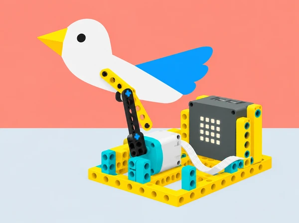

_La silueta de paper és un personatge escènic; el hub i el motor visibles són components del set SPIKE Prime._

## 🌱 Situació i intenció

La biblioteca escolar prepara una mostra de relats breus del territori. Els equips creen una titella mecànica inspirada en l’Albufera: pot ser un animal real representat a partir d’una font pública, un paisatge personificat o una criatura inventada que es declara com a ficció. La Generalitat presenta l’Albufera com un parc natural amb llacuna, marjal, devesa i costa; aquestes formes ofereixen idees de color, ritme i moviment sense haver de copiar una espècie concreta. Si un grup n’usa el nom, contrasta’l amb recursos del [Parc Natural de l’Albufera](https://parquesnaturales.gva.es/va/web/pn-l-albufera) i anota la font.

La titella pot moure un bec o una ala, girar, inclinar-se o aparéixer darrere d’una pantalla de paper. El hub i el motor SPIKE Prime fan el moviment; la figura és de cartó lleuger. El repte connecta disseny, literatura, arts escèniques i enginyeria, i deixa oberta la forma de contar: narració oral, subtítols, seqüència d’imatges o so opcional.

## 🎯 Objectius i criteris

- Descompondre un personatge en silueta, articulació, moviment i seqüència narrativa.

- Construir una manovella o biela que transforme el gir del motor en un moviment recognoscible.

- Relacionar el punt d’unió i la longitud del braç amb l’amplitud i la trajectòria de la titella.

- Programar pausa, repetició finita i comportaments diferents amb els botons disponibles.

- Provar una escena amb una altra parella, revisar el codi o mecanisme i documentar una millora.

- Representar fauna amb respecte i distingir una dada documentada d’un element narratiu inventat.

Criteris de disseny: el moviment es pot descriure amb un verb; l’estructura aguanta la figura sense carregar el motor; la seqüència té inici i final recognoscibles; el públic disposa d’una via visual per seguir el relat; i el prototip pot aturar-se abans de tocar-se o ajustar-se.

## 📅 Seqüència didàctica · 5 sessions de 50 minuts

### **Sessió 1 · Del lloc a un personatge.**

#### Fase 1 · Activem i prediem

Consulteu un mapa o pàgines divulgatives del Parc Natural de l’Albufera. Trieu una idea visual —aigua, canyís, dunes, barca o silueta animal— i prepareu una targeta de font: què hem vist, què sabem per la font i què inventarem per al relat. Si representeu una espècie, no li atribuïu comportaments biològics sense font; també podeu crear una criatura fictícia i declarar-ho.

#### Fase 2 · Explorem i construïm

Dibuixeu tres poses i assigneu un verb a cadascuna: alçar, girar, inclinar, avançar o amagar-se. En una tira de paper, marqueu quatre moments del relat i decidiu quin necessita moviment mecànic.

#### Fase 3 · Expliquem i registrem

Feu una animació desconnectada passant les figures per una finestra de paper, sense representar el gest amb el cos. Anoteu l’ordre de les vinyetes i el verb associat a cada pose.

#### Fase 4 · Apliquem i millorem

Reviseu les poses si el moviment triat no es distingeix del personatge quiet. Separeu trets consultats a la font dels elements inventats.

#### Fase 5 · Comprovem i reflexionem

Expliqueu quin moment necessita moviment i què aporta a la història. **Evidència:** targeta de font/ficció, esbossos i guió de quatre moments.

### **Sessió 2 · Del motor a la titella.**

#### Fase 1 · Activem i prediem

Trieu un format: titella de vareta amb moviment directe, silueta darrere d’una pantalla o titella de fils amb un moviment senzill i fils curts subjectes. Dibuixeu l’eix de rotació i prediu el recorregut de la figura.

#### Fase 2 · Explorem i construïm

Construïu primer el suport i el punt de gir amb cartó lleuger. En SPIKE Prime, fixeu un motor i una manovella o biela que faça avançar i retrocedir la vareta. El moviment es pot resoldre també amb una vareta unida al braç motor.

#### Fase 3 · Expliquem i registrem

Proveu dues longituds de braç o dos punts d’unió amb una mateixa figura. Mesureu l’arc aproximat en una graella i anoteu si la titella gira massa, es queda curta o colpeja l’escenari.

#### Fase 4 · Apliquem i millorem

Reduïu la massa de la figura abans d’augmentar la potència. Ajusteu el punt d’unió o el braç i torneu a provar. Comproveu que l’estructura aguanta sense carregar el motor.

#### Fase 5 · Comprovem i reflexionem

Compareu predicció i moviment observat i expliqueu com la manovella transforma el gir en trajectòria. **Evidència:** esquema mecànic, predicció i comparació de dues configuracions.

### **Sessió 3 · Escrivim i provem la partitura de codi.**

#### Fase 1 · Activem i prediem

Abans de programar, redacteu una seqüència amb inici, pausa i retorn: per exemple, «posició de repòs; alçar una vegada; esperar; tornar a repòs». Predigueu on estarà la titella al final.

#### Fase 2 · Explorem i construïm

En blocs, programeu una repetició finita per al gest que es repeteix. Si el grup ja treballa amb Python, useu un `for` amb nombre limitat de repeticions per a la partitura principal. Estudieu `while` només amb condició de parada explícita i una acció curta; mai amb motor atrapat en un bucle sense eixida.

#### Fase 3 · Expliquem i registrem

Executeu a baixa velocitat i marqueu si cada pas coincideix amb la targeta del relat. Registreu pseudocodi, programa o blocs i tres observacions.

#### Fase 4 · Apliquem i millorem

Canvieu una variable per intent —rotacions, duració o pausa— i compareu la previsibilitat. Verifiqueu l’app local abans d’usar Python, ja que la sintaxi del brief depén de SPIKE Legacy.

#### Fase 5 · Comprovem i reflexionem

Expliqueu quin valor ha donat més control al moviment i si la seqüència té inici i final recognoscibles. **Evidència:** pseudocodi, programa o blocs i tres observacions comparables.

### **Sessió 4 · Botons, so i lectura del públic.**

#### Fase 1 · Activem i prediem

Si l’app local ho permet, assigneu comportaments diferents als botons A i B del hub, com una pose d’atenció i un moviment d’ala. Predigueu què passarà en cada cas; els botons creen variants, no una puntuació o resposta correcta.

#### Fase 2 · Explorem i construïm

Prepareu un guió de mostra i proveu si la figura es pot llegir des de dos llocs marcats de l’aula. Podeu sincronitzar un so curt amb el moviment si l’app i el dispositiu ho permeten; també és vàlid fer el so en directe o usar una targeta visual. El so no és necessari per entendre l’escena.

#### Fase 3 · Expliquem i registrem

Una altra parella veu l’assaig sense rebre el títol i tria quin verb descriu millor el gest. Recolliu una pregunta concreta de millora i anoteu si el públic ha pogut seguir l’escena per via visual.

#### Fase 4 · Apliquem i millorem

Reviseu una pose, el control d’un botó o la sincronització a partir del retorn. Manteniu una alternativa visual per a qui no use so.

#### Fase 5 · Comprovem i reflexionem

Comproveu si el moviment es llig des dels dos punts de l’aula. **Evidència:** mapa de botons, prova de sincronització o alternativa, retorn i nota de revisió.

### **Sessió 5 · Reescrivim i presentem.**

#### Fase 1 · Activem i prediem

Trieu una millora —modificar el mecanisme, canviar el ritme, afegir una pausa, reduir la figura o aclarir una targeta— i prediu què canviarà en la lectura de l’escena.

#### Fase 2 · Explorem i construïm

Apliqueu la millora i repetiu l’escena. Prepareu una presentació de dos minuts amb el personatge, la font local si escau, explicació del moviment, codi o esquema i un límit del prototip.

#### Fase 3 · Expliquem i registrem

Organitzeu una mostra en estacions. La persona que presenta pot parlar, mostrar subtítols o col·locar targetes; una altra pot operar el botó si qui narra no vol tocar l’equip.

#### Fase 4 · Apliquem i millorem

Useu el retorn per aclarir una part de la narració o del mecanisme. Registreu una dada de la font que hàgeu contrastat i una prova que encara falta.

#### Fase 5 · Comprovem i reflexionem

Compareu la primera escena amb la revisada i completeu: «una decisió artística que afecta el mecanisme», «una dada contrastada» i «una prova pendent». **Evidència:** escena revisada, cartel·la i reflexió.

## 🧰 Materials i preparació

Set SPIKE Prime 45678, hub, un motor, bigues i connectors; cartó o cartolina, varetes lleugeres de paper, fils curts si s’opta per una titella de fils, pantalla de paper, cinta, retoladors, targetes de guió i regle. Altaveu o so programat és opcional. No cal expansió; el moviment es pot resoldre amb un motor i el hub.

Carregueu hubs, reviseu la construcció i comproveu quins botons i ordres de so estan disponibles en l’app local. Retalleu figures menudes i lleugeres perquè no sobrecarreguen la transmissió. Prepareu una còpia impresa d’una font del Parc Natural per als equips sense internet i una plantilla de quatre vinyetes. Roteu els rols d’autoria, construcció, programació, operació, narració i documentació.

## 🧪 Evidències i avaluació

Carpeta de procés: targeta de font o ficció, guió gràfic, esquema mecànic, hipòtesi de moviment, pseudocodi/programa, registre de proves, retorn d’audiència i revisió final. Observeu si l’alumnat:

- distingeix una dada consultada d’una invenció narrativa;

- explica com la manovella o biela transforma el gir en trajectòria;

- usa pauses, repeticions limitades i controls per a donar intenció al moviment;

- prova l’escena des de perspectives diferents i ajusta una decisió a partir del feedback;

- comunica el relat amb més d’un canal i descriu una limitació del prototip.

Autoavaluació: «el moviment es llig com a… perquè…», «la longitud/punt d’unió que he triat és…» i «per a entendre el meu relat també puc…». El feedback entre equips concreta una fortalesa visual i una pregunta, no una valoració de l’espècie o de la interpretació personal.

## ♿ Participació i seguretat

Permeteu narrar, subtitular, dissenyar, programar, operar o observar; cap rol exigeix actuar davant del públic. Proporcioneu guió en text i pictogrames, contrast de siluetes i alternativa sense so. Els fils han de ser curts i no envoltar mans o coll; pareu el motor abans de desfer nusos o ajustar l’eix. Manteniu el mecanisme sobre una base ferma, a baixa velocitat, i allunyeu dits de les parts articulades.

La titella no és un model científic de locomoció animal, i el robot no imita una espècie. Si un personatge es basa en fauna local, la fitxa diferencia trets consultats i elements inventats; l’activitat no requereix observar o molestar animals al seu hàbitat.

## 🔗 Brief oficial adaptat

Aquesta situació adapta el repte [SPIKE Activity Brief: Puppet Show](https://assets.education.lego.com/v3/assets/blt293eea581807678a/bltec6e8b8eef367bb0/6324c3f02343d638c6940874/LE_14x8.5_LessonMat_Puppet_Show_WB_Mech2_NoCrops.pdf?locale=en-us) i el seu [exemple de codi Python per a la titella de vareta](https://assets.education.lego.com/v3/assets/blt293eea581807678a/blt0065e3f0ed027e5a/5f880121b8b59a77a945d126/le_activitybrief_puppet_show_python.pdf?locale=en-us). Conserva la creació de personatges i el disseny obert, les idees de titella de fils, ombres i vareta, la pregunta biològica de com es mouen diferents criatures, la transformació del gir en moviment lineal, la prova/millora, música, botons per a moviments alternatius, so simultani i bucles `for`/`while`. La narració de l’Albufera, les targetes, les proves, la rúbrica i la il·lustració són pròpies. El codi Python del fabricant requereix SPIKE Legacy; s’ofereix una seqüència de blocs equivalent.
