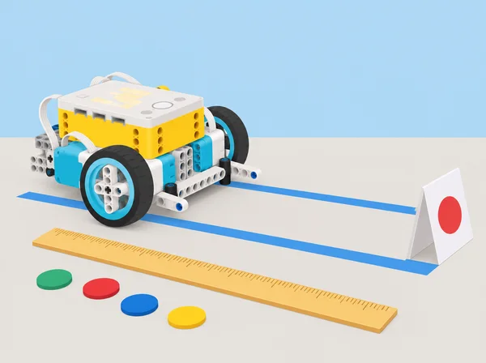
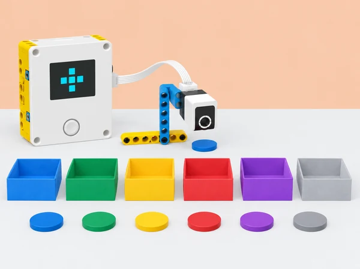
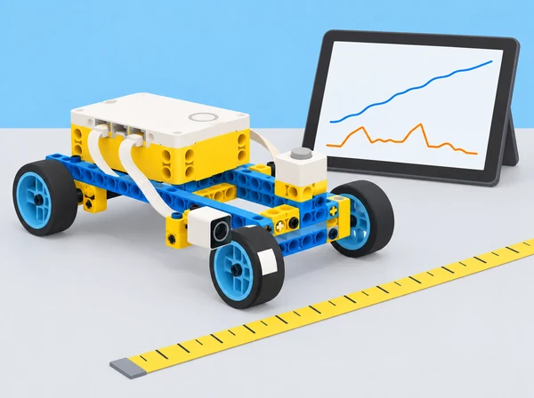
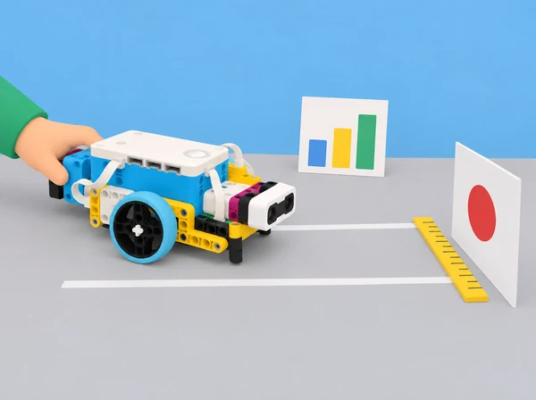
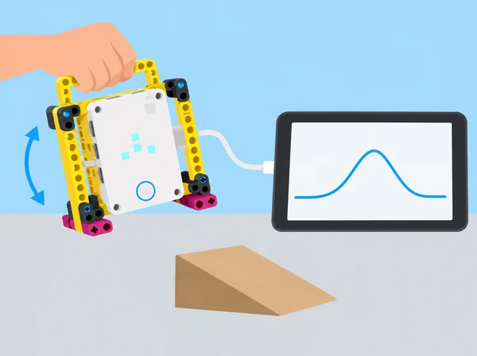

_Una mesura només és útil si sabem què representa, com s’ha obtingut i quina incertesa té._

## 🌱 Repte i intenció

La biblioteca prepara un plànol de rutes per a una jornada escolar simulada. Els equips han de representar moviments en una quadrícula, llegir dades d’orientació del hub, programar variables que compten destinacions i comparar la distància prevista amb la recorreguda per una base SPIKE Prime. Al final, cada equip recomana una ruta dins d’un pressupost fictici de temps i materials i explica quines dades justifiquen la decisió. La seqüència adapta les sis lliçons de la unitat *Variables* de *Foundations of Physical Computing*. Les pràctiques de “vol” de la font es converteixen en models a mà i trajectòries de taula: SPIKE Prime no és un dron i la seua orientació no mesura la posició d’un vehicle en l’espai.

## 🧭 Idees clau

- **Yaw:** gir al voltant de l’eix vertical; **pitch** i **roll:** inclinacions en dos eixos diferents. Useu els termes com a convenció per descriure orientació.

- **Variable:** nom associat a un valor que el programa pot llegir i actualitzar, com ara `paquets_blaus` o `distancia_cm`.

- **Mesura:** la predicció calculada amb la circumferència de la roda no és idèntica al recorregut real, que depén de la superfície, el lliscament, l’alineació i la bateria.

- **Decisió:** una recomanació ha d’indicar criteris, costos simulats i límits de les dades.

## 📅 Seqüència didàctica · sis lliçons

### **Lliçó 1 · Orientar-se sense volar (60–90 min).**

Obriu amb dues preguntes: com sabem si un moviment és precís i què pot revelar-ne un gràfic? Cada alumne anota una hipòtesi. En dos minuts, construïu amb un màxim de deu peces un model menut amb davant, darrere, dalt i baix; useu-lo per representar una inclinació de nas (pitch), una inclinació lateral (roll), un gir sobre l’eix vertical (yaw) i dues combinacions. Després munteu un marc propi amb nansa que subjecte el hub sense tapar la matriu de llum i marqueu-ne el davant. Connecteu-lo per USB o Bluetooth, obriu el gràfic de línia de l’app SPIKE i configureu el flux de dades d’orientació. Amb el hub en posició inicial estable i la matriu orientada cap a l’alumnat, programeu una prova de deu segons que represente un recorregut recte amb un obstacle baix de cartó: eleveu i abaixeu el davant una sola vegada mentre avanceu suaument, com si el sobrevolàreu. Compareu la predicció dibuixada amb la corba de pitch i assenyaleu-ne el pic; repetiu el moviment a una velocitat diferent i observeu com canvia la forma del traç. L’alumnat que necessite una entrada més simple pot fer la mateixa prova subjectant directament el hub, sense construir el marc; manteniu el programa ajustat a la posició del model. El gràfic registra orientació, no altura ni posició real. No llanceu, sacsegeu ni deixeu caure el hub.

### **Lliçó 2 · Llegir una ruta a partir de dades (60–90 min).**

Prepareu sobre una taula dos carrils paral·lels d’anada i tornada, d’uns dos metres de llarg, amb obstacles baixos de cartó i una zona lliure als costats. Abans de moure el model, dibuixeu la ruta i prediu on caldrà fer pitch per passar per damunt d’un obstacle i yaw per girar al carril de tornada; recordeu que el hub és un simulador manual i que el seu angle no és la posició del model. Ajusteu el programa del gràfic perquè registre yaw al llarg del temps, manteniu la mateixa posició inicial i feu una passada contínua, lenta i segura; marqueu en el registre els moments de gir i relacioneu-los amb els canvis de la corba. Després afegiu pitch o roll al gràfic per a una segona prova i compareu com es combinen els moviments. Com a repte de programació, definiu una condició calibrada que mostre un senyal quan yaw o pitch supera un llindar acordat; proveu una vegada per sota, una en el llindar i una per damunt per revisar la frontera. Intercanvieu gràfics amb una altra parella perquè reproduïsca el patró de moviments i expliqueu on el traç és ambigu. Com a extensió matemàtica, trieu un tram quasi recte del gràfic, estimeu-ne el pendent amb dos punts (canvi d’angle/temps) i compareu-lo amb una segona prova; no extrapoleu el pendent a tot el recorregut. Un gràfic d’orientació pot suggerir un gir o una inclinació, però per si sol no revela la ubicació exacta, l’altura ni l’obstacle; indiqueu quina dada addicional faria falta.

### **Lliçó 3 · Comptar destinacions amb variables (90 min).**

Presenteu cinc safates de devolució fictícies, cadascuna identificada amb color i símbol, i una sisena safata de revisió. En una primera ronda sense codi, cada equip rep deu targetes de préstec simulades, escriu pseudocodi que les classifica i anota quantes n’arriben a cada destinació; compareu com canvia el resultat quan es modifica l’ordre. Després creeu variables de nom clar —`comptador_blau`, `comptador_verd`, `comptador_groc`, `comptador_roig`, `comptador_lila` i `revisio_manual`— i establiu-les totes a zero a l’inici del programa. Amb el sensor de color, llegiu les targetes d’una en una; repetiu deu lectures, sumeu una unitat al comptador adequat i envieu qualsevol color no previst a revisió manual. Abans de provar, feu una execució de taula amb la mateixa seqüència per a poder comparar els valors finals. Afegiu comentaris, compareu si el codi ha comptat cada lectura una sola vegada i depureu una errada introduïda expressament (per exemple, oblidar reiniciar una variable). Com a extensió, convertiu la ronda en un joc fictici d’organització del bibliobús: la variable `punts` comença a zero, una categoria suma un punt, una altra en suma dos i una etiqueta de retorn incorrecte en resta un; l’equip ha d’explicar els valors assignats i validar el marcador amb una seqüència coneguda. Useu els comptadors de l’app per veure els valors i el so del hub com a confirmació opcional; no feu servir dades de préstecs reals ni noms d’alumnes.

_Cada lectura actualitza un comptador amb nom; el color imprevist s’envia a revisió manual._

### **Lliçó 4 · Distància, velocitat i representació gràfica (90 min).**

Comenceu amb dues rodes unides per un eix: feu-les rodar amb una empenta suau i estimeu el recorregut sense regle, per exemple amb rajoles o passos; després comproveu la idea amb una cinta mètrica. Munta cada equip un xicotet carretó propi amb rodes lliures, una fitxa blanca i negra en una roda, el sensor de color orientat al marcador i el sensor de força accessible a la part superior. Mesureu la circumferència de la roda real almenys tres vegades i calculeu-ne la mitjana. Connecteu el hub a l’app SPIKE, activeu les variables i el gràfic; el programa espera el toc al sensor de força, registra el temps i el sensor de color compta els cicles del marcador mentre el vehicle avança. En una zona de taula delimitada i buida, premeu el sensor, deixeu anar el carretó amb una empenta controlada i pareu el registre quan s’haja aturat. Llegiu la corba de distància i els canvis de color: mesureu el temps entre dos passos consecutius pel mateix marcador i estimeu la velocitat en cm/s. Comproveu el càlcul de l’app amb `distància = circumferència × voltes` i `velocitat = distància / temps`; indiqueu les unitats, compareu el temps de la primera volta amb els següents i expliqueu per què els canvis de color se separen quan el carretó va perdent velocitat. Repetiu tres intents, canvieu una sola condició cada vegada (empenta suau/mitjana/forta o diàmetre de roda) i compareu distància i velocitat amb gràfic o taula. Amb una massa mesurada o proporcionada pel docent en quilograms i la velocitat inicial estimada convertida a m/s, calculeu l’energia cinètica inicial aproximada, `Ec = ½ × massa × velocitat²`; és un resultat del model matemàtic, no una lectura del sensor ni l’energia que el sensor haja mesurat. Anoteu com el temps, la superfície i la interpretació de la velocitat poden explicar les diferències entre equips.

_El carretó es desplaça amb una empenta manual; els sensors registren les voltes i el temps per a estimar distància i velocitat._

### **Lliçó 5 · Joc de distància: encertar i justificar (90 min).**

Recupereu el carretó instrumentat de la lliçó anterior i delimiteu un carril llarg, recte i d’accés controlat, amb una línia de llançament i una diana a 2 m. Cada parella fa dues o tres proves d’escalfament per observar com una empenta, el pes afegit o la superfície canvien el recorregut. Abans de competir, creeu i inicialitzeu les variables `massa_kg`, `velocitat_cm_s`, `velocitat_m_s`, `energia_J`, `error_cm` i `error_acumulat_cm`. Després de cada empenta, llegiu la velocitat del registre de voltes, convertiu-la dividint per 100, actualitzeu la massa real del carretó si afegiu o retireu peces SPIKE pesades i calculeu `energia_J = 0.5 × massa_kg × velocitat_m_s²`. La persona que empeny fa tres intents per diana; mesureu sempre des de la part davantera del carretó fins al centre del blanc, anoteu l’error absolut en centímetres i acumuleu-lo. Després d’acabar els tres intents, moveu la diana a 3 m i repetiu, i feu una tercera ronda a 4 m només si el carril escolar és prou llarg i segur. La parella alterna qui empeny i cadascú rep el mateix nombre d’intents. Entre dianes, cada participant pot revisar les dades i triar una estratègia: mantindre la massa i ajustar la intensitat de l’empenta, o canviar el pes mesurat mantenint l’empenta tan constant com siga possible; no canvieu les dues variables alhora si voleu atribuir-ne l’efecte. Guanya qui acumula menys error absolut, no qui fa un únic llançament llunyà. Compareu si l’energia cinètica estimada ajuda a interpretar la distància i expliqueu per què superfície, fregament i diferències d’empenta impedeixen tractar-la com una predicció exacta.

_En cada ronda es mesura la distància al centre de la diana i se suma l’error dels tres intents._

### **Lliçó 6 · Qui planifica els recursos? Finances i gestió empresarial (90 min).**

Connecteu la ruta de la biblioteca amb dues vies professionals: finances i gestió/administració d’empreses. Primer, cadascú completa una targeta privada amb dos interessos personals, una habilitat que ha practicat en la unitat i una pregunta sobre feines futures; compartir-la és voluntari. En equips de quatre, feu una pluja d’idees de quatre ocupacions per via i classifiqueu-les en una matriu comuna: tasques, habilitats, entorn de treball, formació o qualificacions i relació amb altres ocupacions. Cada equip investiga almenys dues ocupacions de cada via en fonts seleccionades pel docent (per exemple, l’[Observatori de les Ocupacions del SEPE](https://www.sepe.es/HomeSepe/es/que-es-observatorio.html), centres formatius o webs institucionals); anota la data de consulta, una tasca concreta, dues habilitats, una via d’accés i, si hi ha dades comparables, una tendència laboral sense convertir una previsió en certesa. Després, useu les dades de la maqueta —distància, temps, intents i girs— i un full de costos ficticis igual per a tothom per a calcular dues opcions de lliurament. Separeu en la taula les mesures reals de maqueta dels preus i supòsits inventats, mostreu una suma verificable i justifiqueu quina opció recomanaríeu a la biblioteca. Amb peces del set SPIKE, construïu una representació física d’una de les dues vies (per exemple, flux de pressupost, planificació d’operacions o comprovació de comptes); no cal fer un robot nou. Prepareu una explicació d’un minut que relacione cada part del model amb una tasca, una habilitat i una ocupació investigada. Després de les presentacions, compareu les dues vies: quines habilitats comparteixen, en què es diferencien i com col·laboren? Tanqueu amb una autoavaluació individual: quina tasca m’ha interessat, quina evidència de la unitat puc aportar i què voldria investigar després. Recolliu la targeta individual sense exposar interessos personals.

_El traç registra el canvi d’orientació mentre es mou el hub; no representa l’altura ni la posició del model._

## 🧰 Materials i preparació

Un set SPIKE Prime 45678 i dispositiu amb l’app SPIKE per equip; hub carregat, peces per a un marc amb nansa i per a un carretó lleuger de rodes lliures, obstacles baixos de cartó, sensor de color, sensor de força, fitxa blanca i negra per a una roda, taula amb espai lliure, targetes de colors, cinta mètrica i fulls per a prediccions i gràfics. Per al joc, reserveu un corredor o espai interior de 4 m, marqueu un únic carril d’anada i diana de paper a 2, 3 i 4 m; no useu passadissos compartits ni feu llançaments amb persones dins del recorregut. Connecteu el hub per USB o Bluetooth i comproveu abans de la sessió que l’app mostra el gràfic, les variables i les lectures emprades. Prepareu el programa, un exemple de corba i una alternativa amb dades simulades si no hi ha connexió; disposeu d’una balança escolar o d’una massa mesurada pel docent.

## 🧪 Evidències i avaluació

Recolliu el vocabulari anotat de yaw/pitch/roll, l’esbós dels dos carrils, les corbes reals de pitch i yaw amb el moviment que les genera, la comparació entre dues velocitats, pseudocodi, programa comentat i els tres casos de prova del llindar. Per a les variables, guardeu el pseudocodi de recompte, la taula de les deu lectures, els valors finals, la prova amb etiqueta desconeguda, el joc de puntuació i la depuració de la variable no reiniciada. Per a distància/velocitat, conserveu les mesures de circumferència, gràfics de distància i sensor de color, temps entre voltes i velocitat en cm/s. Del mini-repte, guardeu la massa mesurada, la conversió a m/s, els valors d’energia en joules, les tres mesures d’error per diana a 2/3/4 m, l’error acumulat i l’estratègia revisada entre rondes. Per a la lliçó professional, avalueu la matriu comparativa de les dues vies, la qualitat/data de les fonts, el pressupost amb supòsits separats, el model físic i el pitch d’un minut; useu criteris comuns de precisió, relació tasca-habilitat-ocupació i ús explícit d’evidències. Valoreu si l’alumnat correlaciona moviment físic i corba, explica què representa cada eix, inicialitza i actualitza variables, controla les condicions, usa unitats coherents, verifica el càlcul i limita la conclusió a les dades observades. Autoavaluació individual sobre interpretació de gràfics, variables, decisions amb dades, gestió del temps/materials, col·laboració i interessos propis; la reflexió personal es conserva privada. La parella revisora prova de reproduir el patró de l’altra, destaca un encert i proposa una millora concreta; qui ha creat el gràfic pot respondre si la prova confirma la interpretació.

## ♿ Inclusió, privacitat i seguretat

Oferiu rols rotatius de muntatge, registre, programació, càlcul i comunicació; accepteu gràfics tàctils o esquemàtics i instruccions escrites en lloc de conducció manual. La classificació usa només dades fictícies. No es registren trajectes, noms ni préstecs reals de l’alumnat. Els models es mouen sobre taula amb espai lliure, velocitat baixa i peces menudes recollides; el hub s’atura abans de connectar o modificar mecanismes. Les conclusions econòmiques són una simulació escolar, no una estimació de cost d’un servei públic.

## 🔗 Referent oficial i adaptació

Adapta les sis lliçons de la unitat 6 *Variables* de LEGO Education [*Foundations of Physical Computing*](https://assets.education.lego.com/v3/assets/blt293eea581807678a/blt1b4345f429fde833/64d3828c455bf62b71f9b840/Foundation_of_Physical_Computing_Course_SPIKE_3_2022.pdf?locale=en-gb): *Drone Pitch and Roll*, *Drone Movements*, *Variables*, *Graphing, Speed, and Distance*, *Mini-Challenge: Distance Game* i *Connecting to Careers: Finance and Business Management*. La primera i la segona lliçó ara mantenen el model amb nansa, el flux de dades real de pitch/roll/yaw, la lectura de corbes, la prova a velocitats diferents, la recreació d’un gràfic i el pas a obstacles i recorregut de retorn; el vol és una simulació manual sobre taula, no un dron real. La quarta recupera la maqueta de rodes lliures, inici amb el sensor de força, recompte de voltes amb sensor de color, gràfics de distància/temps, velocitat en cm/s i estimació de l’energia cinètica amb massa i velocitat en unitats coherents. La cinquena ja fa servir aquests resultats: programa variables de massa, velocitat i energia, afegeix pes mesurat al carretó i compara tres intents per diana a 2/3/4 m amb error acumulat i estratègia basada en dades. La resta conserva la progressió de variables per al recompte i la connexió professional. El flux de gràfics de moviment pren com a referent funcional la lliçó pública [Stretch with Data](https://education.lego.com/en-us/lessons/prime-training-trackers/stretch-with-data/); els procediments, exemples, context i il·lustració són propis.
