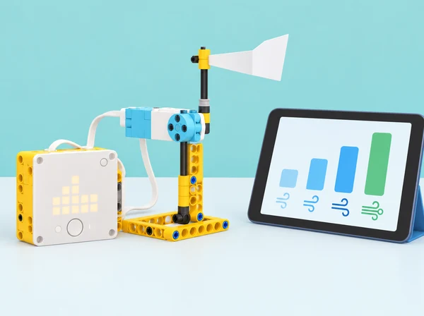
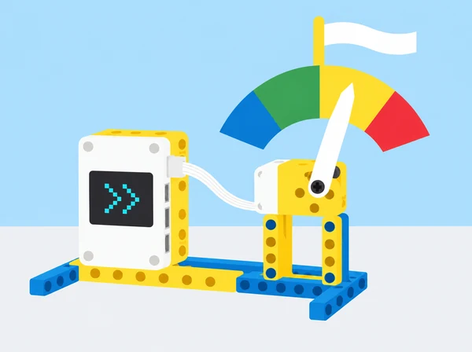

_La maqueta mostra dades consultades al núvol; no mesura el vent que fa al pati._

## 🌬️ Repte i intenció

**Situació:** Transformem una previsió meteorològica en una representació que es puga llegir i comparar. En equips, construïm un indicador accionat per motor, calibrem l’escala i programem condicions per classificar quatre intervals inspirats en l’escala Beaufort.

> **Pregunta guia:** Com podem convertir una dada de velocitat del vent en una representació calibrada, comparable i comprensible?

> **Límit del model:** La maqueta representa dades d’una previsió per a una ubicació i una hora. No mesura el vent del pati ni és un dispositiu d’avís o seguretat.

## 🎯 Aprenentatges i vocabulari

- Interpretar una dada quantitativa de velocitat del vent i identificar-ne la font i les unitats.
- Construir i calibrar un indicador amb intervals que es puguen distingir i provar.
- Afegir una segona condició o direcció i comprovar com canvia la representació.
- Comunicar que el prototip representa dades i no mesura el vent ni substitueix els avisos oficials.

## 📅 Seqüència didàctica · 3 sessions

### **S1 · Construïm i interpretem un indicador (45–60 min).**

#### Fase 1 · Activem i prediem

Parleu de com canvien les activitats quotidianes quan fa vent i de com distingim una brisa d’un vent fort. Presenteu l’escala Beaufort com una classificació de referència, no com una mesura del pati. Cada equip prediu quina posició o categoria mostrarà l’indicador davant d’una velocitat triada.

#### Fase 2 · Explorem i construïm

En parelles, munteu una base estable amb una agulla o placa lleugera i un motor SPIKE. Alineeu el motor perquè l’angle programat corresponga al sentit de la fletxa. Trieu una ciutat pública a l’app, llegiu la velocitat i executeu el programa inicial. Si no hi ha consulta en viu, feu servir una taula de valors datada i identifiqueu-la com una simulació arxivada.

#### Fase 3 · Expliquem i registrem

Descriviu què mostra l’indicador i com es relaciona la dada amb la posició. Registreu ciutat, data, hora, unitat i font; dibuixeu el mecanisme i assenyaleu quina part és entrada de dades, procés i eixida del model.

#### Fase 4 · Apliquem i millorem

Compareu la lectura inicial amb una segona velocitat. Si l’agulla no assenyala la categoria prevista, reviseu l’alineament o el programa i canvieu una sola cosa abans de repetir la prova.

#### Fase 5 · Comprovem i reflexionem

Expliqueu què representa l’agulla i què no permet concloure la maqueta. **Evidència:** dibuix del mecanisme, ciutat, data, hora i unitats consultades, predicció i dues lectures comparades.

### **S2 · Calibrem quatre intervals amb condicions (45–60 min).**

#### Fase 1 · Activem i prediem

Ordeneu targetes de velocitat i associeu cada banda amb el color acordat. Manteniu les unitats visibles: **blau · força 1–3:** 0,5–5,5 m/s; **verd · força 4–6:** 5,5–13,8 m/s; **groc · força 7–9:** 13,8–24,4 m/s; **roig · força 10–12:** 24,4–32,7 m/s. Predigueu com tractareu els valors de frontera i la calma (0 m/s).

_Representació qualitativa dels quatre trams; no és una escala de mesura. Per programar, useu els valors i les unitats._

#### Fase 2 · Explorem i construïm

Com a bastida, podeu començar amb dos intervals; el repte compartit és arribar als quatre i verificar-los.

1. Escriviu una taula de llindars amb unitats coherents i decidiu a quin tram pertany cada valor de frontera.
2. Programeu condicions *si / si no* perquè cada tram active el color o l’angle assignat.
3. Tracteu **0 m/s com a calma**, fora de les quatre bandes codificades.
4. Proveu valors dins de cada tram, valors propers als llindars i un valor superior al rang.
5. Anoteu si cada cas queda classificat com esperàveu i corregiu les condicions quan calga.

#### Fase 3 · Expliquem i registrem

Descriviu com les condicions transformen dades contínues en grups discrets. Deseu la taula, el pseudocodi o l’esquema de condicions i indiqueu què fa cada frontera.

#### Fase 4 · Apliquem i millorem

Proveu valors dins de cada tram, valors just per davall i per damunt dels llindars i un valor superior al rang. Anoteu si cada cas es classifica com esperàveu i corregiu les condicions quan calga; torneu a executar els casos afectats.

#### Fase 5 · Comprovem i reflexionem

Una altra parella revisa si les quatre bandes cobreixen els casos previstos i si la calma i els valors fora de rang tenen una resposta definida. **Evidència:** taula de llindars, pseudocodi, casos de prova i una correcció explicada.

### **S3 · Comparem ubicacions i afegim direcció (45–60 min).**

#### Fase 1 · Activem i prediem

Abans d’executar el programa, compareu dues velocitats en cadascuna de tres ciutats públiques i predigueu quina categoria correspondrà a cada dada. Distingiu aquestes dades de les condicions meteorològiques locals del centre.

#### Fase 2 · Explorem i construïm

Executeu el mateix programa amb almenys dues velocitats diferents en cadascuna de les tres ciutats. Afegiu la direcció del vent amb fletxes a la matriu LED del hub. Si hi ha temps, amplieu l’indicador fins a 180° i mesureu quant tarda l’equip a recalibrar-lo; un segon motor per al dial és opcional. Per a l’ampliació, convertiu les dades a una altra unitat (per exemple, km/h), feu explícit el factor de conversió i comproveu un valor de frontera.

_L’agulla representa la categoria de la previsió seleccionada; la maqueta no capta el vent de l’aula ni del pati._

#### Fase 3 · Expliquem i registrem

Prepareu una taula que compare ubicació, hora, font, velocitat, categoria i direcció. Expliqueu què pot inferir el model a partir d’aquestes dades i què queda fora del seu abast.

#### Fase 4 · Apliquem i millorem

Reviseu una categoria o recalibreu l’indicador si els resultats de dues ubicacions no concorden amb les dades. Si useu un segon motor, proveu el dial de direcció; si no, manteniu la matriu LED com a opció base. Contrasteu l’explicació amb una font divulgativa fiable o una persona experta, si és possible.

#### Fase 5 · Comprovem i reflexionem

Presenteu la comparació citant font, ubicació i hora. Indiqueu que la previsió correspon a un lloc i moment determinats i que la maqueta no mesura el vent de l’aula o del pati ni substitueix avisos oficials. **Evidència:** comparació de tres ubicacions, programa amb velocitat i direcció, registre de calibratge i missatge sobre els límits del model.

## 🧰 Materials i preparació

**Materials:** Prepareu els elements necessaris per al muntatge, la consulta de dades i les proves.

- Hub SPIKE Prime, un motor i peces per a una base estable i un indicador lleuger.
- Ordinador o tauleta amb l’app i els blocs meteorològics al núvol.
- Targetes, paper, regla i plantilla d’angles per a l’ampliació a 180°.
- Taula de valors datada i amb unitats per si no hi ha connexió.
- Un segon motor per al dial de direcció, opcional; la matriu LED ja permet representar-la.

Abans de la sessió, confirmeu l’accés a les dades, la ciutat consultable, la unitat disponible i el funcionament del programa. Prepareu també les targetes de classificació desconnectada.

## 🧪 Evidències i avaluació

Recolliu una carpeta de procés amb:

- Predicció inicial i dibuix del muntatge.
- Registre de dades, ubicació, hora i unitats; incloeu la conversió si és necessària.
- Taula de quatre categories i programa condicional.
- Proves dels llindars, casos de frontera i revisió d’una condició.
- Comparació de tres ciutats i representació de la direcció.

**Criteris d’èxit:** l’alumnat calibra l’indicador per a la unitat emprada, justifica els límits, classifica els casos de prova i revisa el programa a partir dels resultats. En l’ampliació, combina velocitat i direcció en el programa. El retorn entre parelles assenyala una prova que falta.

**Autoavaluació:**

- **En procés:** represente dues velocitats en tres ubicacions.
- **Assolit:** classifique les quatre bandes en tres ubicacions i comprove els llindars.
- **Ampliació:** afegisc la direcció; si dispose d’un segon motor, la mostre amb un dial i el recalibre fins a 180°.

## ♿ Participació i límits

- Mostreu cada categoria amb color **i** amb una paraula, símbol, explicació oral o targeta tàctil; no depengueu només del color.
- Consulteu ciutats públiques i no introduïu ubicacions personals.
- Expliqueu que la previsió correspon a una ubicació i una hora, i no descriu necessàriament el pati.
- Davant d’una situació meteorològica adversa, seguiu els canals oficials i les indicacions del centre.

## 🔗 Lliçó oficial adaptada

La seqüència adapta [Wind Speed](https://education.lego.com/en-us/lessons/prime-life-hacks/wind-speed/), quarta lliçó de [Life Hacks](https://education.lego.com/en-us/lessons/prime-life-hacks/). Conserva el muntatge en parelles i l’alineament del motor, la consulta d’una ciutat, la representació de dades del núvol, les quatre bandes Beaufort amb condicions, la comparació d’ubicacions i l’ampliació a la direcció del vent. També incorpora la classificació desconnectada, proves dels llindars, registre de dades i límits d’ús. La situació, el registre, la programació i les il·lustracions són propis; els materials docents complets remeten a l’app SPIKE.
