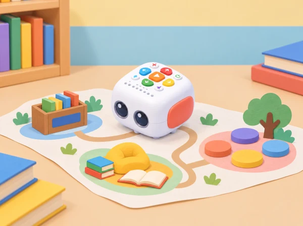

_Tale-Bot segueix una graella pròpia que connecta una prestatgeria, un racó de lectura i un cercle de contes._

## ❓ Repte i intenció

La biblioteca es converteix en un mapa de llocs imaginaris: un racó de contes, una prestatgeria de llibres sense paraules i una plaça on les històries es conten en veu baixa. Els equips creen un personatge i un motiu per al seu viatge, planifiquen una ruta amb Tale-Bot i fan que cada parada aporte una part al relat. La programació és una seqüència d’ordres que podem representar, provar i corregir; la història és una obra pròpia que podem explicar amb paraules, imatges o gestos.

## 🎯 Aprenentatges i vocabulari

orientar-se en una graella, construir una seqüència amb més d’una destinació, anticipar posicions, detectar i corregir una ordre, crear una narració amb inici, canvi i final, escoltar i negociar decisions compartides.

## Abans de començar

Per a equips de tres o quatre, prepareu Tale-Bot carregat i comprovat, una graella gran de paper o tela, targetes de fletxes, tres espais de lectura dibuixats, obstacles opcionals i figures o pictogrames per a personatges. Dissenyeu un mapa original i de poques caselles; no cal reproduir les targetes del fabricant. Deixeu un corredor lliure perquè el robot puga girar i avançar sense caure de la taula.

Comproveu amb antelació com s’introdueixen, s’executen i s’esborren ordres en el model disponible. La proposta pressuposa únicament els botons de programació bàsica de Tale-Bot; si la unitat concreta incorpora àudio o gravació, aquestes funcions són opcionals i no es necessiten per completar-la. No graveu veus infantils ni associeu personatges a infants reals. El docent pot ser escriba de les idees o oferir pictogrames quan la producció oral o escrita no siga accessible.

**Vocabulari:** graella, casella, davant, darrere, gir, ruta, ordre, seqüència, personatge, escena i final. Presenteu-lo mentre es mou una figura de paper pel mapa i convideu l’alumnat a descriure posicions amb paraules, gestos o fletxes.

## 📅 Seqüència didàctica · tres sessions de 40 minuts

### **Creem la biblioteca i els personatges (40 min).**

#### Fase 1 · Activem i prediem

Comenceu amb la pregunta: quin lloc de lectura ens agradaria trobar al barri? Recolliu idees sense valorar-les per realistes o fantàstiques. Predigueu quins espais podrien ajudar a contar un viatge i quina informació ha de descobrir el personatge.

#### Fase 2 · Explorem i construïm

En assemblea, seleccioneu tres espais diferents i representeu-los amb dibuixos o pictogrames: per exemple, una prestatgeria de llibres d’animals, un racó de lectura tranquil i una plaça de narració. Parleu de com es comparteix un espai: deixar passar, cuidar els materials i respectar qui vol escoltar en silenci.

#### Fase 3 · Expliquem i registrem

Cada equip tria un personatge fictici —una llavor que busca un conte, un núvol viatger o una tortuga bibliotecària— i decideix què necessita o vol descobrir. Ordeneu tres targetes: inici, canvi durant el viatge i final o descobriment. Encara no programeu: cada parada ha de tindre una raó dins de la història.

#### Fase 4 · Apliquem i millorem

Comproveu que el personatge té un motiu per visitar cada espai. Si dues parades conten el mateix, canvieu-ne una o reviseu l’ordre. Una altra parella pot llegir les targetes i dir què espera que passe.

#### Fase 5 · Comprovem i reflexionem

**Evidència:** mapa dels tres espais i esquema narratiu amb personatge, motiu i tres moments. «Què vol descobrir? Què pot canviar en cada parada? Quin espai ajuda a explicar aquesta part?»

### **Planifiquem i provem la ruta (40 min).**

#### Fase 1 · Activem i prediem

Col·loqueu la graella al terra o en una taula accessible. Situeu Tale-Bot a l’inici i els tres espais en destinacions separades. Predigueu en quina casella acabarà després de les primeres ordres i marqueu l’orientació inicial.

#### Fase 2 · Explorem i construïm

Afegiu, si cal, un únic obstacle que obligue a triar camí. Cada equip mou primer una fitxa de paper casella a casella i representa les instruccions amb fletxes. Un moviment equival a passar a la casella adjacent; els girs depenen de l’orientació del robot.

#### Fase 3 · Expliquem i registrem

Ordeneu les targetes de fletxes i assenyaleu les tres parades. Anoteu la seqüència i la predicció de casella final. Comproveu el pla amb una altra parella abans de transferir-lo al robot.

#### Fase 4 · Apliquem i millorem

Una persona introdueix la seqüència a Tale-Bot, una altra comprova la posició i una tercera compara el resultat amb el mapa. Feu un trajecte curt fins a la primera destinació i continueu després cap a les altres. Si el robot no arriba on s’esperava, reconstruïu les ordres i canvieu-ne només una cada vegada. Compareu dues rutes: quina és més curta, quina evita l’obstacle i quina és més fàcil de comprovar?

#### Fase 5 · Comprovem i reflexionem

**Evidència:** dues propostes de ruta, seqüència final anotada i registre d’una correcció explicada. «On pensàveu que acabaria? Quina ordre concreta ha canviat el resultat? Com ho podem comprovar?»

### **Narrem les parades i compartim (40 min).**

#### Fase 1 · Activem i prediem

Recupereu l’esquema de la primera sessió i assigneu una part de la història a cada espai. Predigueu què entendrà el públic només observant les parades i les targetes.

#### Fase 2 · Explorem i construïm

Abans de moure el robot, acordeu una frase breu, un gest o una imatge per a cada parada. Prepareu una targeta d’escena que indique què hi descobreix el personatge. Manteniu la història fictícia; ningú no ha de relatar experiències personals ni actuar en públic si no vol.

#### Fase 3 · Expliquem i registrem

Reviseu l’ordre de les escenes amb el mapa i anoteu quina parada correspon a cada moment. Si useu una funció de so del model disponible, demaneu permís i empreu només contingut creat pel grup; també podeu narrar en directe o mostrar pictogrames.

#### Fase 4 · Apliquem i millorem

Feu una passada completa de la ruta mentre una persona narra i una altra verifica les destinacions. Un altre equip reconstrueix l’ordre de les escenes observant les targetes. Si algun moment no s’entén, canvieu una targeta, una frase o l’ordre d’una parada i repetiu la comprovació.

#### Fase 5 · Comprovem i reflexionem

**Evidència:** demostració de ruta, seqüència narrativa visual i una millora proposada a partir de la prova. «Què sabria el públic de la història només mirant les parades? El recorregut ha ajudat a entendre-la?»

## 📋 Avaluació i evidències

Observeu el raonament i la col·laboració durant les proves. Registreu si l’equip:

- situa inici i destinacions en la graella i descriu una posició relativa;

- representa una ruta amb ordres en l’ordre d’execució i prediu almenys una arribada;

- compara el trajecte real amb el previst i localitza una ordre que cal revisar;

- connecta les parades amb moments diferents d’un relat comprensible;

- escolta una proposta del grup i explica una decisió compartida.

Guardeu el mapa inicial, la ruta corregida i les targetes de les tres escenes. Una seqüència dictada, assenyalada o construïda amb fletxes demostra el mateix aprenentatge que una explicació oral completa. No puntueu la velocitat ni la longitud del relat.

## ♿ Més d’una manera de participar

Augmenteu la mida de les caselles i el contrast, simplifiqueu el mapa a una destinació cada vegada o afegiu relleu tàctil. Repartiu rols rotatius —narrador/a, planificador/a, programador/a i verificador/a—, amb dret a observar o canviar de rol. Oferiu pictogrames, frases iniciadores («El personatge arriba perquè…»), narració compartida i temps d’espera. El robot pot ser conduït per una persona seguint les indicacions de qui planifica; cap infant necessita parlar, llegir, escriure o manipular el dispositiu per participar en el repte.

## 🔗 Referent oficial i adaptació

La idea de donar un motiu narratiu a cada destinació s’inspira en l’activitat oficial [Deliver Animals](https://matatalab.com/en/node/86) i en el marc de [les Activity Cards de Tale-Bot](https://matatalab.com/en/lesson4.4). Ací canviem el context, els personatges, el mapa i el guió.
