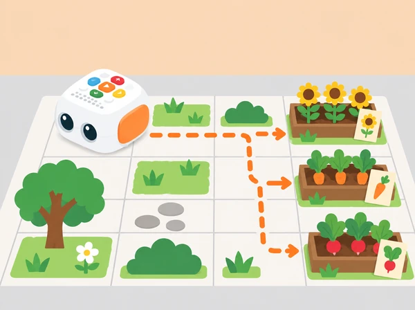

_Les llavors i els cultius del mapa són símbols de paper; la ruta ajuda a parlar de cura i creixement._

## 🌱 Repte, context i aprenentatges

El grup prepara un hort escolar imaginari amb bancals de flors, hortalisses i plantes aromàtiques pròpies del context local. Tale-Bot transporta una fitxa de llavor —no una llavor real— des del viver dibuixat fins al bancal triat. A cada parada, l’equip conta què podria passar a continuació i quines condicions ajudaran una planta a créixer: llum, aigua, aire i condicions adequades per a l’espècie. Les necessitats concretes varien entre plantes; no totes es planten o es reguen de la mateixa manera.

## 🎯 Aprenentatges i vocabulari

seqüenciar ordres, orientar-se en una graella, anticipar el destí, revisar una instrucció, observar plantes de manera respectuosa i ordenar una explicació temporal: llavor, germinació, creixement i cura. El robot segueix les ordres introduïdes; no sap què necessita la llavor ni pot comprovar si una planta està sana.

## 🧰 Materials i preparació

Prepareu un Tale-Bot Pro carregat, una quadrícula gran amb un punt de partida i tres bancals, targetes pròpies de plantes i fitxes planes de llavor, pictogrames de llum/aigua/aire/cura, fletxes grans i un full d’observació amb espai per dibuixar. Abans de la classe, comproveu que les caselles coincidisquen aproximadament amb un moviment del robot. En el sistema de targetes oficial, les ordres bàsiques inclouen avançar o retrocedir aproximadament 10 cm i girar 90°; verifiqueu el comportament del model del centre sobre la superfície que fareu servir.

Trieu fotos pròpies o autoritzades de plantes de l’hort o l’entorn. No colliu plantes ni demaneu tocar terra, fertilitzants o eines. No feu servir llavors reals si hi ha risc d’ingestió, al·lèrgia o confusió amb aliments; aquesta SDA funciona completament amb targetes. Els bancals es dibuixen amb espai suficient perquè el robot gire i perquè les fitxes no bloquegen els botons ni les rodes.

**Vocabulari:** llavor, bancal, hort, germinar, créixer, llum, aigua, aire, davant, darrere, gir, ordre i ruta. Acompanyeu les paraules amb gestos i pictogrames i diferencieu «ho hem observat» de «pensem que passarà».

## 📅 Seqüència didàctica · quatre sessions de 40 minuts

### **Observem i fem preguntes sobre les plantes (40 min).**

#### Fase 1 · Activem i prediem

Observeu una planta del pati des d’un espai permés o mireu fotografies de l’hort escolar i de conreus de l’entorn valencià. Predigueu què podríeu observar abans d’apropar-vos-hi.

#### Fase 2 · Explorem i construïm

Descriviu el que veieu directament: fulles, tija, flor, ombra, terra o recipient. No arrenqueu fulles ni toqueu plantes desconegudes. En assemblea, trieu tres bancals ficticis i associeu-los a imatges, com flor, carlota i rave.

#### Fase 3 · Expliquem i registrem

Separeu observacions de prediccions: «veig una fulla nova» és diferent de «potser necessita més llum». Cada equip crea una fitxa de llavor de paper i redacta una pregunta de cura que puga investigar després amb una persona adulta.

#### Fase 4 · Apliquem i millorem

Reviseu la pregunta perquè es puga investigar sense danyar la planta ni assumir-ne les necessitats. Si no hi ha una planta accessible, baseu l’observació en fotografies o fonts del centre.

#### Fase 5 · Comprovem i reflexionem

**Evidència:** dibuix d’una planta, observació directa o documentada i pregunta de cura. «Què podem veure sense tocar? Què ens agradaria investigar abans de decidir com cuidar-la?»

### **Dissenyem el mapa i planifiquem les ordres (40 min).**

#### Fase 1 · Activem i prediem

Col·loqueu el viver a la casella inicial i els tres bancals en destinacions diferents. Trieu un bancal i assenyaleu l’orientació inicial del robot; predigueu la casella final.

#### Fase 2 · Explorem i construïm

Abans d’usar Tale-Bot, feu avançar una fitxa de paper sobre la graella. Compteu cada moviment com una casella adjacent i marqueu els girs amb fitxes.

#### Fase 3 · Expliquem i registrem

Ordeneu fletxes o targetes d’instrucció per arribar al bancal. Anoteu dues rutes alternatives i la predicció de destinació per a cadascuna.

#### Fase 4 · Apliquem i millorem

Compareu quina ruta evita l’obstacle, usa menys instruccions i és més fàcil de llegir per una altra parella. La ruta més curta no sempre és la millor si confon la seqüència. Reviseu les instruccions abans d’executar-les.

#### Fase 5 · Comprovem i reflexionem

**Evidència:** mapa amb inici/destinació, dues seqüències i predicció de casella final. «Cap a on mira Tale-Bot al començament? Què hem de fer abans de dir-li que gire?»

### **Programem el lliurament i depurem la ruta (40 min).**

#### Fase 1 · Activem i prediem

Recupereu la seqüència triada i predigueu quina ordre pot ser més difícil d’executar o comprovar.

#### Fase 2 · Explorem i construïm

Introduïu les instruccions amb els botons de Tale-Bot. Una persona dicta o assenyala la seqüència, una altra la comprova amb les targetes i una tercera observa la ruta.

#### Fase 3 · Expliquem i registrem

Feu un trajecte curt fins al primer bancal. Registreu posició inicial, orientació, nombre de moviments i girs, casella final prevista i casella observada.

#### Fase 4 · Apliquem i millorem

Si el robot no acaba on s’esperava, torneu a situar-lo a l’inici, localitzeu l’última casella correcta i corregiu només les ordres necessàries. Quan funcione, repetiu el procés per a un altre bancal.

#### Fase 5 · Comprovem i reflexionem

**Evidència:** seqüència revisada i explicació del pas corregit. En arribar, col·loqueu la fitxa de llavor i trieu pictogrames de condicions que podrien ajudar la planta; no programeu diagnòstic ni reg automàtic. «Quina és l’última casella correcta? Quin canvi provaràs ara?»

### **Contem el cicle de creixement (40 min).**

#### Fase 1 · Activem i prediem

Recupereu la ruta i predigueu quins quatre moments ajudaran a explicar el creixement sense convertir-los en una regla universal per a totes les plantes.

#### Fase 2 · Explorem i construïm

Creeu una història oral, gràfica o dictada amb quatre moments: llavor al viver, arribada al bancal, germinació i planta en creixement.

#### Fase 3 · Expliquem i registrem

A cada parada, afegiu una imatge o pictograma de llum, aigua, aire o cura. Expliqueu que són idees generals i que les necessitats reals depenen de la planta i de l’observació concreta. Una altra parella reconstrueix l’ordre del relat amb el mapa.

#### Fase 4 · Apliquem i millorem

Proposeu una cura per a l’hort del centre que puga comprovar una persona responsable: observar abans de regar, respectar la zona de pas o preguntar quina planta s’hi cultiva. Si no hi ha hort, formuleu-la com a pregunta o disseny, no com una instrucció per plantar sense permís.

#### Fase 5 · Comprovem i reflexionem

**Evidència:** ruta final, història de quatre moments i pregunta o proposta de cura validable. «Què sabem d’aquesta planta? Què hauríem de preguntar o observar abans d’actuar?»

## 📋 Avaluació i evidències

Guardeu el mapa, les targetes d’ordres, la seqüència corregida i el relat en quatre moments. Observeu si l’alumnat:

- identifica l’orientació inicial i tria una destinació de la graella;

- ordena instruccions i anticipa una casella d’arribada;

- compara el moviment real amb el previst i prova una correcció;

- diferencia una observació d’una predicció sobre el creixement;

- proposa una cura respectuosa que es pot consultar amb una persona adulta.

No s’avalua memoritzar una llista universal de cures ni encertar totes les rutes al primer intent. Es valora explicar què s’ha provat i com s’ha revisat amb el mapa.

## ♿ Participació i cura

Oferiu caselles grans i contrastades, un mapa tàctil amb vores suaus i pictogrames per a les ordres. Es pot participar dibuixant, triant destinació, dictant la seqüència, comprovant una predicció o observant la prova; no cal manipular el robot per demostrar aprenentatge. Roteu els rols sense pressa i doneu temps d’espera. Tota l’activitat es pot fer en aula amb fotografies i targetes. No es manipulen plantes, llavors ni eines si el centre no ho ha autoritzat.

## 🔗 Referent i autoria de l’adaptació

La proposta s’inspira en l’ús de mapes, blocs tangibles de moviment, destinacions i narració que apareix en les [targetes oficials d’activitat de Tale-Bot Pro](https://matatalab.com/en/lesson4.4) i en l’activitat de Coding Set [Delivery Animals](https://matatalab.com/en/node/86). El viver, l’hort, les preguntes de cura i els materials gràfics són propis. Les ordres es comproven amb el model físic i la fitxa evita atribuir coneixements botànics al robot.
