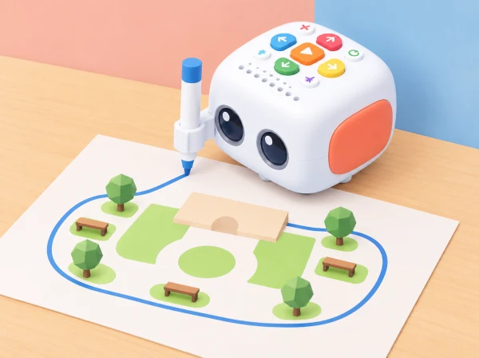

_Un esbós amb zones i recorreguts, dibuixat amb Tale-Bot i el suport per a retolador del kit. El mapa és una proposta, no un plànol arquitectònic._

## Repte i intenció

Com podem explicar un pati a algú que no el coneix i imaginar-hi activitats diferents? L'alumnat observa les zones, crea un plànol simbòlic i programa Tale-Bot perquè trace formes que representen espais possibles: un lloc tranquil, una zona de moviment o un espai per construir. El dibuix del robot fa visible com una seqüència de moviments es transforma en una línia; les peces i pictogrames completen el significat del mapa.

La situació parteix de la possibilitat de dibuix de Tale-Bot Pro amb el suport i els retoladors compatibles descrits pel fabricant. Abans d'impartir-la, comproveu que el model del centre disposa dels accessoris corresponents i proveu la fixació, el paper i una ruta curta. Si no hi ha accessori o la superfície no és adequada, feu el mateix repte amb una fitxa que recorre el traç i després dibuixeu-lo a mà.

## Aprenentatges i criteris d'èxit

- Reconéixer formes i recorreguts del pati i representar-los amb símbols i una llegenda senzilla.

- Compondre una seqüència de moviments per crear una forma i anticipar-ne el resultat.

- Comparar el traç amb l'esbós, descriure una diferència i modificar una instrucció.

- Proposar una distribució que admeta activitats variades, pauses i circulació clara.

- Cooperar en el disseny sense assumir que totes les persones volen jugar de la mateixa manera.

## Materials i preparació

Prepareu Tale-Bot, el suport de retolador i retoladors rentables compatibles si el kit del centre els inclou, paper gran fixat a una superfície plana, formes de cartolina, pictogrames de zones i una tira visual amb les instruccions. Comproveu que el paper no es mogui i que les unions del suport no impedisquen avançar. Deixeu espai al voltant per observar sense acostar les mans a les rodes mentre el robot està en moviment.

Per a l'observació, useu una visita al pati en un moment tranquil o un plànol buit preparat pel docent. No fotografieu infants ni feu una classificació de qui utilitza cada zona. Recolliu característiques de l'espai —ombra, banc, zona oberta, recorregut— i pregunteu quines activitats podria permetre cadascuna.

## Seqüència didàctica

### Sessió 1 — Mirem l'espai amb ulls de disseny (20–25 min)

#### Fase 1 · Activem i prediem

Abans d’observar, penseu quines zones i recorreguts fan que un pati siga comprensible i convide a jugar de maneres diferents.

#### Fase 2 · Explorem i construïm

Feu una volta curta i localitzeu dues o tres zones sense fotografiar persones. Si no podeu eixir al pati, useu un plànol buit preparat per la docent.

#### Fase 3 · Expliquem i registrem

Descriviu què permet cada lloc i quines condicions hi observeu: ombra, soroll, espai per moure’s o lloc per seure. Registreu característiques de l’espai, no qui l’utilitza.

#### Fase 4 · Apliquem i millorem

Trieu formes i pictogrames per al mapa. Reviseu la pregunta de disseny: «tenim un lloc tranquil i un recorregut que no travesse el joc?» Afegiu un element si falta una opció de descans o circulació.

#### Fase 5 · Comprovem i reflexionem

**Evidència:** esbós inicial amb zones i preguntes sobre les activitats possibles. Què hem observat i què continua sent una idea per comprovar?

### Sessió 2 — De la forma a les instruccions (20–25 min)

#### Fase 1 · Activem i prediem

Sobre paper, creeu un plànol simbòlic amb tres zones. Trieu una forma gran —quadrat, rectangle o camí en L— i predigueu on començarà i acabarà Tale-Bot.

#### Fase 2 · Explorem i construïm

Amb cordill o peces, representeu la forma i seguiu-la amb el dit. Assenyaleu l’orientació inicial i on caldrà girar.

#### Fase 3 · Expliquem i registrem

Ordeneu les instruccions de Tale-Bot amb les targetes del kit. Anoteu quantes vegades repetireu el moviment i la casella final prevista.

#### Fase 4 · Apliquem i millorem

Feu una passada simulada amb una fitxa de paper. Si el recorregut no concorda amb la forma, reviseu una ordre abans d’executar el robot.

#### Fase 5 · Comprovem i reflexionem

**Evidència:** plànol, forma representada i seqüència d’ordres anotada. «On comença? Quantes vegades repetirem el moviment? On hauria d’acabar?»

### Sessió 3 — Dibuixem, observem i revisem (20–25 min)

#### Fase 1 · Activem i prediem

Recupereu la seqüència i prediu la forma que dibuixarà el robot abans de col·locar el retolador.

#### Fase 2 · Explorem i construïm

Col·loqueu el retolador segons les instruccions del fabricant, poseu Tale-Bot al punt d’inici i executeu una seqüència curta.

#### Fase 3 · Expliquem i registrem

Observeu el traç i compareu-lo amb el model de cordill. Marqueu inici i final; descriviu qualsevol diferència, com un costat massa llarg o un gir en una altra direcció.

#### Fase 4 · Apliquem i millorem

Canvieu una sola instrucció i torneu a provar en un espai net del paper. També podeu assolir l’objectiu descrivint l’ordre o assenyalant quin canvi caldria fer, sense manipular el robot.

#### Fase 5 · Comprovem i reflexionem

**Evidència:** esbós, traç observat i una ordre revisada. Quina diferència heu trobat entre el traç i la predicció? La precisió del dibuix no és l’únic objectiu.

### Sessió 4 — Presentem un pati amb opcions (20–25 min)

#### Fase 1 · Activem i prediem

Mireu les formes dibuixades i predigueu què podrà entendre un altre grup sense que li ho expliqueu.

#### Fase 2 · Explorem i construïm

Afegiu pictogrames a les formes i decidiu què representa cadascuna: un lloc tranquil, una zona de moviment o un espai per construir.

#### Fase 3 · Expliquem i registrem

Un altre equip rep el plànol sense explicació i intenta trobar-hi les zones. Anoteu què interpreta i quins símbols resulten ambigus.

#### Fase 4 · Apliquem i millorem

Afegiu una llegenda si cal i reviseu la proposta: hi ha una opció de descans, un espai ampli i un recorregut comprensible? No cal representar totes les activitats.

#### Fase 5 · Comprovem i reflexionem

**Evidència:** plànol amb pictogrames i llegenda revisada després de la prova. El producte és una maqueta inicial per conversar, no una afirmació que resol les necessitats de totes les persones.

## Organització i rols

Roteu quatre responsabilitats: observador/a de l'espai, dissenyador/a del plànol, planificador/a de la seqüència i narrador/a de la prova. En grups grans, una parella pot seguir el traç amb una fitxa i una altra controlar la tira d'ordres. Accepteu que una persona contribuïsca assenyalant, triant entre dues formes, dictant una idea o observant el resultat sense manipular el robot.

## Documentació i avaluació

- Esbós inicial amb punt d'inici, formes i pictogrames proposats.

- Seqüència d'ordres representada abans de dibuixar i una revisió després de comparar-la amb el traç.

- Llegenda que permet a un altre grup interpretar el plànol.

- Explicació d'una decisió de disseny relacionada amb descans, moviment o circulació.

Observeu si l'alumnat prediu una part del traç, associa l'ordre amb un resultat, revisa una instrucció amb una raó i escolta una interpretació diferent. Useu preguntes concretes: «Quina forma volíem?», «Què ha dibuixat?», «Quina instrucció canviaries?» i «Com ho sabrà una altra classe?». Recolliu notes o dibuixos; no cal enregistrar l'alumnat.

## Inclusió i ampliacions

Useu paper gran amb contrast alt, formes tàctils, fletxes àmplies i una seqüència reduïda. Oferiu alternatives a l'escriptura manual i a la manipulació del robot. Per ampliar, planifiqueu una mateixa forma amb dos ordres diferents, mesureu aproximadament el perímetre amb blocs o creeu una ruta que connecte zones sense travessar la zona tranquil·la. En cada cas, feu explícit que es tracta d'un model simplificat.

## Referent i adaptació

Matatalab descriu per a Tale-Bot Pro les funcions de dibuix, el suport i els retoladors, juntament amb activitats de seqüència i creació ([informació oficial del producte](https://matatalab.com/en/node/774)). Aquesta proposta transforma eixa possibilitat en un repte propi d'observació i representació del pati; el mapa, els pictogrames i els criteris són originals i no reutilitzen materials gràfics oficials.
