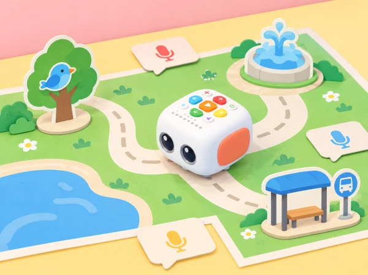

_Mapa de ficció amb tres punts sonors. Els sons es representen amb pictogrames o missatges preparats; no es graven converses del barri._

## Repte i intenció

En aquest barri inventat, una gota d'aigua, un ocell i un autobús són pistes per contar què passa en cada lloc. Els infants dissenyen un mapa senzill, inventen una veu per a cada escena i programen Tale-Bot per visitar-les en ordre. En lloc de demanar una gravació de l'entorn, poden usar instruments, onomatopeies dites en directe, targetes o àudios ficticis enregistrats per l'adult. El repte combina escolta, llenguatge oral, representació simbòlica, orientació i seqüenciació.

La proposta es calibra per a l'edat de 3–5 anys indicada pel fabricant, amb trobades breus i un objectiu principal per sessió. El robot ajuda a fer visible l'ordre de les instruccions: si la ruta no arriba al lloc previst, el grup observa, revisa i torna a provar sense valorar l'error com a fracàs.

## Aprenentatges i criteris d'èxit

- Relacionar un símbol amb un lloc i explicar que la representació no és el lloc real.

- Escoltar, imitar o descriure sons i crear una frase breu que situe qui parla i què ocorre.

- Planificar un trajecte de dues o tres parades i ordenar les instruccions abans de prémer el botó de reproducció.

- Observar el recorregut i localitzar una instrucció que cal afegir, llevar o canviar.

- Respectar el torn de veu i triar lliurement entre parlar, assenyalar, usar un pictograma o no enregistrar.

## Preparació i materials

Prepareu un mapa gran i estable amb caselles prou àmplies per al moviment del Tale-Bot, tres pictogrames (aigua, ocell, transport), fitxes de direcció, targetes de frase i instruments suaus com ara un triangle, una campaneta o un tub de pluja. Afegiu una quarta casella d'inici ben visible. Carregueu i comproveu el robot abans de la sessió, reviseu que el mapa quede pla i assageu una ruta curta per estimar quantes pulsacions calen en el vostre suport.

Si el centre vol provar la funció de gravació de Tale-Bot Pro, feu-ho només amb un missatge inventat i amb el procediment de consentiment i eliminació que use el centre. L'activitat és completa sense enregistrar: l'adult pot llegir el missatge quan el robot arriba a la parada, o el grup pot alçar la targeta corresponent. No graveu veus ambientals ni converses espontànies.

## Seqüència didàctica

### Sessió 1 — Escoltem i imaginem (20–25 min)

#### Fase 1 · Activem i prediem

Mostreu les tres targetes sense anomenar-les. Cada infant prediu quin lloc fictici podria representar.

#### Fase 2 · Explorem i construïm

Feu sonar un instrument o proposeu una onomatopeia. Els infants trien quin lloc podria produir aquell so i poden proposar interpretacions diferents.

#### Fase 3 · Expliquem i registrem

En grup, dibuixeu un símbol per a cada escena i dicteu una frase curta: «A la font, l’aigua fa…».

#### Fase 4 · Apliquem i millorem

Col·loqueu les targetes al mapa i expliqueu què representa cada símbol. Una altra parella intenta interpretar-los abans que els autors els expliquen.

#### Fase 5 · Comprovem i reflexionem

**Evidència:** tres targetes, símbols i frases associades. Quina pista sonora o visual ajudaria a entendre una interpretació diferent?

### Sessió 2 — El mapa té un ordre (20–25 min)

#### Fase 1 · Activem i prediem

Recordeu el punt d’inici i trieu dues parades. Predigueu quina visitarà Tale-Bot primer i quina després.

#### Fase 2 · Explorem i construïm

Col·loqueu una fitxa de direcció per cada moviment necessari. Una persona segueix la ruta amb el dit, una altra mou una fitxa de paper i una tercera comprova si el robot cabria per aquell camí.

#### Fase 3 · Expliquem i registrem

Descriviu l’ordre amb frases com «primer anirà a…, després…». Registreu les targetes i la ruta prevista.

#### Fase 4 · Apliquem i millorem

Si dues targetes poden significar el mateix so, afegiu una pista visual o una frase que ajude una altra classe a distingir-les.

#### Fase 5 · Comprovem i reflexionem

**Evidència:** mapa amb punt d’inici, dues parades i targetes ordenades. La ruta és clara per a qui no l’ha dissenyada?

### Sessió 3 — Programem i depurem (20–25 min)

#### Fase 1 · Activem i prediem

Recupereu la ruta i feu una predicció de la casella final abans de programar-la.

#### Fase 2 · Explorem i construïm

Introduïu les instruccions a Tale-Bot amb una tira visual d’ordres. El docent acompanya la planificació i cedeix els controls en torns curts.

#### Fase 3 · Expliquem i registrem

Observeu el robot i marqueu la casella on ha arribat. Compareu-la amb la prevista i localitzeu l’últim moviment que coincidia.

#### Fase 4 · Apliquem i millorem

Si la ruta no coincideix, reviseu la tira: falta un moviment, n’hi ha un de més o la direcció és incorrecta? Canvieu una instrucció cada vegada i repetiu. En arribar a una parada, representeu el so en directe o mostreu-ne la targeta i la frase.

#### Fase 5 · Comprovem i reflexionem

**Evidència:** seqüència inicial i corregida amb una diferència explicada. Quina ordre ha canviat el resultat?

### Sessió 4 — Contem el barri a una altra classe (20–25 min)

#### Fase 1 · Activem i prediem

Prepareu una passejada de tres parades i prediu quines instruccions i símbols necessitarà un altre grup.

#### Fase 2 · Explorem i construïm

Cada equip presenta el mapa a un altre grup. Aquest intenta seguir la ruta i interpretar els símbols sense explicacions addicionals.

#### Fase 3 · Expliquem i registrem

Anoteu quines parades ha trobat el grup visitant i què ha entés de cada símbol o so.

#### Fase 4 · Apliquem i millorem

Després del primer intent, afegiu una pista visual o canvieu l’ordre de les parades. Repetiu el recorregut per comprovar si el missatge s’entén millor.

#### Fase 5 · Comprovem i reflexionem

**Evidència:** mapa final, interpretació del grup visitant i canvi aplicat. Quin so heu inventat, quin símbol l’acompanya i què heu canviat perquè el missatge s’entenguera millor?

## Rols i organització

Feu equips xicotets amb rols rotatius: qui tria la targeta, qui ordena les instruccions, qui observa el trajecte i qui presenta el missatge. Els rols no exigeixen parlar: la persona portaveu pot assenyalar pictogrames o usar una frase model. Amb un sol robot, tot el grup pot planificar en paral·lel amb una fitxa de paper mentre un equip executa.

## Observació i evidències

- Mapa amb inici, llocs i pictogrames que el grup pot explicar.

- Seqüència d'ordres representada abans de la prova i corregida si cal.

- Relació oral, gestual o visual entre lloc, símbol i missatge.

- Una observació de depuració: què esperàvem, què ha fet el robot i quina instrucció hem revisat.

Useu una graella breu per anotar si cada infant participa en una elecció, anticipa una part de la ruta, interpreta almenys un símbol i comunica una idea per algun canal. L'evidència pot ser una fotografia del mapa buit, una anotació docent o una frase dictada; no cal enregistrar les veus per avaluar el procés.

## Inclusió i variacions

Comenceu amb dues parades, reduïu les distàncies i useu fletxes grans amb forma i color. Oferiu símbols tàctils i temps d'espera per respondre. L'alumnat pot crear un so amb un objecte, imitar-lo, seleccionar una targeta o deixar que una parella el represente. Per ampliar, afegiu una ruta alternativa i compareu quina instrucció permet arribar al mateix lloc; també es pot repetir un motiu sonor com a patró rítmic.

## Privacitat

El barri i els seus habitants són imaginaris; les targetes no inclouen adreces, noms ni informació d'infants reals. L'enregistrament és opcional, mai necessari per completar la situació, i s'ha de gestionar segons les normes del centre.

## 🔗 Referents i adaptació

La funció de gravar històries i les targetes de micròfon formen part de les possibilitats descrites per [Matatalab per a Tale-Bot Pro](https://matatalab.com/en/node/774). Aquesta versió crea un mapa sonor original a partir d'eixes possibilitats; no reutilitza mapes ni imatges del fabricant.
