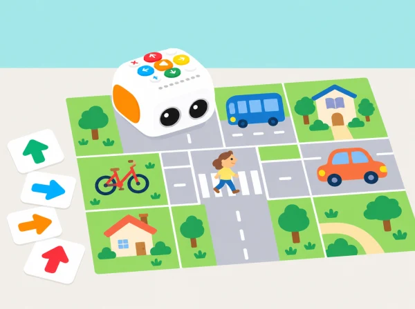

_El barri representat és una maqueta de paper: el robot segueix una ruta i no controla cap vehicle real._

## ❓ Repte i intenció

Partim de la temàtica de cotxes de les etiquetes interactives de l’Activity Box per imaginar carrers compartits. Tale-Bot es mou per un mapa pla de l’aula; l’equip decideix com connectar habitatges, biblioteca, plaça i transport públic, i com representar un pas de vianants accessible. Els cotxes apareixen com a dibuixos i no hi ha cap moviment de vehicles reals.

## 🎯 Aprenentatges i vocabulari

- Llegir un mapa de maqueta i descriure itineraris amb orientació, parades i cruïlles.
- Comparar recorreguts amb criteris acordats de llegibilitat i accessibilitat, sense simular experiències personals.
- Programar i depurar una ruta amb Tale-Bot i proposar una millora de disseny de la cruïlla.
- Explicar que el mapa és una representació escolar i no una avaluació de seguretat del carrer real.

## Abans de començar

Prepareu una graella amb interseccions amples, targetes pròpies de llocs del municipi i peces planes que representen bancs, arbres o obres. Incloeu opcions de transport diverses. No poseu obstacles al pas del robot ni feu l’activitat en una via pública. L’ús de l’adhesiu temàtic de cotxes és opcional i depén de la disponibilitat del centre.

## 📅 Seqüència didàctica

## 📋 Avaluació i evidències

Valoreu que l’alumnat puga ordenar ordres, anticipar el resultat, rectificar un error i comparar dues rutes amb criteris explícits. Guardeu el plànol, els programes i una breu explicació de la decisió. No es pressuposa que la maqueta prove l’accessibilitat o la seguretat d’un carrer real.

## 📅 Seqüència d’aprenentatge · quatre sessions

### Sessió 1 — Què fa fàcil seguir una ruta? (25–30 min)

#### Fase 1 · Activem i prediem

Mostreu un mapa fictici amb biblioteca, plaça, parada i punt d’inici. Cada equip tria una destinació i predigueu com la trobaria algú que no coneix el barri.

#### Fase 2 · Explorem i construïm

Creeu perfils ficticis —una persona que camina, algú que empeny un cotxet o viatja en cadira de rodes, una criatura acompanyada— com a perspectives de disseny, sense assignar necessitats a l’alumnat ni demanar experiències personals.

#### Fase 3 · Expliquem i registrem

Parleu de quina informació del mapa ajudaria cada viatge. Trieu dos criteris observables, com nombre de girs i presència d’una zona de pas lliure, i deixeu-los visibles.

#### Fase 4 · Apliquem i millorem

Reviseu la llegenda del mapa perquè una persona que no coneix el barri puga trobar la destinació. Afegiu un símbol si falta informació per orientar-se.

#### Fase 5 · Comprovem i reflexionem

**Evidència:** criteris triats pel grup i llegenda inicial. Expliqueu què fa còmoda o fàcil de seguir una ruta dins de la maqueta.

### Sessió 2 — Construïm la maqueta i les alternatives (25–30 min)

#### Fase 1 · Activem i prediem

Trieu biblioteca, plaça, parada i punt d’inici, i prediu per on passaria una ruta directa. Acordeu quina incidència fictícia farà necessari pensar en una alternativa.

#### Fase 2 · Explorem i construïm

En una graella plana, col·loqueu tres llocs i una intersecció. Afegiu una incidència simulada amb una targeta que es puga llevar; no poseu barreres davant de les rodes.

#### Fase 3 · Expliquem i registrem

Dibuixeu una ruta directa i una altra que evite la incidència. Seguiu-les amb una fitxa, marqueu els girs i comproveu que la casella d’arribada està definida.

#### Fase 4 · Apliquem i millorem

Si les cruïlles són difícils d’interpretar, feu més ampla la graella o canvieu el símbol. Comproveu que les peces no bloquegen físicament Tale-Bot.

#### Fase 5 · Comprovem i reflexionem

**Evidència:** mapa amb dues opcions de recorregut i llegenda clara. Indiqueu quina modificació ha fet que el mapa siga més fàcil de llegir.

### Sessió 3 — Programem, provem i depurem (25–30 min)

#### Fase 1 · Activem i prediem

En parelles, codifiqueu una ruta directa i una ruta alternativa amb les tecles de moviment. Abans d’iniciar-les, una persona prediu la casella final i l’altra assenyala els girs.

#### Fase 2 · Explorem i construïm

Introduïu la seqüència al Tale-Bot i demaneu a una altra parella que llija la ruta del mapa. Comproveu l’orientació inicial i el punt de partida.

#### Fase 3 · Expliquem i registrem

Compareu on acaba el robot amb la predicció. Anoteu l’ordre dels girs, el nombre de passos i el resultat observat.

#### Fase 4 · Apliquem i millorem

Si no arriba, reviseu l’ordre de cada gir, el nombre de passos o l’orientació. Canvieu una instrucció per prova i registreu quin ajust resol el desajust.

#### Fase 5 · Comprovem i reflexionem

**Evidència:** dos programes, prediccions i registre d’una depuració. El temps que tarda el robot no s’utilitza per comparar equips.

### Sessió 4 — Explica la proposta i els seus límits (25–30 min)

#### Fase 1 · Activem i prediem

Intercanvieu mapes entre equips i demaneu a qui els rep que trobe la biblioteca utilitzant només la llegenda. Predigueu quins símbols poden resultar confusos.

#### Fase 2 · Explorem i construïm

Recolliu les preguntes de l’altre equip i afegiu una millora al mapa o al pas accessible. Compareu les opcions segons distància en caselles, nombre de girs i pas lliure.

#### Fase 3 · Expliquem i registrem

Cada equip presenta la ruta triada i el criteri que ha prioritzat. Anoteu una cosa que la maqueta pot representar i una que no pot comprovar.

#### Fase 4 · Apliquem i millorem

Si la classe vol continuar, consulteu amb la docent un mapa públic del municipi i compareu-ne les representacions. No feu una observació de carrer sense planificació i supervisió del centre.

#### Fase 5 · Comprovem i reflexionem

**Evidència:** ruta justificada i una pregunta per investigar. El plànol de paper no certifica la seguretat ni l’accessibilitat d’un carrer real.

## Opció amb els mapes interactius de l’Activity Box

Aquest itinerari propi funciona amb mapa de paper. Si el centre disposa de l’Activity Box compatible, podeu substituir-lo o ampliar-lo amb un mapa interactiu, sense canviar l’objectiu d’accessibilitat:

1. Poseu Tale-Bot a l’entrada principal de la cantonada superior esquerra i escolteu la consigna completa.
2. Quan la veu indique una entrada secundària, traslladeu el robot a eixe punt. Abans de programar, localitzeu en el mapa el destí, les cruïlles i una ruta possible.
3. Programeu i executeu la seqüència. Si el robot arriba a un lloc equivocat, useu l’avís del mapa com una dada per a revisar la ruta, no com una valoració de l’equip.
4. En una entrada o punt d’inici, una nova consigna pot substituir l’anterior en moure-hi el robot. Si el robot ja es desplaça i cal interrompre la veu, useu *Play*; la resta de botons no la cancel·len.
5. Useu els mapes interactius i els adhesius interactius per separat. Si canvieu d’un mapa a un tema d’adhesius, reinicieu el robot abans de començar el nou tema. Si la caixa o el mapa de la dotació no coincidix amb aquestes funcions, torneu a la graella pròpia i no pressuposeu la resposta sonora.

**Evidència:** seqüència de targetes, consigna escoltada o llegida, error detectat i una modificació provada. Sense Activity Box, feu servir la mateixa evidència amb un mapa propi i una targeta de destí.

## Materials, representació i evidències

Feu una graella de caselles grans sobre paper reutilitzable, símbols impresos en alt contrast, un full de llegenda, targetes de gir i una fitxa alternativa per assajar sense robot. Una còpia en relleu o línies amb cordill pot facilitar l'exploració tàctil. Les evidències mínimes són el mapa inicial, les dues rutes, una tira d'ordres amb predicció, el registre d'una depuració i una justificació oral, escrita o pictogràfica de la decisió final.

L’Activity Box és opcional. En la versió descrita per Matatalab inclou cinc mapes interactius de doble cara, un mapa en blanc de doble cara, 32 targetes de comandament i adhesius; comproveu la caixa concreta abans de preparar la sessió, perquè altres paquets del fabricant tenen inventaris diferents.

Useu una escala formativa: encara necessita suport / ho resol amb una pista / ho explica de manera autònoma. Observeu si l'equip manté l'ordre de les instruccions, localitza l'error amb una prova i usa els criteris acordats per comparar opcions. No avalueu suposades necessitats d'accessibilitat de companys ni demaneu a ningú que simule una discapacitat.

## Seguretat, participació i transferència

El mapa s'utilitza només en un espai interior pla i sense circulació de persones; la maqueta no representa controls viaris reals. Les observacions en carrer, si es fan, requereixen planificació i supervisió del centre i no formen part d'aquesta activitat. Roteu els rols de cartògraf/a, planificador/a, programador/a i observador/a. Oferiu ruta de taula, pictogrames, lectura oral o participació com a observador. L'adhesiu oficial de cotxes és opcional: la situació funciona amb un plànol en blanc i símbols creats per l'alumnat.

## ♿ Més d’una manera de participar

Oferiu un mapa amb relleu, poques interseccions i símbols d’alt contrast; permeteu respostes amb gestos, pictogrames o explicació oral. Els rols de planificació, programació, registre i presentació roten, i qualsevol equip pot proposar una ruta alternativa sense competir en temps.

## 🔗 Material oficial reinterpretat

La temàtica parteix dels adhesius de cotxes de l’[Activity Box oficial de Tale-Bot Pro](https://matatalab.com/en/lesson4.3). La guia oficial descriu cinc mapes interactius de doble cara, un mapa en blanc, 32 targetes de comandament, adhesius i les regles de les consignes de veu; l’opció anterior les adapta a una missió pròpia. Aquesta és una ampliació didàctica, no una activitat numerada de les 42 Activity Cards ni una reproducció dels mapes o materials gràfics originals. Les activitats amb mapa propi continuen disponibles si la caixa no és a la dotació.
