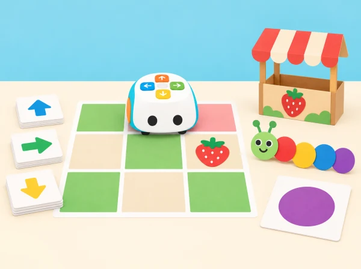
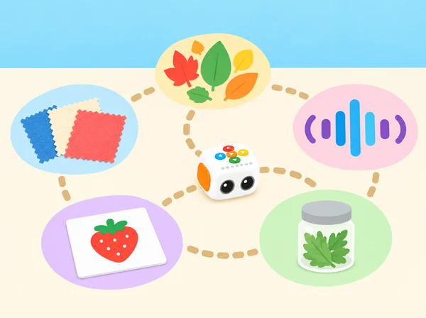

_Els set estands de la fira es construeixen amb targetes i materials senzills de l'aula._

## 🌱 Punt de partida

La classe organitza una fira de descobertes per a una altra aula. Tale-Bot visita estands de l'escola, una parada de fruita, un espai de formes i una taula d'art. En cada sessió, l'alumnat formula una pregunta, representa les ordres amb targetes, prediu el trajecte i prova el programa. El mapa, els materials, els personatges i les consignes són originals i s'adapten als llocs propers al centre.

Aquesta seqüència pren com a referència els títols públicament visibles de les lliçons 3–9 del currículum Tale-Bot Pro de nivell 1. Els plans complets d'aquestes lliçons no s'han pogut consultar; per tant, les sessions adapten el tema i la progressió pública, sense atribuir al fabricant objectius o passos que no es poden verificar.

## 🗺 Set estands, set reptes

### **Sessió 1 · L'escola de Tale-Bot — «Matatalab School».**

#### Fase 1 · Activem i prediem

Llegiu el repte de la sessió i acordeu què espereu que passe. Anoteu una predicció abans de començar.

#### Fase 2 · Explorem i construïm

Dibuixem una planta senzilla de l'aula amb tres llocs d'interés (biblioteca, hort o pati). Per parelles, triem un destí, escrivim una seqüència d'ordres i expliquem com l'hem calculada. Una persona fa de robot en la graella de paper i després comparem la representació amb el recorregut del Tale-Bot real. Tanquem amb una instrucció per a les visites de la fira.

#### Fase 3 · Expliquem i registrem

Feu explícit el procediment: registreu la seqüència, les decisions i el resultat perquè una altra parella puga entendre què heu provat.

#### Fase 4 · Apliquem i millorem

Trieu una sola decisió o instrucció per revisar, repetiu la prova en condicions comparables i anoteu què ha canviat.

#### Fase 5 · Comprovem i reflexionem

Compareu el resultat amb la predicció i expliqueu què heu aprés, quina evidència ho sosté i quin límit conserva la conclusió.

### **Sessió 2 · Un robot, moltes respostes — «Versatile Matatalab Robot».**

#### Fase 1 · Activem i prediem

Llegiu el repte de la sessió i acordeu què espereu que passe. Anoteu una predicció abans de començar.

#### Fase 2 · Explorem i construïm

Preparem tres microreptes en un mateix mapa: arribar a una casella, fer una pausa i continuar cap a una altra destinació. Amb el Tale-Bot Pro i els seus accessoris propis, provem moviments, una dansa i un dibuix curt amb retolador rentable; anotem què fa el robot en cada seqüència i com es pot esborrar el programa per tornar a començar. Separem les funcions integrades dels accessoris de muntatge i no atribuïm al robot cap sensor que no tinga.

#### Fase 3 · Expliquem i registrem

Feu explícit el procediment: registreu la seqüència, les decisions i el resultat perquè una altra parella puga entendre què heu provat.

#### Fase 4 · Apliquem i millorem

Trieu una sola decisió o instrucció per revisar, repetiu la prova en condicions comparables i anoteu què ha canviat.

#### Fase 5 · Comprovem i reflexionem

Compareu el resultat amb la predicció i expliqueu què heu aprés, quina evidència ho sosté i quin límit conserva la conclusió.

### **Sessió 3 · El recorregut dels cinc sentits — «My Five Senses».**

#### Fase 1 · Activem i prediem

Llegiu el repte de la sessió i acordeu què espereu que passe. Anoteu una predicció abans de començar.

#### Fase 2 · Explorem i construïm

Preparem cinc estacions de taula amb pictogrames: una composició de colors per a la vista, un enregistrament ambiental triat pel docent per a l’oïda, retalls nets de tela per al tacte, una targeta de fruita per al gust i un pot tancat amb una herba culinària coneguda per a l’olfacte. No s’hi tasten aliments ni s’acosten recipients al nas; cada infant pot triar una estació alternativa de mirar o assenyalar. Abans de moure el robot, distingim què pot fer Tale-Bot —seguir ordres i marcar una parada— i què fan les persones —observar i descriure—. En equips, ordenem tres estacions, representem el recorregut amb targetes de moviment i comprovem la ruta sobre el mapa. A cada parada, l’observador tria un pictograma o una paraula per registrar una característica de l’objecte o del so, sense anotar gustos ni experiències personals. Després, canviem l’ordre de dues parades i comparem si la seqüència de moviments també canvia. Tanquem explicant quina instrucció ha indicat cada lloc i quina observació s’hi ha fet; la ruta del robot no és una mesura sensorial.

_Les imatges indiquen llocs d'observació, no instruccions perquè el robot perceba sabors, olors, sons o textures._

**Conducció de la parada (30 min):** reserveu 5 minuts per anticipar el recorregut i recordar les opcions de participació; 7 per seleccionar tres estacions i construir la seqüència amb targetes; 10 per provar la ruta i completar observacions breus per torns; 5 per intercanviar l’ordre de dues parades i depurar una instrucció; i 3 per compartir què ha indicat el robot i què han observat les persones. Amb un únic robot, la resta d’equips anticipen el programa en una graella de paper mentre esperen.

**Evidència:** mapa amb inici orientat, seqüència de targetes abans i després de la prova, i tres registres pictogràfics o orals de característiques observades. Es pot demostrar l’aprenentatge assenyalant, dictant o movent peces; no cal tocar, olorar ni parlar davant del grup.

#### Fase 3 · Expliquem i registrem

Feu explícit el procediment: registreu la seqüència, les decisions i el resultat perquè una altra parella puga entendre què heu provat.

#### Fase 4 · Apliquem i millorem

Trieu una sola decisió o instrucció per revisar, repetiu la prova en condicions comparables i anoteu què ha canviat.

#### Fase 5 · Comprovem i reflexionem

Compareu el resultat amb la predicció i expliqueu què heu aprés, quina evidència ho sosté i quin límit conserva la conclusió.

### **Sessió 4 · La botiga de temporada — «Matata Grocery Store».**

#### Fase 1 · Activem i prediem

Llegiu el repte de la sessió i acordeu què espereu que passe. Anoteu una predicció abans de començar.

#### Fase 2 · Explorem i construïm

Dissenyem una parada amb imatges de productes de mercat local i fitxes de preus senzills. Una targeta de comanda demana visitar dos productes; l'equip calcula la ruta i, si és adequat al nivell, suma dos preus. El robot lliura una fitxa de paper i una persona comprova que la comanda coincideix. Els aliments són dibuixats o de joguina: no es manipula ni es reparteix menjar real.

#### Fase 3 · Expliquem i registrem

Feu explícit el procediment: registreu la seqüència, les decisions i el resultat perquè una altra parella puga entendre què heu provat.

#### Fase 4 · Apliquem i millorem

Trieu una sola decisió o instrucció per revisar, repetiu la prova en condicions comparables i anoteu què ha canviat.

#### Fase 5 · Comprovem i reflexionem

Compareu el resultat amb la predicció i expliqueu què heu aprés, quina evidència ho sosté i quin límit conserva la conclusió.

### **Sessió 5 · Quantes maduixes hi ha? — «Count Strawberries I».**

#### Fase 1 · Activem i prediem

Llegiu el repte de la sessió i acordeu què espereu que passe. Anoteu una predicció abans de començar.

#### Fase 2 · Explorem i construïm

Situem grups de maduixes de paper en diverses caselles. Abans de programar, cada equip prediu quantes trobarà en una ruta i tria com evitar comptar-ne alguna dues vegades. Després segueix el recorregut, marca cada grup visitat i compara predicció i recompte. Com a ampliació, canviem l'ordre dels estands i comprovem si el total es manté.

#### Fase 3 · Expliquem i registrem

Feu explícit el procediment: registreu la seqüència, les decisions i el resultat perquè una altra parella puga entendre què heu provat.

#### Fase 4 · Apliquem i millorem

Trieu una sola decisió o instrucció per revisar, repetiu la prova en condicions comparables i anoteu què ha canviat.

#### Fase 5 · Comprovem i reflexionem

Compareu el resultat amb la predicció i expliqueu què heu aprés, quina evidència ho sosté i quin límit conserva la conclusió.

### **Sessió 6 · El monstre de les formes — «Shape Monster I».**

#### Fase 1 · Activem i prediem

Llegiu el repte de la sessió i acordeu què espereu que passe. Anoteu una predicció abans de començar.

#### Fase 2 · Explorem i construïm

Cada equip rep una silueta geomètrica gran i la descompon en fites de la graella. El robot visita els vèrtexs en ordre; el grup anota canvis de direcció i nombre de trams, i una persona uneix els punts en paper. Compareu triangles i quadrilàters sense exigir que Tale-Bot dibuixe: la línia es representa amb llapis després de la ruta.

#### Fase 3 · Expliquem i registrem

Feu explícit el procediment: registreu la seqüència, les decisions i el resultat perquè una altra parella puga entendre què heu provat.

#### Fase 4 · Apliquem i millorem

Trieu una sola decisió o instrucció per revisar, repetiu la prova en condicions comparables i anoteu què ha canviat.

#### Fase 5 · Comprovem i reflexionem

Compareu el resultat amb la predicció i expliqueu què heu aprés, quina evidència ho sosté i quin límit conserva la conclusió.

### **Sessió 7 · L'eruga artista — «Matata Artist—Caterpillar».**

#### Fase 1 · Activem i prediem

Llegiu el repte de la sessió i acordeu què espereu que passe. Anoteu una predicció abans de començar.

#### Fase 2 · Explorem i construïm

A partir d'una eruga de cercles de paper, triem un patró de colors o formes i construïm un recorregut perquè el robot visite els segments en l'ordre desitjat. Col·loquem un retolador rentable en el suport inclòs i comprovem el traç en paper gran, amb un adult que prepare el full i retire el retolador en acabar. Els infants expliquen la regla del patró i busquen un error o un canvi possible. Si falta el retolador o el suport en la unitat del centre, resolen el mateix repte amb el mapa i les targetes de direcció.

#### Fase 3 · Expliquem i registrem

Feu explícit el procediment: registreu la seqüència, les decisions i el resultat perquè una altra parella puga entendre què heu provat.

#### Fase 4 · Apliquem i millorem

Trieu una sola decisió o instrucció per revisar, repetiu la prova en condicions comparables i anoteu què ha canviat.

#### Fase 5 · Comprovem i reflexionem

Compareu el resultat amb la predicció i expliqueu què heu aprés, quina evidència ho sosté i quin límit conserva la conclusió.

## Intencions d'aprenentatge i criteris d'èxit

- Llegir una graella amb inici orientat, destí i llegenda, i descriure el recorregut amb ordres que una altra parella puga seguir.

- Anticipar el resultat abans de prémer Play, registrar què ha passat i corregir una sola instrucció quan la ruta no coincideix.

- Usar els accessoris i funcions disponibles segons la tasca, distingint moviment del robot, dansa aleatòria, gravació i dibuix.

- Comparar, comptar o crear patrons amb materials ficticis i explicar el criteri emprat.

- Presentar una parada de la fira amb llenguatge, gest, pictograma o demostració, sense exposar dades personals.

Una evidència d'èxit no és que la primera execució funcione: és que l'equip puga descriure una predicció, observar el resultat i justificar un canvi o explicar per què manté el programa. Per a Infantil, accepteu una resposta d'un pas; qui ja tinga pràctica pot comparar dues rutes o simplificar la seqüència.

## Ritme i conducció de cada sessió

Reserveu aproximadament 5 minuts per presentar la pregunta amb objectes o imatges, 5 per planificar amb una fitxa i targetes, 15 per executar i revisar, i 5 per explicar què s'ha descobert. Amb un únic Tale-Bot, un equip opera mentre els altres resolen una predicció en paper; canvieu l'equip de torn en cada sessió. Manteniu la seqüència curta i el temps d'espera suficient perquè la màquina no avance abans que les persones hagen fet una predicció.

### **Escola:**

els equips reben tres targetes de lloc i dos possibles punts d'inici. Marquen amb una fletxa cap a on mira el robot i comparen dues rutes cap a la biblioteca. Una parella externa prova les instruccions sense que l'autor les explique mentre el robot es mou.

### **Funcions:**

feu una taula de quatre columnes —botons de moviment, Play/Clear, dansa i dibuix/gravació— i indiqueu quin resultat s'espera i si requereix accessori. Proveu una funció cada vegada, esborreu el programa entre proves i descriviu una diferència observable; no suposeu que el robot interpreta ordres de veu.

### **Cinc sentits:**

useu pictogrames i pistes segures preparades pel docent. L'alumnat decideix quina informació pot observar a distància i quina podria resultar molesta; es pot passar qualsevol estació. No es tasten aliments, no s'oloren substàncies desconegudes i no es toca cap persona com a part del repte.

### **Botiga:**

creeu una targeta de comanda amb dos productes dibuixats, una ruta i una suma opcional de preus ficticis. Separeu el càlcul matemàtic del codi de moviment: el robot porta una fitxa, mentre el grup comprova en paper si els productes i la suma concorden amb la comanda.

### **Recompte:**

agrupeu les fruites de paper en conjunts visibles de dos o tres. Marqueu cada casella visitada perquè cap grup es compte dues vegades; compareu el total de la ruta amb una suma feta per una altra parella i reviseu la discrepància casella per casella.

### **Formes:**

comenceu en una quadrícula amb pocs vèrtexs i una fletxa d'inici. Una persona mou el robot, una altra assenyala el vèrtex següent i una tercera registra girs i trams. Uniu punts després de la ruta i compareu el dibuix amb la silueta objectiu sense exigir un traçat perfecte.

### **Eruga artista:**

construïu un patró de tres peces —per exemple cercle gran/cercle menut/cercle gran—, demaneu al grup que el continue i convertiu l'ordre de visita en una ruta. Amb retolador, proveu primer en un tros de paper recuperable; sense suport, retolador o full segur, useu targetes per representar el traç i manteniu intacte el mateix criteri de patró.

## Diari de proves i mostra final

Useu una única fitxa de registre per a totes les parades: pregunta, targetes o materials, inici i orientació, seqüència prevista, resultat, canvi provat i explicació final. Les fotografies opcionals han d'enquadrar només el mapa i el robot, sense cares, noms ni treballs identificables. Al final, cada parella guia un visitant per una ruta i li demana que la torne a explicar amb les seues paraules.

La graella d'observació docent recull si l'infant identifica inici i meta, espera el torn, anticipa una ordre, interpreta una diferència entre predicció i resultat, usa un recompte o patró i comunica una decisió. Un mateix alumne pot demostrar-ho amb accions diferents en sessions diferents; no cal exigir totes les habilitats en cada parada. Tanqueu preguntant quina instrucció ha sigut més clara per a qui visitava la fira i quin material canviaria el grup en una nova versió.

## 🎯 Aprenentatges i vocabulari

- Explorar espais de l’escola amb instruccions de moviment i destinacions fictícies o autoritzades.
- Usar recompte, formes, vocabulari i observació en reptes breus de la fira.
- Crear una proposta artística o narrativa i presentar-la amb veu, pictogrames o demostració.
- Provar les rutes i revisar-les perquè una altra classe puga seguir-les amb claredat.

## 🧰 Materials i preparació

Tale-Bot Pro de la dotació, retolador rentable i suport de dibuix del kit base, mapa gran de paper o quadrícula al terra, targetes de fletxes, siluetes i fitxes reutilitzables, imatges de fruita/productes i llapis. Feu una prova del traç amb el robot abans de la sessió i utilitzeu un full prou gran, fixat a la taula. Si la unitat disponible no inclou el retolador o el suport, manteniu el repte com a recorregut de caselles i targetes, sense afegir accessoris no disponibles.

## ♿ Participació i evidències

Repartim els rols de planificació, programació amb targetes, conducció, recompte i explicació, i els fem rotar. La ruta es pot recórrer amb robot o amb una persona sobre una graella, i es pot respondre parlant, assenyalant pictogrames, movent peces o dictant una seqüència. Guardem la predicció, les targetes del programa, el registre de recompte i una breu explicació oral o visual de cada equip. No publiquem enregistraments de veu ni dades personals de l'alumnat.

## 🔗 Font oficial i abast

La pàgina del [currículum Tale-Bot Pro](https://matatalab.com/zh-hans/tbp) descriu el nivell 1 com una progressió de 16 lliçons sobre ordres, programes, seqüències, descomposició i patrons. La llista pública del fabricant mostra títols addicionals en el seu [arxiu de lliçons](https://matatalab.com/zh-hans/node?page=11); els plans i adjunts complets de la lliçó 3 en avant remeten a permisos de curs o no són consultables des de les pàgines verificades. Ací s'adapten els set títols i es crea una seqüència pròpia, però no s'afirma cobertura íntegra dels materials docents no disponibles. El fabricant també inclou al kit base un [Challenge Booklet amb 14 missions](https://shop.matatastudio.com/products/matatastudio-tale-bot-pro); el contingut de les missions encara no s'ha pogut consultar i no es considera adaptat en aquesta fitxa. Les 42 activitats de les [Activity Cards](https://matatalab.com/en/lesson4.4) ja tenen cobertura específica en les fitxes A–D del portal.
