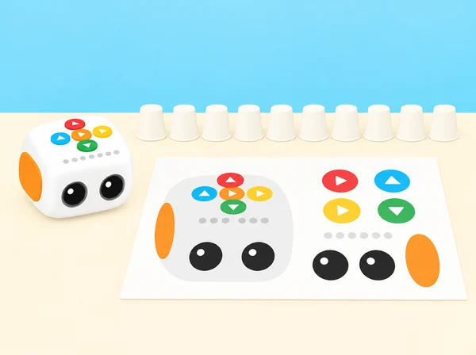
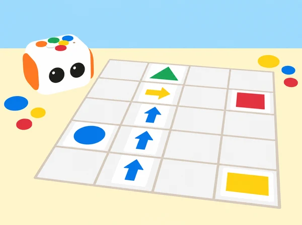

_Els set estands de la fira es construeixen amb targetes i materials senzills de l'aula._

## 🌱 Punt de partida

La classe organitza una fira de descobertes per a una altra aula. Tale-Bot visita estands de l'escola, una parada de fruita, un espai de formes i una taula d'art. En cada sessió, l'alumnat formula una pregunta, representa les ordres amb targetes, prediu el trajecte i prova el programa. El mapa, els materials, els personatges i les consignes són originals i s'adapten als llocs propers al centre.

Aquesta seqüència comença amb una sessió pròpia que adapta els objectius públics de la primera lliçó del nivell 1 —reconéixer Tale-Bot Pro i les seues parts i botons, practicar l’encesa/apagada i tractar el robot amb cura— i continua amb propostes temàtiques basades en els títols públics de les lliçons 3–9. La segona lliçó («On són els animals de la granja?») té una adaptació separada a [El rastre del corral](../../situacio/index.html?id=tb-rastre-corral). Els plans complets de les lliçons 3–9 no s’han pogut consultar; les sessions corresponents adapten els temes i la progressió pública, sense atribuir al fabricant objectius o passos que no es poden verificar.

## 🗺 Una benvinguda i set estands

### **Hola, Tale-Bot: el coneixem i el cuidem (40 min).**

#### Fase 1 · Activem i prediem (5 min)

Presenteu el Tale-Bot Pro del centre com una màquina que respon a instruccions. Compareu-lo amb una persona i amb un vehicle de joguina: quines accions pot fer cadascun, què necessiten per funcionar i quines idees són només suposicions? L’objectiu és despertar curiositat i reconéixer que el robot no té intencions humanes: el grup decideix les instruccions i comprova la resposta. Acordeu també una norma observable de cura, com ara esperar que el robot s’ature abans d’alçar-lo.

#### Fase 2 · Explorem i construïm (10 min)

Amb un Tale-Bot apagat, observeu-ne el cos, les rodes, els botons i els indicadors lluminosos. Useu una maqueta o silueta de paper pròpia per assenyalar cada part i relacionar-la amb una funció que després comprovareu. Si el kit del centre els inclou, mostreu les ales i el suport per a dibuixar o construir; són peces de caracterització o accessoris, no parts que el robot puga moure de manera autònoma. Prepareu deu gots de paper lleugers com a fites per a una ruta, no com a obstacles per colpejar.

_La silueta i els gots són recursos didàctics propis; el robot il·lustrat correspon al Tale-Bot Pro del kit._

#### Fase 3 · Expliquem i registrem (10 min)

En parelles, ordeneu targetes pròpies de «encendre», «introduir una ordre», «prémer *Play*» i «observar». Amb supervisió, cada equip encén i apaga el robot segons la guia del centre i comprova les quatre ordres de moviment bàsic —avant, arrere, esquerra i dreta— en una superfície plana. Abans de prémer *Play*, observeu els indicadors que corresponen a les ordres introduïdes; després, comproveu si el recorregut coincideix amb la predicció. Anoteu què han fet realment els botons i quina part del procés depén de les persones.

#### Fase 4 · Apliquem i millorem (10 min)

Prepareu una zona plana, neta i allunyada de vores. Col·loqueu els deu gots com a dues files de fites i creeu una destinació pròpia amb una targeta «hola»; la ruta ha de passar per un corredor ample sense tocar els gots. Una parella tria el punt d’inici, orienta el robot i prediu les ordres; l’altra observa els indicadors i comprova el trajecte. Si no coincideixen, canvieu una sola ordre o corregiu l’orientació i torneu a provar. Qui no manipule el robot pot dirigir la seqüència amb targetes, portar el registre o assenyalar l’accessori que s’està observant.

#### Fase 5 · Comprovem i reflexionem (5 min)

**Evidència:** maqueta de paper anotada, demostració d’encesa/apagada, seqüència de quatre ordres i indicadors observats, predicció/resultat de la ruta i una norma de cura explicada amb un exemple.

**Pregunta docent:** quines parts del recorregut ha decidit el programa i quines decisions continuen sent de les persones?

### **Sessió 1 · L'escola de Tale-Bot — «Matatalab School».**

#### Fase 1 · Activem i prediem

Observeu la planta simplificada de l’aula i les tres destinacions. Trieu una ruta entre dos llocs i feu una predicció amb targetes: quantes ordres cap avant necessitarà Tale-Bot si comença orientat cap a la biblioteca? Assenyaleu inici, orientació i meta abans de programar.

#### Fase 2 · Explorem i construïm

Dibuixem una planta senzilla de l'aula amb tres llocs d'interés (biblioteca, hort o pati). Per parelles, triem un destí, escrivim una seqüència d'ordres i expliquem com l'hem calculada. Una persona fa de robot en la graella de paper i després comparem la representació amb el recorregut del Tale-Bot real. Tanquem amb una instrucció per a les visites de la fira.

#### Fase 3 · Expliquem i registrem

Representeu la ruta amb una tira d’ordres i expliqueu cada pas amb «des de… avance… caselles». Registreu la casella inicial, l’orientació, la meta, la seqüència prevista i la posició final observada. Una altra parella ha de poder reconstruir el trajecte només amb el registre.

#### Fase 4 · Apliquem i millorem

Feu que una parella diferent execute la mateixa seqüència des del mateix inici i sense explicacions orals durant el moviment. Si arriba a una casella diferent, reviseu primer l’orientació i després una ordre cada vegada. Marqueu la versió inicial i la corregida i comproveu si una visita pot seguir el mapa sense ajuda.

#### Fase 5 · Comprovem i reflexionem

**Evidència:** planta amb llegenda, dues rutes amb inicis orientats, tira d’ordres inicial/final i comprovació d’una parella visitant. Expliqueu quina informació del mapa ha evitat una instrucció ambigua i què encara s’ha de dir en veu alta.

### **Sessió 2 · Un robot, moltes respostes — «Versatile Matatalab Robot».**

#### Fase 1 · Activem i prediem

Mireu tres targetes de repte: arribar a una casella, fer una dansa i dibuixar un traç. Predigueu quines accions corresponen a ordres de moviment i quines necessiten una funció o accessori. Distingiu una resposta que el robot pot executar d’una interpretació humana com ara «estar content».

#### Fase 2 · Explorem i construïm

Preparem tres microreptes en un mateix mapa: arribar a una casella, fer una pausa i continuar cap a una altra destinació. Amb el Tale-Bot Pro i els seus accessoris propis, provem moviments, una dansa i un dibuix curt amb retolador rentable; anotem què fa el robot en cada seqüència i com es pot esborrar el programa per tornar a començar. Separem les funcions integrades dels accessoris de muntatge i no atribuïm al robot cap sensor que no tinga.

#### Fase 3 · Expliquem i registrem

Completeu una taula de tres columnes: seqüència introduïda, resultat observable i material necessari. En la prova de dibuix, anoteu si el suport i el retolador estaven muntats; en la dansa, descriviu el moviment que s’ha vist, sense afirmar que el robot haja triat una emoció o entenga la música.

#### Fase 4 · Apliquem i millorem

Proveu primer cada microrepte per separat i esborreu la seqüència abans del següent. Després, combineu moviment i una acció final en un programa curt. Si el dibuix ix del full, fixeu millor el paper o canvieu el recorregut; no canvieu alhora el programa i el muntatge. La dansa i el dibuix són opcions, no requisits si el kit no porta els accessoris corresponents.

#### Fase 5 · Comprovem i reflexionem

**Evidència:** tres microprogrames separats, un programa combinat i taula d’observació. Expliqueu què canvia quan s’afegeix una ordre i quina acció depén d’un accessori; la dansa aleatòria no és una ordre coreogràfica que l’alumnat puga especificar.

### **Sessió 3 · El recorregut dels cinc sentits — «My Five Senses».**

#### Fase 1 · Activem i prediem

Trieu tres pictogrames d’estació i decidiu un ordre de visita. Abans de moure cap material, predigueu quina seqüència de moviments serà necessària i quina característica es podrà observar en cada parada. Recordeu que Tale-Bot no té sensors de gust, olfacte, tacte, oïda o visió: l’observació la fan les persones.

#### Fase 2 · Explorem i construïm

Preparem cinc estacions de taula amb pictogrames: una composició de colors per a la vista, un enregistrament ambiental triat pel docent per a l’oïda, retalls nets de tela per al tacte, una targeta de fruita per al gust i un pot tancat amb una herba culinària coneguda per a l’olfacte. No s’hi tasten aliments ni s’acosten recipients al nas; cada infant pot triar una estació alternativa de mirar o assenyalar. Abans de moure el robot, distingim què pot fer Tale-Bot —seguir ordres i marcar una parada— i què fan les persones —observar i descriure—. En equips, ordenem tres estacions, representem el recorregut amb targetes de moviment i comprovem la ruta sobre el mapa. A cada parada, l’observador tria un pictograma o una paraula per registrar una característica de l’objecte o del so, sense anotar gustos ni experiències personals. Després, canviem l’ordre de dues parades i comparem si la seqüència de moviments també canvia. Tanquem explicant quina instrucció ha indicat cada lloc i quina observació s’hi ha fet; la ruta del robot no és una mesura sensorial.

_Les imatges indiquen llocs d'observació, no instruccions perquè el robot perceba sabors, olors, sons o textures._

**Conducció de la parada (30 min):** reserveu 5 minuts per anticipar el recorregut i recordar les opcions de participació; 7 per seleccionar tres estacions i construir la seqüència amb targetes; 10 per provar la ruta i completar observacions breus per torns; 5 per intercanviar l’ordre de dues parades i depurar una instrucció; i 3 per compartir què ha indicat el robot i què han observat les persones. Amb un únic robot, la resta d’equips anticipen el programa en una graella de paper mentre esperen.

**Evidència:** mapa amb inici orientat, seqüència de targetes abans i després de la prova, i tres registres pictogràfics o orals de característiques observades. Es pot demostrar l’aprenentatge assenyalant, dictant o movent peces; no cal tocar, olorar ni parlar davant del grup.

#### Fase 3 · Expliquem i registrem

Una persona narra les ordres i una altra registra cada parada amb un pictograma o una característica visible/descrita pel docent. Separeu en el full dues columnes: «què ha fet el robot» i «què hem observat nosaltres». No anoteu preferències, salut, noms ni experiències personals.

#### Fase 4 · Apliquem i millorem

Canvieu l’ordre de dues estacions i predigueu si cal una seqüència diferent. Executeu-la des del mateix punt d’inici i compareu només el recorregut; manteniu les mateixes targetes i la mateixa orientació. Oferiu una ruta alternativa de mirar o assenyalar, sense tocar, tastar ni olorar cap material.

#### Fase 5 · Comprovem i reflexionem

**Evidència:** ruta amb tres parades, registre pictogràfic i comparació entre ordre inicial i reordenat. Expliqueu una observació feta per les persones i una acció executada pel robot, sense confondre-les.

### **Sessió 4 · La botiga de temporada — «Matata Grocery Store».**

#### Fase 1 · Activem i prediem

Llegiu una comanda de dos productes dibuixats i mireu el plànol de la parada. Predigueu quin producte visitareu primer, quantes ordres necessita el trajecte i quin serà el cost total si les fitxes indiquen preus. Els preus són dades del joc, no preus actuals del mercat.

#### Fase 2 · Explorem i construïm

Dissenyem una parada amb imatges de productes de mercat local i fitxes de preus senzills. Una targeta de comanda demana visitar dos productes; l'equip calcula la ruta i, si és adequat al nivell, suma dos preus. El robot lliura una fitxa de paper i una persona comprova que la comanda coincideix. Els aliments són dibuixats o de joguina: no es manipula ni es reparteix menjar real.

#### Fase 3 · Expliquem i registrem

Traceu el programa sobre una graella i anoteu el recompte de moviments entre cada producte. En un registre diferent, sumeu els dos preus i escriviu l’operació. La persona que rep la comanda comprova la seqüència i la suma per separat: una ruta correcta no garanteix una suma correcta.

#### Fase 4 · Apliquem i millorem

Intercanvieu la comanda amb una altra parella. Feu una primera prova de ruta, lliureu una fitxa per producte i reviseu si la llista i la suma coincideixen. Si hi ha error, indiqueu si és de moviment, ordre de visita o càlcul; canvieu-ne només un i torneu a provar des del mateix inici.

#### Fase 5 · Comprovem i reflexionem

**Evidència:** comanda marcada, programa amb inici orientat, dues fitxes lliurades i suma comprovada. Expliqueu com heu distingit el recorregut del càlcul i per què les etiquetes «horta» o «mercat» no representen dades de compra reals.

### **Sessió 5 · Quantes maduixes hi ha? — «Count Strawberries I».**

#### Fase 1 · Activem i prediem

Observeu les caselles amb grups de maduixes de paper i trieu una ruta. Predigueu el total abans de comptar i decidiu com marcareu cada casella visitada perquè cap grup es compte dues vegades ni se n’oblide cap.

#### Fase 2 · Explorem i construïm

Situem grups de maduixes de paper en diverses caselles. Abans de programar, cada equip prediu quantes trobarà en una ruta i tria com evitar comptar-ne alguna dues vegades. Després segueix el recorregut, marca cada grup visitat i compara predicció i recompte. Com a ampliació, canviem l'ordre dels estands i comprovem si el total es manté.

#### Fase 3 · Expliquem i registrem

Useu una taula amb casella, quantitat observada i subtotal acumulat. En cada parada, marqueu la casella només després de mirar-la; després, una segona persona torna a comptar els grups sense seguir el robot per comprovar el total per una via independent.

#### Fase 4 · Apliquem i millorem

Canvieu la posició d’un grup de maduixes, manteniu la resta igual i torneu a calcular el total. Compareu la predicció i el recompte abans/després. Si el total no canvia, expliqueu per què; si canvia, identifiqueu la casella modificada sense modificar també la ruta.

#### Fase 5 · Comprovem i reflexionem

**Evidència:** ruta, caselles marcades, predicció inicial, taula de subtotals i recompte independent. Expliqueu quina estratègia ha evitat duplicar una casella i recordeu que les maduixes són fitxes de joc, no una collita observada.

### **Sessió 6 · El monstre de les formes — «Shape Monster I».**

#### Fase 1 · Activem i prediem

Compareu les targetes de triangle, quadrat, cercle i rectangle. Trieu-ne una i predigueu quantes caselles o canvis de direcció caldran per visitar els punts de la seua vora en ordre, començant en una marca orientada.

#### Fase 2 · Explorem i construïm

Cada equip rep una silueta geomètrica gran i la descompon en fites de la graella. El robot visita els vèrtexs en ordre; el grup anota canvis de direcció i nombre de trams, i una persona uneix els punts en paper. Compareu triangles i quadrilàters sense exigir que Tale-Bot dibuixe: la línia es representa amb llapis després de la ruta.

#### Fase 3 · Expliquem i registrem

Registreu el nombre de trams rectes, les caselles de cada tram i els canvis de direcció observats. Una persona uneix els punts després del recorregut i identifica la forma; compareu el contorn amb la targeta sense dir que Tale-Bot dibuixa si no porta el suport i el retolador.

#### Fase 4 · Apliquem i millorem

Intercanvieu la ruta amb una parella que no coneix la forma triada. Si el contorn reconstruït no coincideix, reviseu una instrucció o un punt de gir i repetiu des del mateix inici. Compareu dues formes i determineu si el nombre de trams rectes basta per distingir-les o si també cal observar-ne la disposició.

#### Fase 5 · Comprovem i reflexionem

**Evidència:** targeta seleccionada, ruta marcada, registre de trams/girs i forma reconstruïda per una altra parella. Expliqueu quina observació permet identificar la forma i quin paper ha tingut la persona que ha unit els punts.

_La imatge mostra una ruta de caselles i targetes geomètriques; les formes les identifica l’alumnat, no el robot._

### **Sessió 7 · L'eruga artista — «Matata Artist—Caterpillar».**

#### Fase 1 · Activem i prediem

Observeu una eruga formada per cercles de paper i trieu una regla senzilla, com ara blau–groc–blau–groc o gran–menut–gran–menut. Predigueu quin segment vindrà després i en quin ordre haurà de visitar Tale-Bot les parts del patró.

#### Fase 2 · Explorem i construïm

A partir d'una eruga de cercles de paper, triem un patró de colors o formes i construïm un recorregut perquè el robot visite els segments en l'ordre desitjat. Col·loquem un retolador rentable en el suport inclòs i comprovem el traç en paper gran, amb un adult que prepare el full i retire el retolador en acabar. Els infants expliquen la regla del patró i busquen un error o un canvi possible. Si falta el retolador o el suport en la unitat del centre, resolen el mateix repte amb el mapa i les targetes de direcció.

#### Fase 3 · Expliquem i registrem

Dibuixeu la unitat que es repeteix i escriviu-la en una tira de targetes. Registreu quantes vegades apareix i assenyaleu el punt on la seqüència deixa de seguir la regla. Si utilitzeu el suport de retolador, descriviu el traç com un resultat del moviment, no com una forma que el robot reconega.

#### Fase 4 · Apliquem i millorem

Una altra parella continua el patró amb una peça tapada i programa una ruta que visite els segments en ordre. Compareu el programa amb la tira de targetes, corregiu només el primer punt on discrepen i torneu a executar. Si s’usa retolador, feu primer una prova curta en paper recuperable i fixeu el full; sense accessori, completeu la mateixa activitat amb fitxes i mapa.

#### Fase 5 · Comprovem i reflexionem

**Evidència:** unitat del patró, continuació de la seqüència, ruta de visita i una correcció justificada. Expliqueu com heu sabut què faltava i distingiu entre seguir un patró i dibuixar-lo amb un accessori.

## Intencions d'aprenentatge i criteris d'èxit

- Llegir una graella amb inici orientat, destí i llegenda, i descriure el recorregut amb ordres que una altra parella puga seguir.

- Anticipar el resultat abans de prémer Play, registrar què ha passat i corregir una sola instrucció quan la ruta no coincideix.

- Usar els accessoris i funcions disponibles segons la tasca, distingint moviment del robot, dansa aleatòria, gravació i dibuix.

- Comparar, comptar o crear patrons amb materials ficticis i explicar el criteri emprat.

- Presentar una parada de la fira amb llenguatge, gest, pictograma o demostració, sense exposar dades personals.

Una evidència d'èxit no és que la primera execució funcione: és que l'equip puga descriure una predicció, observar el resultat i justificar un canvi o explicar per què manté el programa. Per a Infantil, accepteu una resposta d'un pas; qui ja tinga pràctica pot comparar dues rutes o simplificar la seqüència.

## Ritme i conducció de cada sessió

Reserveu aproximadament 5 minuts per presentar la pregunta amb objectes o imatges, 5 per planificar amb una fitxa i targetes, 15 per executar i revisar, i 5 per explicar què s'ha descobert. Amb un únic Tale-Bot, un equip opera mentre els altres resolen una predicció en paper; canvieu l'equip de torn en cada sessió. Manteniu la seqüència curta i el temps d'espera suficient perquè la màquina no avance abans que les persones hagen fet una predicció.

### **Escola:**

els equips reben tres targetes de lloc i dos possibles punts d'inici. Marquen amb una fletxa cap a on mira el robot i comparen dues rutes cap a la biblioteca. Una parella externa prova les instruccions sense que l'autor les explique mentre el robot es mou.

### **Funcions:**

feu una taula de quatre columnes —botons de moviment, Play/Clear, dansa i dibuix/gravació— i indiqueu quin resultat s'espera i si requereix accessori. Proveu una funció cada vegada, esborreu el programa entre proves i descriviu una diferència observable; no suposeu que el robot interpreta ordres de veu.

### **Cinc sentits:**

useu pictogrames i pistes segures preparades pel docent. L'alumnat decideix quina informació pot observar a distància i quina podria resultar molesta; es pot passar qualsevol estació. No es tasten aliments, no s'oloren substàncies desconegudes i no es toca cap persona com a part del repte.

### **Botiga:**

creeu una targeta de comanda amb dos productes dibuixats, una ruta i una suma opcional de preus ficticis. Separeu el càlcul matemàtic del codi de moviment: el robot porta una fitxa, mentre el grup comprova en paper si els productes i la suma concorden amb la comanda.

### **Recompte:**

agrupeu les fruites de paper en conjunts visibles de dos o tres. Marqueu cada casella visitada perquè cap grup es compte dues vegades; compareu el total de la ruta amb una suma feta per una altra parella i reviseu la discrepància casella per casella.

### **Formes:**

comenceu en una quadrícula amb pocs vèrtexs i una fletxa d'inici. Una persona mou el robot, una altra assenyala el vèrtex següent i una tercera registra girs i trams. Uniu punts després de la ruta i compareu el dibuix amb la silueta objectiu sense exigir un traçat perfecte.

### **Eruga artista:**

construïu un patró de tres peces —per exemple cercle gran/cercle menut/cercle gran—, demaneu al grup que el continue i convertiu l'ordre de visita en una ruta. Amb retolador, proveu primer en un tros de paper recuperable; sense suport, retolador o full segur, useu targetes per representar el traç i manteniu intacte el mateix criteri de patró.

## Diari de proves i mostra final

Useu una única fitxa de registre per a totes les parades: pregunta, targetes o materials, inici i orientació, seqüència prevista, resultat, canvi provat i explicació final. Les fotografies opcionals han d'enquadrar només el mapa i el robot, sense cares, noms ni treballs identificables. Al final, cada parella guia un visitant per una ruta i li demana que la torne a explicar amb les seues paraules.

La graella d'observació docent recull si l'infant identifica inici i meta, espera el torn, anticipa una ordre, interpreta una diferència entre predicció i resultat, usa un recompte o patró i comunica una decisió. Un mateix alumne pot demostrar-ho amb accions diferents en sessions diferents; no cal exigir totes les habilitats en cada parada. Tanqueu preguntant quina instrucció ha sigut més clara per a qui visitava la fira i quin material canviaria el grup en una nova versió.

## 🎯 Aprenentatges i vocabulari

- Explorar espais de l’escola amb instruccions de moviment i destinacions fictícies o autoritzades.
- Usar recompte, formes, vocabulari i observació en reptes breus de la fira.
- Crear una proposta artística o narrativa i presentar-la amb veu, pictogrames o demostració.
- Provar les rutes i revisar-les perquè una altra classe puga seguir-les amb claredat.

## 🧰 Materials i preparació

Tale-Bot Pro de la dotació, retolador rentable i suport de dibuix del kit base, mapa gran de paper o quadrícula al terra, targetes de fletxes, siluetes i fitxes reutilitzables, imatges de fruita/productes i llapis. Feu una prova del traç amb el robot abans de la sessió i utilitzeu un full prou gran, fixat a la taula. Si la unitat disponible no inclou el retolador o el suport, manteniu el repte com a recorregut de caselles i targetes, sense afegir accessoris no disponibles.

## ♿ Participació i evidències

Repartim els rols de planificació, programació amb targetes, conducció, recompte i explicació, i els fem rotar. La ruta es pot recórrer amb robot o amb una persona sobre una graella, i es pot respondre parlant, assenyalant pictogrames, movent peces o dictant una seqüència. Guardem la predicció, les targetes del programa, el registre de recompte i una breu explicació oral o visual de cada equip. No publiquem enregistraments de veu ni dades personals de l'alumnat.

## 🔗 Font oficial i abast

La pàgina del [currículum Tale-Bot Pro](https://matatalab.com/zh-hans/tbp) descriu el nivell 1 com una progressió de 16 lliçons sobre ordres, programes, seqüències, descomposició i patrons. La pàgina oficial de la [lliçó 1, «Hola, robot Matata!»](https://matatalab.com/en/node/827) publica el focus (estructura, botons i ús pràctic), objectius (reconéixer parts i funcions, engegar/apagar correctament, distingir el robot de les persones, despertar curiositat i cuidar-lo) i materials (robot, maqueta de paper, ales, suport de dibuix/construcció, deu gots, cinta i full d’activitat). Aquesta sessió els adapta a una ruta de fites amb gots i targetes originals; no reutilitza el full, la presentació ni els gràfics oficials. La pàgina enllaça el pla complet, però el PDF adjunt no ha sigut consultable des del visor; per tant, es declara adaptació dels objectius i materials públics, no reproducció de cada pas del document. La llista pública del fabricant mostra títols addicionals en el seu [arxiu de lliçons](https://matatalab.com/zh-hans/node?page=11); els plans i adjunts complets de les lliçons 3–9 remeten a permisos de curs o no són consultables des de les pàgines verificades. Les set sessions següents adapten els temes visibles, però no s'afirma cobertura íntegra d'aquests materials docents. El fabricant també inclou al kit base un [Challenge Booklet amb 14 missions](https://shop.matatastudio.com/products/matatastudio-tale-bot-pro); el contingut de les missions encara no s'ha pogut consultar i no es considera adaptat en aquesta fitxa. Les 42 activitats de les [Activity Cards](https://matatalab.com/en/lesson4.4) ja tenen cobertura específica en les fitxes A–D del portal.
